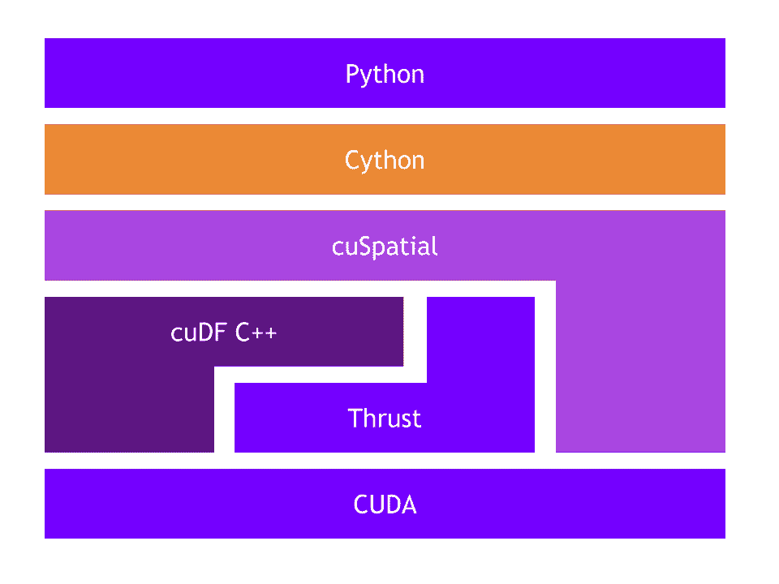
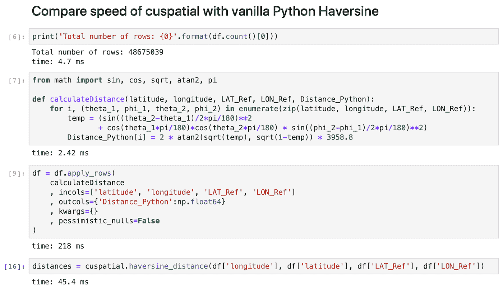
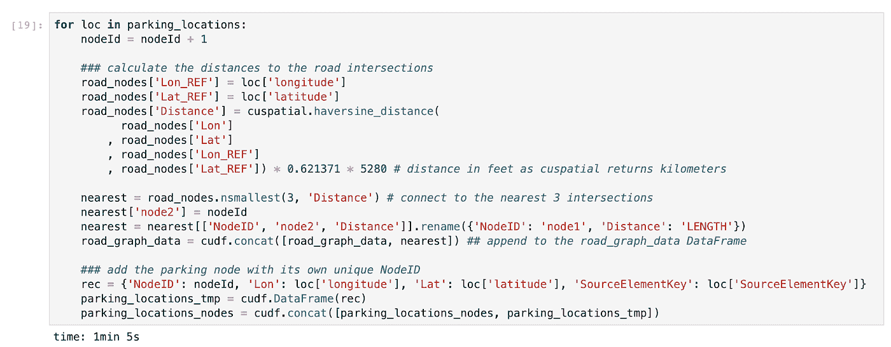
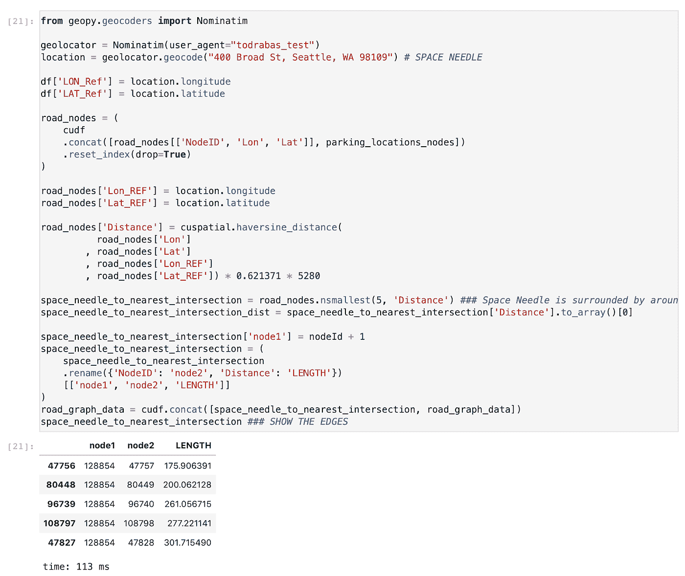
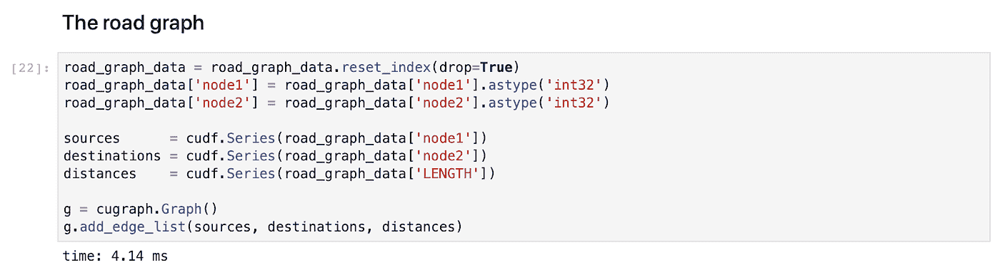
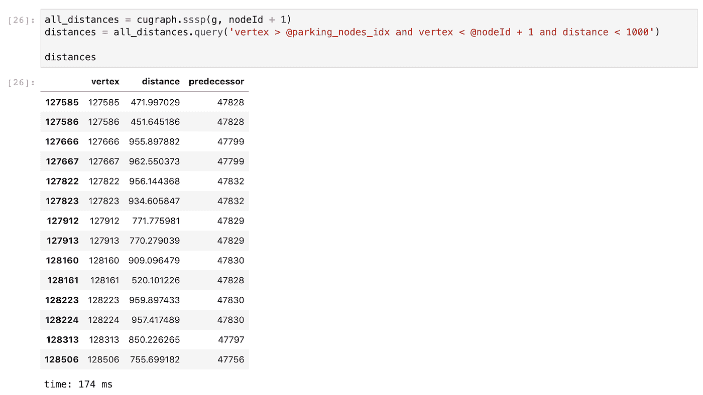
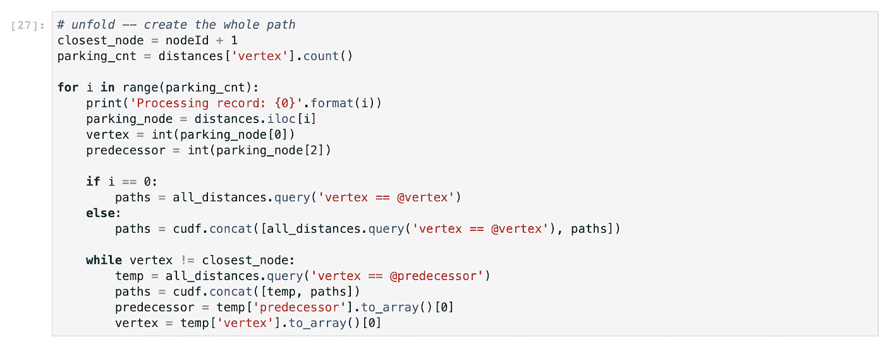
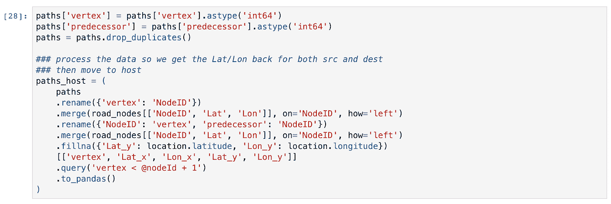
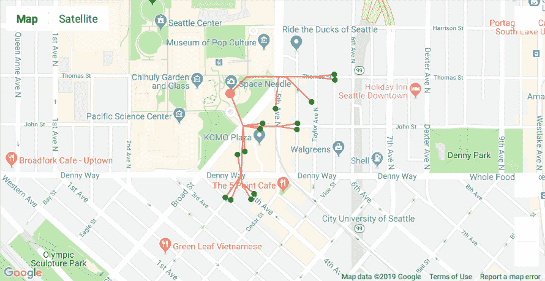

# 我应该去哪里？

> 原文：<https://towardsdatascience.com/where-should-i-walk-e66b26735de5?source=collection_archive---------26----------------------->

## **使用 NVIDIA RAPIDS 的新工具来确定到停车场的最短步行距离**

# **简介**

在[之前的故事](/where-should-i-park-29e8da95265a)中，我们探索了西雅图市交通局提供的付费停车占用率数据集。你可以看到(并希望测试)使用 [NVIDIA RAPIDS](https://rapids.ai/) 对这些数据进行的所有计算有多快。

简单回顾一下:我们使用的数据可以从[这里](http://tomdrabas.com/data/seattle_parking/parking_MayJun2019.tar.gz)下载。它是自 2019 年初以来发布的完整数据集的子集，包括 5 月和 6 月的所有交易。数据集的大小约为 7GB，非常适合配有 24GB VRAM 的 NVIDIA Titan RTX。要在 RAM 更少的 GPU 上使用这个数据集(如 11GB 的[英伟达 RTX 2080 Ti](https://www.nvidia.com/en-us/geforce/graphics-cards/rtx-2080-ti/) )，您可能只需要提取一个月的数据——我已经准备了一个更小的数据集，只包含 2019 年 5 月的交易，您可以在这里下载[。](http://tomdrabas.com/data/seattle_parking/parking_May2019.tar.gz)

# **快速进行地理空间计算**

在我们继续讲这个故事之前，让我们谈一个小的话题。就在我发表我的故事一天后，NVIDIA 的 RAPIDS 团队[宣布了数据科学难题中的另一个伟大作品:cuSpatial](https://medium.com/rapids-ai/releasing-cuspatial-to-accelerate-geospatial-and-spatiotemporal-processing-b686d8b32a9) ！

图一。cuSpatial 堆栈，经 NVIDIA 许可使用

顾名思义，cuSpatial 是一个专注于地理空间计算的库。它是一组通过 Python 接口公开的 C++/CUDA 内核，就像 RAPIDS 工具包中的其他工具一样。而且速度很快，就像其他人一样！

为了让我们感受一下它的计算速度，我们将使用上一个故事中的完整数据集(提醒一下，该数据包含 4800 万个地理编码交易),并测试如果我们使用 cuSpatial，我们的计算速度会快多少。

在这个测试中，我们可以看到 4.8 倍于普通 Python 的加速，而且不费吹灰之力(代码也少得多！！).为了比较性能，我们重用了前面故事中的 *calculateDistance(…)* 方法的(在语法上有所压缩)版本。

注意，如果你运行*。apply_rows(…)* 方法第一次运行时，您将遭受编译损失，因为 RAPIDS 需要首先 JIT 编译*计算距离(…)* 方法:在我的机器上，单元的第一次运行通常报告大约 650 毫秒，但是如果您再次运行单元，执行时间将下降到大约 220 毫秒；假设您没有做任何更改， *calculateDistance(…)* 方法将在此时被缓存。当[我第一次报告我看到的令人印象深刻的速度提升](https://twitter.com/tomekdrabas/status/1172350554229506048?s=20)时，我发现了这一点。然而，接下来的讨论实际上导致了一个[额外性能挤压](https://github.com/rapidsai/cudf/issues/2805)的发现，它将很快来到 RAPIDS！

# 我们是坐飞机还是走路？！

那么，现在回到我们故事的继续。上次我们计算的距离是直线距离，而不是步行距离。这导致了一些停车点的出现，如果步行的话，这些停车点实际上会超过 1000 英尺。

令人欣慰的是，[融合数据科学](https://fusiondatascience.com/)的独一无二的约翰·默里获得了[国王县老虎/线道路网](https://catalog.data.gov/dataset/tiger-line-shapefile-2018-county-king-county-wa-all-roads-county-based-shapefile)的形状文件，并友好地创建和捐赠了一个国王县道路图，其形式为一个交叉点列表(带有地理坐标)和一个连接交叉点与计算长度(以码为单位)的边列表。数据可以在这里下载[，但是如果你使用我们发布在 Github 上的代码，](http://tomdrabas.com/data/seattle_parking/king_county_road_graph_20190909.tar.gz)[笔记本](https://github.com/drabastomek/rapids-notebooks/blob/master/codes/rapids_seattleParking_graph.ipynb)还是会帮你做的。

## **将停车点连接到图表**

很明显，停车位置没有出现在图表中，所以我们需要添加它们。在第一次尝试中，我们将遍历所有 1，500 个停车位置，计算到每个道路交叉口的距离，并选择 3 个最近的交叉口。这有点麻烦，会导致一些伪像(稍后在地图上显示),但现在可以了。在下一个故事中，我们将讨论如何添加新的节点，使停车点垂直于道路/边缘(再次感谢 John 提出这个建议并帮助编写代码！)

[*。nsmallest(…)*](https://rapidsai.github.io/projects/cudf/en/0.9.0/api.html#cudf.dataframe.DataFrame.nsmallest) 方法(也有 [*nlargest(…)*](https://rapidsai.github.io/projects/cudf/en/0.9.0/api.html#cudf.dataframe.DataFrame.nlargest) 可用)返回前 3 个最近的交点；我们使用*将这些边添加到 *road_graph_data* 数据帧中。concat(…)* 方法。最后，我们还向*parking _ locations _ nodes*数据帧添加了一个新节点，这样我们就可以稍后将它们添加到图节点的完整列表中。

让我们在这里暂停一秒钟:我们刚刚使用 cuSpatial 计算了所有 1500 个停车位置到 127k 个道路交叉口的哈弗线距离(因此，这是大约 200 米的计算)，选择了 3 个最近的交叉口，并更新了数据集，所有这些都在大约 1 分钟内完成。如果这还不够快，我不知道什么是…

继续，我们还需要为空间针添加一个节点。然而，不是链接到最近的 3 个十字路口，在地图上的一瞥建议我们应该链接到 5。

就像之前一样，我们使用 [geopy](https://geopy.readthedocs.io/en/stable/) 包中的 Nomatim geo 编码器来获取太空针的坐标。

# **我们来建个图吧！**

现在我们有了节点和边的完整列表，我们可以构建图表了。这在急流中超级容易。

查看[文档](https://docs.rapids.ai/api/cugraph/stable/)获取可用方法和算法的完整列表！

有了完整的图，我们现在可以使用单源最短路径(SSSP)来计算从太空针到每个停车位置的距离！该算法遍历该图并找到到所有 128k 个节点的最短路径；对于 SSSP 算法的概述，我发现这些笔记很有用。作为回报，我们得到一个数据帧，其中包含一系列顶点以及到这些顶点的相应最短距离。数据帧还显示了*的前任*，一个节点(或者顶点，如果你愿意的话)，你需要在之前访问*一个正在讨论的形成最短路径的特定节点。所有这些都在 174 毫秒内完成。*

我们现在可以使用这些信息来创建从太空针到 1000 英尺步行距离内的每个停车点的完整路径。

在上面的代码片段中，我简单地从一个节点跳到另一个节点，并将边添加到*路径*数据帧中。大约 1 秒钟后，我们可以开始制图。从 *road_nodes* 数据帧中，我们提取每个节点的坐标，这样我们以后就可以用它们在地图上绘制这些点。

这是最终的结果！

因此，考虑到所需的距离，距离太空针塔最近的停车点在南面和东面。现在，如果你仔细看，你可以看到我之前提到的人工制品以及将停车位分配到最近的 3 个十字路口的方法的不足之处:为了到达一些停车位，算法将*要求*你走过停车位，然后走回停车位。在下一个故事中，我们将解决这个问题。

# **总结**

与我们之前的[工作流](/where-should-i-park-29e8da95265a)(在泰坦 RTX 上运行大约 20 秒)相比，这个端到端的过程需要大约 2 分钟才能完成。尽管如此，这些工作的大部分可以保存下来，然后在以后重用，将推断时间减少到仅仅一两秒钟。

敬请关注 NVIDIA RAPIDS 的力量、速度和灵活性的更多示例！