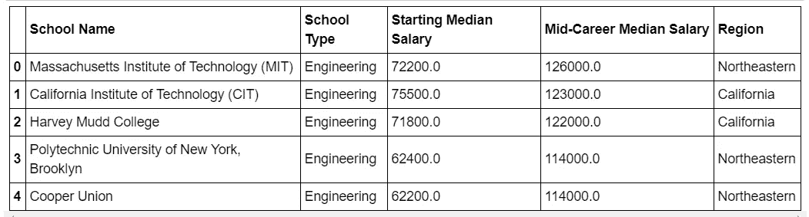
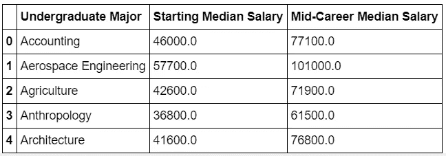
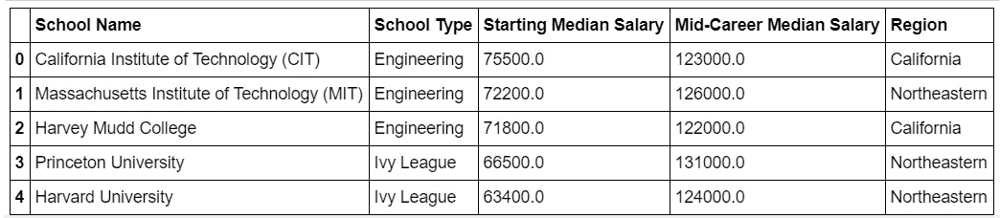
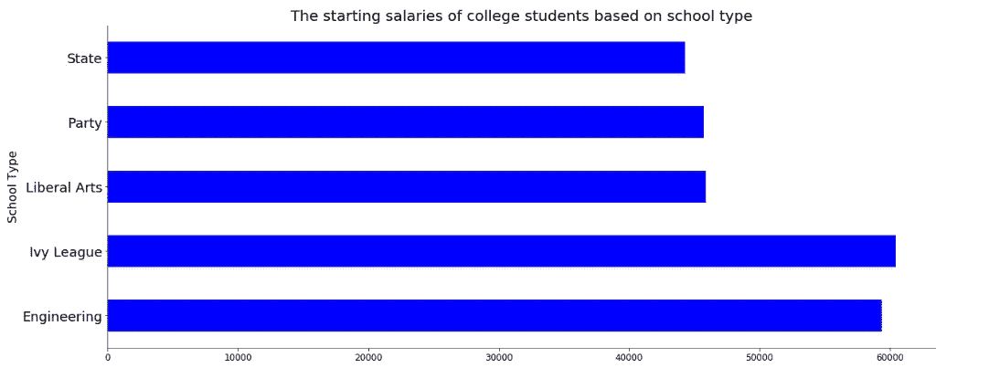
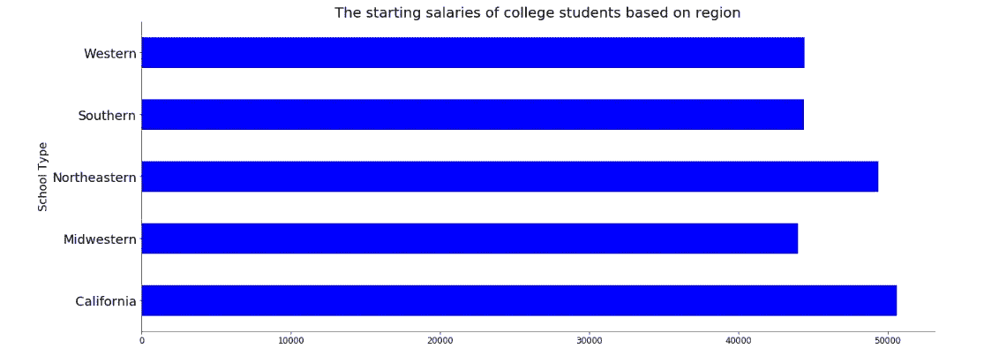
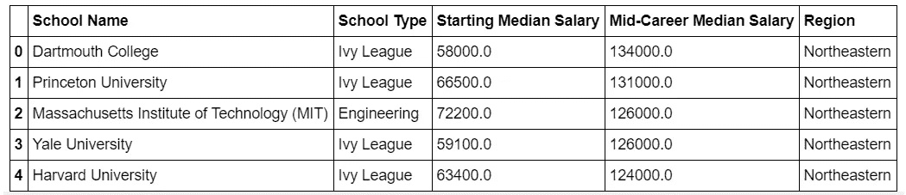
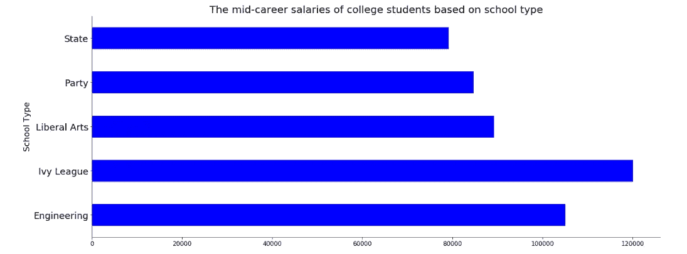
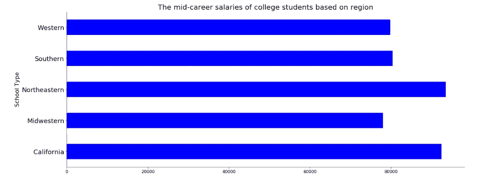
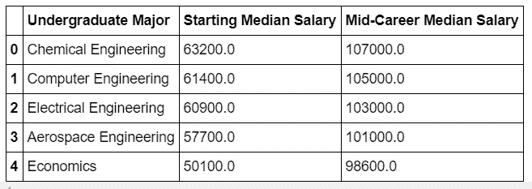

# 你应该去哪里上大学？

> 原文：<https://towardsdatascience.com/where-should-you-go-for-college-225512479289?source=collection_archive---------25----------------------->

## 根据你的大学学历和所在地区，你毕业后的期望薪资是多少。

青少年到达了他们生命中需要追求人生目标的那一点。有些人的抱负需要大学教育。有些人仍然不确定他们的目标或抱负，所以他们去大学寻找。

因此，他们从高三开始申请大学。在申请大学的过程中，他们会问自己这样的问题:为了获得最好的大学经历，我可以去哪个城市？什么学校最适合我的志向？什么专业最适合我？

决定他们申请目标学校的一个因素是他们大学毕业后的工资。因此，他们可能会继续寻找学校，直到找到一所能在工资和满意度之间取得平衡的学校。

由于所有这些问题都是由大学申请人提出的，因此开展了一个数据可视化项目来回答学生关于大学学位、大学地区、大学类型与毕业生工资的关系的问题。

# 数据收集

数据通过这个[链接](https://www.kaggle.com/wsj/college-salaries)从 Kaggle 上的三个 csv 文件中获得。这三个 csv 数据集是由华尔街日报在 2017 年收集的。其中两个数据集被合并成一个数据集，并进行清理，以包括以下列:学校名称、学校类型、起始工资中位数、职业生涯中期工资中位数和地区。

Top five rows of the combined dataset

第三组数据是关于专业和他们的平均工资。它有多个列，但它被清理，以包括重要的列，即本科专业，起始工资中位数，职业生涯中期工资中位数。

Top five rows of the third dataset

在数据集被加载和清理后，它们被用来可视化地区、学校类型和本科专业之间在起薪中位数和职业生涯中期中位数方面的差异。

# 探索数据集

## 起薪中位数

首先创建了一个表格，找出起薪最高的前五所学校。

The top five schools with the highest starting median salaries

结果显示，加州理工大学毕业生的起薪中位数最高，为 75500 美元。麻省理工学院毕业生以 7.22 万美元位居第二。哈维·马德、普林斯顿和哈佛毕业生分列第三、第四和第五位，起薪中位数分别为 7.18 万美元、6.65 万美元和 6.34 万美元。

首先绘制了一张图表，以描绘基于学校类型的毕业生起薪。

Starting salaries of college graduates based on school type

根据上面的图表，常春藤盟校的起薪中值最高，为 60，475 美元。工程学院的起薪中位数第二高，为 59411 美元。文理学院毕业生的起薪中位数为 45917 美元，位居第三。党校毕业生和州立学校毕业生分别获得约 45705 美元和 44304 美元。

第二张图显示了不同地区大学生的起薪。

Starting salaries of college graduates based on region

去加州上大学的人的起薪中位数是 50，623 美元，是所有地区中最高的。东北部地区的大学生以 49，367 美元的薪水位居第二。西部和南部大学生起薪相当接近。两者分列第三和第四位，起薪中位数分别为 44436 美元和 44364 美元。中西部地区大学生的起薪中值为 43，977 美元。

最后，创建了一个表格来显示哪个本科专业获得的起薪最高。

Top five starting median salaries of college graduates

医师助理的起薪中值最高，为 74300 美元。化学工程专业毕业生的薪资位居第二，为 6.32 万美元。计算机工程、电气工程和机械工程毕业生分列第三、第四和第五位，起薪中位数分别为 6.14 万美元、6.09 万美元和 5.79 万美元。

## 职业生涯中期工资中位数

职业生涯中期薪资中位数最高的五大商学院如下表所示:

Top five schools with graduates receiving the most mid-career median salary

然后，绘制了一个图表来展示学校类型和他们职业生涯中期的工资中位数。

Mid-career salaries of college graduates based on school type

根据上面的图表，常春藤盟校的职业中期平均工资最高，为 120，125 美元。然后，工程学校以 105，128 美元的薪资位居第二。文理学院的毕业生获得了职业生涯中期第三高的工资中位数，为 89298 美元。党校毕业生和州立学校毕业生分别获得约 84，685 美元和 79，203 美元。

创建了另一个条形图来描述基于地区的大学毕业生职业生涯中期的工资中位数。

Mid-career median salaries for college graduates

图表显示，去东北部地区上大学的人获得最高的职业中期平均工资 93510 美元。加州大学生以 92411 美元的薪水位居第二。南部地区的大学生以 80，390 美元的职业中期中位数工资排在第三位。西部地区的大学生和中西部地区的大学生分别以 79808 美元和 78010 美元的职业中期工资排名第四和第五。

还创建了一个表格来显示基于本科专业的大学毕业生的职业生涯中期工资中位数。

Top five mid-career median salaries of college graduates based on undergraduate majors

化学工程、计算机工程、电气工程和航空航天工程等工程专业占据了前四名，职业生涯中期工资中位数分别为 10.7 万美元、10.5 万美元、10.5 万美元和 10.3 万美元。经济学毕业生排在第五位，职业中期平均工资为 98600 美元。

# 结论

图形和表格结果清楚地报告了基于大学地区、大学学位和大学类型的人们的工资结果。利用这些结果，大学申请者在申请大学时可以做出更好的选择，如果他们的目标是获得一个在短期和长期对他们都有巨大优势的学位。

**用来构建这些图的完整版本代码可以在** [**这里**](https://github.com/MUbarak123-56/DataBEL/blob/master/COLLEGE%20ANALYSIS.ipynb) **看到。**