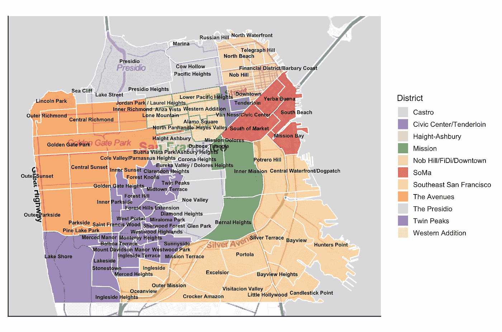
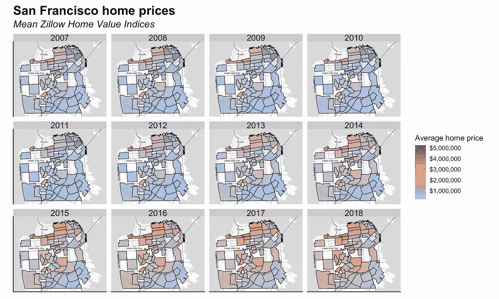
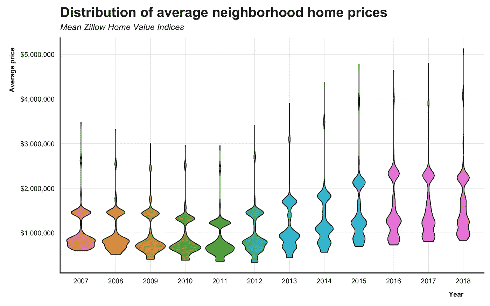
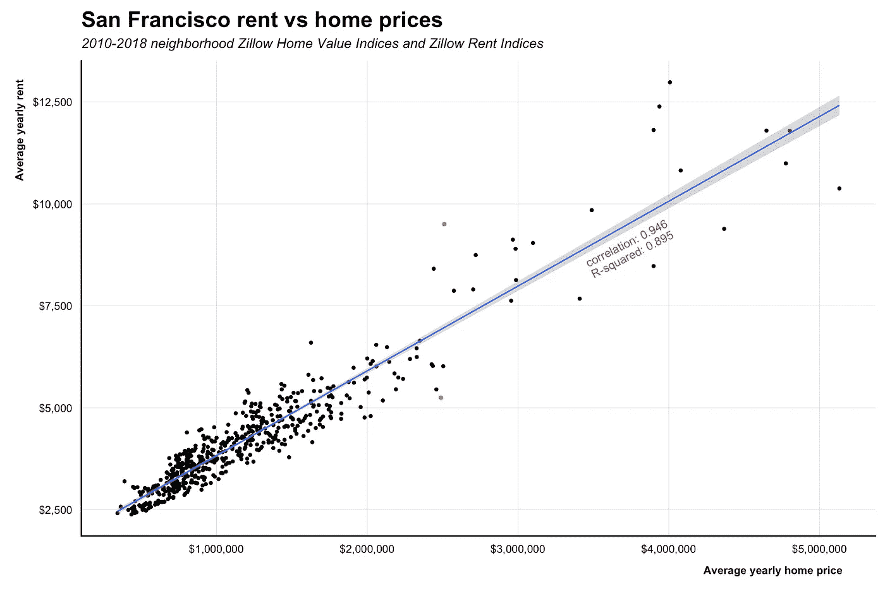
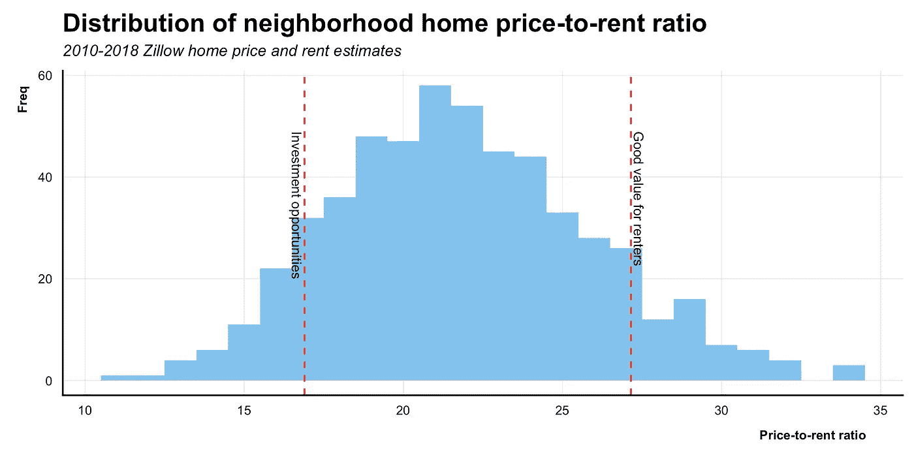
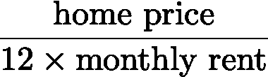
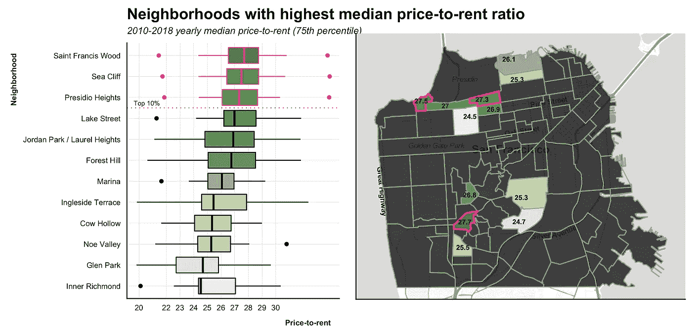
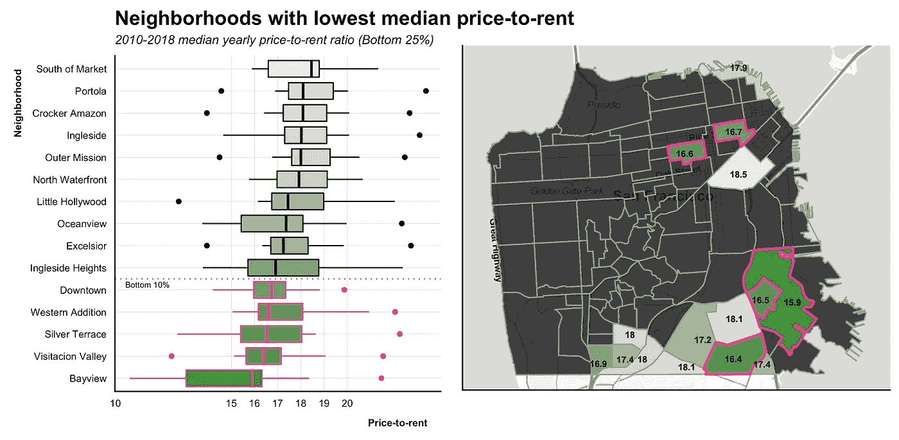
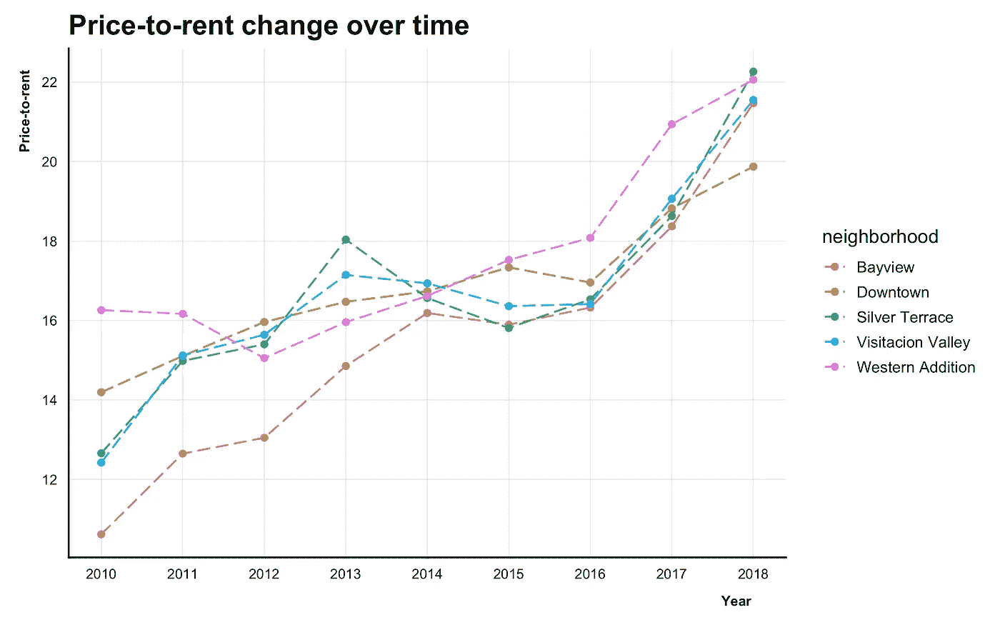
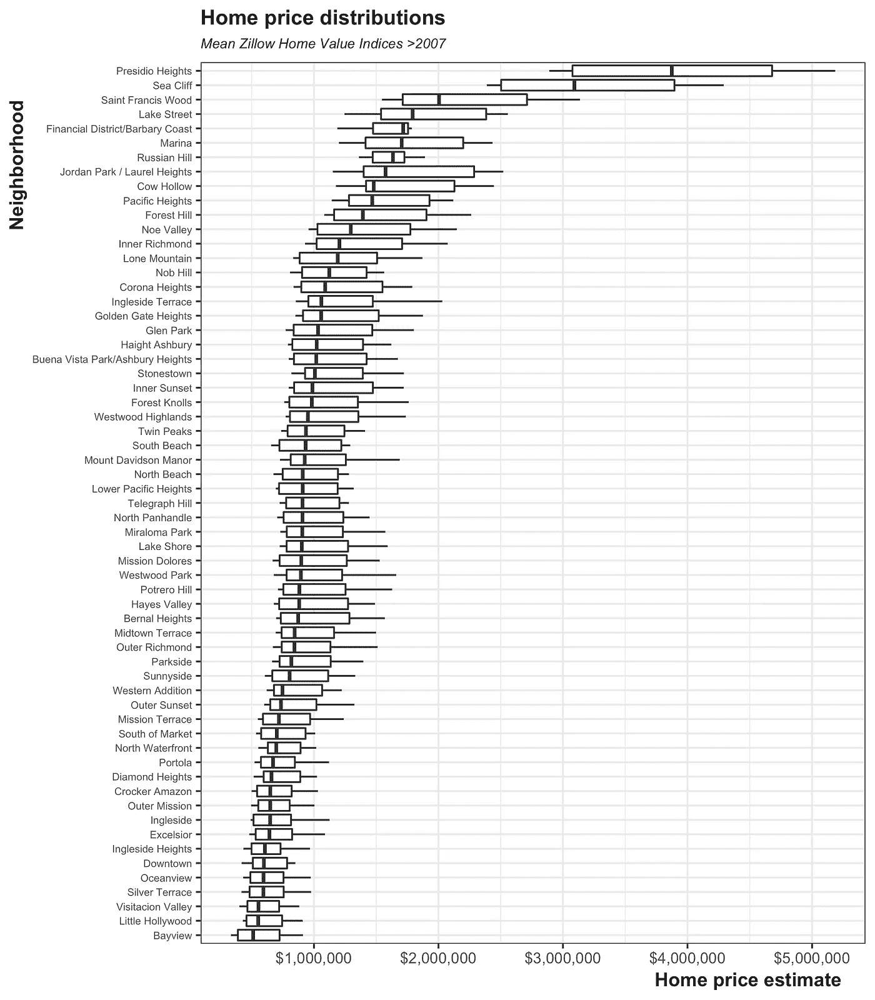

# 你应该住在旧金山的什么地方？

> 原文：<https://towardsdatascience.com/where-should-you-live-in-san-francisco-5f0fa0889a98?source=collection_archive---------19----------------------->

## 在世界上最昂贵的城市实现住房价值最大化

除了生活成本，旧金山还有很多吸引人的地方。住房是其中的一大块，所以无论你是租房者还是房主，从你的住房状况中获取最大价值是很重要的。

在这个项目中，我探索 R 的 Zillow 数据，为 1)潜在的租房者和 2)想购买出租房产的投资者识别旧金山的高价值社区。我们将探索房价、月租金以及两者的比率(房价租金比)来寻找候选社区。

感谢 Ken Steif 和 Keith Hassel 为我们提供的关于探索旧金山房价的[精彩教程](http://urbanspatialanalysis.com/dataviz-tutorial-mapping-san-francisco-home-prices-using-r/)。他们启发了下面的情节和图形。这个项目的代码可以在[这里](https://github.com/collindching/sf_housing/blob/master/reports/intro_post.pdf)找到。

## 邻域参考

因为我的分析是针对社区进行的，所以这里有一个直观的参考。

## 旧金山房价按年统计

由于次贷危机，2007 年至 2011 年间，附近的房价停滞不前。在造船厂，房价甚至在这个时间段下降。

从 2012 年开始，房价开始上涨。这种住房增长在旧金山市中心增长，然后向外扩散。Presidio 和 Twin Peaks 地区附近的住房一直是最贵的。

这是一个随着时间推移而变化的更好的视图。住房价格在次贷危机期间下降，然后在 2012 年后飙升，并分裂成三态分布。

## 比较房价和租金

上面的地块包括所有房屋类型——公寓、独栋、多户——以及房屋大小——一居室、两居室、三居室等。

从 2010 年到 2018 年，典型的房价略低于 100 万美元，典型的租金约为每月 4000 美元。也很少有住宅价格中位数超过 300 万美元，租金中位数超过 6000 美元的社区。

房价和租金遵循类似的分布。

年均房价解释了年均租金变化的 89.5%。尽管如此，租金还是会随着固定房价的变化而变化:250 万美元的最低租金是 5250 美元/月，最高租金是 9506 美元/月。

如果有人给我两套 250 万美元的房子出租——一套 5250 美元/月，另一套 9506 美元/月——大多数情况下，我会选择 5250 美元/月。

在上面的场景中，我固定了房价。比如说，你可以调整你的房租预算。在这样的预算下，你能买到的最高房价是多少？如果你要购买租赁房产，**在固定的购买预算下，你能得到的最高月租金是多少？**这些问题引导我们进入下一个分析。

## 租金价格比

这些是 2010 年至 2018 年的平均房价租金比，其中房价租金比是

租售比是房价除以一年的估计租金。你可以把它看作是偿还出租财产的估计年限。最大化这个比率会给租房者带来好的价值；最小化这个比率(更少的偿还年数)会给房东带来好的回报。

如果你租了一套公寓，你会希望租金价格最大化。这些社区有更高的租金。最高的 10%邻域标记在右边的面板中。

如果你投资于租赁物业，你希望将房价租金比降至最低，这样你就能快速获得投资回报。最低 10%租售比的社区在左边标出。

## 对租房者来说:最高租售比的社区

圣弗朗西斯伍德、海崖和普雷斯迪奥高地是高价值的租赁区。因为他们是富裕的社区，这些社区的房价可能会更高。如果你能在这些地区找到合理的租金，你可能会从这种租赁情况中获得很高的价值。

作为理智检查，我在圣弗朗西斯伍德和普雷斯迪奥找到了不错的 Craigslist 房源，价格约为 1500 美元/br，公寓看起来也不错。对这个地区来说这是非常合理的。

## 对买家来说:最低租售比的社区

Bayview 的犯罪率一直很高，但根据 Trulia 的数据，平均房价从 50 万美元增长到 90 万美元，增长了 40 万美元。该地区涌现出许多迎合年轻专业人士的咖啡店和餐馆，这使得它成为一个越来越容易接近的社区，而且价格(相对)便宜。

看起来大概需要 16 年的时间来付清在那个地区的租金。这是这个城市最好的地方了，所以考虑在那里开始你的投资搜寻吧。

接下来，我们将看看随时间的变化。

观察一段时间内的变化，我们发现市中心实际上具有最低的当前租售比，因此我们应该将它添加到租赁物业投资候选列表中。

## 结论

总的来说，我们已经确定了为租房者提供高价值、为潜在房东提供高回报的社区。如果你想租房，从圣弗朗西斯伍德、海崖和普雷斯迪奥高地开始搜索。这些都是富裕和安全的社区，你会惊讶地看到一些负担得起的出租候选人。

如果你想购买房产并出租，你希望尽快收回投资。Bayview、Visitacion Valley 和 Downtown 为出租房地产提供了最好的投资回报。

这篇文章只是思考旧金山住房问题的一种方式。我计划通过关注特定的房屋类型，研究旧金山住房市场的总体趋势，以及比较不同城市的住房市场来扩展住房市场分析。

对于那些对用 R 语言制作这些图形感兴趣的人，有一点需要注意:学习如何绘制邻域地图是这个项目中最棘手的部分。我推荐仔细研究一下 Ken Steif 和 Keith Hassel 的教程(上面有链接)。而且学习 geom_polygon()的工作原理超级有帮助。

感谢阅读！我希望你觉得这很有趣或有帮助。请给我评论或信息反馈/建设性的批评。

## 附录

