# 像伊斯坦布尔当地人一样去哪里喝咖啡

> 原文：<https://towardsdatascience.com/where-to-coffee-like-an-istanbul-local-91522bbafa06?source=collection_archive---------34----------------------->

Photo by [Math](https://unsplash.com/@builtbymath?utm_source=unsplash&utm_medium=referral&utm_content=creditCopyText) on [Unsplash](https://unsplash.com/collections/8114147/coffee_post?utm_source=unsplash&utm_medium=referral&utm_content=creditCopyText)

在这篇文章中，我将概述我在伊斯坦布尔当地人最喜欢的地区发现相似和不相似的*咖啡馆*的步骤。

作为我的 IBM 数据科学课程项目的一部分，我被要求提出一个问题，并通过收集、探索和分析位置数据来找到问题的解决方案。作为伊斯坦布尔和咖啡的爱好者，我决定想出一些跨越这两个主题的东西。

伊斯坦布尔是世界上最大、人口最多的城市之一，也是唯一存在于两个大陆上的城市。博斯普鲁斯海峡将城市的两个部分分开。伊斯坦布尔居民喜爱的两个地区分别是欧洲和亚洲的 beikta(be-shik-tash)和 kadky(ka-di-koy)。虽然这些地区有很多共同点，但它们也有各自的不同之处，比如咖啡店的激增。事实上，根据 [Foursquare](https://foursquare.com/top-places/istanbul/best-places-coffee) 的数据，伊斯坦堡 15 家最好的咖啡店中有 8 家位于 beikta 和 Kadı

居民们就邻里之间如何最好地享受一杯咖啡展开了激烈的争论。这份报告将通过提供从数据中得出的见解来解决这个问题。这项研究将会引起伊斯坦布尔的游客和当地人的兴趣，他们还没有发现这两个最受欢迎的街区之间隐藏的相似之处。该报告将帮助读者:

1.  更熟悉所讨论的社区
2.  理解咖啡店和其他社区属性之间的关系
3.  发现邻里之间在咖啡店和其他属性方面的相似之处
4.  像当地居民一样，能够做出在伊斯坦布尔哪里喝咖啡的更明智的决定

将要检查的邻近区域在地图上用红色标记显示。

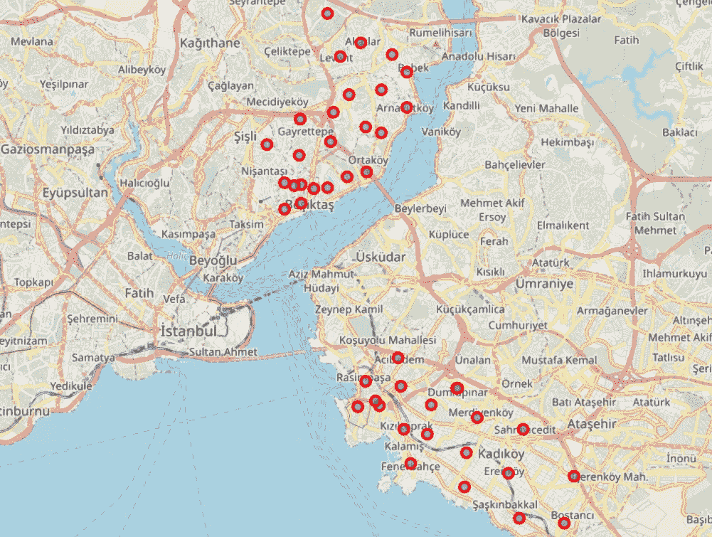

[Pins on the map show the neighborhoods that will be examined](https://leonardoiheme.wixsite.com/ibmproject/neighborhoods)

# 数据

本项目中使用的所有数据都是从互联网上的各种来源获得的。数据操作是用 *Python* 执行的，主要使用的是 *Pandas* 库。我收集的数据可以分为三个部分:

categories of data used in the study

# 方法

从 bulurum.com[我可以获得社区列表和他们各自的邮政编码。漂亮的汤库被用于此，表格显示了前五行的预览](https://www.bulurum.com/en/)

the first five rows of the neighborhoods data frame

通过 API 查询 foursquare 数据库获得位置数据。要下载数据，需要输入以下信息:客户端 ID、客户端机密、纬度、经度、版本、搜索半径

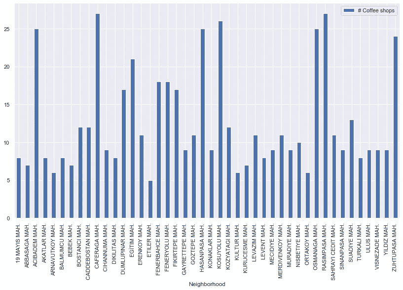

The number of coffee shops in each neighborhood

# 探索性数据分析

## 人口

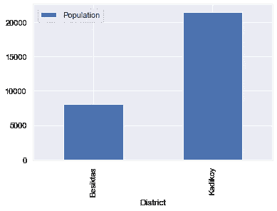

The number of coffee shops in each district

*   Kadı比 beikta 大，所以在那里看到更多的人口并不奇怪。
*   在邻近水平上，人口的分布变得更加清楚。

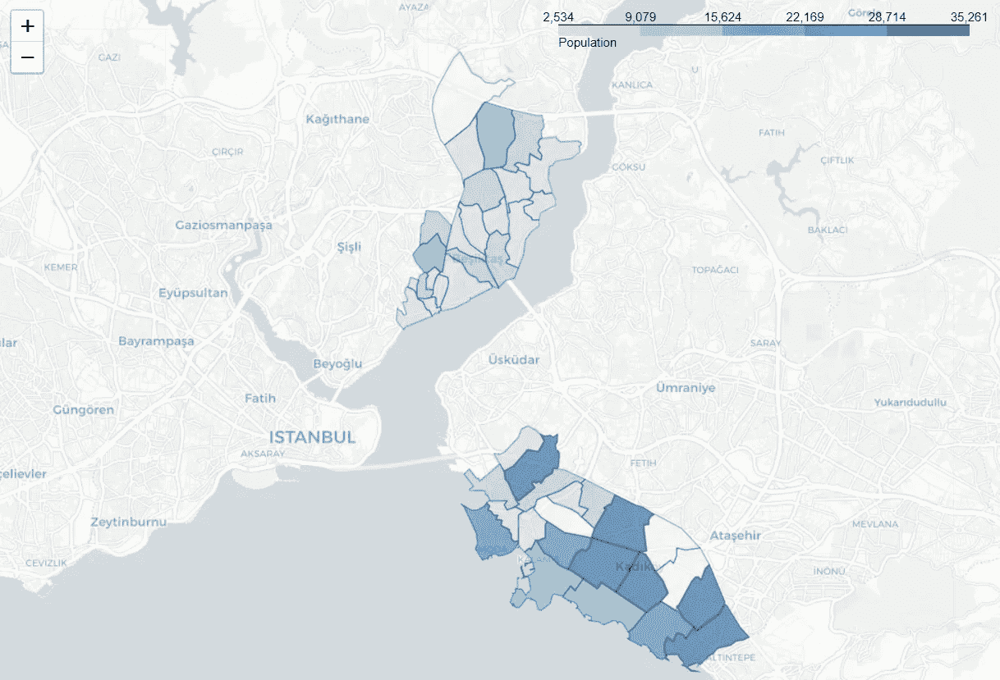

[The population of Besiktas and Kadikoy neighborhoods](https://leonardoiheme.wixsite.com/ibmproject/population)

## 咖啡店的数量

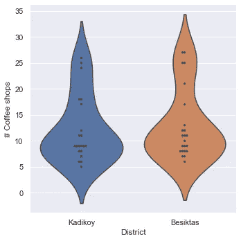

The distribution of coffee shops in Kadikoy and Besiktas

*   两个区的咖啡店数量几乎相等。我们还可以看到，两个地区每个街区的咖啡店数量的变化也几乎相等。

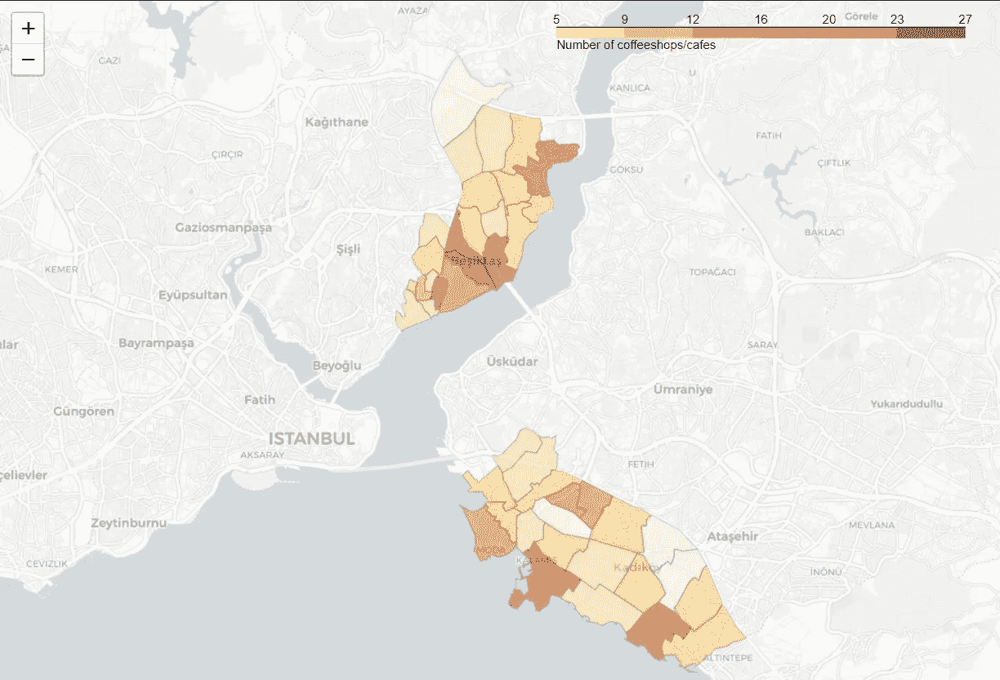

[The number of coffee shops in neighborhoods of Kadikoy and Besiktas](https://leonardoiheme.wixsite.com/ibmproject)

## 租金价格

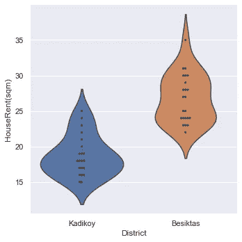

The distribution of the price of rent in Kadikoy and Besiktas

*   在 beikta 租房比在 Kadı贵。
*   Kadı各个街区的租金价格差异较大。这可以从小提琴地块的宽阔形状中看出。

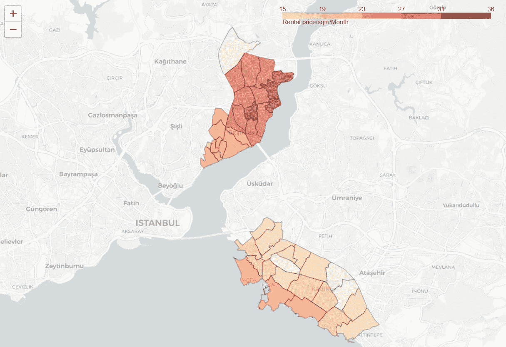

[The price of rent in neighborhoods of Kadikoy and Besiktas](https://leonardoiheme.wixsite.com/ibmproject/price-of-rent)

# 结果

## 回归

进行回归分析以观察咖啡店的数量如何与其他特征相关。

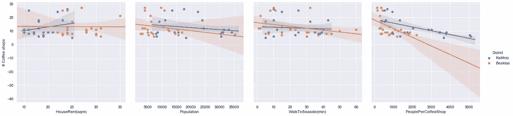

Regression plots

*   如果这个地区有很多咖啡店，租金可能会更高。在贝希克塔斯，情况正好相反。
*   随着人口的减少，咖啡店的数量也在减少。
*   社区离海边越远，咖啡店就越少。

## 有趣的邻域(离群值)

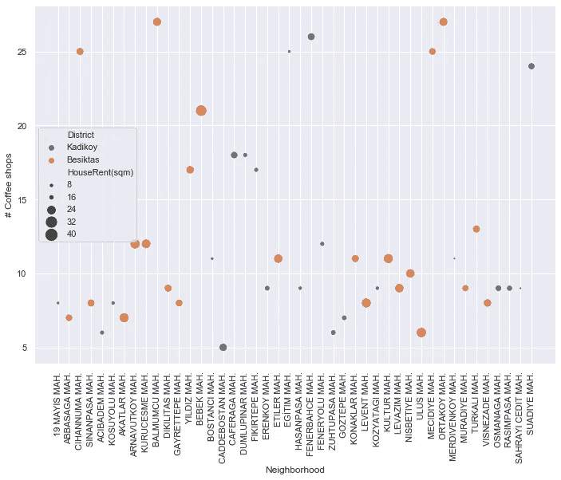

Scatter plot of neighborhoods

*   **费内巴赫·马赫。**是 Kadı最昂贵的街区，拥有最多的咖啡店。
*   在 **Egitim Mah 租房。相对便宜，而且这个地区有很多咖啡店。**
*   **卢斯·马赫。**在 beikta 有一些咖啡店，但租金很高。
*   总的来说，Kadı似乎是一个比 beikta 更加多样化的地区。

# 邻域聚类

在 python 中使用 scikit learn 使得机器学习非常容易实现。下面的代码片段实现了 k 均值聚类

K-means code snippet

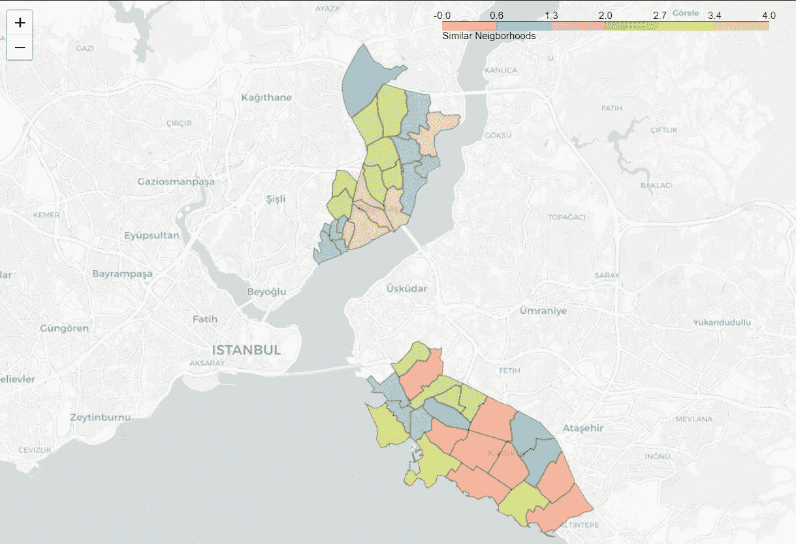

[Map of Besiktas and Kadikoy showing clustered neighborhoods](https://leonardoiheme.wixsite.com/ibmproject/clusters)

## 检查集群

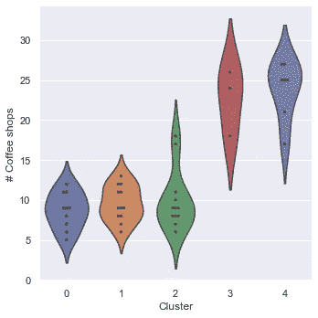

# coffee shop clusters

*   第三和第四类社区中的咖啡店数量最多

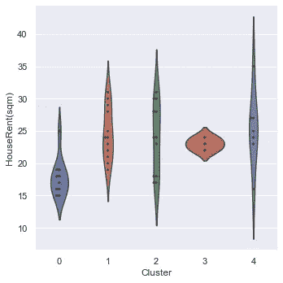

House rent clusters

*   集群一中的社区租金最低

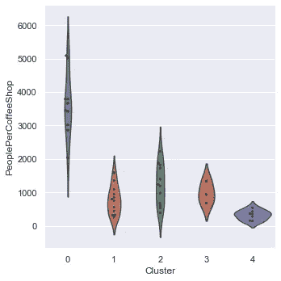

# People per coffee shop clusters

*   聚类三中的那些拥有最不拥挤的咖啡店，而聚类一中的那些拥有最拥挤的咖啡店。
*   从这项研究的结果中可以提出一些建议。

# 结论

在这份报告中，我概述了探索性数据分析和推断性数据分析的发现。使用几种数据收集和辩论技术，分析了伊斯坦布尔最受当地人喜爱的两个区的特征。此外，机器学习被用于寻找最相似的邻域。这项研究的目的不是说哪个社区更好，而是为那些寻求特殊咖啡体验的人提供指导。我让读者根据前面的分析和他们的偏好来决定在哪里以及如何喝咖啡。

如果你已经做到这一步，感谢你的阅读:)详细的[报告](https://nbviewer.jupyter.org/github/leonardo-iheme/IBM_Data_Science_Capstone/blob/master/Report.ipynb#-)和[代码](https://nbviewer.jupyter.org/github/leonardo-iheme/IBM_Data_Science_Capstone/blob/master/Code.ipynb)可以在我的 [Github 资源库](https://nbviewer.jupyter.org/github/leonardo-iheme/IBM_Data_Science_Capstone/tree/master/)中找到。如果您有任何问题或想分享您的想法，请随时联系我。