# 哪位 2020 候选人最擅长推特？

> 原文：<https://towardsdatascience.com/which-2020-candidate-is-the-best-at-twitter-fd083d13fb4e?source=collection_archive---------11----------------------->

## 2020 年民主党候选人推特账户的数据分析

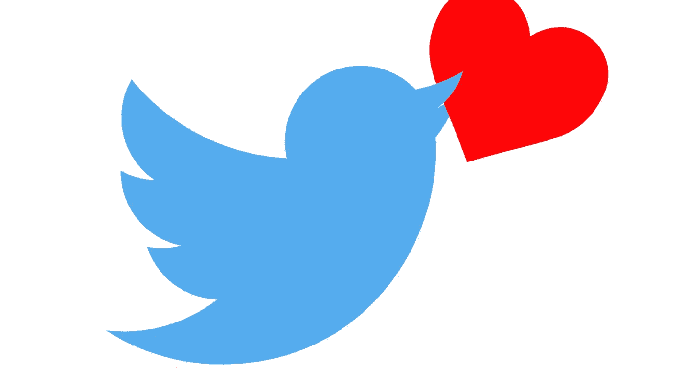

2020 年民主党提名的竞争将在许多领域展开。在一个月后的第一场辩论之前，在关键州的竞选集会之前，甚至在黄金时间的电视采访之前，提名之争已经在 Twitter 上开始了。每个主要的民主党候选人都有大量的社交媒体追随者。有了这些账户，候选人就有了直接与选民、媒体和世界沟通的手段。毕竟，我们已经看到精心制作的推文可以[改变现实世界中的叙述](https://twitter.com/alyssa_milano/status/919659438700670976?lang=en)。

了解到这一点，我决定收集 11 位民主党总统候选人的所有推文。其中三个竞争者有独立的工作账户，所以总共分析了 14 个档案。有了这些数据，就有可能看到哪些候选人充分利用了这个新的强大的平台。

# Twitter 统计数据

## 追随者

拥有最多推特粉丝的候选人无疑是**伯尼·桑德斯**。在他的参议院(@SenSanders)和个人(@BernieSanders)账户之间，桑德斯拥有超过 1700 万名粉丝。毫无疑问，其中一些重叠，但这表明他的 2016 年竞选活动创造了大量的社交媒体追随者。伊丽莎白·沃伦的参议院账户远远排在第三位，而科里·布克、乔·拜登和卡玛拉·哈里斯也有数百万人关注。

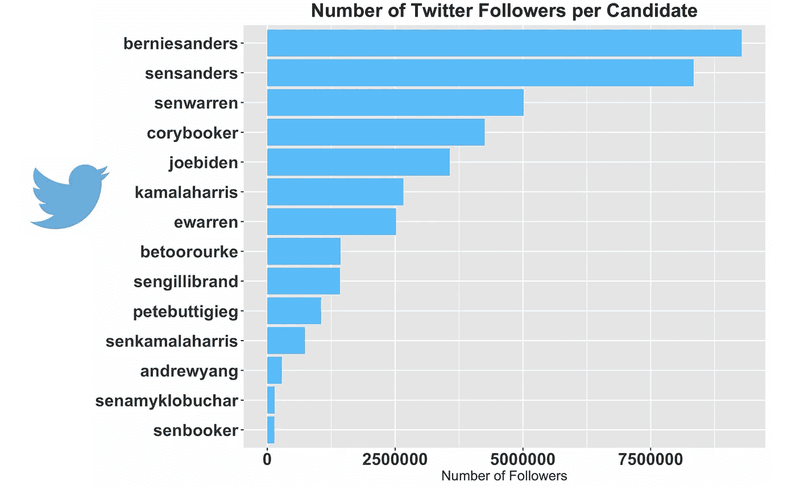

关注者数量可以被视为候选人在线影响力的衡量标准。大量追随者的实际效果取决于候选人的沟通能力。

## 推文数量

如果关注者数量就像势能，那么发布的推文数量就类似于动能。在这方面，**杨安泽**是 2020 年候选人中最有活力也是最多产的。2019 年，杨发布了近 3000 条推文，他使用社交媒体的次数远远超过了他的同龄人。他可能是一个充分利用这种媒介的竞争者。

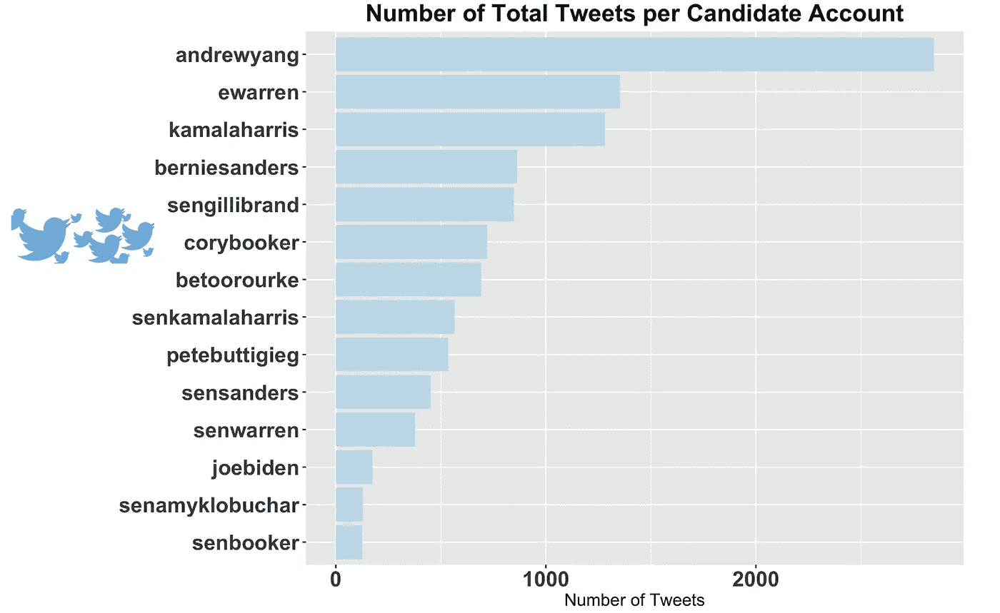

在杨之后，和是发微博最多的政客。远远落后于这些的是民调领先者乔·拜登。拜登在 2019 年只有 147 条推文。和现实生活中一样，他在推特上的竞选策略似乎是避免引起太多关注。

## 最喜欢

如果我们把 2019 年每位候选人在推特上获得的所有喜欢加起来，卡玛拉·哈里斯名列榜首，伊丽莎白·沃伦远远落后。

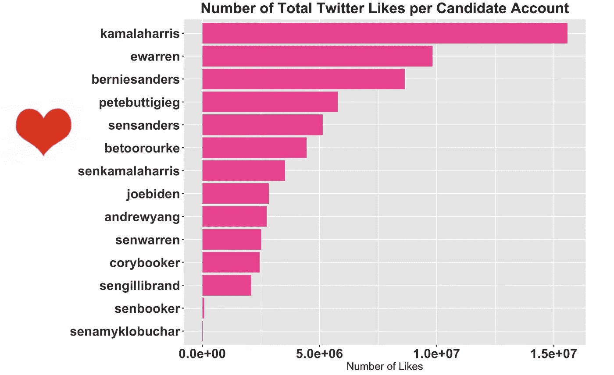

然而，如果我们随着时间的推移绘制这些喜欢，我们会看到哈里斯的大部分支持是在 2 月份她首次宣布竞选时。相比之下，伊丽莎白的沃伦喜欢计数一直在稳步上升。这是我认为沃伦最有可能获得提名的原因之一。她的势头仍在增长。

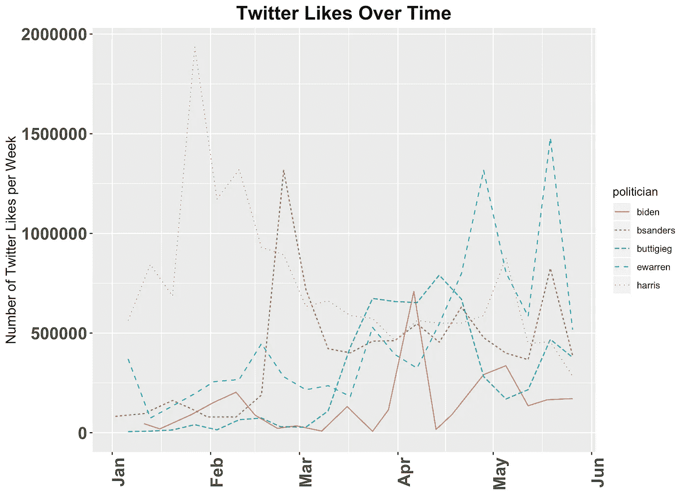

如果我们将所有这些赞除以每位候选人的推特粉丝数(从而将他们归一化)，那么我们会看到**杨安泽**和**皮特·布蒂吉格**名列前茅。在所有候选人中，他们的追随者似乎是最积极的。

## 转发和参与峰值

衡量 Twitter 参与度的另一个有用指标是“转发量”。转发是在网络上传播信息的方式，也是衡量一条微博成功与否的最佳指标。

转发的情节看起来和赞的情节几乎一样。和 likes 一样，我们在 5 月份看到了参与的高峰，我认为这是因为阿拉巴马州和佐治亚州通过了限制堕胎的法案。尤其是在女性候选人中，这些法律提供了源源不断的推特素材。伯尼·桑德斯在这个问题上也做得很好，而乔·拜登却没有。下面是每位候选人包含“堕胎”一词的推文数量图。这些推文大多是上个月的。

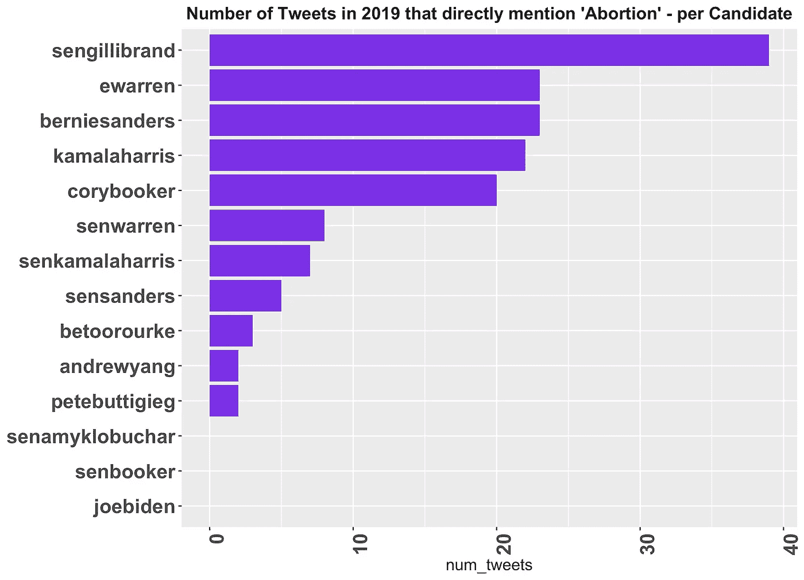

Kirsten Gillibrand more than any other candidate prioritizes woman’s issues

有趣的是，顶级候选人乔·拜登、皮特·布蒂吉格和贝托·奥罗克在这个问题上基本保持沉默。我认为这证明了男性在今年的初选中会很艰难。

# Twitter 风格

除了查看与候选人推文相关的统计数据，我们还可以查看其内容。下面我将重点放在 tweet 文本本身，并检查出现的不同主题。

## 乔·拜登

乔·拜登将自己标榜为反特朗普者。因此，毫不奇怪，他最受欢迎的推文——任何候选人最喜欢的推文——是对总统的攻击。

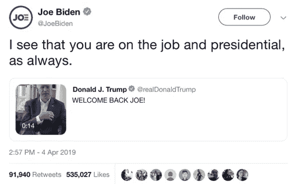

具体来说，拜登的推文认为，他可以让美国回归其“核心价值观”。在其中一封信中，他说“我们选择希望而不是恐惧，选择真理而不是谎言，选择团结而不是分裂。”在另一封信中，他将这些价值观与现任总统进行了对比。

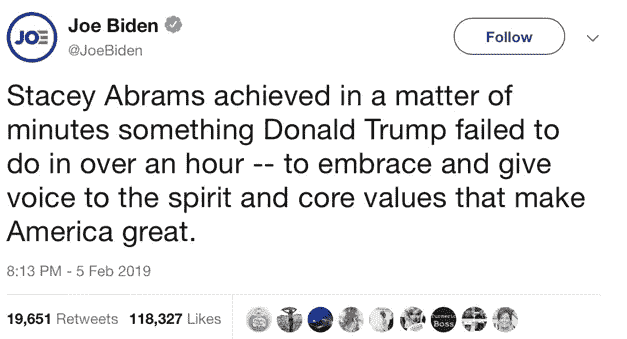

在拜登的推文中创建了一个最常见术语的词云，我们看到了对“国家”、“美国”和“民族”的常见引用。他的竞选活动似乎是由模糊的承诺推动的，即让事情回到更美好的过去。

Joe Biden Word Cloud

## 伯尼·桑德斯

伯尼·桑德斯是社交媒体内外的煽动者。他最受欢迎的推特倾向于与共和党人争吵，无论是在堕胎还是伊尔汉·奥马尔问题上。

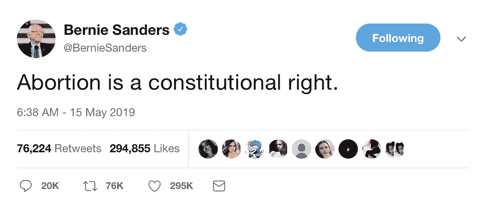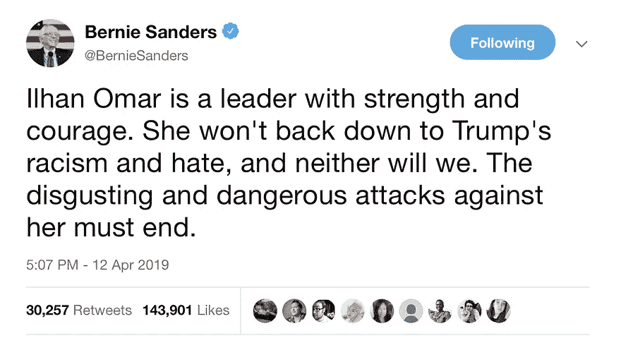

伯尼还谈到了“国家”，但通过其“人民”的镜头，而不是其价值观。事实上，“人民”是他的推文中最常用的词。他使用的另一个关键词是“健康”,而医疗保健似乎是他竞选中的主要议题。

Bernie Sanders Word Cloud

## 伊丽莎白·沃伦

伊丽莎白·沃伦是 Twitter 上更有深度的故事讲述者之一。她在 2019 年的前 3 封信都很长，很详细。他们处理从针对女性的暴力(Ilhan Omar)和不平等(财富税)到堕胎等一系列问题。在后一种情况下，她特别引人注目，解释了为什么佐治亚州和阿拉巴马州的法律如此有害。

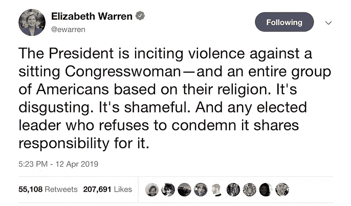

像伯尼·桑德斯一样，她关注“人民”，但更强调为他们“战斗”。她也比桑德斯更关注“家庭”。

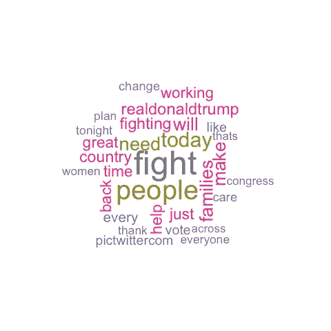

Elizabeth Warren Word Cloud

## 卡玛拉·哈里斯

和伊丽莎白·沃伦一样，卡玛拉·哈里斯也把堕胎和攻击川普作为她竞选的关键内容。她最受欢迎的推文反映了这一点。

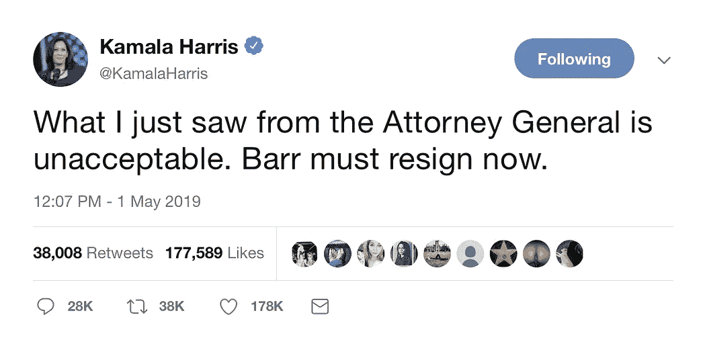

但对我来说，哈里斯在网上似乎并不自在。尽管哈里斯的推文触及了“健康”、“人民”和“家庭”等重要主题，但她倾向于简单，有点缺乏情感。我怀疑她作为律师的背景使她对自己的言辞过于谨慎。她最常用的词是经典的行动号召——“必须”和“将”。

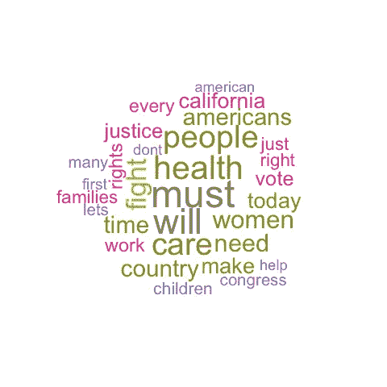

Kamala Harris Word Cloud

## 皮特·布蒂吉格

皮特·布蒂吉格发推特的次数比他的对手少，但当他发推特时，他非常有效。他最受欢迎的推文混合了愤怒和有趣的故事——这是社交媒体上的一个爆炸性组合。

最重要的是，Buttigieg 的 Twitter 角色反映了一个好人的形象。例如，他似乎经常使用“谢谢”这个词。Buttigieg 也是一种反特朗普的人，但比拜登的包袱少，比伯尼的意识形态少(见他对“社区”而不是“工人”的强调)。他的字云在下面。

Pete Buttigieg Word Cloud

## **感悟**

衡量候选人推文内容的最简单方法之一是计算他们有多积极。使用 sentimentR 库，我能够比较候选人推文的平均情绪。

正如我之前提到的，杨安泽是 2020 年所有候选人中最积极的。贝托·奥罗克和皮特·布蒂吉格在社交媒体上交流时也倾向于使用积极的语气。相比之下，卡玛拉·哈里斯、伊丽莎白·沃伦和伯尼·桑德斯更可能使用负面语言。最后，乔·拜登的语气基本上是积极的，但没有巴顿那么乐观。对我来说这似乎是对的。推特上的情绪似乎反映了与每场竞选相关的普遍情绪。

# 最后的想法

我个人认为，在社交媒体时代，赢得选举也意味着在网络上的良好沟通。在这方面，我们看到候选人都有不同的长处。伯尼·桑德斯拥有最多的追随者，因此拥有最多的草根支持。卡玛拉·哈里斯拥有最多的支持，或许也是最有制度性的支持。伊丽莎白·沃伦最有冲劲，而乔·拜登最有能力用他的知名度吸引注意力。到 2020 年，我们将看到哪个候选人最有效地利用这些优势。