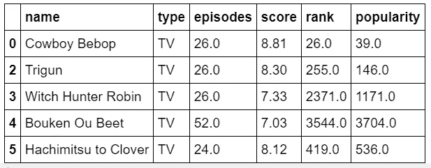
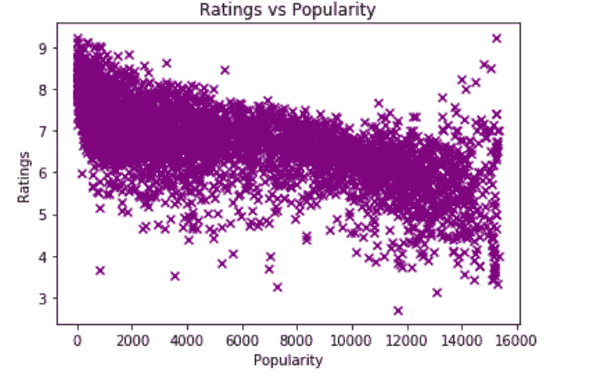
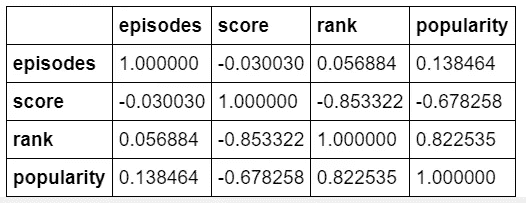
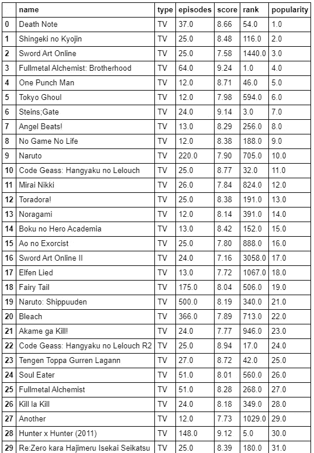
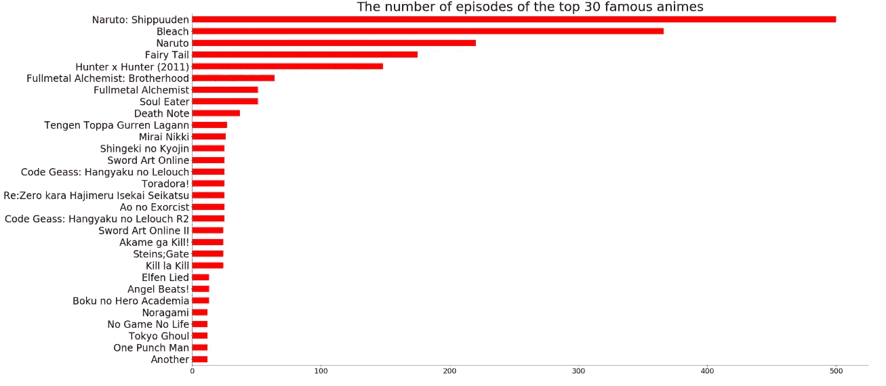
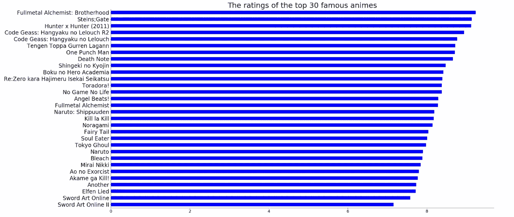

# 哪部动漫最好看？

> 原文：<https://towardsdatascience.com/which-anime-is-the-best-4acb28f80bf5?source=collection_archive---------13----------------------->


Photo credit: [https://www.flickr.com/photos/bagogames/22812069025](https://www.flickr.com/photos/bagogames/22812069025)

## 使用数据可视化显示流行动漫如何排名

动画是日本制作的一种卡通形式，在全世界非常流行。在过去的二十年里，不同的动画系列已经发行，其中一些对电视文化产生了巨大的影响。

火影忍者就是这些有影响力的动漫系列中的一个例子。它有能力让任何坐下来看几分钟的人被它美丽的故事和疯狂的动作场面所吸引。每次我仍然看火影忍者，我都会有这种怀旧的感觉，就像我是看着这部伟大的艺术作品长大的。

在我看来，最好的动画应该是《对泰坦的攻击》。在观看 Shingeki no Kyojin(日语中攻击泰坦的意思)时，我看到谏山创在娱乐方面为未来的动漫系列树立了榜样。这部动画为观众提供了许多未解之谜、大量曲折的情节和刺激的事件。我等不及下一季明年秋天出来了。

还有其他令人难以置信的动画系列，如《全金属:兄弟情谊》、《心理传递》、《龙珠 Z》、《死亡笔记》、《漂白剂》和《猎人 x 猎人》。然而，至今让我困惑的问题是，这几部动漫到底哪部最好？

# 数据收集

为了正确地进行这项研究，动画数据集是使用这个[链接](https://www.kaggle.com/aludosan/myanimelist-anime-dataset-as-20190204)从 Kaggle 获得的。在 Jupyter 笔记本上加载后，它被改进为包括重要的功能，如:名称，类型，剧集，分数，排名和受欢迎程度。下面是新形成的数据集的前五行:



Top five rows of the newly-formed dataset

使用该数据集，进行了一些可视化的数据分析。

# 收视率与受欢迎程度

第一张图表是比较动画系列的收视率和受欢迎程度。



Scatter plot of Anime Ratings vs Popularity



Correlation coefficient of the anime dataset

图表清楚地表明，收视率最高的动漫系列往往最受欢迎。使用相关系数表，该图的相关系数为-0.85。这表明，收视率与动漫的受欢迎程度有着强烈的负相关性。这意味着随着收视率的增加，动画的受欢迎程度越来越接近顶端。

# 最受欢迎的 30 部动漫系列

该数据集被修改为包括排名前 30 的动画系列，以便进一步分析，找出它们之间的差异。下面是用于提取前 30 个最受欢迎的动画的代码:

```
df_anime11 = df_anime1.sort_values(by = "popularity", ascending = **True**).reset_index()
df_anime11 = df_anime11[df_anime11['popularity'] != 0.0].reset_index()
df_anime11 = df_anime11.head(30)
df_anime12 = df_anime11[['name', 'type', 'episodes', 'score', 'rank', 'popularity']]
df_anime12
```



Top 30 most popular anime with their features.

# 集数最多的动漫

建立了一个水平条形图来显示前 30 个最受欢迎的动漫系列中哪个动漫系列制作的剧集最多。



The number of episodes of the top 30 most popular anime series

火影忍者 shippuuden 以 500 集位居第一。《漂白剂》第二，约 366 集。火影忍者，也是火影忍者系列的一部分，有 220 集，排在第三位。《仙尾》和《猎人 x 猎人》分别以 175 集和 148 集排在第四和第五位。

# 收视率最高的 30 部流行动漫

另一个水平条形图展示了前 30 名最受欢迎的动漫之间的排名。



The ratings of the top 30 most popular anime

第一名是全金属炼金术士:兄弟情谊，评分 9.24。Steins:Gate 和 Hunter x Hunter 分别以 9.14 和 9.12 分别位居第二和第三。代号 Geass: Hangaku no 车夫党 R2 以 8.94 的评分排在第四位。Cod Geass: Hangaku no 车夫党以 8.77 的评分排名第五。

我最喜欢的两个动漫系列火影忍者 shippuuden 和 Shingeki no Kyojin 分别获得了 8.19 和 8.48 的评分。他们也分别排在第 16 和第 9 位。

用于进行研究的完整版本代码可以在这里看到 [**。**](https://github.com/MUbarak123-56/DataBEL/blob/master/Anime%20stuff.ipynb)