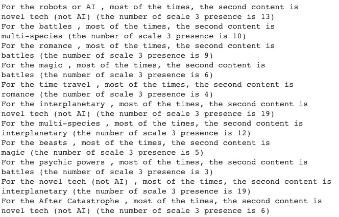

# 是什么让一本科幻小说受欢迎？

> 原文：<https://towardsdatascience.com/which-content-of-the-story-is-the-most-popular-in-top-rated-sci-fi-books-6f3644246ac3?source=collection_archive---------13----------------------->

## 三个世纪以来科幻小说故事的主要内容探析

在顶级科幻小说中，哪个故事内容最受欢迎？几十年来，内容的受欢迎程度有变化吗？在同一本科幻书中有哪些内容经常一起出现？

为了回答这些问题，我探索了 Kathleen M. Carley (2017)编写的过去三个世纪的科幻书籍数据集(*科幻书籍数据集，*从 [CASOS](http://www.casos.cs.cmu.edu/tools/datasets/internal/index.php) 检索)。该数据集包含有关书名、出版日期、作者、作者性别、一本书在 2016 年左右出现在最高评级列表中的次数以及故事内容的信息，其中包括机器人、时间旅行、天启等内容。每个内容都根据其在书中的存在程度进行分级，最高级别为 3，表示该内容是存在的、强有力的，并且是故事的一部分，最低级别为 0，表示该内容根本不存在。

# **数据集概述**

从下图可以看出，总体来说，科幻书出现频率最高的内容是小说科技(不是 AI)、星际(设定)、战斗。

男性作者首选的内容列表是新技术、星际(设定)和与其他物种的战斗。

女性作者首选的内容是新颖的科技、浪漫和带有时间旅行的星际(设定)。此外，女性作者不写精神力量。

2000 年以后出版的科幻书中的内容有什么不同？这些书更多的是关于新奇科技，天启，浪漫，战斗，没有灵力。

这引出了我的第二个问题:

# **同一本科幻书中有哪些内容经常一起出现？**

为了回答这个问题，我将每个主要内容的数据转换为 python 字典，格式如下:

这就回答了问题，但是很难看到全貌，所以我就标出来了。在下图中，绘图颜色对应一个刻度；刻度越高，颜色越深。

例如，机器人或人工智能内容最常见的第二个内容是新技术。此外，机器人和魔法很少出现在同一本书里，并且用白色圆圈标出。

对于新技术，最常见的第二个内容是星际(设置):

对于每种内容，结果如下:

我的下一个问题是:

# **几十年来，内容的受欢迎程度如何变化？**

某个特定内容在某个特定十年内的强势存在与其他内容的强势存在之间的比例将回答这个问题。结果如下图所示:

除了小说技术，这是几十年来最常见的内容，情节表明，在过去的几十年里，科幻小说更多的是关于天启，其他星球，而不是关于精神力量。

在视觉上更具戏剧性的情节中，我们可以看到，在二十一世纪，科幻书籍不再是关于野兽(红色)，而是机器人或 AI(蓝绿色)。机器人或 AI 内容出现在上个世纪中叶，是二十一世纪科幻书籍中一个故事的七个主要内容之一。

# **哪种内容在顶级科幻书中出现频率更高？**

为了弄清楚这一点，我直观地研究了数据，以查看内容在所有频率值下的分布情况。例如，下面的图显示，机器人或人工智能内容几乎出现在所有频率值上，也是顶级书籍(频率值为 6 或更高)的故事(等级 3)的主要内容。

精神力量的内容大多出现在低频率值，从来不是经常名列前茅的科幻小说故事的主要内容。

# **总结**

综上所述，数据集探索的结果是，科幻书籍最常出现的内容是新奇科技(非 AI)、星际(设定)、战斗。男作者多写小说技术和空间，女作者多写小说技术和浪漫。2000 年后，启示录在科幻书籍的流行内容中上升，灵力内容是最不受欢迎的一种。还有，对于新颖的技术，在同一本书里最常发现的内容是星际(设定)和机器人或 AI。野兽不再是故事的主要内容，而机器人或人工智能已经在上个世纪中叶出现，并稳步发展。最后，在顶级科幻书籍中最常见的三个内容是星际(设置)、机器人或人工智能以及新颖的技术。