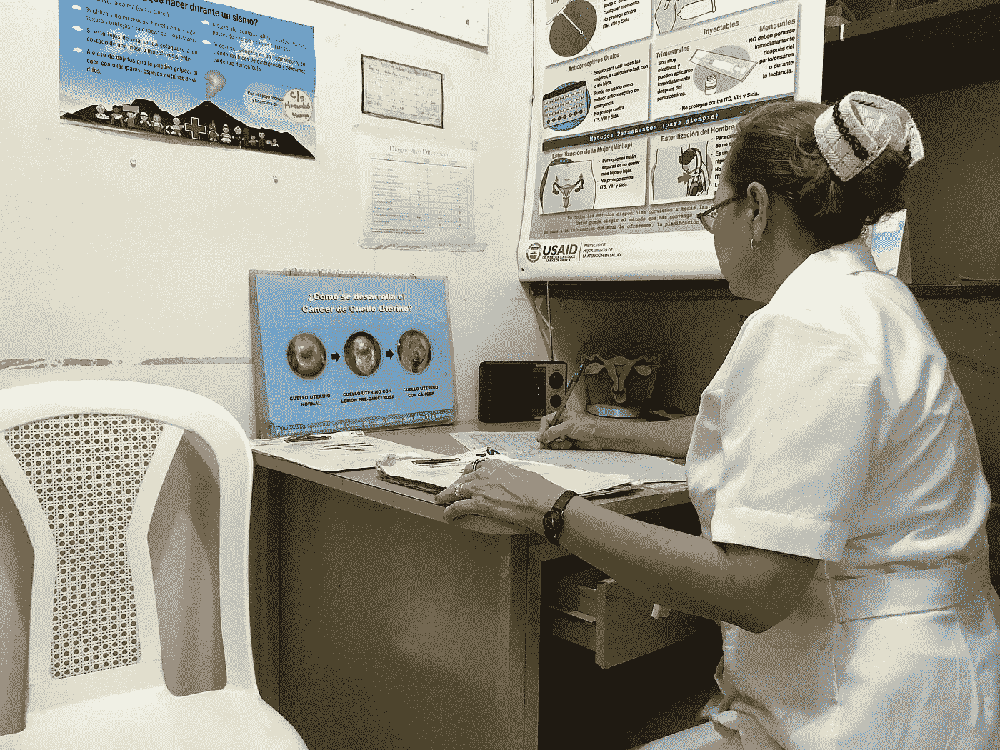
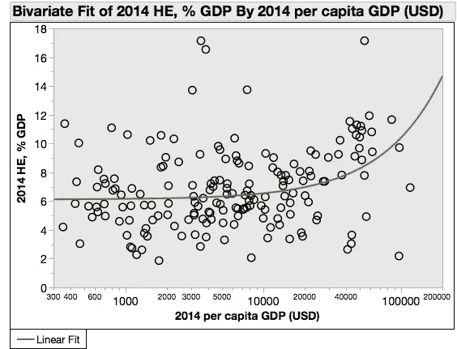
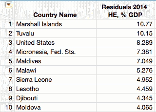
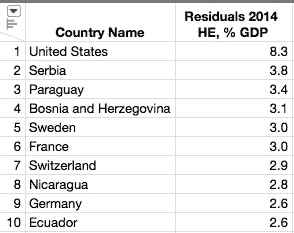
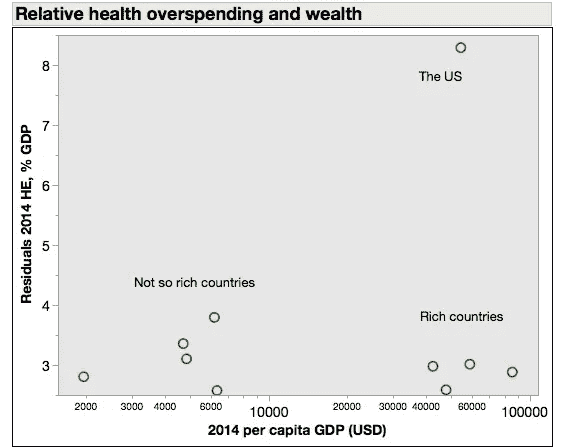
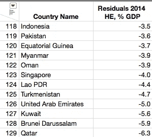

# 哪些国家最重视人的生命和健康？

> 原文：<https://towardsdatascience.com/which-countries-put-the-highest-value-on-human-life-and-health-b011fbdbc550?source=collection_archive---------28----------------------->

## 定量分析

Nicaraguan nurse preparing a Pap smear. Mtran99 CC BY-SA 4.0

这似乎是一个天生主观的问题。你怎么能给生命和健康定价呢？

但是人们和国家一直在这样做。对医疗保健的需求可能是无限的，但资源是有限的，即使在最富裕的国家也是如此。我们如何分配资源揭示了我们的优先事项。

富裕国家支付更多是因为他们有能力，而不是因为他们一定更重视他们的公民。为了了解国家如何重视其公民的生命，我们应该比较实际卫生支出与支付能力。如果医疗保健在每个国家都有同样的优先权，我们预计它在 GDP 中的份额会保持不变。

事实并非如此。这是医疗保健总支出占 GDP 的百分比与人均 GDP 的关系图:

Own work, data from [World Development Indicators](http://databank.worldbank.org/data/reports.aspx?country=&series=NY.GDP.PCAP.CD&source=2)

大多数国家的人均国内生产总值不到 100 美元，集中在图的左侧，所以我把 x 轴做成了对数坐标来展开数据。然后我对数据做了一条最佳拟合线。二次模型更合适一些，但不会真正改变我们的结论。

这项工作中出现了一些问题。首先，数据中有很多分散点(r^2 = 0.18)。你需要一个涵盖 6 倍医疗支出范围(人均 GDP 的 2%到 12%)的桶，以覆盖 90%的国家。各国在投入医疗资源的方式上有很大差异。这种差异并不与收入成正比。这并不是说穷国(或富国)都被迫进入一个狭窄的支出范围。这些支出反映了一种选择。

其次，这种关系有一个显著的(P < 0.0001)上升趋势——较富裕的国家愿意在医疗保健上花费更多的资源。这并不奇怪。一旦你有了食物和住所，医疗保健可能会成为剩余收入的首要支出。

令人惊讶的是这种关系是如此的脆弱。人均 GDP 每增加 1000 美元，医疗支出只有 0.04%左右的增长。中等国家的人均国内生产总值为 5500 美元。在这个范围内，每增加 1000 美元的收入，只有 2.2 美元用于医疗保健。换句话说，财富和消费意愿之间的关系在统计上很重要，但在功能上毫无意义。除了金钱之外的因素——历史、文化、管理——决定了医疗支出的水平。

有趣的案例是那些偏离趋势线最多的国家。鉴于这些国家的人均国内生产总值，它们的支出或多或少于预期。以下是十大超支者:

这里给出的数字(残差)是上图中绿色趋势线上方的距离。

我们这里有一些非常小的国家，其中许多是岛国，还有美国。尽管马绍尔群岛名列榜首，但其人均医疗支出仅为 680 美元。它不是一个花钱大手大脚的人，而是如此之小和如此之穷，以至于即使是一笔小的支出也会变得相对较大。让我们排除那些向医生支付过高工资、拒绝与 T2 谈判药品价格、允许令人憎恶的医疗破产的国家。这是一个异数，一个颠覆了消费和价值之间联系的怪异世界系统。

富裕国家的过度消费并不显著。或者，至少，他们不应该。这些国家有充足的资源用于改善其公民的福祉，它们也确实如此。

值得注意的是低收入国家。他们都不是良好治理的典范。在世界银行的名单上，T4 排在第 73 位(塞尔维亚)和第 141 位(尼加拉瓜)之间。然而，这些政府选择优先考虑公民的健康。愤世嫉俗者可能会说，这是一种收买:让我们继续执政，我们将为你提供医疗保健。但是，只有当公民本身重视健康和生命时，这种交易才会起作用。贿赂是很好的价值指标。

在此基础上，我提出塞尔维亚、波斯尼亚和黑塞哥维那、巴拉圭、厄瓜多尔和(特别是)尼加拉瓜这些国家是最重视生命和健康的地方。

在光谱的另一端…

…我们有以下支出不足者列表:

# 名单的这一端是两种类型国家的混合体:绝对消费水平相当高的极度富裕国家(新加坡、阿联酋、科威特、阿曼和卡塔尔)，以及贫穷且治理不善(如果不是彻头彻尾的盗贼统治的话)的国家。这些国家都没有对公民特别负责的政治制度。在性别平等和妇女权利方面，大多数国家的排名很差。除了三个国家，其他国家都是穆斯林占主导地位。

相对医疗保健支出的扩大说明了重要的一点。不是每个国家都富裕。但是国家可以选择如何分配他们所拥有的资源。他们可以像巴基斯坦一样拥有庞大的军队和核武库。或者他们可以尽力照顾他们的人民，就像巴拉圭一样。这不是命运、历史或环境，而是一种选择。

This end of the list is a mixture of two types of countries: extremely wealthy states that spend a fair amount in absolute terms (Singapore, the UAE, Kuwait, Oman and Qatar), and countries that are poor and are poorly governed, if not outright kleptocracies. None of these countries have political systems that are particularly responsive or accountable to their citizens. Most of them [rank very poorly](http://reports.weforum.org/global-gender-gap-report-2015/rankings/) with respect to gender equality and women’s rights. All but three are Muslim-dominated.

The spread in relative health care expenditures illustrates an important point. Not every country is rich. But countries can choose how they allocate the resources they do have. They can have a large military and a nuclear arsenal like Pakistan. Or they can try to take care of their people to the best of their ability, like Paraguay. It is not fate or history or circumstances, it is a choice.