# 哪个深度学习框架发展最快？

> 原文：<https://towardsdatascience.com/which-deep-learning-framework-is-growing-fastest-3f77f14aa318?source=collection_archive---------2----------------------->

## TensorFlow 与 PyTorch

2018 年 9 月，我在[这篇文章](/deep-learning-framework-power-scores-2018-23607ddf297a)中，从需求、使用情况、受欢迎程度等方面对比了各大深度学习框架。TensorFlow 是深度学习框架无可争议的重量级冠军。PyTorch 是一个充满活力的年轻新秀。🐝

在过去的六个月里，领先的深度学习框架的前景发生了怎样的变化？

为了回答这个问题，我看了看[上的招聘信息，事实上还有](http://indeed.com)、[怪兽](https://www.monster.com/)、 [LinkedIn](https://linkedin.com) 和[简单雇佣](https://www.simplyhired.com/)。我还评估了[谷歌搜索量](https://trends.google.com/trends/explore?cat=1299&q=tensorflow,pytorch,keras,fastai)、 [GitHub 活跃度](https://github.com/)、[中等文章](https://medium.com)、 [ArXiv 文章](https://arxiv.org/)和 [Quora 话题关注者](https://www.quora.com)的变化。总的来说，这些来源描绘了一幅需求、使用和兴趣增长的综合图景。

# 集成和更新

我们最近看到了 TensorFlow 和 PyTorch 框架的几个重要发展。

PyTorch v1.0 于 2018 年 10 月预发布，同时发布的还有 fastai v1.0。这两个版本都标志着框架成熟的重要里程碑。

TensorFlow 2.0 alpha 于 2019 年 3 月 4 日发布。它增加了新功能，改善了用户体验。它也更紧密地集成了 Keras 作为它的高级 API。

# 方法学

在本文中，我将 Keras 和 fastai 包括在比较中，因为它们与 TensorFlow 和 PyTorch 紧密集成。它们还提供了评估 TensorFlow 和 PyTorch 的尺度。

我不会在本文中探索其他深度学习框架。我希望我会收到反馈，认为 Caffe、Theano、MXNET、CNTK、DeepLearning4J 或 Chainer 值得讨论。虽然这些框架各有千秋，但似乎没有一个框架的增长轨迹会接近 TensorFlow 或 PyTorch。它们也没有与这些框架紧密耦合。

搜索于 2019 年 3 月 20 日至 21 日进行。源数据在[这个谷歌工作表](https://docs.google.com/spreadsheets/d/1Q9rQkfi8ubKM8aX33In0Ki6ldUCfJhGqiH9ir6boexw/edit?usp=sharing)中。

我使用了 [plotly](https://plot.ly/) 数据可视化库来探索流行度。对于交互式 plotly 图表，见我的 Kaggle 内核[这里](https://www.kaggle.com/discdiver/2019-deep-learning-framework-growth-scores)。

让我们看看每个类别中的结果。

# 在线工作列表中的变化

为了确定今天的就业市场需要哪些深度学习库，我在 Indeed、LinkedIn、Monster 和 SimplyHired 上搜索了工作清单。

我用*机器学习这个词搜索，*后面跟着库名。于是用*机器学习 TensorFlow 评测 TensorFlow。*这种方法用于历史比较。没有*机器学习*的搜索不会产生明显不同的结果。搜索区域是美国。

我用 2019 年 3 月的房源数减去了半年前的房源数。以下是我的发现:

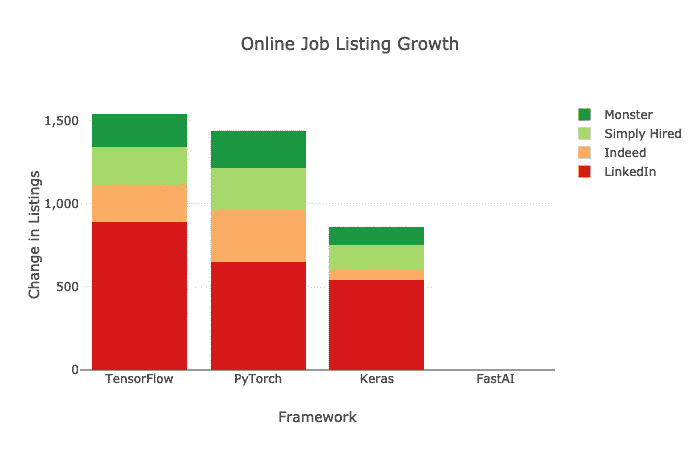

TensorFlow 的上市量增幅略高于 PyTorch。Keras 的上市量也有所增长，大约是 TensorFlow 的一半。Fastai 仍然没有出现在任何工作列表中。

请注意，PyTorch 在 LinkedIn 之外的所有求职网站上看到的附加列表数量都比 TensorFlow 多。还要注意的是，从绝对值来看，TensorFlow 出现在工作列表中的数量是 PyTorch 或 Keras 的近三倍。

# 平均谷歌搜索活动的变化

在最大的搜索引擎上的网络搜索是受欢迎程度的衡量标准。我查看了过去一年谷歌趋势的搜索历史。我搜索了全球对*机器学习和人工智能*类别*的兴趣。谷歌不提供绝对搜索数字，但它提供相对数字。*

我取了过去六个月的平均利息分数，并将其与之前六个月的平均利息分数进行了比较。

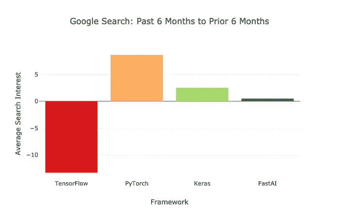

在过去的六个月中，TensorFlow 的相对搜索量有所下降，而 PyTorch 的相对搜索量有所增长。

谷歌下面的图表显示了过去一年的搜索兴趣。

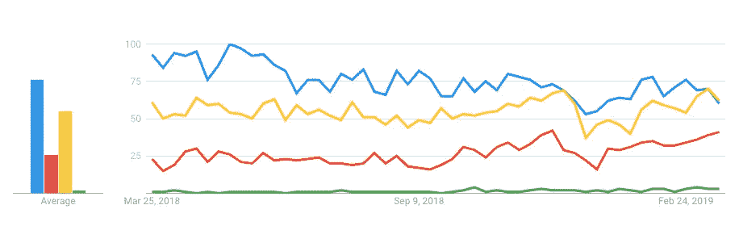

TensorFlow in blue; Keras in yellow, PyTorch in red, fastai in green

# 新媒体文章

Medium 是数据科学文章和教程的热门位置。我希望你喜欢它！😃

在过去的六个月里，我用谷歌搜索了 Medium.com，发现 TensorFlow 和 Keras 发表的文章数量差不多。PyTorch 相对较少。

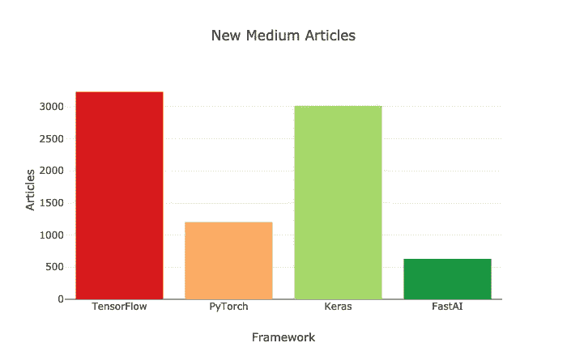

作为高级 API，Keras 和 fastai 受到新的深度学习从业者的欢迎。Medium 有很多教程展示如何使用这些框架。

# 新的 arXiv 文章

arXiv 是一个在线存储库，大多数学术深度学习文章都在这里发表。在过去的六个月里，我使用 Google 站点搜索结果在 arXiv 上搜索了提到每个框架的新文章。

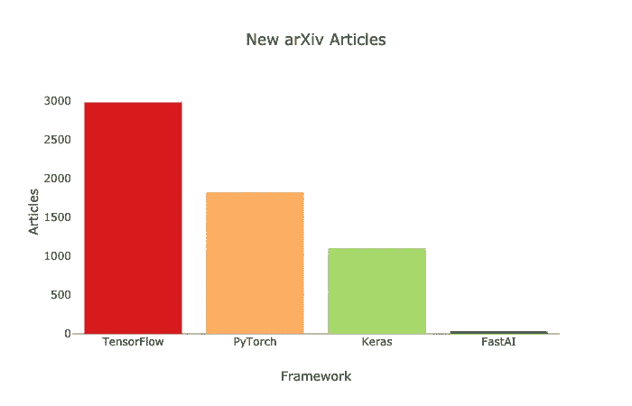

TensorFlow 以明显优势获得了最多的新文章。

# 新 GitHub 活动

GitHub 上最近的活动是框架流行的另一个指标。我在下面的图表中列出了星星、叉子、观察者和贡献者。

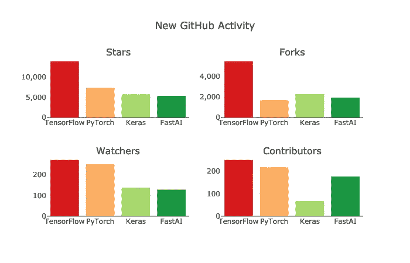

TensorFlow 在每个类别中都有最多的 GitHub 活动。然而，PyTorch 在观察者和贡献者的增长方面非常接近。此外，Fastai 看到了许多新的贡献者。

毫无疑问，Keras 的一些贡献者正在 TensorFlow 库中研究它。值得注意的是，TensorFlow 和 Keras 都是由谷歌人带头的开源产品。

# 新 Quora 追随者

我添加了新 Quora 话题关注者的数量——这是一个新的类别，我之前没有这个数据。

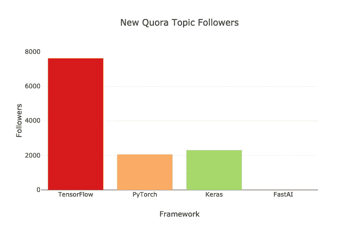

TensorFlow 在过去六个月中添加了最多的新话题关注者。PyTorch 和 Keras 各自增加的要少得多。

一旦我有了所有的数据，我就把它整合成一个指标。

# 生长评分程序

以下是我创建成长分数的方法:

1.  在 0 和 1 之间缩放所有特征。
2.  汇总了*在线工作列表*和 *GitHub 活动*子类别。
3.  根据下面的百分比进行加权分类。

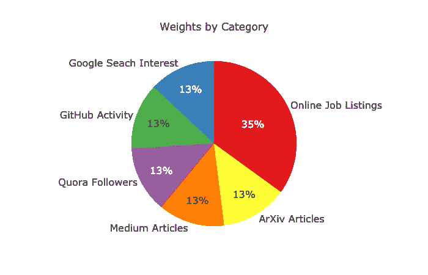

4.可理解性的加权分数乘以 100。

5.将每个框架的类别得分汇总成一个单一的增长得分。

工作列表占总分的三分之一多一点。俗话说，金钱万能。💵这种划分似乎是各种类别的适当平衡。与我的 [2018 power score analysis](/deep-learning-framework-power-scores-2018-23607ddf297a) 不同，我没有包括 KDNuggets 使用调查(没有新数据)或书籍(六个月出版的不多)。

# 结果

以下是表格形式的变化。

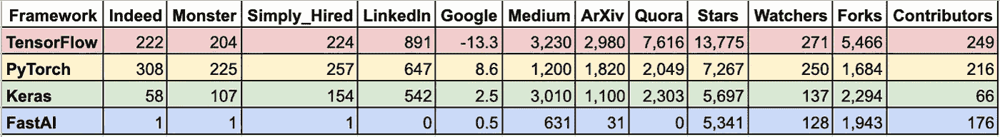

Google Sheet [here](https://docs.google.com/spreadsheets/d/1Q9rQkfi8ubKM8aX33In0Ki6ldUCfJhGqiH9ir6boexw/edit?usp=sharing).

这是类别和最终分数。

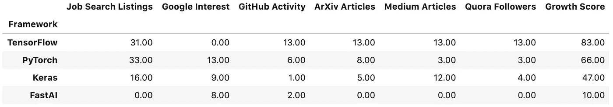

这是最终的成长分数。

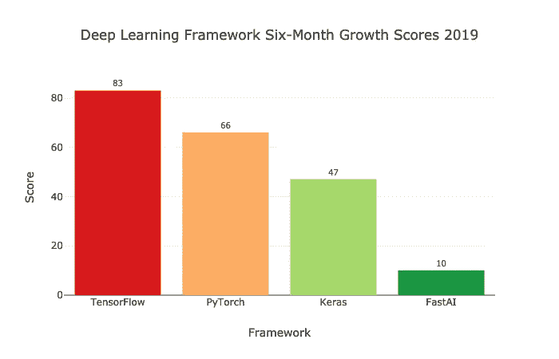

TensorFlow 既是需求最大的框架，也是发展最快的框架。它不会很快去任何地方。😄PyTorch 也在迅速发展。它的工作列表的大量增加证明了它的使用和需求的增加。在过去的六个月里，Keras 也增长了不少。最后，fastai 从一个低基线开始成长。值得记住的是，它是最年轻的。

TensorFlow 和 PyTorch 都是很好的学习框架。

# 学习建议

如果你想学习 TensorFlow，我建议你从 Keras 开始。推荐 Chollet 的 [*深度学习用 Python*](https://www.amazon.com/Deep-Learning-Python-Francois-Chollet/dp/1617294438) 和 Dan Becker 的 [DataCamp 课程上 Keras](https://www.datacamp.com/courses/deep-learning-in-python) 。Tensorflow 2.0 通过 tf.keras 使用 Keras 作为其高级 API，下面是由 [Chollet](https://threader.app/thread/1105139360226140160) 对 TensorFlow 2.0 的快速入门介绍。

如果你想学习 PyTorch，我建议你从 fast.ai 的 MOOC [程序员实用深度学习，v3](https://course.fast.ai/) 开始。您将学习深度学习基础、fastai 和 PyTorch 基础。

TensorFlow 和 PyTorch 的前景如何？

# 未来方向

我一直听说人们更喜欢使用 PyTorch 而不是 TensorFlow。PyTorch 更 pythonic 化，有更一致的 API。它还有原生的 [ONNX](https://onnx.ai/supported-tools) 模型导出，可以用来加速推理。此外，PyTorch 与 [numpy](https://github.com/wkentaro/pytorch-for-numpy-users) 共享许多命令，这降低了学习它的障碍。

然而，正如谷歌首席决策智能工程师 [Cassie Kozyrkov](https://medium.com/u/2fccb851bb5e?source=post_page-----3f77f14aa318--------------------------------) 在这里[解释的那样，TensorFlow 2.0 完全是关于改进的 UX。TensorFlow 现在将有一个更简单的 API、一个简化的 Keras 集成和一个热切的执行选项。这些变化，以及 TensorFlow 的广泛采用，应该有助于该框架在未来几年保持流行。](https://hackernoon.com/tensorflow-is-dead-long-live-tensorflow-49d3e975cf04?sk=37e6842c552284444f12c71b871d3640)

TensorFlow 最近宣布了另一个令人兴奋的计划:为 TensorFlow 开发 [Swift。](https://www.tensorflow.org/swift) [Swift](https://swift.org/) 是苹果最初打造的一种编程语言。在执行和开发速度方面，Swift 比 Python 有许多优势。Fast.ai 将把 [Swift 用于 TensorFlow](https://www.tensorflow.org/swift) ，作为其高级 MOOC 的一部分——见 fast.ai 联合创始人杰瑞米·霍华德关于这个主题的帖子[这里](https://www.fast.ai/2019/03/06/fastai-swift/)。这种语言可能不会在一两年内准备好，但它可能是对当前深度学习框架的一个改进。

语言和框架之间的协作和交叉肯定会发生。🐝 🌷

另一个将影响深度学习框架的进步是[量子计算](https://en.wikipedia.org/wiki/Quantum_computing)。可用的量子计算机可能还需要几年时间，但谷歌、IBM、微软和其他公司正在考虑如何将量子计算与深度学习相结合。需要对框架进行调整以适应这种新技术。

# 包装

你已经看到 TensorFlow 和 PyTorch 都在增长。两者现在都有不错的高级 API——TF . keras 和 fastai——降低了深度学习的入门门槛。你也听说了一些最近的发展和未来的方向。

要交互式地使用本文中的图表或分叉 Jupyter 笔记本，请前往我的 [Kaggle 内核](https://www.kaggle.com/discdiver/2019-deep-learning-framework-growth-scores)。

我希望这个比较对你有所帮助。如果你有，请分享到你最喜欢的社交媒体频道，这样其他人也可以找到它。😄

我撰写关于 Python、DevOps、数据科学和其他技术主题的文章。如果你对其中的任何一个感兴趣，请查看并在这里跟随我。

为了确保你不会错过精彩的内容，请加入我的 [Data Awesome 简讯](https://dataawesome.com)。

感谢阅读！