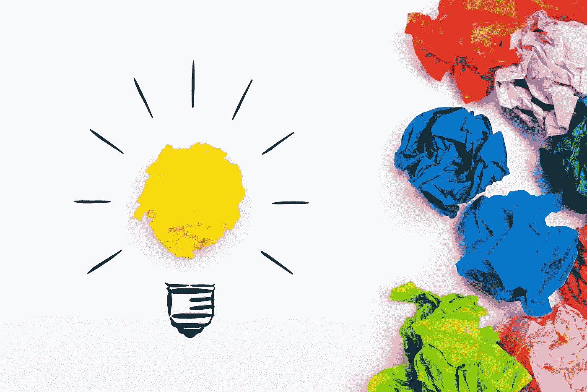
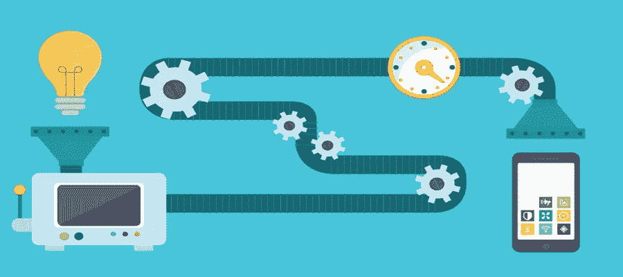
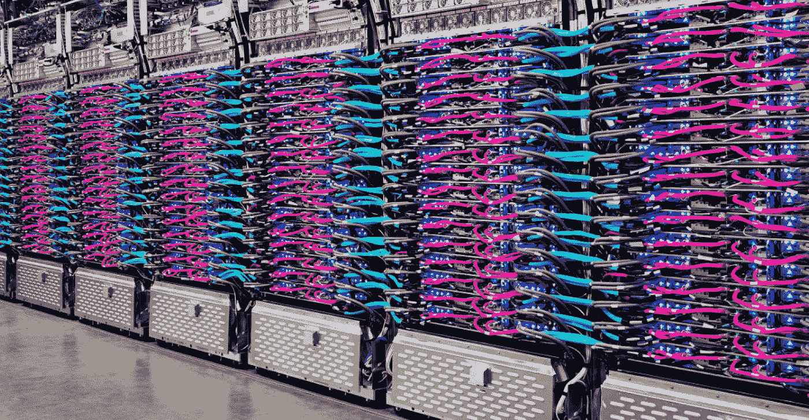

# 你是哪种类型的数据专家？

> 原文：<https://towardsdatascience.com/which-flavor-of-data-professional-are-you-5e01375584ce?source=collection_archive---------5----------------------->

## 扩展数据科学领域的实地指南

数据世界正在快速扩张，现在是我们开始认识到这个领域有多大的时候了，在其中的一部分工作并不自动要求我们成为所有领域的专家。不要期望数据人员能够做所有的事情，让我们开始互相询问，“你是哪一种人？”最重要的是，我们该问自己同样的问题了。

> 在数据世界的一部分工作并不自动要求我们成为所有数据的专家。

Image: [Source](https://www.syfy.com/syfywire/the-13-greatest-x-men-of-all-time).

***免责声明:*** *我画这些漫画是为了帮助你开始一幅思维地图，但我们都知道现实生活并不总是线条分明。例如，一个人可能身兼数职，或者项目阶段可能被未计划的迭代混淆在一起。请不要因为缺乏细微差别而向我扔烂番茄。*

**注:**我关于各种角色推荐录用顺序的文章在这里。

# 你从事哪一行？

现实世界[应用的 ML/AI](http://bit.ly/quaesita_dmguide) 汇集了与[数据](http://bit.ly/quaesita_hist)相关的每一个工作角色，从[统计员](http://bit.ly/quaesita_versus)到[可靠性工程师](http://bit.ly/sre_ch1)。即使你已经研究了*所有*数据的东西(*是的，没错*)，一天中也没有足够的时间让一个人独自做所有的事情，所以让我们进行一次[数据科学生态系统中常见角色](http://bit.ly/quaesita_roles)的快速狩猎，用一个[厨房类比](http://bit.ly/quaesita_fail)来解释。

> 一天中没有足够的时间让一个人独自做所有的事情。

如果你把你的工作翻译成你在食品行业的朋友们会感到自在的术语，哪一个是最合适的？(我原来的厨房类比文章是[这里](http://bit.ly/quaesita_fail)。)

[**数据工程**](http://bit.ly/quaesita_datasci) :来源和流程成分。这有两种方式:(1)提供[数据集](http://bit.ly/quaesita_slkid)给[数据科学家](http://bit.ly/quaesita_datasci)使用，以及(2)支持[数据](http://bit.ly/quaesita_hist)大规模交付。

*如果你只是为自己的晚餐做点什么，杂货店购物很容易，但当你扩大规模时，琐碎的事情就变得错综复杂了——你如何获得、储存和加工 20 吨冰淇淋……而不让它们融化？规模使它成为一个复杂的挑战。类似地，当你为你的学校项目下载一个小的电子表格时，数据工程是相当容易的，但是当你处理 Pb 级的数据时，就令人头晕目眩了。*

[**数据科学研究**](http://bit.ly/quaesita_bsides) :发明厨房电器新品种。你可以把这当成[数据科学](http://bit.ly/quaesita_bubble)的理论研究面，也是 ML/AI/统计/优化的博士学位为你准备的。它是关于创造理论来扩展人类可以解决的问题的种类。

研究人员发明新东西。他们职业生涯的激情在于证明以前不可能的事情是可能的。他们倾向于一路享受工作原型，然后开始追逐下一个挑战。就厨房类比而言，它们都是关于电器蓝图的。也许他们会把这些蓝图变成一个能完成这项工作的装置，但是期望它被希望和胶带粘在一起…砰的一声关上，它就散架了。至于界面——当然，在研究人员的头脑中，按钮的顺序是有意义的，但是如果你试图使用它，你会沮丧地把头发拉出来。人性化？健壮？精心设计？算了吧！那是别人的工作。你的研究人员正忙着研究如何将传送能力植入微波炉。(你什么时候为你的行业团队聘请研究员？当你知道你需要心灵运输能力，但还没有人发明心灵运输。)

[**数据工具制作/平台工程**](http://bit.ly/quaesita_ux) :打造人性化的家电，融入令人愉悦的厨房。这是为了给[的数据科学家](http://bit.ly/quaesita_datasci)提供精美的工具和平台。

*研究人员通常不会给你造出你实际上会* ***享受*** *使用的微波炉。这就是平台工程师的用武之地。这些人没有发明新的接线图或蓝图，他们让现有的可供大众消费。做这部分工作的团队聚在一起，埋头研究设计思维、可靠性和效率。他们做用户研究，以确保他们建立的工具你真的爱上了。不幸的是，你不会看到很多人进入一个空间，直到一些可怜的傻瓜通过证明不友好的版本有市场而遭受损失。在微波炉的早期，没有任何防呆型的产品在家庭用品商店里大量生产和销售。人工智能已经处于这种初级阶段很长时间了，但现在它被证明是有用的，工具制造商正在加紧努力！这是一个激动人心的时刻，因为你认为关于人工智能的许多困难不是智力上的，而是与工具质量相关的。随着工具变得更加用户友好，更多的人将开始进入人工智能，更多的创造力将蓬勃发展。*

[**决策智能**](http://bit.ly/quaesita_di) :创新菜谱，服务菜品。你可以把这个当做[数据科学](http://bit.ly/quaesita_datasci)的应用面。而是用[数据](http://bit.ly/quaesita_hist)和[算法](http://bit.ly/quaesita_emperor)解决具体的业务问题。

决策智能团队的成员致力于配方创新。如果他们尝试的现有算法运气不佳，他们会带一名算法研究员上船，如果他们需要友好的工具，他们会带一名平台工程师到团队，但他们也很乐意外包这些功能。他们对烹饪更感兴趣——不仅仅是任何一种烹饪。他们是一种不同的研究者，是那种通过发明令人敬畏的特制配方来解决不可能的商业问题的研究者。厨房用具和原料仓库一个接一个，他们的目标是找出如何让你吃到米其林星级无热量披萨。

如果你在应用 [ML/AI](http://bit.ly/quaesita_emperor) 领域，让我们弄清楚你在哪个项目阶段工作，然后放大来找到你的角色。

# 应用 ML/AI 的项目阶段

在现实生活中，经常会涉及到迭代和回溯，但以下是大致的阶段。

**准备**:在我们去厨房玩之前，让我们弄清楚[我们的目标是什么](http://bit.ly/quaesita_dmguide)，集合团队，然后[布置好我们的厨房](http://bit.ly/forbes_ai)。如果我们想要使用微波炉，那就去买吧。如果我们想要传送点，让我们试着发明它们。

**原型**:假设我们的目标是制作一种尝起来像真香肠的素食无热量香肠。需要多长时间？谁知道呢！[你的厨房正等着你](http://bit.ly/quaesita_redhat)——祝你好运！

生产:我们有一个符合要求的配方，让我们在全世界服务十年……

# 加速阶段的角色

**决策者/产品经理**:我们想为客户提供什么服务，需要做到多好？你发号施令，提出计划。点击阅读更多[。](http://bit.ly/quaesita_first)

数据工程师/建筑师:准备好卡车，建立仓库，为大规模管理原料制定物流计划。在这里阅读更多。

我们希望在厨房里有一个传送器。发明一个。在这里阅读更多。

**工具制造者/平台工程师** —研究人员的原型传送器是用胶带和希望粘在一起的。造一个我们摔门时不会散架的。这个类别包含了传统软件团队中的所有角色，从设计师到软件工程师。在这里阅读更多。

*最后三个角色可以外包——例如，外包给* [*云提供商*](http://bit.ly/forbes_ai)*——如果你不想处理厨房设置或运输之类的事情。*

确保你确切地知道[你卖的是什么](http://bit.ly/quaesita_fail):数据？算法？让别人做 AI 的工具？恰好使用 AI 的解决方案？我的建议是专注于你的核心业务，尽可能让别人替你照顾休息。

# 原型阶段的角色

**分析师**:杂货铺和厨房一片漆黑。我们不知道从哪里开始。你是唯一一个有手电筒的人。你的工作是通过帮助你的团队发现和探索可能性来加速项目。点击阅读更多[。](http://bit.ly/quaesita_hero)

数据工程师:想办法给我们弄来两万吨冷冻胡萝卜；不要让它们解冻。在这里阅读更多。

人工智能工程师:去厨房修补一下，直到你做出味道像真的一样的无卡路里素食香肠。在这里阅读更多。

统计员:我们应该把这道菜加到菜单上吗？这取决于你，以确保提出的食谱足够好，以满足要求。在这里阅读更多。

# 生产阶段的角色

人工智能工程师:我们有一个惊人的原型配方。调整它，做工程，让我们大规模地服务它。需要的时候帮忙维护。点击阅读更多[。](http://bit.ly/quaesita_roles)

可靠性工程师:安排生产并建立安全网，这样我们就能可靠地提供我们的食谱，即使树莓短缺。在这里阅读更多。

分析师:监控生产，如果出现问题就发出警报。在这里阅读更多。

**统计学家**:进行现场实验，验证用户是否满意，食谱是否继续符合要求，尤其是如果我们考虑批准对秘制酱料进行调整的话。点击阅读更多[。](http://bit.ly/quaesita_statistics)

# 所有项目阶段的角色

**决策者/产品经理**:指引我们，亲爱的领导！你发号施令。在这里阅读更多。

**定性专家/决策科学家/数据翻译**:如果决策者对食品一无所知，但还是负责，你就需要在他们和其他人之间做翻译。点击阅读更多[。](http://bit.ly/quaesita_roles)

**顾问/专家**:你是决策者就某个特定话题(如道德、UX 等)寻求建议的人。点击阅读更多[。](http://bit.ly/quaesita_dmguide)

技术人员:你是帮助完成工作的人，尽管你的角色没有明确地列在这个列表上。这并不意味着我们可以没有你！传统软件项目中的所有标准角色——从开发人员到项目经理到人事经理——在 ML/AI 厨房中都有它们的位置。

要了解更多相关概念的生态系统，请参阅我的文章[决策智能简介](http://bit.ly/quaesita_di)。

# 感谢阅读！人工智能课程怎么样？

如果你在这里玩得开心，并且你正在寻找一个为初学者和专家设计的有趣的应用人工智能课程，这里有一个我为你制作的娱乐课程:

Enjoy the entire course playlist here: [bit.ly/machinefriend](http://bit.ly/machinefriend)

# 喜欢作者？与凯西·科兹尔科夫联系

让我们做朋友吧！你可以在 [Twitter](https://twitter.com/quaesita) 、 [YouTube](https://www.youtube.com/channel/UCbOX--VOebPe-MMRkatFRxw) 、 [Substack](http://decision.substack.com) 、 [LinkedIn](https://www.linkedin.com/in/kozyrkov/) 上找到我。有兴趣让我在你的活动上发言吗？使用[表格](http://bit.ly/makecassietalk)取得联系。