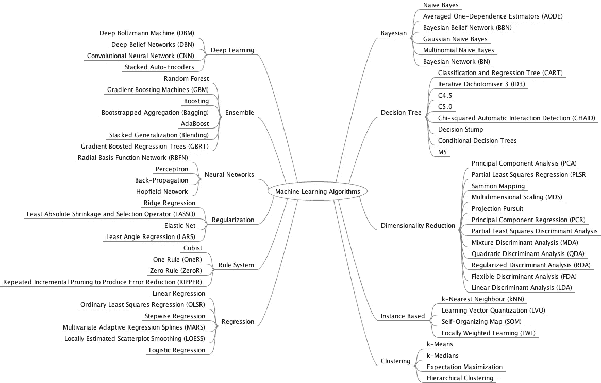
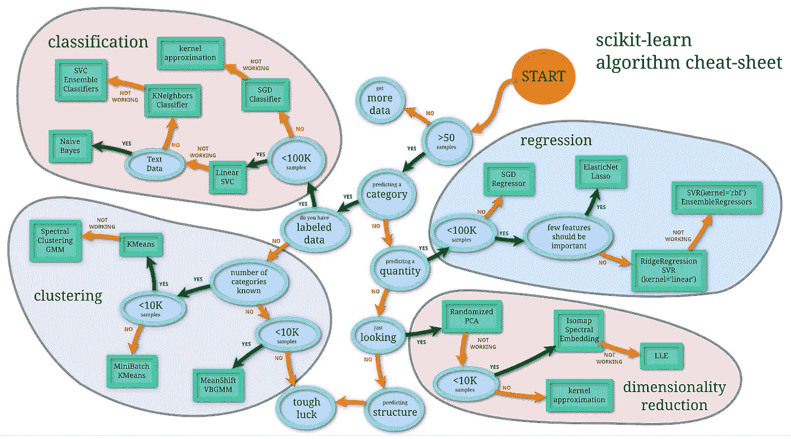
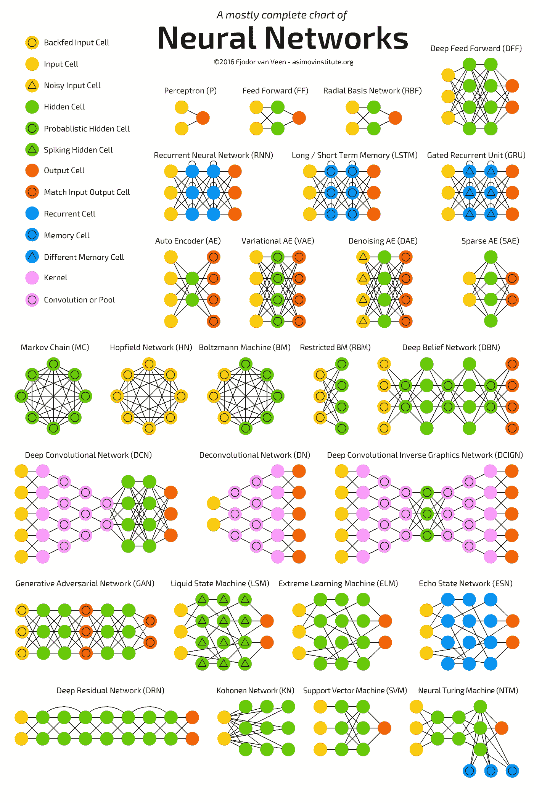

# 用哪个机器学习模型？

> 原文：<https://towardsdatascience.com/which-machine-learning-model-to-use-db5fdf37f3dd?source=collection_archive---------4----------------------->

## 陈述你的问题，并跟随这篇文章来知道使用哪个模型。

image by [stevepb](https://pixabay.com/users/stevepb-282134)

—如果你不知道什么是 ML 型号，看看这篇[文章](/introduction-to-machine-learning-top-down-approach-8f40d3afa6d7)。

summary of ML models, [Source](http://machinelearningmastery.com/a-tour-of-machine-learning-algorithms/)

T 参加机器学习课程和阅读相关文章并不一定会告诉你使用哪种机器学习模型。它们只是给你一个关于这些模型如何工作的直觉，这可能会让你为选择适合你的问题的模型而烦恼。

在我开始 ML 之旅的时候，为了解决一个问题，我会尝试许多 ML 模型，并使用最有效的模型，我现在仍然这样做，但我遵循一些最佳实践——关于如何选择机器学习模型——这些最佳实践是我从经验、直觉和同事那里学到的，这些最佳实践使事情变得更容易，以下是我收集的。

我会根据你的问题性质告诉你用哪种机器学习模型，我会试着解释一些概念。

[Pexels](http://pexels.com)

# 分类

首先，如果你有一个分类问题“预测给定输入的类别”。

请记住您要将输入分类到多少个类，因为有些分类器不支持多类预测，它们只支持 2 类预测。

## -缓慢但准确

*   [非线性 SVM](https://en.wikipedia.org/wiki/Support-vector_machine) 查看分类部分末尾的**注释**了解更多关于 SVM 使用的信息。
*   [随机森林](https://en.wikipedia.org/wiki/Random_forest)
*   [神经网络](https://en.wikipedia.org/wiki/Artificial_neural_network)(需要大量数据点)
*   [梯度增强树](https://en.wikipedia.org/wiki/Gradient_boosting)(类似于随机森林，但更容易过度拟合)

## -快

*   可讲解的模型: [**决策树**](https://en.wikipedia.org/wiki/Decision_tree) *和* [**逻辑回归**](https://en.wikipedia.org/wiki/Logistic_regression)
*   不可解释模型: [**线性 SVM**](https://en.wikipedia.org/wiki/Support-vector_machine) *和* [**朴素贝叶斯**](https://en.wikipedia.org/wiki/Naive_Bayes_classifier)

## 注:SVM 内核使用(摘自吴伟雄的课程)

*   当特征数量大于观察数量时，使用线性核。
*   当观测值的数量大于要素的数量时，使用高斯核。
*   如果观测值的数量大于 50k，那么在使用高斯核时，速度可能是一个问题；因此，人们可能想使用线性核。

# 回归

如果你有一个回归问题，“这是预测一个连续的值，就像预测房子的价格，给定房子的特征，如大小，房间数量等”。

## -准确但缓慢

*   [随机森林](https://en.wikipedia.org/wiki/Random_forest)
*   [神经网络](https://en.wikipedia.org/wiki/Artificial_neural_network)(需要大量数据点)
*   [渐变提升树](https://en.wikipedia.org/wiki/Gradient_boosting)(类似随机森林，但更容易过度拟合)

## -快

*   [决策树](https://en.wikipedia.org/wiki/Decision_tree)
*   [线性回归](https://en.wikipedia.org/wiki/Linear_regression)

# 使聚集

如果你有一个聚类问题“根据特征将数据分成 k 组，使得同一组中的对象具有某种程度的相似性”。

[**层次聚类**](https://en.wikipedia.org/wiki/Hierarchical_clustering) (也称为**层次聚类分析**或 **HCA** )是一种聚类分析方法，旨在构建聚类的层次结构。分层聚类的策略通常分为两种类型:

*   **凝聚**:这是一种“自下而上”的方法:每个观察从它自己的集群开始，随着一个集群在层次结构中向上移动，集群对被合并。
*   **分裂**:这是一种“自上而下”的方法:所有的观察从一个集群开始，随着层级的下移，分裂被递归地执行。

**非层次聚类:**

*   [DBSCAN](https://en.wikipedia.org/wiki/DBSCAN) (不需要指定 k 的值，它是集群的数量)
*   [k-means](https://en.wikipedia.org/wiki/K-means_clustering)
*   [高斯混合模型](https://en.wikipedia.org/wiki/Mixture_model#Gaussian_mixture_model)

如果你正在聚类一个**分类数据**使用

*   [k 模式](https://amva4newphysics.wordpress.com/2016/10/26/into-the-world-of-clustering-algorithms-k-means-k-modes-and-k-prototypes/)

# 降维

使用 [**主成分分析**](https://en.wikipedia.org/wiki/Principal_component_analysis)

**PCA** 可以被认为是将一个 *n* 维椭球体拟合到数据上，其中椭球体的每个轴代表一个主分量。如果椭球的某个轴很小，则沿该轴的方差也很小，并且通过从数据集的表示中省略该轴及其相应的主分量，我们仅损失了相应少量的信息。

如果你想做 [**主题建模**](https://en.wikipedia.org/wiki/Topic_model) (下面解释)你用**奇异值分解** ( **SVD** ) 或者**潜在狄利克雷分析** ( **LDA** )，概率主题建模用 **LDA** 。

*   **主题建模**是一种统计模型，用于发现文档集合中出现的抽象“主题”。主题建模是一种常用的文本挖掘工具，用于发现文本中隐藏的语义结构。

我希望现在事情对你来说更容易了，我会用我从你的反馈和实验中得到的信息来更新这篇文章。

我将留给你这两个精彩的总结。

[source](http://peekaboo-vision.blogspot.de/2013/01/machine-learning-cheat-sheet-for-scikit.html)

[Source](http://www.asimovinstitute.org/neural-network-zoo/)