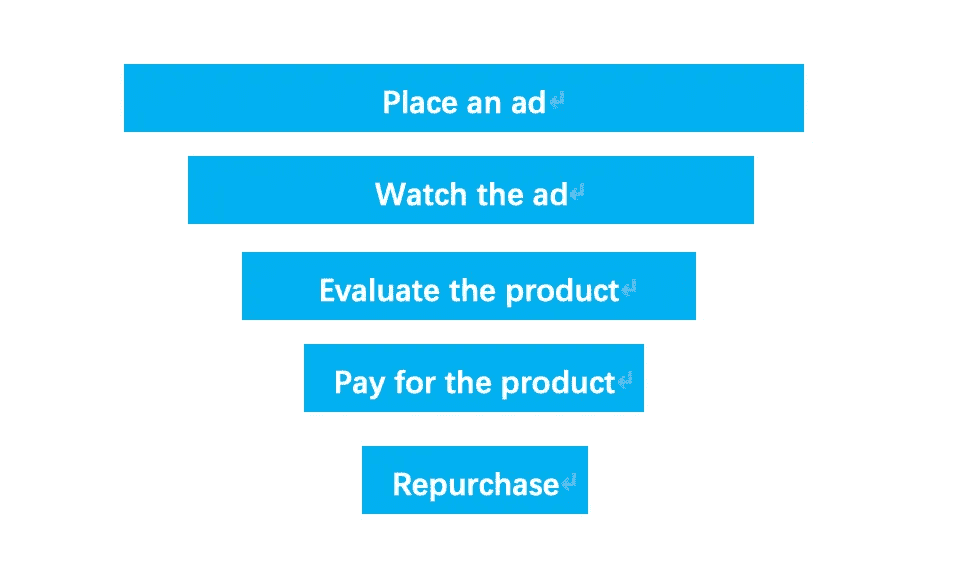
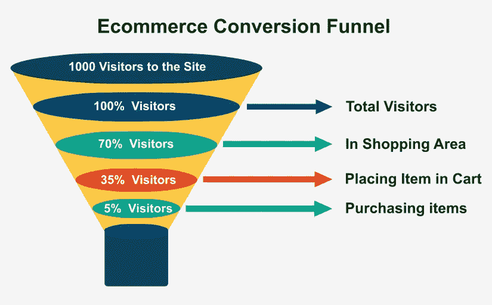
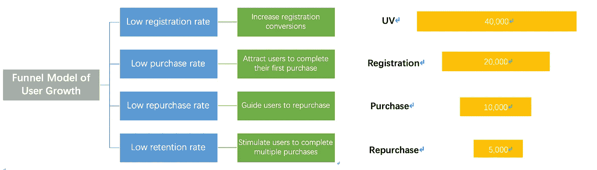
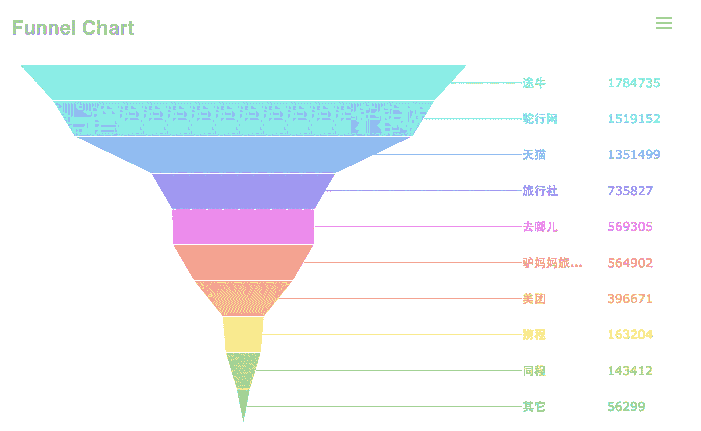
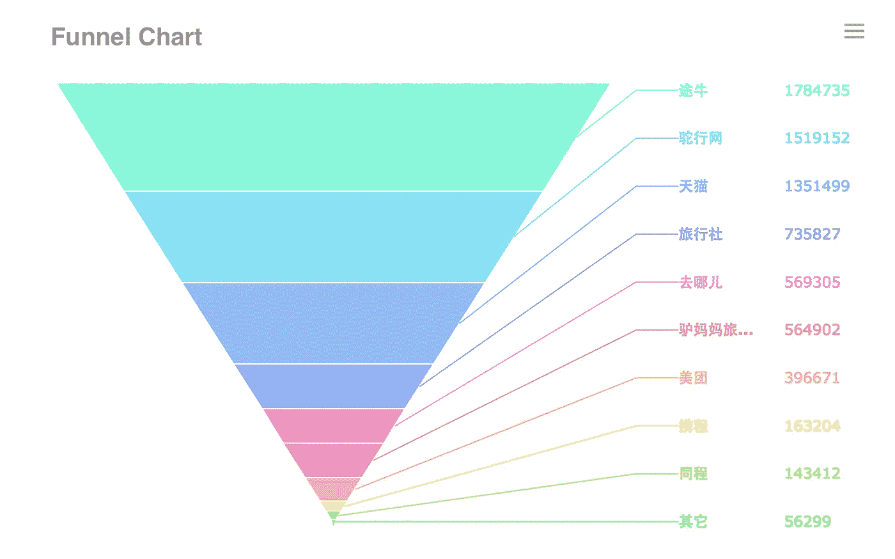
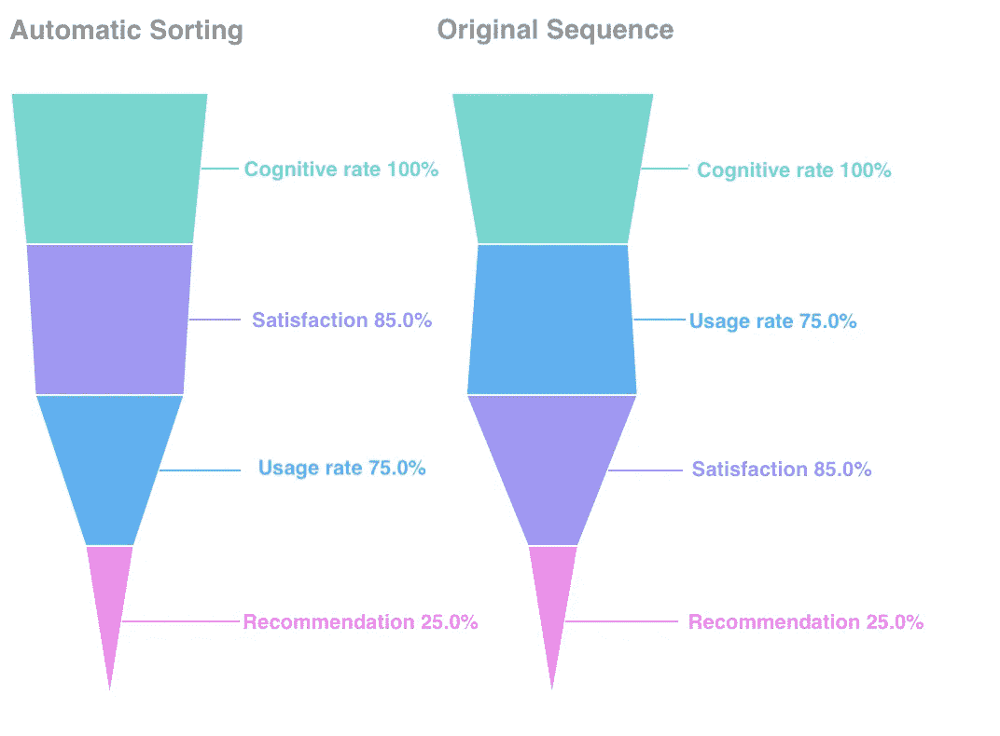
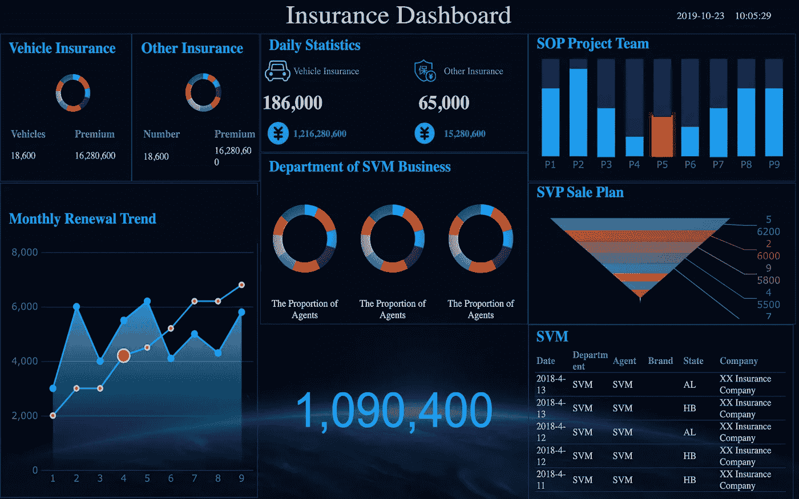
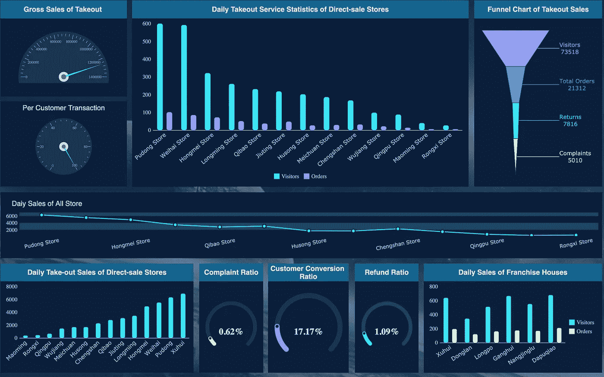

# 数据分析中哪种建模工具最赚钱？

> 原文：<https://towardsdatascience.com/which-modeling-tool-is-the-most-profitable-in-data-analysis-abcb29062f34?source=collection_archive---------20----------------------->

很多时候我们发现自己的业务数据看似不错，但最终的转化量却很低，这说明业务转化率是有问题的。在[数据分析](http://www.finereport.com/en/data-analysis/6-key-skills-that-data-analysts-need-to-master.html?utm_source=medium&utm_medium=media&utm_campaign=blog&utm_term=Which%20Modeling%20Tool%20Is%20the%20Most%20Profitable%20in%20Data%20Analysis%3F)中，有一个至关重要的建模工具可以很好的解决这个问题。它是漏斗分析模型。你可能已经从我的上一篇文章 [*数据分析中的五大思维方法*](/top-5-data-analysis-methods-you-need-to-know-e83f95cae355) *s* 中知道了这一点。今天我就来详细介绍一下这个漏斗模型。

# 1.什么是漏斗分析？

漏斗分析模型，简单来说就是营销产品的一个过程。而我们需要观察这个过程中每一步的转化和损失。

关于实际应用场景中的漏斗模型，人们期望的不外乎两点:

*   **大量转换**
*   **最终转化率高**

对于这两个目标，可行的措施是:

*   **增加初始流量**
*   **提高每个关键点的保留率**

# 2.漏斗分析的关键是什么？

一般来说，漏斗分析是有顺序的，这种顺序体现在关键节点的路径上。在有序的漏斗中，路径越来越窄。换句话说，每一步留下的数据量不能大于前一步留下的数据量。如果不满足这个条件，说明关键路径的流程顺序可能有问题，我们应该调整路径顺序。

# 3.如何进行漏斗分析

## 3.1 目标

和任何数据分析一样，漏斗分析的第一步也是设定目标，即了解自己到底想做什么，想得到什么结果。例如，在商业营销活动的漏斗模型中，目标是实现业务和盈利。并且为此目的确定以下五个步骤。

*   **第一步**:投放广告。提高用户对品牌的认知度。
*   **第二步**:看广告。增加用户对产品的兴趣。
*   第三步:评估产品。用户将根据他们对品牌的认知和对产品的兴趣来决定是否购买。
*   **第四步**:为产品付款。用户将在评估后购买他们感兴趣的产品，并达成交易。
*   **第五步**:重复购买。一些用户会继续购买。他们也可能向亲戚朋友推荐该产品。

## 3.2 变量

变量是能够影响漏斗分析结果的因素。它们分为自变量、因变量和中介变量。

在组织行为学中，因变量是要测量的行为反应，自变量是影响因变量的变量。

在上面的模型中，因变量是广告观看率、产品支付率、再购买率等。以及广告渠道(如电视、报纸、杂志、地铁、网站等。)，观看广告的用户的年龄，用户的位置，他们的爱好和他们的经济条件是影响因变量的自变量。

[**中介变量**](https://www.statisticssolutions.com/mediator-variable/) 因变量和自变量中引起中介。它们减少了自变量对因变量的影响。中介变量的存在使得自变量和因变量之间的关系更加复杂。

中介变量是我们需要干预的变量。我们要无限解构它来影响自变量。

From [Neil Patel](https://neilpatel.com/blog/how-marketing-funnels-work/)

在上面的传统漏斗模型中，假设我们的品牌是高端奢侈品，我们需要分析独立变量，如广告渠道、用户年龄和广告服务区域。我们最终发现我们的广告区域太广，成本太高。

然后我们盯着广告区。我们看到偏远地区的广告比例比较高。这个时候，我们发现问题了吗？我们可以缩小广告投放区域。在大城市重点做广告会不会更好？

理想的情况是，我们可以一步步解构问题，找到唯一的变量。然后我们就能准确定位问题并解决，这就带来了用户的增长。

## 3.3 关系

一旦我们确定了目标和影响我们目标的各种变量，我们需要研究变量之间的关系。

在确定变量之间的关系时，要谨慎判断哪个是原因，哪个是结果。不能因为两个变量之间的统计关系，就说两个变量之间有因果关系。

比如我们说用户增长，更多说的是获取客户。我们并没有考虑如何提高现有用户的转化率和激活率。我们真的需要思考如何让用户成为忠实用户。只有忠实的用户才不会流失，带来更多的收益。

通过漏斗分析，可以还原用户转化的路径，分析每个转化节点的效率。

*   从头到尾的整体转化率是多少？
*   每一步的转化率是多少？
*   哪一步我们失去的客户最多？为什么？那些客户符合什么特征？

# 4.谈到大数据，您使用什么工具进行漏斗分析？

说到大数据，用 Excel 等工具很难做到高效的漏斗分析。一般的做法是使用类似 [FineReport](http://www.finereport.com/en/?utm_source=medium&utm_medium=media&utm_campaign=blog&utm_term=Which%20Modeling%20Tool%20Is%20the%20Most%20Profitable%20in%20Data%20Analysis%3F) 这样的专业数据分析工具搭建一个 [**仪表盘**](http://www.finereport.com/en/data-visualization/a-beginners-guide-to-business-dashboards.html?utm_source=medium&utm_medium=media&utm_campaign=blog&utm_term=Which%20Modeling%20Tool%20Is%20the%20Most%20Profitable%20in%20Data%20Analysis%3F) ，在这里我们可以很方便的进行漏斗分析。下图是 FineReport 漏斗模型的两种形式。(这个工具的个人版完全**免费**。)

[**FineReport**](http://www.finereport.com/en/?utm_source=medium&utm_medium=media&utm_campaign=blog&utm_term=Which%20Modeling%20Tool%20Is%20the%20Most%20Profitable%20in%20Data%20Analysis%3F) 的漏斗图也有自动排序功能。

当我们进行业务分析时，也有很多使用漏斗分析的场景。

**保险仪表板**

From FineReport

**旅游仪表盘**

From FineReport

**投资仪表板**

From FineReport

**外卖销售仪表盘**

From FineReport

专业数据分析工具的优点是方便。工具本身有各种漏斗模型。你只需要拖拽就可以完成漏斗分析，这是用 Excel 很难实现的。所以建议使用专业软件。如果你有兴趣，可以阅读这篇文章[*2019 年 6 大数据分析工具*](/top-6-data-analytics-tools-in-2019-4df815ebf82c) 。

# 您可能也会对…感兴趣

[*数据分析师需要掌握的 6 项关键技能*](/6-key-skills-that-data-analysts-need-to-master-df1d82257b9)

[*2019 年你不能错过的 9 款数据可视化工具*](/9-data-visualization-tools-that-you-cannot-miss-in-2019-3ff23222a927)

*[*制作销售仪表盘的分步指南*](/a-step-by-step-guide-to-making-sales-dashboards-34c999cfc28b)*

*[*新手如何设计酷炫的数据可视化？*](/how-can-beginners-design-cool-data-visualizations-d413ee288671)*

*[*4 个参数查询功能让您的数据可视化互动*](/4-parameter-query-functions-to-make-your-data-visualization-interactive-bbd84dd6bafb)*

**原载于 2019 年 4 月 30 日*[*http://www.finereport.com*](http://www.finereport.com/en/data-analysis/which-modeling-tool-is-the-most-profitable-in-data-analysis.html)*。**