# 超越演讲时间:民主党总统辩论分析

> 原文：<https://towardsdatascience.com/which-presidential-candidate-talks-like-that-b2b16060ff8b?source=collection_archive---------18----------------------->

## 使用真实世界数据进行预测建模的数据准备和特征工程

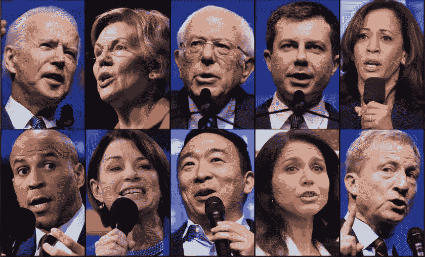

Source: This LA Times [article](https://www.latimes.com/politics/story/2019-11-19/what-time-is-the-democratic-debate-in-atlanta)

随着我们在严重的政治两极分化的气氛中步入新的一年，我意识到我从来没有像过去一年这样关注这个国家的政治——这意味着我现在每天早上都听每日播客，甚至完整地观看了两三场直播的民主党初选辩论。

每次辩论后的第二天，我的新闻订阅源就会被评论、镜头和对候选人谈论的**以及他们谈论了多少*的分析所淹没。但是我注意到缺少关于**他们在辩论台上如何谈论的信息。*****

***当我们举杯庆祝 2010 年代的最后一年，以及定于 12 月 19 日举行的第八次也是最后一次民主党总统候选人辩论时，我认为通过一点探索和数据分析来弥合这一差距是不错的。***

***在这篇文章中，我将:***

*   ***简单概述一下我是如何预处理从互联网上搜集的原始文本的。***
*   ***用熊猫对候选人的话语进行比较分析，看看谁最以自我为中心，谁最面向未来，谁说话最华丽。***

***12 月 12 日之后(这是候选人必须满足所有捐助者和投票要求的最后日期，以便有资格参加下一场辩论)，我将获得我需要的所有信息:***

*   ***使用 scikit-learn 建立一个分类模型，仅使用本文中确定的语音特征来预测谁将有资格参加 12 月 19 日的辩论。敬请关注！(而且现在是[这里](/the-triune-pipeline-for-three-major-transformers-in-nlp-18c14e20530?source=friends_link&sk=1071a220c98e9585b4128c177a19a356)。)***

# ***快速浏览原始文本***

***截至今天(2019 年 12 月 7 日)，我们已经为 2020 年大选完成了总共八场民主党初选辩论:***

***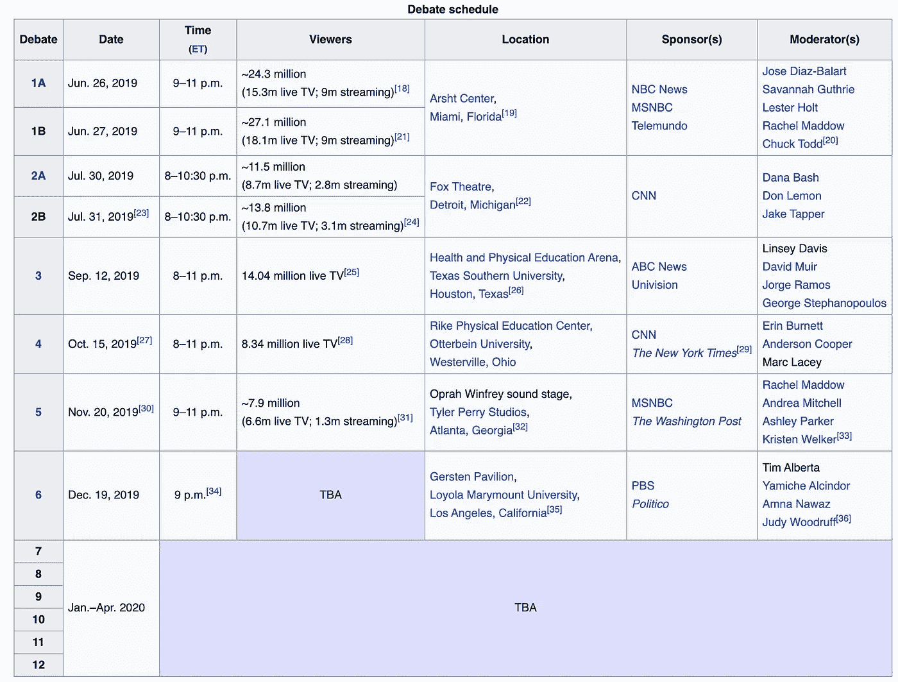***

***Source: [https://en.wikipedia.org/wiki/2020_Democratic_Party_presidential_debates_and_forums](https://en.wikipedia.org/wiki/2020_Democratic_Party_presidential_debates_and_forums)***

***我从一个来源收集了辩论记录，*《华盛顿邮报》*(从 2019 年 6 月到 2019 年 11 月)。这里有一个[的例子](https://www.washingtonpost.com/politics/2019/06/27/transcript-night-one-first-democratic-debate-annotated/)，里面看起来是这样的:***

**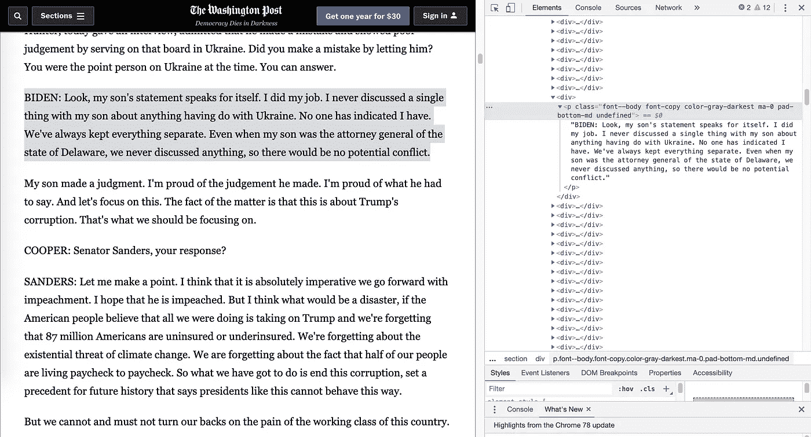**

**文本的每个 ***块*** (例如，上面用灰色突出显示的部分)对应于 HTML 源代码中的一个`<p>`标记，您可以通过突出显示文本的一部分并右键单击“Inspect”来找到它。注意，每个说话人的边界都由一个 ***说话人标签*** 表示，这是说话人的姓，全部大写(“BIDEN”、“COOPER”等)。).我将每个块中扬声器标签后面的部分称为 ***段*** 。由于只有第一个连续的相同说话者块包含一个说话者标记，因此有必要将原始文本的每个块重新整形为一个标记段对，如下所示:**

```
**# block 1
**Speaker tag**: BIDEN
**Segment**: Look, my son's statement ... no potential conflict,# block 2
**Speaker tag**: BIDEN
**Segment**: My son made a judgment ... we should be focusing on.# block 3 **Speaker tag**: COOPER
**Segment**: Senator Sanders, your response?**
```

**到达那里可不是一件简单的事情。事实上，我认为我在这个早期预处理步骤上花的时间比这个项目的任何其他部分都多，但是花费必要的时间将您的数据转换成分析所需的精确格式，并建立一个简化的预处理管道以便在将来轻松接收和转换任何新数据总是值得的。以下是这一早期但重要的步骤的一些主要组成部分:**

## **1.提取`<p>`块**

## **2.将原始文本转换为说话者片段元组**

## **3.把所有东西放进一个数据框架**

**输出:**

**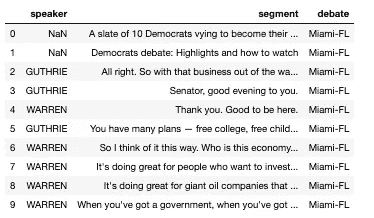**

**Transcript text in a dataframe**

**我们现在准备好了一些严肃的乐趣——提取特征来用数字表示候选人的演讲。在下面的分析中，我删除了所有包含版主(如 Cooper)发言片段的行。我没有排除像`(APPLAUSE)`和`(CROSSTALK)`这样的转录，如果它们与候选之一相关，以防它们在以后成为重要的特征。在这之后，我有了 4069 行。**

```
**# subset the dataframe based on speaker info  
df = original_df[original_df['speaker'].isin(CANDIDATE_NAMES)].reset_index(drop=True)df['speaker'].value_counts().sum()  #4069** 
```

# **候选人语音比较**

**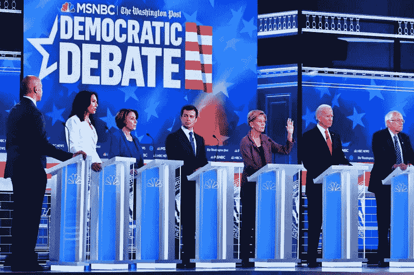**

**为了比较候选人的话语，有必要将这些片段转换成数字表示。我用[空间](https://spacy.io/)到[写规则](/linguistic-rule-writing-for-nlp-ml-64d9af824ee8?source=friends_link&sk=3a063a20b2f3a14ca253ebc33c0ed2f4)来提取下面的大部分特征。我将在下面的代码块中强调其中的几个，但是你可以在这里查看完整的脚本。**

# **⏳谁说得最多？**

**拜登和沃伦在`segment length`(所有辩论的总票数)和`number of sentences`两个方面发言最多。值得注意的是，在我们的顶级竞争者中，**桑德斯**发言最少，略微落后于**哈里斯**、**布克**、 **Buttigieg** 和**克洛布查尔。**这些发现似乎与[候选人的发言时间](https://www.nytimes.com/interactive/2019/09/12/us/elections/debate-speaking-time.html) *相关。***

**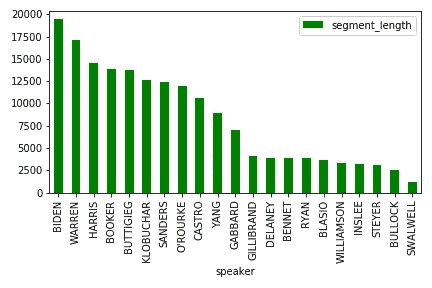****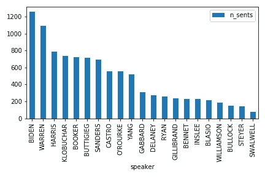**

**顺便说一句，这篇文章中的大部分条形图都可以用类似这样的图形来表示:**

```
**import matplotlib.pyplot as pltmean_df = original_df.groupby('speaker').agg('mean')
mean_df[['segment_length']].sort_values('segment_length', ascending=False).plot(kind='bar')**
```

**另一个要考虑的长度特性是`mean sentence length`，它是通过将标记(单词)的总数除以每个片段的句子数并在所有片段中取平均值来计算的。该图显示了 **Gabbard、O'Rourke、**和 **Steyer** 设法使符合其句子中的最大字数:**

**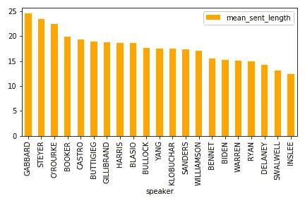**

**同样的三个候选人在句子长度上也表现出最大的差异，这是由`standard deviation of sentence length`(在标记中)确定的。换句话说，他们很好地混合了长句和短句(这可能是你的高中英语老师希望你在作文中出现的)。**

**图表右端的候选人，包括**斯威尔**和**德莱尼**，在他们的演讲中并没有改变太多的句子长度。事实上，结合上图，我们可以推断两个候选人*一致地*说出短句。**

**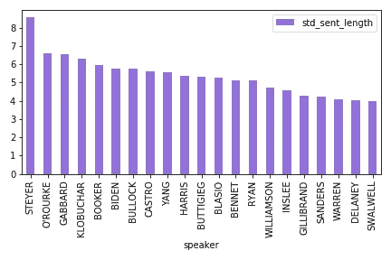**

**将文本转换为空间`Doc`提供了一种简单的方法来提取这些长度特征:**

# **🤹‍谁说得最详细？️**

**也就是说，谁的演讲表现出最大程度的句法复杂性？我用了两个特征来衡量这个:`number of complex clauses` 和`number of words before the main verb`。**

**我将复句定义为在论元结构(“主语”、“宾语”等)方面比简单的及物或不及物句子更复杂的任何句子级结构。)，包含状语从句修饰，和/或包含嵌入从句。例如:**

1.  **与格结构包含两个内部论元，一个直接宾语和一个间接宾语:“我把钱给他了。”**
2.  **从句:“*如果你想改变世界*，你必须每天早上整理床铺。”**
3.  **从句补充道:“我从未想过她会这么早退出竞选。))**

**在一个句子中有一个或多个这样的属性会增加它的整体句法复杂性。**

**`Number of words before the main verb` 专门衡量动词前结构的复杂程度。主动词前的文本越长，越有可能包含从句修饰词(和/或主语修饰词)。这是对句法复杂性的一个非常粗略的度量，但是它很快给了我们一些有用的东西。**

**在下面的标准化图表中，我们看到 **Gabbard** 和 **Steyer** 的演讲在这两个方面都表现出最大程度的复杂性。在光谱的另一端， **Bennet** 和 **Inslee** 表现出最少的句法复杂性，这可能表明他们坚持使用非常简单的句子形式(即主语-动词-(宾语))，并且缺少条件“if”语句或并列短语等从句修饰语。**

**Swalwell 表现出了一种有点反常的模式:他在 T1 上得分最低，T1 衡量了说话前和说话后的复杂性(但主要是后者)，但他在另一项衡量指标 T2 上仅略高于中间水平。这种复杂性轨迹的不对称性表明，虽然他的主要动词后面的部分往往简单而简短，但他在如何打开句子方面却相当一般(即，在主要动词之前)。**

**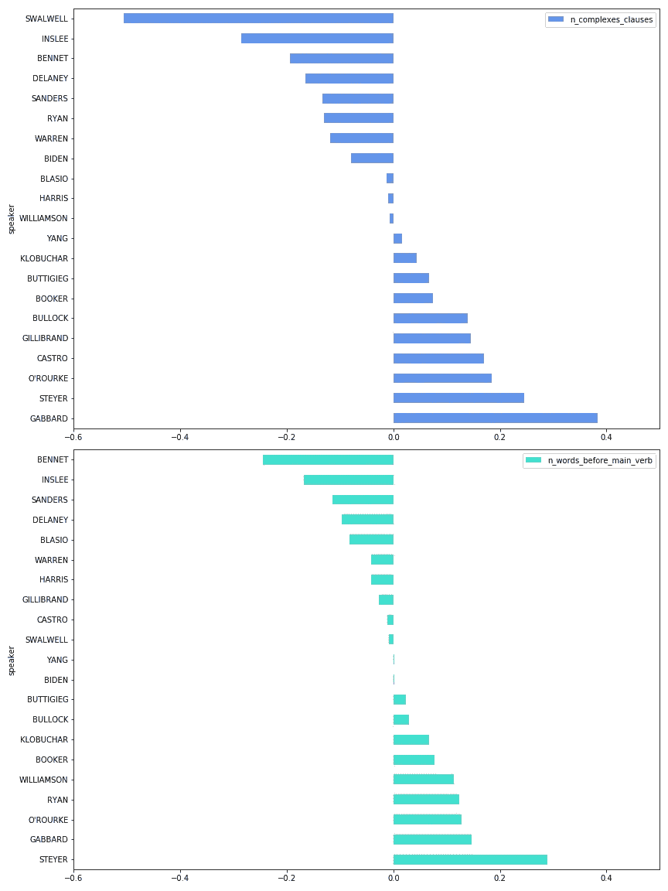**

**值得注意的是，已经有资格参加 12 月 19 日辩论的六名候选人中的四名——**桑德斯**、**沃伦**、**拜登**和**哈里斯**——表现出相对较低的句法复杂度，这表明他们在辩论舞台上的发言相当简单。**

**以下是用于提取这两个句法特征的基于空间的函数:**

**Two functions used to extract syntactic features**

# **🧸，他的演讲对五年级学生来说是可以理解的？**

**与句法复杂性密切相关的一个范畴是可读性。我使用了 [**textstat**](https://pypi.org/project/textstat/) ，这是一个 Python 库，提供了多种统计数据来衡量一段文本的可读性。网站上描述了不同的衡量标准，但由于怀疑其中一些是相关的，我创建了一个快速关联矩阵，采用了这里的[实现](https://chrisalbon.com/machine_learning/feature_selection/drop_highly_correlated_features/):**

```
**import seaborn as snsREADABILITY_FEATURES = ['n_difficult_words',
 'automated_readability_index',
 'coleman_liau_index',
 'dale_chall_readability',
 'flesch_kincaid_grade',
 'flesch_reading_ease',
 'gunning_fog',
 'linsear_write_formula',
 'smog_index',
 'text_standard']corr_matrix = df[READABILITY_FEATURES].corr().abs()
fig, ax = plt.subplots(figsize=(9,5))
sns.heatmap(corr_matrix)**
```

**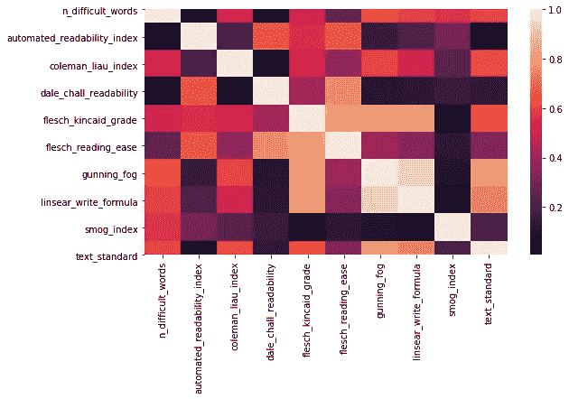**

**Correlation matrix of readability features**

**在浅色像元处相交的特征高度相关，例如`gunning_fog`和`linear_write_formula`，在较小程度上还有`flesh_flesch_kincaid_grade`和`flesh_reading_ease`，以及`text_standard`和`gunning_fog`。**

**根据 textstat 网站的描述，`text_standard`是一种综合衡量标准，它根据所有其他测试返回理解文本所需的估计分数水平，所以我选择在这里绘制这个图表:**

**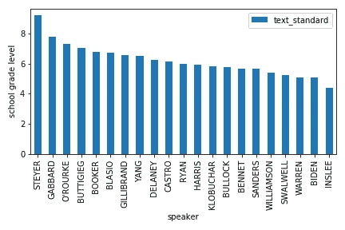**

```
**df.agg('mean')['text_standard']
6.077291717866798**
```

**平均来说，大多数演讲者的水平是六年级学生能够理解的。Steyer 和 **Gabbard** 说话的水平略高，八年级及以上的学生可以理解，这与他们表现出的最高水平的句法复杂性相吻合，如上所述。**

**这两个候选人在`number of difficult words`(每段)上得分最高，这是另一个可读性指标，它与其他任何指标都不相关。请注意，我们的领跑者之一沃伦在每段发言中使用的难词最少。(她也是`text_standard`上得分最低的人之一，如上图所示。)**

**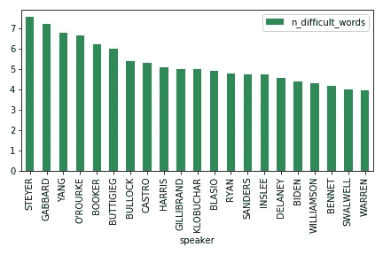**

**Mean number of difficult words per segment**

# **🦚:谁在演讲中最以自我为中心？**

**(*我用这个术语来描述一种言语行为模式，这种行为模式的特点是大量的口头指称自己。它不应该被解释为可能带有更负面含义的其他术语的同义词，如“自恋”或“自私”。)**

**在这个专题中，我探索了代词的使用，以此来衡量候选人在与他人和美国公众交谈时，将自己视为个人还是群体的一部分。特别是，我认为:**

1.  **第一人称单数代词“我”、“我的”、“我的”、“我的”、“我自己”的数量**
2.  **第一人称复数(1pl)代词的数量:“我们”、“我们的”、“我们的”、“我们的”、“我们自己”**
3.  **两个数字之间的差异**

**所有的双栏会显得有点拥挤，所以我将视觉效果分成两个图表:一个是符合 12/19 辩论资格的候选人群集，另一个是不符合资格的候选人群集(或在 12/7 时处于风口浪尖):**

**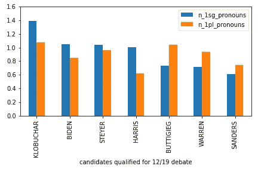****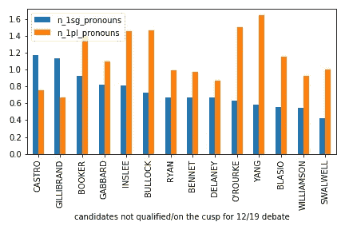

Pronoun use by candidate group (qualified vs. not qualified/on the cusp)** 

**快速浏览这些图表可以发现，从绝对意义上来说，**克洛布查尔**在她的演讲中是最以自我为中心的，每段使用的“我”代词比任何其他候选人都多。在那些没有资格参加 12 月辩论的候选人中，**卡斯特罗**是最自我的，紧随其后的是**吉利布兰德**。但是我们也看到 **Klobuchar** 比其他两个使用了更多的“我们”代词——这意味着，在*相对于*而言，卡斯特罗和吉利布兰德可能更以自我为中心，这取决于你如何看待它。**

**相比之下，**杨**无论从绝对角度还是相对角度来看都是最不自我的，平均每段使用 1.64 个“我们”代词，而“我”代词只有区区 0.58 个。对杨来说，这两组第一人称代词的区别比其他任何候选人都要明显得多。这可以通过下图更容易地可视化，该图显示了“我”代词和“我们”代词之间的*差异*(“我”代词减去“我们”代词)。**

**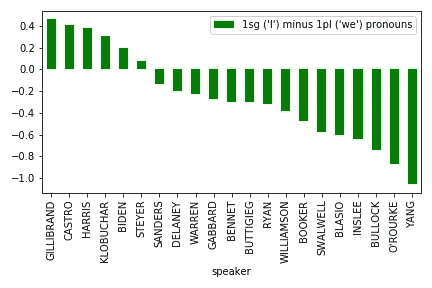**

**Difference between number of 1sg and 1pl pronouns per segment**

**这种差异越积极，候选人使用的“我”代词就越多。回到之前的观点，我们从这张图表中确认，尽管 **Klobuchar** 在每个片段中使用了最多的“我”代词，但与**吉利布兰德**和**卡斯特罗**相比，她在“我们”代词中使用的比例更适中，他们在两组代词中表现出最大的*差异*。**

**特征提取器:**

# **🔮谁的演讲最有未来感？**

**从某种程度上来说，一个候选人表达其未来计划和战略的能力可以被视为对其“面向未来”的一种衡量，我认为语言可以提供一种有趣的方式来发现一个候选人是否具有一个有远见、前瞻性的领导人的品质——这是选民可能希望他们未来的总统具有的品质。**

**使用 spaCy 标签，我对片段中的以下单词/短语进行了计数，作为对未来导向性的粗略衡量:**

*   **未来情态助动词(“将”、“将”)**
*   **`Going + to + non-finite clause`建筑**
*   **像“明天”和“未来”这样的词**

**以下是每位候选人使用的面向未来的表达总数:**

**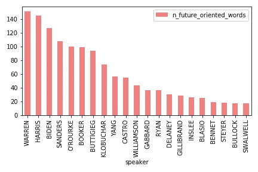**

**Total number of future-oriented expressions across all debates**

**沃伦和哈里斯在他们的演讲中使用了最多的面向未来的词汇。这很有趣，但我们必须记住，他们也是总体上发言最多的候选人之一。因此，为了控制这一点，我对所有部分中面向未来的表达式的比例(%)求和。**

```
**proportion_future_oriented = (df4['n_future_oriented_words'] / df['segment_length']) # segment_length == number of tokens per segmentdf['proportion_future_oriented'] = proportion_future_orienteddf[['speaker', 'proportion_future_oriented']].groupby('speaker').agg('sum').sort_values('proportion_future_oriented', ascending=False).plot(kind='bar', color='navy')**
```

**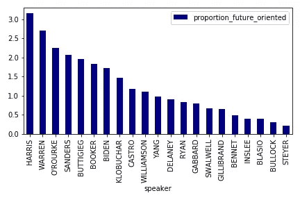**

**即使做了这样的调整，我们仍然看到**哈里斯**和**沃伦**在他们的演讲中仍然大量使用面向未来的表达。**

# **⚔ ️Who 提到川普最多？**

****哈里斯**在所有八场辩论中提到川普最多，其次是**杨**和**布克**:**

**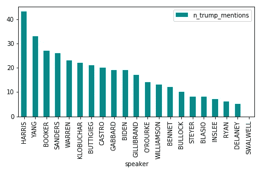**

**Total number of Trump mentions by candidate**

**但是，我们必须再次记住，哈里斯是总体上发言最多的人之一，因此，我再次将特朗普提及的比例总和(%)用于所有片段的片段长度。**

```
**proportion_trump_mentions = (df4['n_trump_mentions'] / df4['segment_length'])df5['proportion_trump_mentions'] = proportion_future_orienteddf5[['speaker', 'proportion_trump_mentions']].groupby('speaker').agg('sum').sort_values('proportion_trump_mentions', ascending=False).plot(kind='bar', color='orange')**
```

**调整后，我们看到**哈里斯**仍然是提及特朗普最多的人(即，即使是相对而言)。然而，对于杨来说，尽管在这些辩论中提到特朗普超过 30 次，但他的特朗普在演讲中的比例相对较低，与所有其他候选人相比，不超过平均水平。**

**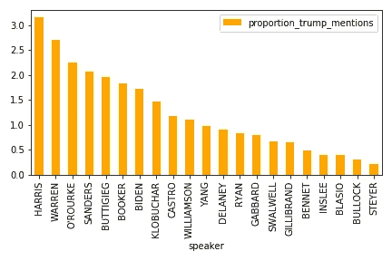**

**Sum of proportions of Trump mentions by candidate**

**在这一点上，我急切地想知道是否有一条清晰的分界线，区分那些进入下一场辩论的候选人和那些没有进入辩论的候选人。我们可能已经在这篇文章中看到了一些迹象，但是一旦我们有了所有的信息，我可能需要更彻底地核实一下。**

**到目前为止，拜登、Buttigieg、Klobuchar、沃伦、桑德斯、施泰尔和哈里斯都符合条件(尽管最后一位已经退出)。杨和加巴德还没有达到所有的要求，但我们将在 12 月 12 日或之前查明他们是否达到了要求。**

**请继续关注后续的[帖子](/the-triune-pipeline-for-three-major-transformers-in-nlp-18c14e20530?source=friends_link&sk=1071a220c98e9585b4128c177a19a356)，我将使用这篇帖子中描述的功能来建立一个机器学习模型，以回答最终的问题:演讲特征(单独)能否预测候选人有资格参加下一场辩论的可能性——因此，很有可能，他们当选总统的可能性？**