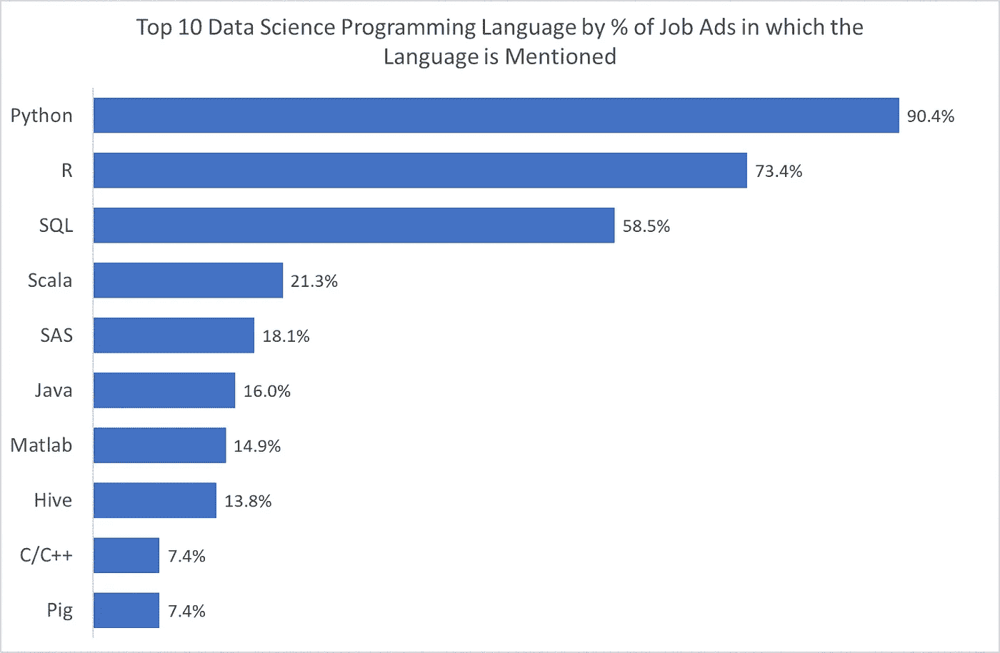
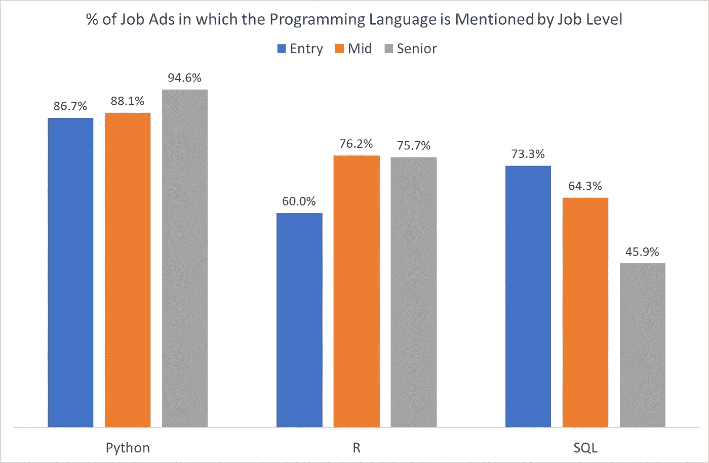

# 数据科学家应该先学习哪种编程语言？

> 原文：<https://towardsdatascience.com/which-programming-language-should-data-scientists-learn-first-aac4d3fd3038?source=collection_archive---------3----------------------->

## r，Python，SQL 还是别的？

当我开始我的第一份真正的工作时，在 21 世纪初，我是一名毕业的精算分析师，我的老板做的第一件事是递给我一本关于 SAS 的小册子，并告诉我自学 SAS。

在我的工作中，我需要能够争论数据并使统计模型适应数据，如果我不会编程，我就不会走得很远。

当谈到数据科学时，几乎是一样的，但有一个小而重要的区别。在数据科学领域，没有人*会走到你的办公桌前，递给你一本关于如何编程的书。*

即使是入门级，数据科学家也应该能够从第一天开始编程。

但是并不是所有的编程语言都是平等的，有些语言比其他语言更受雇主的重视。此外，就像口语一样，真正学习一门编程语言需要时间，大多数人在刚开始时没有时间学习一门以上的编程语言。

因此，如果您正试图在数据科学领域获得突破，并且没有多余的时间，那么为了最大化您的就业机会，您应该首先学习哪种语言呢？

# 数据科学的三大编程语言

我最近检查了 2019 年 4 月 22 日至 2019 年 5 月 5 日期间在 [LinkedIn](https://www.linkedin.com/jobs/) 上发现的 100 份数据科学招聘广告，这些广告来自四个英语国家(澳大利亚、加拿大、英国和美国)。这些招聘广告被选择来代表雇主类型、规模、行业和工作级别的广泛代表性，而纯粹的管理角色没有被考虑。

之前，我使用这一分析来确定数据科学雇主寻求的顶级技能，不包括编程语言和技术(你可以在我的博客文章中读到这一点:[如何成为数据科学三重威胁](/how-to-become-a-data-science-triple-threat-bb41e0664ca5))。

这一次，我采取了相反的方法，根据数据科学招聘广告中提到它们的比例，确定了数据科学的 10 大编程语言。这些显示在下表中:

由此可以看出，Python、R 和 SQL 是目前为止数据科学中需求最大的三种语言。没有真正的惊喜。

然而，有趣的是，如果我们进一步分析，并考虑工作级别对每种语言的需求。

在我提取的 100 个数据科学招聘广告中，有 15 个是入门级角色(定义为标题中带有“初级”、“研究生”、“实习生”或类似名称的角色)；44 人担任中级职务；41 个是高级职位(定义为头衔中有“高级”、“主要”、“领导”或类似的职位)。

下面的图表显示，随着工作资历的增加，能够用 Python 或 R 编程变得更加重要。然而，能够用 SQL 编程变得不那么重要了。

这表明，从长远来看，学习 R 或 Python 比学习 SQL 要好得多。

但是为什么会这样呢？为什么*高级数据科学家能够用 SQL 编程*不重要？

# SQL、R 和 Python 之间的主要区别

r 和 Python 都是通用编程语言，带有附加包，允许用户执行数据科学的大多数技术要求，包括统计分析和机器学习。

随着工作级别的提高，能够执行机器学习和统计分析变得越来越重要，因此有理由认为，了解执行这些任务所需的语言也变得更加重要。

另一方面，SQL 是一种专门为在关系数据库中查询和操作数据而设计的数据库语言。

雇主通常要求 SQL 技能，因为他们将数据保存在关系数据库中，并希望他们的数据科学家能够访问这些数据。然而，一旦您访问了给定任务所需的数据，SQL 的作用也就差不多到此为止了。

尽管所有级别的数据科学家都应该能够提取和争论他们自己的数据，但随着工作资历的增加，这些技能变得(相对)不那么重要了。在一个足够大的组织中，一名高级数据科学家甚至可以让更多的初级数据科学家为他们提取和准备数据，这样他们就可以专注于他们有潜力增加最大价值的任务，如模型开发。

因此，R 和 Python 可以被视为数据科学的两种*真正的*语言，而 SQL 只是提供支持(顺便说一句，有多个为 Python 和 R 编写的包允许用户从这些语言中运行 SQL 查询)。

# R 队还是 Python 队？

如果你计划在数据科学领域建立职业生涯，那么理想情况下，你应该学习 Python、R 和 SQL 这三种语言。

学习这三种语言不仅可以最大化你的就业前景和与其他数据科学家互动的机会，还可以让你利用每种语言的不同优势，并始终选择最适合工作的语言。

然而，如果您正在寻求向数据科学转型，并希望尽快获得您的第一个数据科学职位，那么您最好掌握一种语言，并学习如何使用它来有效地执行广泛的任务，而不是学习如何使用多种语言执行较小的任务集(或相同的任务集，但不太好)。

此外，支撑大多数编程语言的原则(如函数、for 和 while 循环、if/else 语句和变量类型)或多或少都是通用的，所以一旦你掌握了一门语言，你会发现以后再回头学习第二门(或第三门)语言会容易得多。

根据前几节的讨论，如果你必须选择一种语言开始，那么雇主的需求建议你选择 Python。

然而，在为数据科学选择编程语言时，雇主的需求并不是唯一要考虑的事情。在做出最终决定之前，你应该问自己的其他问题包括:

*   其他人都在用什么编程语言？
*   你打算用这种语言做什么？
*   未来呢？
*   你最喜欢哪种编程语言？和
*   专有语言呢？

我在博文中详细讨论了这些问题:[团队 R 还是团队 Python？](/team-r-or-team-python-2f8cf04310e6)

# 结论

编程语言时好时坏，对于数据科学家来说，它们真的只是达到目的的一种手段。然而，你也可以对汽车说同样的话，就像大多数人没有汽车(或者至少没有优步)无法生活一样，除非你会编码，否则你不会在数据科学方面走得很远。

在本文中，我们将编程语言的选择范围缩小到 R 和 Python 中的一个，并列出了在两者之间进行选择时要考虑的一系列因素，但是到最后，如果您仍然不能做出决定，就选择一个(如果需要的话，抛硬币)并接受它。

因为归根结底，R 和 Python 都是数据科学的优秀语言*，而且我不认为它们中的任何一种会很快消失。*

**吉纳维芙·海斯博士是一名数据科学家、教育家、人工智能和分析专家，拥有* [*吉纳维芙·海斯咨询*](https://www.genevievehayes.com/) *。你可以在*[*LinkedIn*](https://www.linkedin.com/in/gkhayes/)*或者*[*Twitter*](https://twitter.com/genevievekhayes)*上关注她。她还是* [*价值驱动数据科学*](https://www.genevievehayes.com/episodes/) *的主持人，这是一个每月两次的播客，面向希望最大化其数据和数据团队价值的企业。**

**想要发掘企业数据的价值，但不知道从何入手？* [***下载免费的数据科学项目探索指南。***](https://www.genevievehayes.com/discovery-guide/)*