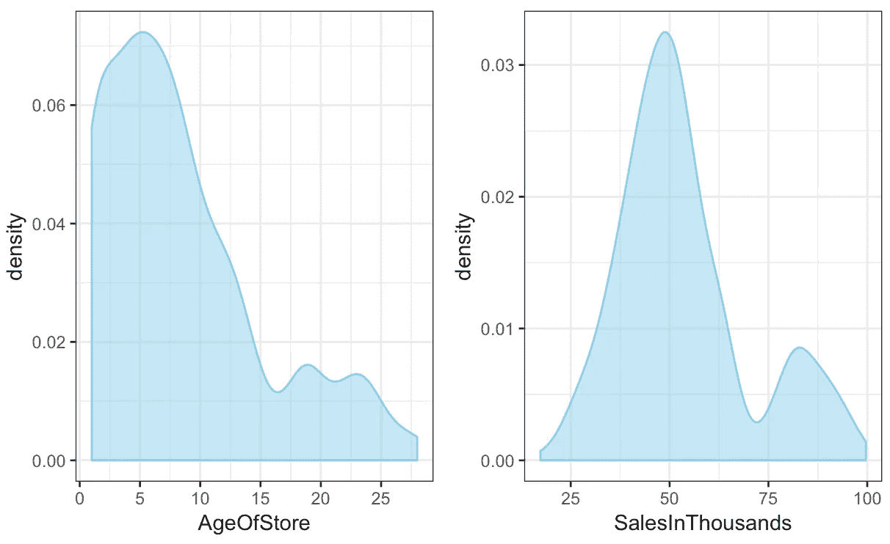
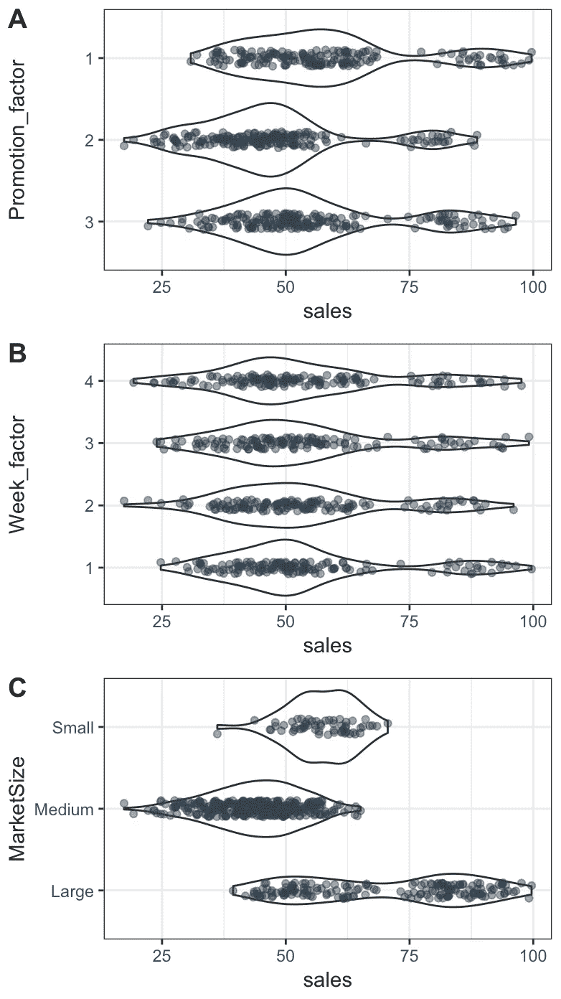
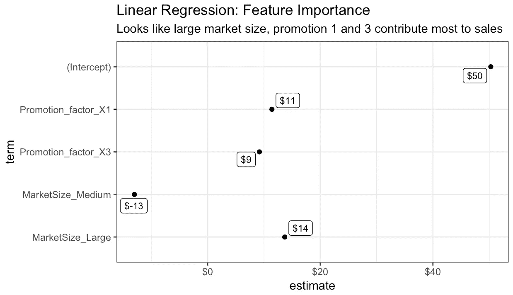

# 应该使用哪种促销来增加销售额？一家快餐连锁店的营销活动案例研究

> 原文：<https://towardsdatascience.com/which-promotion-should-be-used-to-increase-sales-c1c91b4ffb34?source=collection_archive---------6----------------------->

## 使用 Parsnip R 软件包的线性建模方法


Photo by [JJ Ying](https://unsplash.com/@jjying?utm_source=unsplash&utm_medium=referral&utm_content=creditCopyText) on [Unsplash](https://unsplash.com/s/photos/promotion?utm_source=unsplash&utm_medium=referral&utm_content=creditCopyText)

在向市场推出新产品时，一个常见的问题是什么样的促销对销售有最大的影响。一家快餐连锁店试图通过在几个随机选择的市场推出新产品来测试这一点。每个地点都采用不同的促销方式，并记录前四周的周销售额。

我通过这个[链接](https://www.ibm.com/communities/analytics/watson-analytics-blog/marketing-campaign-eff-usec_-fastf/)从 IBM Watson 网站收集数据。以下分析的关键问题是:**是什么推动了销量上千？**为了回答这个问题，我们将从研究数据开始，并通过应用多元线性回归来确定哪种促销或市场规模的投资回报率最高。

这篇文章将使用一些现代的 R 包，包括 parsnip 用于建模， *cowplot* 用于组合图，*标尺*用于评估模型性能，以及*配方*用于特征工程。

## 数据集的描述

我们的数据集由 548 个条目组成，包括:

*   AgeOfStores:以年为单位的商店年龄(1–28)。商店的平均年龄是 8.5 年。
*   LocationID:商店位置的唯一标识符。每个位置由一个数字标识。门店总数为 137 家。
*   促销:测试的三种促销之一(1，2，3)。我们并不真正了解每次促销的具体情况。
*   以千为单位的销售额:特定 LocationID、促销和周的销售额。平均销售额是 5.35 万美元。
*   市场规模:市场规模有三种类型:小型、中型和大型。
*   周:进行促销的四周中的一周(1–4)。

所有这些变量对于建模过程都是有益的。我会把销售额以千为单位定为我们的目标变量，分析一下哪些变量对销售额的贡献最大。

首先，我导入数据集，然后根据需要安装或加载包。

```
marketing <- read_csv("WA_Fn-UseC_-Marketing-Campaign-Eff-UseC_-FastF.csv", 
             col_types = cols(MarketID = col_skip())) # removed MarketID because it's not needed.library(simpleSetup)# Load packages, install if needed
packages <- c('tidyverse',
              'readr',
              "recipes",
              "magrittr",
              "rsample",
              "viridis",
              "caret",
              "parsnip",
              "yardstick",
              "broom")
library_install(packages)
```

## 探索性可视化

这个可视化阶段对于查看数据集中的模式和做出假设以测试建模部分是必不可少的。



The density plots of numeric values in the dataset

密度图类似于直方图，因为它们都显示变量的分布。这里的区别是 y 轴代表 x 轴上每单位的概率。然而，在这里，我更喜欢使用[密度图](/histograms-and-density-plots-in-python-f6bda88f5ac0)，因为它们产生平滑版本的直方图，使它们看起来更美观，可读性更强。

这两个图显示了以千为单位的商店年龄和销售额的密度分布。大多数商店都很年轻，从 1 年到 10 年不等，而销售额最高的是每周 5 万美元。



The violin plots of categorical variables in the dataset. Every point is also visualized to make it easier to see the pattern.

这里的小提琴图显示了*市场规模、周数和促销*的分布，这些是与*销售额*相关的因素变量。

*与其他促销相比，促销 1* 具有更高的平均销售额和更多异常值，这意味着更高的销售额。*较大的市场规模*也显示了更高的销售额，同时分销范围也更广。第一周没有显示任何特定的高销售额模式，但是较胖的分布显示更多的人在第一周购买食物。

从这些可视化中，我可以做出如下假设:

**市场规模大，促销 1 是销量提升的驱动因素。**

建模过程将帮助我们确认这一点。

下面是上面两个图的代码:

```
marketing_trnformed <- marketing %>%
  mutate(
    Promotion = as.character(Promotion),
    Promotion_factor = as_factor(Promotion),
    week = as.character(week),
    Week_factor = as_factor(week)
  ) %>% 
  select(-c("week", "Promotion", "LocationID"))# plot violin
marketing_trnformed %>% 
  select(Promotion_factor, Week_factor, MarketSize, SalesInThousands) %>% 
  distinct() %>% 
  group_by(Promotion_factor, SalesInThousands, MarketSize, Week_factor) %>% 
  summarise(sales = sum(SalesInThousands)) %>%
  ungroup() %>% 
  select(-SalesInThousands) %>% 
  gather(x, y, Promotion_factor:Week_factor) %>% 
  ggplot(aes(x = y, y = sales)) +
  facet_wrap(~ x, ncol = 1, nrow = 3, scales = "free") + 
  geom_violin(aes(x = y, fill = sales), alpha = 0.5) +
  coord_flip() +
  geom_jitter(width = 0.1, alpha = 0.5, color = "#2c3e50") +
  ylab("Sales in Thousands") + xlab(NULL) +
  theme_bw() <- promotion_plot#continuous variables: ageinstores and salesnum_vars_plot <- marketing_trnformed %>% 
  select(AgeOfStore, SalesInThousands) %>%
  gather(x, y, AgeOfStore:SalesInThousands) %>% 
  ggplot(aes(x = y)) +
  facet_wrap(~ x, ncol = 2, nrow = 1, scales = "free") + 
  geom_density(color = "skyblue", fill = "skyblue", alpha = 0.5) +
  theme_bw()
```

# 建模

这篇文章在建模过程中使用了线性回归，因为这些特性很简单，只需要小小的调整就可以让它们适合建模。以下是关于线性回归需要注意的一些要点:

*   线性回归旨在从一个或多个输入 X 预测结果 Y。该算法背后的假设是 X 和 Y 之间存在线性关系。
*   线性模型(lm)试图通过最小化最小二乘准则来产生最佳拟合线性关系。通过找到最小的误差平方和来找到最佳拟合线。
*   较小的 p 值表明由于随机的偶然性，不太可能观察到实质性的关系。因此，如果观察到一个小的 p 值，我们可以很有把握地认为 X 和 Y 之间的关系是存在的。

为了说明这种多元线性回归模型，我们将线性建模方程定义如下:

> *y =截距+ c1 x 促销 1+ c2 x 促销 3+C3 x MarketSize _ Medium+C4 x MarketSize _ Large*

其中:

*   **截距:**是所有预测的起点。在这种情况下，是 5 万美元。
*   **模型系数(c1 到 c4):** 估计调整模型中的特征权重。

## 特征工程

为了使我们的建模过程更有效，我们需要将数据转换成适当的格式。这里我们概述了一些转换步骤:

1.  *促销*现在是一个数字变量，需要为每种类型的促销模拟成列。
2.  对于每种类型的市场规模，使用一键编码来转换市场规模。

如果这些解释变量是分类的，这个过程也使得线性回归模型是可解释的。为此，使用[一键编码](https://www.quora.com/What-is-one-hot-encoding-and-when-is-it-used-in-data-science)。

下面的代码就是这样做的。我首先将变量*推广*和*周*转换成因子，并使用包 *rsample* 来分割数据集，70%的数据将用于训练，另外 30%用于测试。包*配方*也用于上述特征工程过程。

```
set.seed(3456)split <- rsample::initial_split(marketing_trnformed, prop = 0.7)split %>% training()split %>% testing()train <- training(split)
test  <- testing(split)recipe <- recipe(SalesInThousands ~ Promotion_factor + MarketSize, data = train) %>%
  step_string2factor(MarketSize) %>%
  step_dummy(MarketSize, Promotion_factor, one_hot = TRUE) %>% 
  prep(data = train)recipetrain_recipe <- bake(recipe, new_data = train)
test_recipe  <- bake(recipe, new_data = test)
```

一旦特征工程过程完成，建模过程使用 **parsnip** 包，这简化了建模过程，使其易于分析和可视化。

```
linearModel <- linear_reg(mode = "regression") %>%
  set_engine("lm") %>%
  fit(SalesInThousands ~ Promotion_factor_X1 +
                         Promotion_factor_X3 + 
                         Promotion_factor_X2 +
                         MarketSize_Large +
                         MarketSize_Medium +
                         MarketSize_Small, data = train_recipe)
```

## 估价

为了评估模型如何拟合数据，我们测量拟合优度。使用标尺指定重要的度量标准:

```
linearModel %>% 
  predict(new_data = test_recipe) %>%
  bind_cols(test_recipe %>% select(SalesInThousands)) %>%
  yardstick::metrics(truth = SalesInThousands, estimate = .pred)## .metric .estimator .estimate
##  rmse    standard   10.5  
##  rsq     standard   0.579
##  mae     standard   8.69
```

其中:

*   rsq (Rsquared):这显示了我们的输入解释了多少差异。在这种情况下，我们的输入可以解释数据集中 58%的可变性。
*   rmse(均方根误差):这量化了平均平方残差*(即实际值和预测值之间的差异)*。该模型显示 rmse 等于 10.5，而销售范围是 20-100。
*   mae(平均绝对误差):rmse 的问题在于，由于它对残差求平方，因此会受到较大残差的影响。Mae 取而代之的是平均残差的绝对值。在这种情况下，模型显示 mae 等于 8.69。

衡量模型的业务影响的另一种方法是可视化模型的每个变量的功能重要性，并评估它对销售的贡献大小:

```
linearModel$fit %>%
  broom::tidy() %>%
  arrange(p.value) %>%
  mutate(term = as_factor(term) %>% fct_rev()) %>%

  ggplot(aes(x = estimate, y = term)) +
  geom_point() +
  ggrepel::geom_label_repel(aes(label = scales::dollar(estimate, accuracy = 1)),
                            size = 3) +
  scale_x_continuous(labels = scales::dollar_format()) +
  labs(title = "Linear Regression: Feature Importance",
       subtitle = "Looks like large market size, promotion 1 and 2 contribute most to sales") +
  theme_bw()
```



下图显示了从最高 p 值(Promotion_factor_X1)到最低 p 值(MarketSize_Large)排列的重要要素列表。促销 1 (11，000 美元)和大市场规模(14，000 美元)对销售额的贡献最大，正如我们上面展示的探索性可视化所预期的那样。

然后，我们可以通过添加系数来解释模型:

> *y = 50+ 14 x (1) + 11x (1) = 75*

所以如果我们在大市场规模中使用促销 1，我们平均可以赚 7.5 万美元/周。与综合其他变量相比，这是最高的销售额。

## 限制

数据集很小，只有 508 个观察值。这使得一些变量，如*促销 _ 因素 _X2 和市场规模 _ 小*不包括在我们的模型结果中。当观察值较少时，模型决定不包括这些变量。

## 结论

为了增加销售额，快餐连锁店应该使用促销手段，以大市场为目标。

线性回归因其简单而给了我们解释的能力。特性重要性图能够显示每个变量的业务影响，这使得它对于利益相关者或非技术人员来说是容易的和相关的。这里的教训是，如果数据集不太复杂，简单模型比复杂模型更受欢迎。

## 我了解到的资源:

[](https://www.ibm.com/communities/analytics/watson-analytics-blog/marketing-campaign-eff-usec_-fastf/) [## 样本数据:营销活动，促销效果-快餐连锁店

### 通过使用该社区中提供的样本数据集来熟悉 Watson Analytics。它们都经过测试…

www.ibm.com](https://www.ibm.com/communities/analytics/watson-analytics-blog/marketing-campaign-eff-usec_-fastf/) [](https://university.business-science.io) [## 商业科学大学

### 从虚拟研讨会中学习，这些研讨会将带您了解解决问题的整个数据科学业务流程…

大学.商业-科学. io](https://university.business-science.io) 

我喜欢与人交流和聊天。我也乐于接受反馈和批评。请随时通过 [LinkedIn](https://www.linkedin.com/in/tamhnguyen179/) 与我联系。