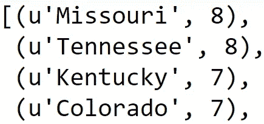

# 美国哪些州的邻居最多？

> 原文：<https://towardsdatascience.com/which-u-s-states-have-the-most-neighbors-2b4f24c68ad9?source=collection_archive---------26----------------------->

Photo by [Joey Csunyo](https://unsplash.com/photos/NwGMe-NuDm0?utm_source=unsplash&utm_medium=referral&utm_content=creditCopyText) on [Unsplash](https://unsplash.com/search/photos/united-states?utm_source=unsplash&utm_medium=referral&utm_content=creditCopyText)

这将是一篇关于使用 python 来确定美国一个州(或任何任意地理位置)是否与美国另一个州(或任何其他任意地理位置)接壤的非常快速而肮脏的帖子。

我们的输入将是美国各州的一个 **GeoJSON** (只是一个描述复杂形状的 JSON)，你可以从我的 GitHub [这里](https://github.com/ritvikmath/StarbucksStoreScraping/blob/master/us_states.geojson)获得。而且，我们的输出将是一个 python 的**字典**，它将美国的每个州映射到一个单一的数字，表示它有多少个相邻的州。

我们这篇文章的主要工具是 python 库 **shapely** ，它帮助我们用 python 处理复杂的地理。

这个过程非常简单:对于美国的每个州，我们可以遍历美国的所有其他州，然后**检查这两个州是否接触**。如果是这样，我们可以更新当前有问题的州的相邻州的运行列表。

首先，我们需要将 GeoJSON 转换成 shapely 可以理解的对象。我们将使用的两个主要的造型优美的物体是:

*   **多边形**对象:基本上是一个单一的有界形状
*   **多多边形**对象:基本上是多边形对象的集合(因为美国的一些州由多个地理区域组成)

下面是解析 GeoJSON 的代码:

现在我们已经在***state Polygons***中获得了一个不错的州地理对象(多边形或多多边形)字典，我们可以遍历字典并检查每个州是否与其他州相邻。

并且，结果是:

不错！所以密苏里州和田纳西州并列第一，各有 8 个邻居，然后肯塔基州和科罗拉多州并列第二，各有 7 个邻居。

希望这篇文章对使用 shapely 进行空间应用有所帮助。**感谢阅读！**