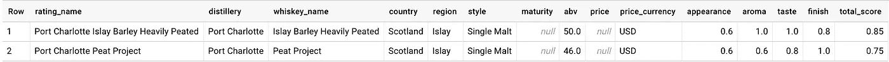
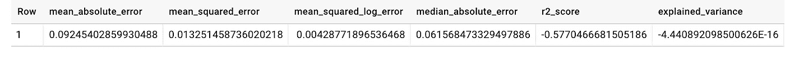
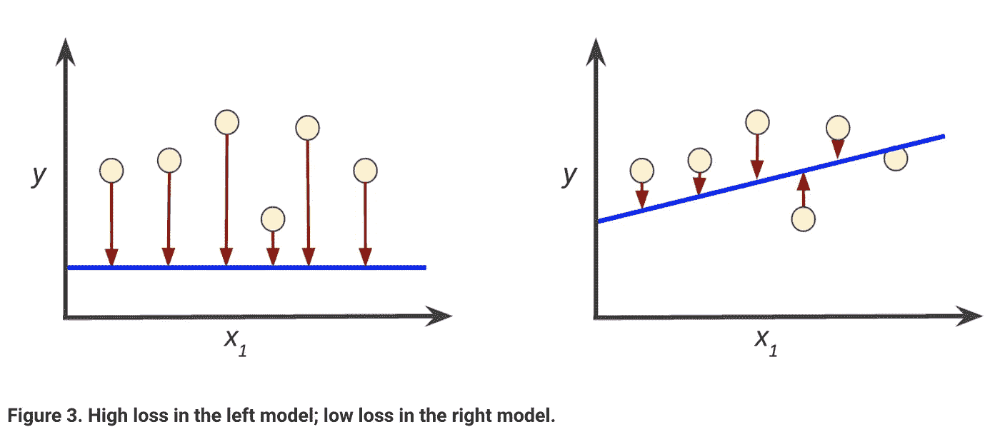
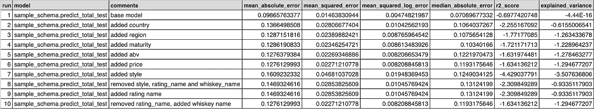
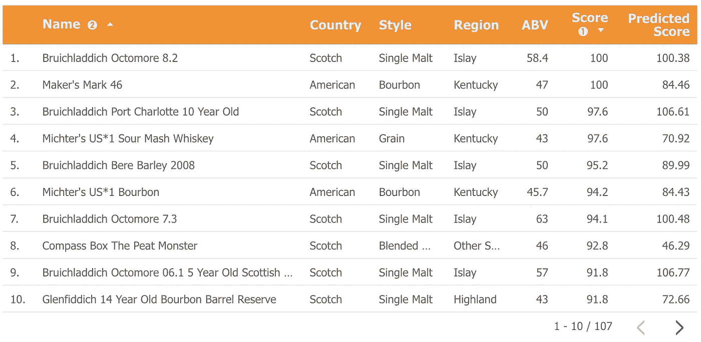

# 被 BigQuery ML 带走了

> 原文：<https://towardsdatascience.com/whisked-away-by-bigquery-ml-e98bacad2120?source=collection_archive---------12----------------------->


Photo credit: Phil Goerdt

## 预测 GCP 人对威士忌的偏好

# *“我在找…*

*…任何泥炭味的东西，像海滩上的营火一样冒烟，中度到高度的酒精，干果，柑橘，还有淡淡的陆地气息。”*

我很容易走进当地的酒类商店，与工作人员中的威士忌男或女谈论品酒笔记(和笑话)，他或她将能够知道我在寻找什么，并向我推荐。但是机器学习模型可以在最小数据集和有限输入的情况下做同样的事情吗？这就是眼下的问题。

(对于现在加入的人，感谢你们参与这一部分的报道！我建议你看看这个系列中的其他博客，但如果你不看，总结就是我有一堆威士忌数据和我的品尝偏好。让我们看看我们能从中学到什么。)

# 简单地说，BigQuery ML

在这个练习中，我将使用谷歌云平台的 [BigQueryML](https://cloud.google.com/bigquery/docs/bigqueryml-intro) 引擎。如果你没猜错，这是一个 ML 工具，它允许你创建 ML 模型并在 BigQuery 中运行它们。

对于任何在 BigQuery 中拥有大量数据的人来说，BQML 是一个不可思议的优势，因为数据可以保持不变，不需要定义数据框架。不仅如此，我们还可以在 BigQuery 中管理和运行我们的模型；这意味着不再需要供应特定于 ML 的计算虚拟机(或者我认为是物理机)。最后，我们可以[使用 BQ 中的专用 SQL 命令](https://cloud.google.com/bigquery/docs/reference/standard-sql/bigqueryml-syntax-create)创建这些模型。这不像其他 SQL 插件，需要大量用户定义的函数、类和其他有趣的东西来阻止我们开发真正的内容；它开箱即用。多酷啊。！

## 你为什么选择了那个？

我们为什么要关心这些特性呢？难道我不应该尝试使用 TensorFlow 这样的“真正的 ML 框架”吗？嗯，是的……也许吧。我可以尝试在 TensorFlow 这样的“真实框架”中做这个练习。但是，有几个原因让我没有走上那条路。

首先，我不想再写一篇“如何用 TensorFlow 做你的第一件事”的博客。已经被写死了。此外，像莎拉·罗宾逊这样的人在制作酷炫前卫的 TensorFlow 内容方面会比我做得好得多。BigQueryML 我们来了！

另一个原因是，在以前的博客中，我谈到了我在设计协同工作的系统时对简单性的热爱。我喜欢活动部件越少越好，故障点越少越好，从一开始就尽可能自动化。BigQueryML 很简单，对我来说试验起来很便宜，并且符合我当前的技术栈定义。使用它对我来说是很容易的。

最后，我的需求并没有规定我需要大马力的东西。我的训练集是刚刚超过 100 行的子集(2018 年我尝试过的所有威士忌)，我正在进行非常简单的回归预测。由于这些原因，我认为使用一个更强大和高度工程化的解决方案过度训练的风险很高。(如果你愿意，可以在下面评论和讨论。如果对此有很多回应，也许我会在未来的帖子中做一些 TensorFlow 模型并与 BQML 进行比较。)

不管我选择 BigQueryML 的理由是什么，让我们进入使用它的正题。

# 大查询，大 ML？

正如我上面所说的，使用 BigQueryML 非常简单，这主要是由于产品的特性集。然而，简单易用并不意味着它没有细微差别。让我们根据我的数据创建一个示例模型，对其进行评估，并就此进行一些讨论。

## 我要和他一样的

在本系列的一些早期博客中，我提供了威士忌评级数据的快速浏览。这里有一个快速提醒:



Mmm… data tartare.

以上是两种威士忌的原始未加权分数，以及一些维度属性。你认为这足以预测？我认为这个案子还没有定论。我认为，如果我们从大多数喝威士忌的人通常如何开始他们喝什么的谈话来思考这个问题，通常是通过说一种威士忌，如“我是一个波旁威士忌的家伙”或“我只喝单麦芽威士忌”。有时候成熟会发挥作用，而且价格往往决定了我们买什么或能买得起什么。这些通常本身就是很好的指标。但是这个模型能够学习更多的东西吗？我们有足够的证据来发现细微差别吗？

我想我们得看看模特是怎么想的。

## 像专业人士一样做模特

既然我们已经对训练数据集了如指掌，让我们看看如何在 BigQueryML 中实际建模。

如果您熟悉 SQL，您可能已经猜到创建模型类似于任何 [DDL](https://en.wikipedia.org/wiki/Data_definition_language) 语句。使用`create model`语句，我们可以创建一些在 BigQuery 中运行和训练的模型。GCP 文档在检查所有可用参数方面做得很好，所以如果你想了解我在这个例子中没有用到的东西，可以查看那里的。

```
--hi! i'm a (very) simple model for predicting a total score!create or replace model `sample_schema.predict_total_test`
options
  ( model_type='linear_reg',      /*this is the model type*/
    l1_reg=0,                     /*how much L1 regularization should we use?*/
    max_iterations=5,             /*how many times should we train?*/
    input_label_cols=['label'],   /*this is the column to predict*/
    data_split_method='seq',   /*how do we want to split the data?*/
    data_split_eval_fraction=0.3, /*how much should we split?*/
    data_split_col='date_sampled' /*which column should we split on?*/
  ) as /*this is a query to collect data to use in the model.
  all of these columns must be present later when we run the model.*/select 
  f.rating_name    as full_name
, f.distillery     as distillery
, f.date_sampled   as date_sampled
, f.total_score    as label
from 
  `sample_schema.w_ratings_f` f
where 1 = 1
;
```

这看起来很简单，但是让我来分析一下到底发生了什么。

首先，我们有`create or replace model`语句，后跟模型名称。接下来是`options`子句，它允许我们参数化新创建的模型。正如我之前说过的，这里有很多有趣的杠杆和旋钮，你可以在文档中读到更多。这个例子中只有几个选项来激起你的兴趣。让我们来看看它们是什么。

*   `model_type`:这是我正在创建的模型类型。我使用的是推荐的线性回归模型，用于预测和预报。
*   `l1_reg`:它控制模型中输入的[权重，这对于减少特征中的噪声和移除稀疏、高维数据集中不相关的特征非常重要。既然这个模型如此简单，这里有一个 0 就可以了。但是，如果我们编辑模型使其具有更高的维度，我们可能需要调整这个参数。(这何时变得相关？让我们假设我将品尝笔记添加到数据集，并且只有一些样本集有这些笔记。因为这些注释是稀疏的(不适用于所有行)，并且因为我们对每一行都有不同的注释(一组不同的文本)，所以如果没有注释，我们希望将该特性的权重强制设置为 0，以忽略特定输入的注释。)](https://developers.google.com/machine-learning/crash-course/regularization-for-sparsity/l1-regularization)
*   `max_iterations`:这是模型训练需要的步数。我对过度训练有所怀疑，因为这是一个如此小的数据集，这就是为什么我将最大值从默认的 20 降低到 5。
*   `input_label_cols`:标识将要被预测的列。简单来说，特征是输入，标签是输出。这里我试着预测总分。
*   我们应该如何分割训练数据？选项有`random`和`seq`。
*   `data_split_eval_fraction`:控制分割多少数据用于训练。默认是`.2`，但是由于这个数据集很小，我更喜欢多一点。因此选择了`.3`。
*   `data_split_col`:标识要拆分数据的列。它不包含在功能集中。

继续往下看 SQL 语句，您会注意到有一个`select`语句为模型提供数据。这是不言自明的，这种不需要定义数据框架、特性和 ML 模型附带的所有其他有趣的东西的简单性使得 BigQueryML 对我这种情况的人非常有吸引力。


一旦定义了模型，我就可以运行上面的语句，接下来发生的事情非常酷。BigQuery 接收模型逻辑，查询数据，然后在 BigQuery 中运行模型。说真的，这多酷啊？眼尖的(具有计费管理权限)可能会注意到 GCE 有几个额外的行项目，这是因为您将为运行这些 ML 语句付费。但是，在运行这些资源时，您不需要负责旋转它们。

既然我已经运行了模型，我应该对它进行评估。这样做的原因是为了更好地理解模型的准确性。虽然我们可以明确地知道模型是否准确(因为，你知道，数学)，但在某些情况下，模型构建和调整更像是艺术而不是科学。让我们通过几个例子来说明为什么会出现这种情况。

# 考试时间

我可以通过在 BigQuery 中运行以下命令来检查我的模型准确性的一些重要指标:

```
select *
from ml.evaluate(model `sample_schema.predict_total_test`);
```

这将为您提供如下所示的输出:



Uh… thanks?

上述各种统计数据有助于量化模型中的误差量；即模型与正确分数“偏离”了多少。如果我们每次都试图预测正确的分数(我们确实是这样)，我们会试图让误差尽可能接近零。



Who remembers “line of best fit” from stats class?

[让我们快速浏览一下谷歌 ML 速成班的这张图。](https://developers.google.com/machine-learning/crash-course/descending-into-ml/training-and-loss)这张图向我们展示了模型是如何试图适应数据集的，显然右边的模型做得更好。通过查看模型的统计误差，我们似乎可以做得更好…对吗？

理论上，是的，我肯定可以。接下来，我用不同的特性集多次运行同一个模型，以确定是什么影响了模型的错误率。您可以在下面看到，添加和删除额外的功能使错误率发生了很大的变化，没有一个错误率比基本模型低。



Wow. Such stats.

这是否意味着我们应该回到基地？在我看来，没有，原因如下。数据集太小了。如果我们看一下基本模型，有两个特征:威士忌的全名和酿酒厂。如果我只是用这些来预测我是否喜欢威士忌，随着时间的推移，我可能会得到很差的结果。当我添加更多特征时，错误率上升的原因是没有足够的数据或足够丰富的特征来确定模式。

这意味着，尽管我们可以从数学的角度来看一个模型是“最正确的”，但这并不意味着它将扩展或能够从它所接触到的新数据中学习。那有什么意义呢？

## 回到制图板？

从第一个模型开始，我已经制作了几个其他的模型，并对它们进行了试验，产生了更好的结果。这个过程的一部分是获取更多的数据，特别是向模型中引入品尝记录。此外，调整模型参数也有帮助。那么最终的“进展中的工作”是什么样的呢？



Not bad… right?

我觉得上面的成绩还可以。显然，我仍然需要对模型做一些调整，我也认为小数据集是问题的一部分。(如果你想查看所有的推荐，请随意前往[该死的 Dram](https://damndram.com/recommendations/) 。)

但我们不要忘记这里的明星，BigQueryML。在 BigQueryML 中构建、管理和测试这些模型是如此的容易，而且它无缝地集成到了我已经在构建的东西中。我看不出这有什么不对。

*Phil Goerdt 是专门研究云架构和数据工程的独立顾问。*