# 谁是独立选民

> 原文：<https://towardsdatascience.com/who-are-independent-voters-f12160f72b3?source=collection_archive---------14----------------------->

## 对一个政党认同“不太强烈”的人和那些认同独立但“更接近”一个政党的人之间的差异。

我们使用的数据是由 YouGov Blue 和进步数据组织 [Data For Progress、](https://www.dataforprogress.org/)进行的民意调查，它由 3215 名选民组成，然后根据“年龄、性别、种族、教育、城市/农村状况、党派、婚姻状况和人口普查地区”进行加权，以反映美国投票公众，权重附加到 2018 年选民份额的[编目员](http://catalist.us/)的数据。他们公开发表了数据，对此我表示感谢。

我要展示的数据来自政党识别问题，尽管我希望他们也被问到这个人的实际注册政党是什么，因为我来自肯塔基州，在肯塔基州第六区， 根据[《纽约时报》的最新民调](https://www.nytimes.com/interactive/2018/upshot/elections-poll-ky06-1.html)(或者参考[哈里·恩滕的](https://twitter.com/ForecasterEnten)推特传记“政党 ID 不等于政党注册”)，注册的民主党人只有大约 65%投票给艾米·麦格拉思，研究竞选活动如何克服数据缺陷并找到自称是自己政党但注册为反对党的选民将是有益的。

然而，被问到的问题是“总的来说，你认为自己是一个…？”回答政党的人的后续问题是“你会称自己是强大的(插入政党)还是不太强大的(插入政党)？”对于那些把自己列为无党派、其他或不确定的人，接下来的问题是“你认为自己更接近民主党还是共和党？”。一个简单的条形图将我们引向这一价差。

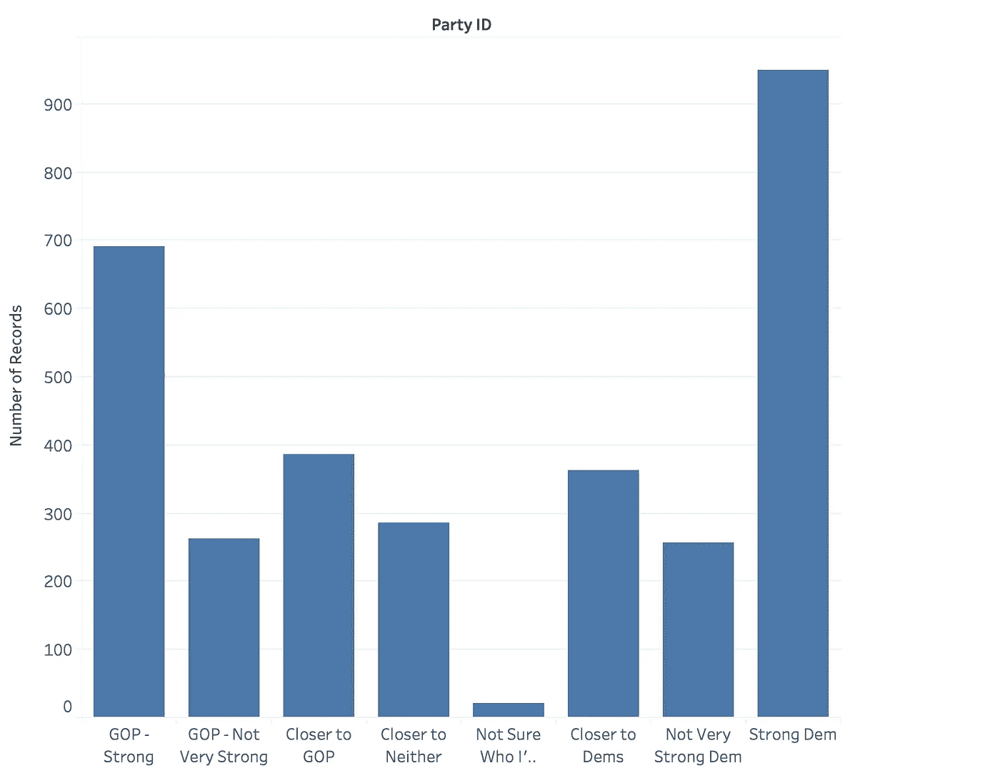

拥有更大样本量的好处是，我们可以看到答案的内部，所有类别至少有 200 个回答(除了不确定我和谁更接近，但我们现在忽略它们)，我们可以看到这些群体的行为。我想重点介绍的群体如下:

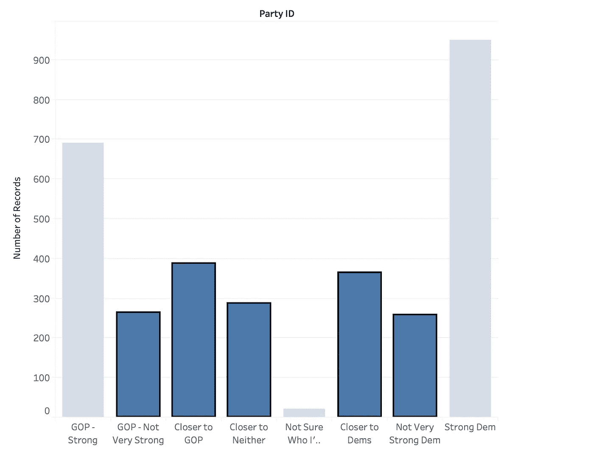

首先，我们将看看这五类中每一类的意识形态。我们将把“更接近共和党”称为共和党独立人士，民主党也是如此。我们将把共和党+不是很强的人称为共和党弱势党员，民主党也是如此。

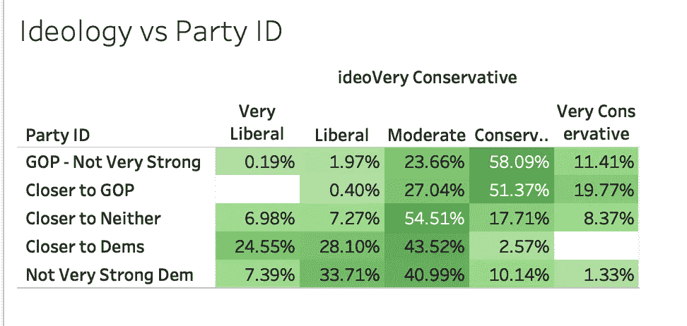

正如我们所见，共和党弱势党员和共和党独立人士更有可能自称为保守派，而不是民主党人自称为自由派。我们还看到，有一个“更接近民主党”的小组，在民主党的左边，比他们的保守派对手略大。总的来说，民主党人比共和党人多，所以当考虑哪些地区应该努力扩大你的基础，而不是向中间靠拢，为民主党争取温和派。即使意识形态不同，政党 ID 的投票模式在很大程度上是普遍存在的。

当我们看一看这些群体在 2018 年众议院选举中投票给谁时，我们首先看到了党派(或缺乏党派)投票行为的总体趋势。在此图中，我们比较了政党 id 与 2018 年投票:

它变得有点混乱，与所有的“精益 ______”和次要选项，所以这里有精益民主党和精益共和党和犹豫不决的两党投票。

这里我们看到，强党、弱党和无党派人士通常会投票给自己的政党，但当我们比较弱党和无党派人士时，我们看到无党派人士比弱党更有党派性。

当查看 2018 年全党选票的交叉表时，我们看到共和党人只获得了 77%的不是很强的共和党人，但民主党人获得了 88%的不是很强的民主党人，这对 2018 年的民主党竞选活动是一个很好的推动。

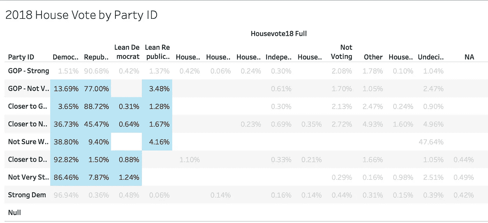

当我们对比无党派者和有党派者的政策偏好时，我们也看到了相似的趋势，但是我们看到弱党派者和无党派者比强党派者有更多的相似之处。以下是每个小组对黑人的命也是命的看法。

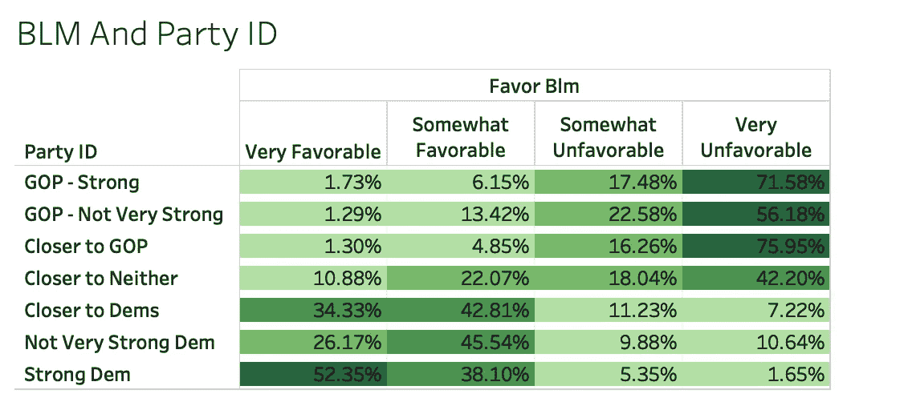

我们看到软弱的党派民主党人和党派独立民主党人对 BLM 的看法比强大的民主党人更相似，但党派独立共和党人认为 BLM 更像强大的党员，这让我们稍微绕了一下，看看政党 ID 的[种族怨恨得分](http://filesforprogress.org/datasets/wthh/WTHH_Core_and_DFP_modules.pdf)(代码本第 10 页)。

在这里，我们看到对弱势党派的种族怨恨更多的是针对总的中间值，而对党派独立人士的种族怨恨非常接近强势党派。也许这有助于我们解释唐纳德·特朗普的下一个交叉表，正如我们所见，弱势党派比党派独立人士更愿意打破排名。共和党人也有很多只愿意说“有点”而不是“非常好”的人，这可能会导致未来的投票率问题。尽管如此，共和党人可能会比其他人更倾向于消极的党派偏见。

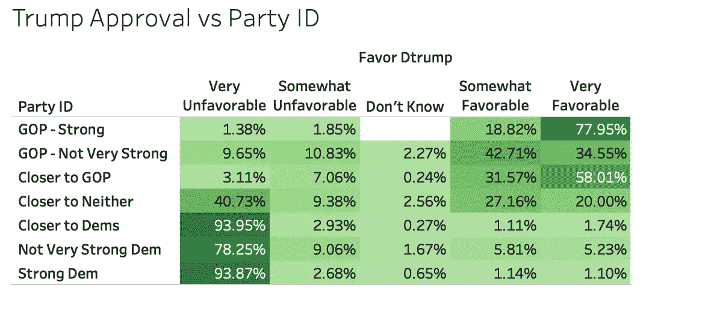

我们还看到，表示支持特朗普的 60 名民主党人(强势、弱势、党派独立)的种族怨恨得分平均为 0.3941，与共和党人相似。在 114 名表示不支持特朗普的共和党人(强势、弱势、党派独立)中，种族怨恨得分为 0.3088，51 名得分非常不利的共和党人的平均种族怨恨得分为 0.2333，与弱势民主党人相似。这些样本量太小了，但是你可以在更大的数据集中寻找。

下一个数据是按党派 ID 查看 2016 年选举，因为我们的民调是基于 2018 年的投票率，所以重要的是要记住，这个样本在民主党中比 2016 年高出约 6%，所以唐纳德·特朗普的数字看起来会比实际情况好一点。

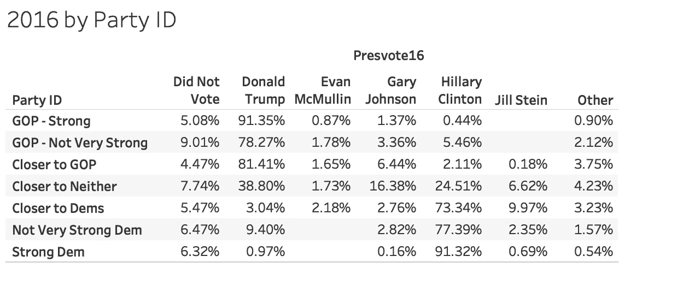

我最感兴趣的方面是特朗普能够抓住几乎 10%的弱势民主党人。党派独立人士虽然没有投票给特朗普，但也没有投票给希拉里。当然，还有“真正的无党派人士”，我们接下来会看看他们，希拉里比特朗普更接近加里·约翰逊。

让我们来揭开“真正的独立人士”的面纱，看看他们有多忠于自己的诺言。

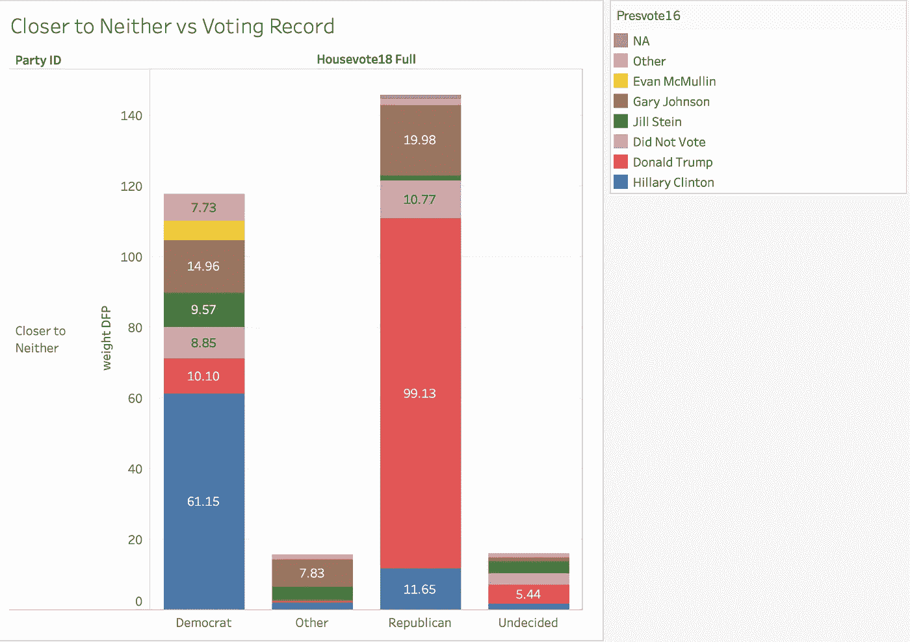

他们的投票行为有点不稳定，但基本上是可以预测的。他们是多元化的共和党人，2018 年投票给共和党人的人大多投票给特朗普，剩下的几乎等量的选票投给了自由主义者加里·约翰逊(Gary Johnson)、希拉里·克林顿(Hillary Clinton)，或者不投票。投票给民主党众议院候选人的“真正的独立人士”大约有一半时间投票给希拉里，另一半分配给加里·约翰逊(12%)、特朗普(8.5%)、吉尔·斯坦(8.12%)、不投票(7.51%)、其他(6.51%)和埃文·麦克穆林(4.59%)。

改变党派投票的独立人士只占美国选民的一小部分。

Total of 6.87% of total Americans switched from Obama voter->Trump, or Romney->AntiTrump

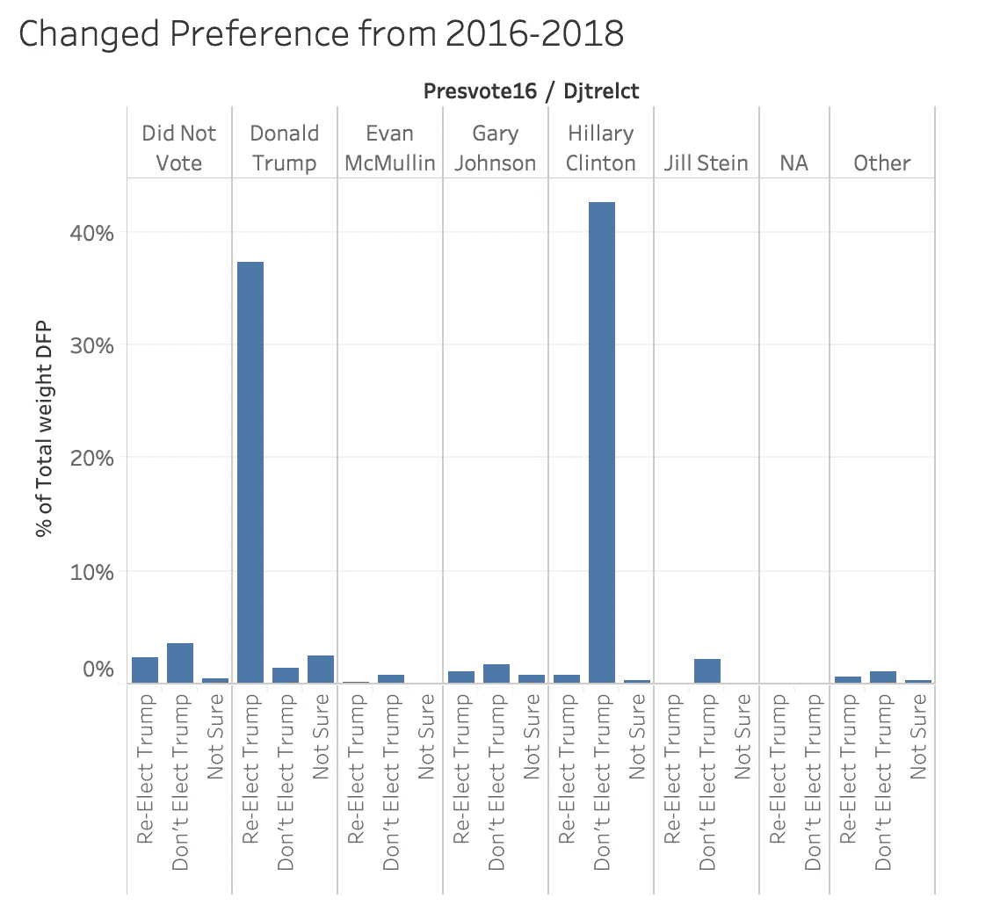

Only 2.13% changed from Trump Voter->Don’t Re-Elect Trump or Hillary Voter-> Re-Elect Trump

这个过去的图表非常糟糕，你可能不应该吸引特朗普的选民，而是你在 2020 年的基础。人们基本上不会改变对同一个人的看法。

85%的人投票支持参议院和众议院的同一个政党(第二届民主党/民主党+民主党/民主党+共和党/共和党)

这里还有一些表格:

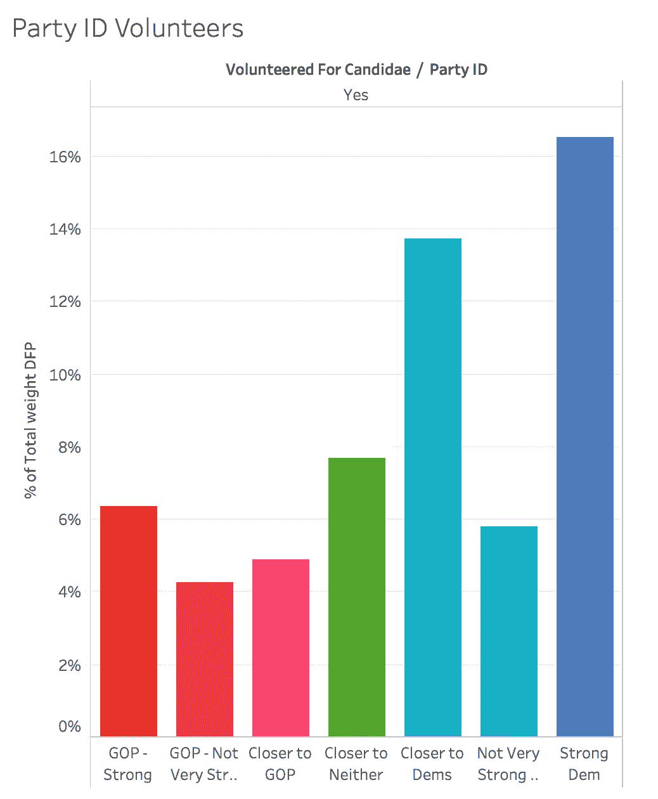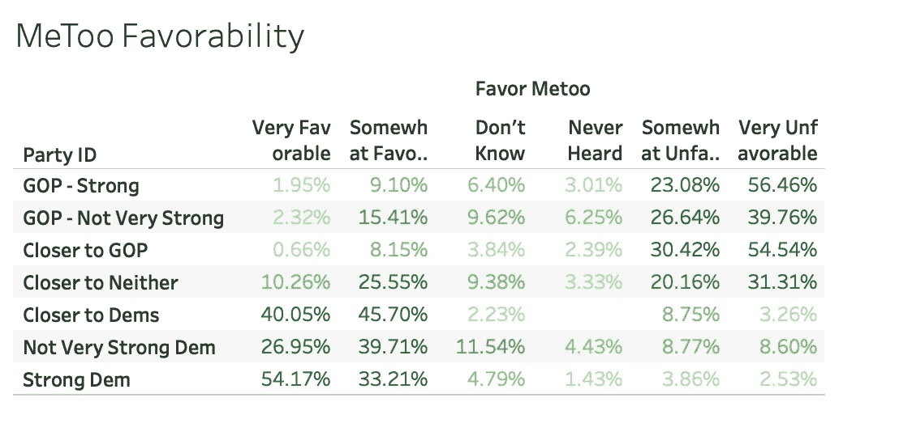

I don’t really like the colorful texts either

This is better

Green Jobs particularly poll well with Non-Strong Partisans, 76% — 16% (Grand Total Line)

Labor Unions Poll poorly, 44–48, but with total voters, it is 49–41

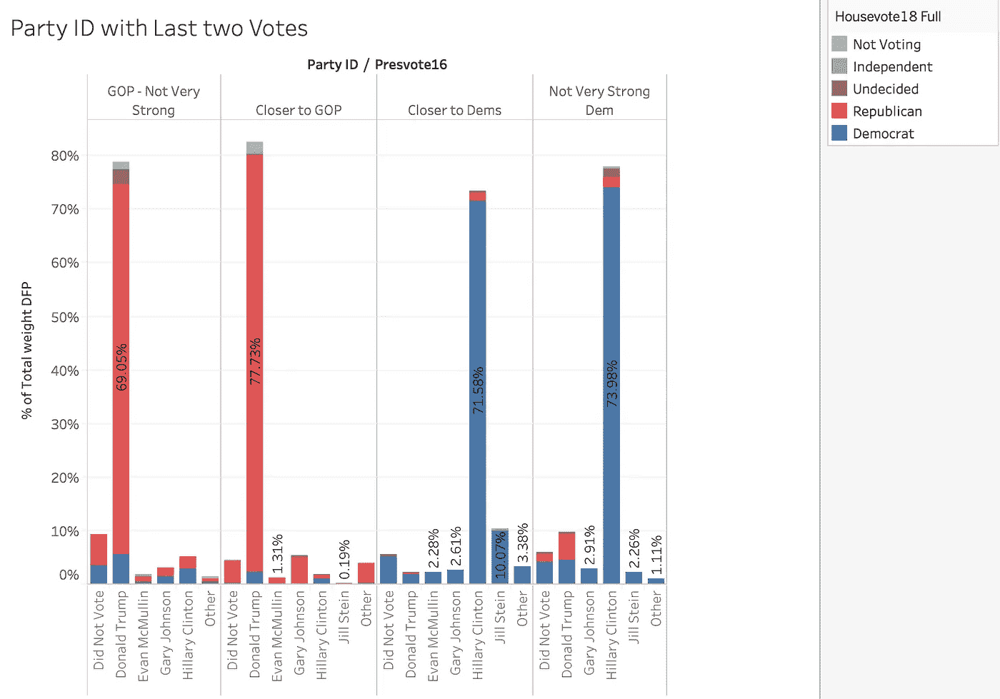

在 2018 年投票的非强势党派选民中，略低于 75%的人在 2016 年投票给了同一个政党，即使他们之间没有强烈的党派关系。两次都没有投票给他们预期的政党的两类非强势党员约占 2018 年选民的 11%。投票给反对党的人就更少了。这部分选民中大约有 3%投了反对党的票。吸引持不同意见的 8%的人比吸引另一方的 3%的人更有用。