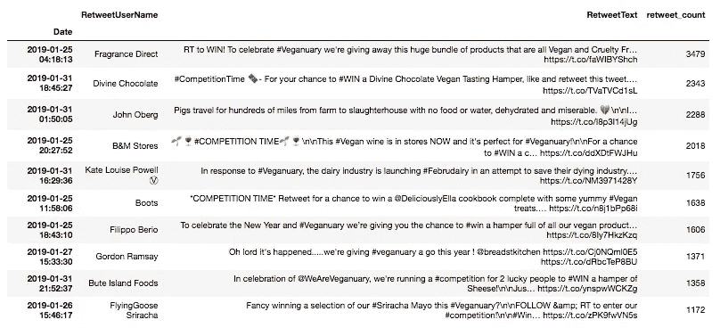

# #Veganuary2019 的演员有哪些？

> 原文：<https://towardsdatascience.com/who-are-the-actors-of-veganuary2019-f408579141bb?source=collection_archive---------28----------------------->

## 第 1 部分:Tweets 数据分析

# 1.介绍

“纯素食日”是由英国慈善机构“纯素食日”组织的一项活动，鼓励人们在一月份尝试纯素食(只吃植物性食物)。人们参与这一挑战的主要原因包括动物福利、气候变化和改善个人健康等问题。今年报名参加的人数创下了新纪录。Veganuary 透露，全球共有 250，000 名参与者订阅加入该运动。

素食主义比以往任何时候都是最热门的话题，因此给了 Twitter 数据分析一个绝佳的机会。这将有助于深入了解该运动的影响，并确定积极参与该运动的行为者。不幸的是，并没有收集整个一月的推文，因此，这篇文章只对 2019 年 2 月的事件略有所知。我在这里的目的是熟悉 Twitter API，并对我感兴趣的辩论进行数据清理和数据探索性分析。我们开始吧！

# 2.数据收集

这个项目的数据是使用 [Twitter API](https://developer.twitter.com/en/docs/basics/getting-started) 收集的。这些推文是在 1 月 22 日至 1 月 31 日之间收集的。总共有 21，421 条推文使用#Veganuary2019 和#Veganuary 运动的官方标签记录。

首先，请求库用于读取数据，然后构建在 JSON 编码器中。然后，我在 python 笔记本中预处理并分析了这些推文。

在这里，我要感谢一些伟大的媒体成员，他们帮助我实现了我的分析。如果你对文化和城市感兴趣，可以看看 [Vishal Kumar](https://medium.com/u/2390882c92aa?source=post_page-----f408579141bb--------------------------------) 的文章。相反，如果你更热衷于学习如何掌握熊猫和收集推特数据，那么就去读读泰德·彼得鲁和马尔科·邦扎尼尼。

# 3.数据分析

以下图表说明了为更好地理解围绕#Veganuary2019 的讨论以及参与挑战的参与者而进行的介绍性分析。

在这里，我将介绍以下结果:

*   每小时的推文数量
*   前 10 名推特用户(按关注人数)
*   前 10 名推特用户(按推特数量)
*   转发量最高的 10 个账户和推文

**每小时的推文数量**

下图显示了每小时的推文数量。有趣的是，人们最活跃的时间是午餐和晚餐时间。这很可能是因为人们在用餐时谈论了#素食主义者的话题，并借此机会在推特上发布了这个话题。

从中午到下午 2 点总共发布了 2941 条推文，从晚上 7 点到 9 点发布了 2613 条推文。在凌晨 1 点到 6 点(GMT +0)之间，平均有 240 条推文发布，这可能对应于美国或亚洲国家用户发布的推文。

The bar chart shows the average number of tweets by hours between the 22nd-31st of January

**十大推特账号:名人**

用户的关注者越多，他的推文就越有可能被大量的人阅读。下图显示了参与素食讨论的十个最受欢迎的账户。

毫不奇怪，前两个地方由著名的英国名厨占据:戈登·拉姆齐和杰米·奥利弗。然而，他们受到各种行为者的关注，如媒体公司(SkyNews 或 New Scientist)、快餐连锁店(Nandos)甚至加拿大奥林匹克队(Team Canada)。这清楚地表明，讨论不是局限在一个小圈子内，而是扩展到各个人口群体。

The bar chart shows the most famous accounts by the number of followers

你想知道这些演员的推特是什么吗？看一下桌子！

The table shows the top ten most famous tweeters

How you do #Veganuary! [Gordon Ramsey](https://medium.com/u/54a723e71ecb?source=post_page-----f408579141bb--------------------------------)

**十大推特账号:推特**

值得注意的是，那些最著名的人并不是#Veganuary 的主要演员。为了了解积极参与宣传活动并讨论前述动物蛋白挑战一个月的人的身份，有必要看看每个推特用户的推特(包括转发)数量！下图说明了这一分析。

行动者由组织和个人组成，他们的共同目标是教育公众关于动物权利、气候变化和人类健康的知识。

The bar chart shows the most active tweeters by number of tweets

**十大转发推文**

转发推文的数量提供了对推特用户行为的有趣洞察，或者换句话说，对人们行为的有趣洞察！下表列出了被转发次数最多的 10 条推文，以及它们来自哪些 Twitter 账户。

有趣的是，有一半的推文邀请 Twitter 用户参加比赛，以赢得免费的东西，如纯素食巧克力、葡萄酒、植物奶酪或蛋黄酱，或者美味艾拉的美味植物食谱！:-)

The table shows the tweets that have been retweeted the most

**结论**

该结束了！:-)这篇文章研究了 2019 年 1 月的大约 21，421 条推文。我希望你喜欢这篇文章，如果你想留下任何意见，建议或想法，我真的很感激！所以，请随时伸出手来！

我的代码可以在下面的 [Github](https://github.com/audevuilli/veganuary-analysis) repo 中找到。

**接下来的步骤**

每天，我都在发现更多关于数据分析的东西，因此，我的下一篇文章将探索一些推文的自然语言处理(NLP )!素食 2019 的演员和参与者实际上在发什么微博？他们如何参与话题，是积极的、中立的还是消极的参与？

感谢您的宝贵时间！

奥德

*我是* [*数据和植物科学家*](http://www.audevuilli.com) *在* [*垂直未来*](https://www.verticalfuture.co.uk/) *，之前在*[*WBC SD*](https://www.wbcsd.org/)*。理学硕士。在城市分析和智能城市方面，来自 UCL 的 Bartlett* [*伦敦的 CASA*](https://www.ucl.ac.uk/bartlett/casa/) *和 BSc。在食品科学方面来自* [*苏黎世联邦理工学院*](https://ethz.ch/en.html) *。对城市、美食、健康充满热情通过*[*Twitter*](https://twitter.com/audevuilli)*或*[*LinkedIn*](https://www.linkedin.com/in/aude-vuilliomenet-69248711a/)*取得联系。*