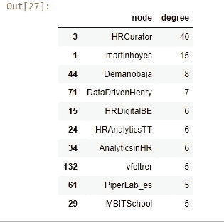
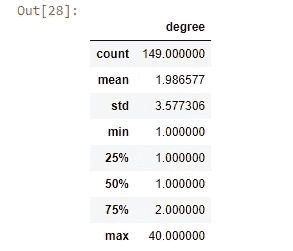
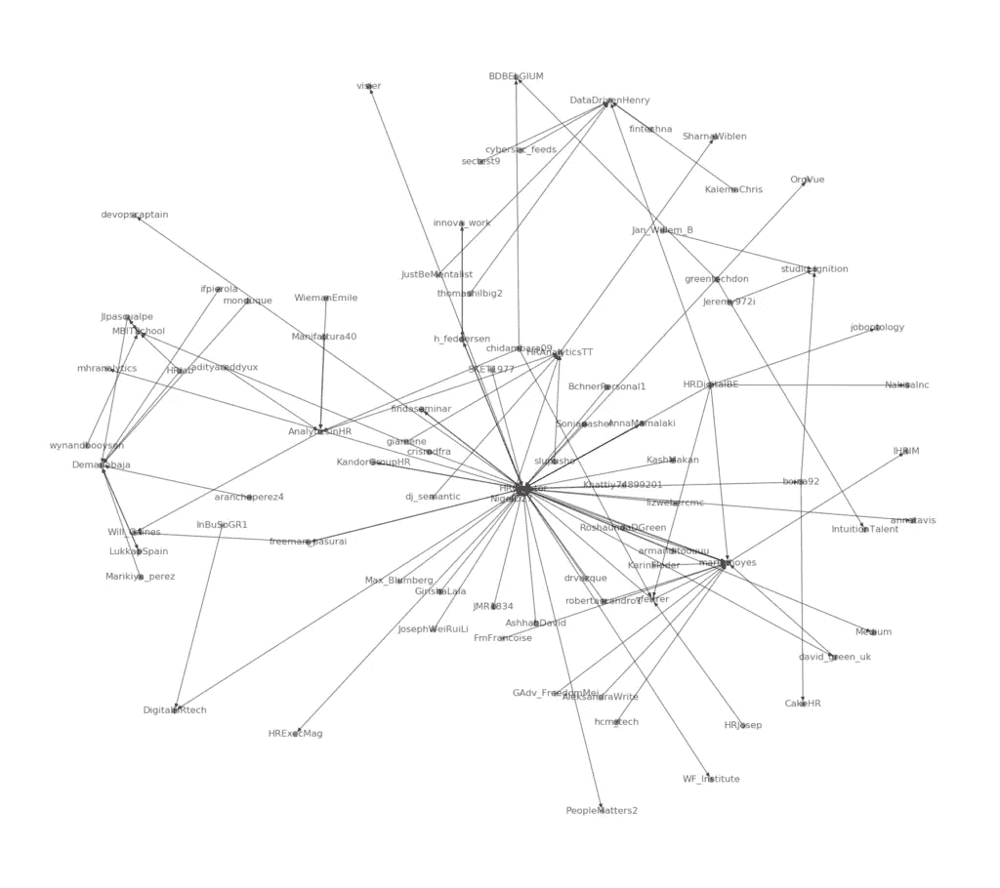
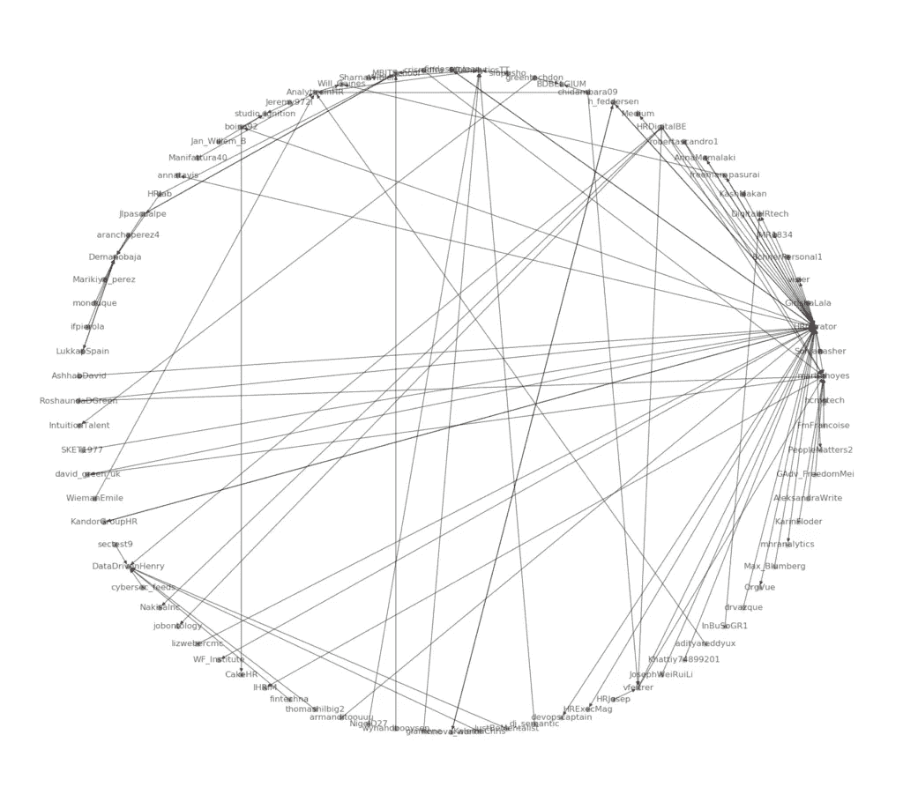
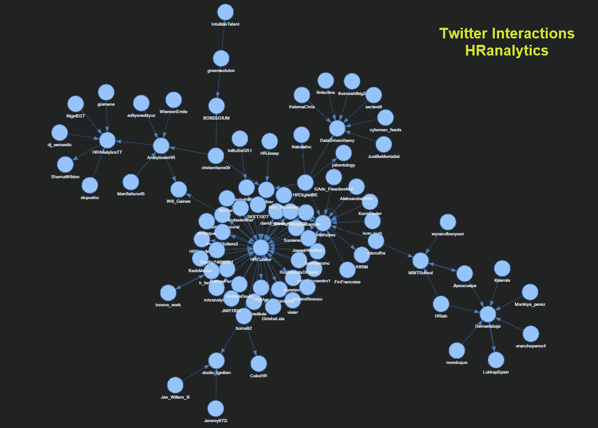

# Twitter 上最具人力资源分析影响力的人是谁

> 原文：<https://towardsdatascience.com/who-are-the-top-hr-analytics-influencers-on-twitter-f44a19e198a0?source=collection_archive---------33----------------------->

## 可视化 Twitter 社交网络*人力资源分析*

日常生活中，人们使用 Twitter 等社交媒体来分享想法和创意。兴趣相投的人聚在一起，通过重新分享或回复自己喜欢的帖子，在网络平台上进行互动。通过研究人们如何在社交网络上互动，这将有助于我们了解信息是如何分布的，并确定谁是最突出的人物。

在我们的[上一篇文章](https://ai-journey.com/2019/10/auto-generated-insights-of-2019-hr-tech-conference-twitter-part-2/)中，我们使用 Twitter feeds #HRTechConf 进行了主题建模研究，并训练了一个模型来学习所有推文的主题。在本文中，我们将分析 Twitter 用户交互，并将其可视化为一个交互图。这里是[互动图表网页](https://ai-journey.com/wp-content/uploads/2019/11/interactive_twitter_graph.html)的链接。

> 社交网络是社会互动和个人关系的网络。
> 
> 牛津词典

我使用 Python 3.6 和以下软件包:

*   [Tweepy](https://www.tweepy.org/) :用于访问 Twitter API 的 Python 库。
*   [NetworkX](https://networkx.github.io/) :用于研究复杂网络结构的 Python 包。
*   [PyVis](https://pyvis.readthedocs.io/en/latest/index.html) :用于创建和可视化*交互式*网络图的 Python 库。

如果你对组织网络分析感兴趣，可以查看我们写的这篇文章。

# 数据采集

我们使用 [Tweepy](https://www.tweepy.org/) (一个用于访问 Twitter API 的 Python 库)来提取所有提到 ***HRanalytics*** 的 Tweepy。由于 [Twitter API 限制](https://developer.twitter.com/en/docs/tweets/search/overview/standard)，只能检索到 2019 年 11 月 2 日至 11 日发布的推文。总共有 333 条推文。

我们认为，当一条推文被转发或回复，或者一个 Twitter 用户在另一个用户的推文中被提及时，就存在 Twitter 用户互动。这个想法是，如果某人的推文或名字在网络中出现得更频繁，那么他对人力资源分析的话题就有更大的影响力。

在下面的转发示例中，我们认为 Twitter 用户 *Sonianasher* 和*HR 策展人*之间存在交互。

> *RT @ HR 策展人:博世如何利用游戏化构建# HR 分析技能(案例分析)*[*https://t.co/8IjyO1HdUe*](https://t.co/8IjyO1HdUe)*【digital hrtech @ analytics inhr…*
> 
> 索尼亚纳舍尔

# 图形建模

社交网络，例如 Twitter 图，由节点和边组成。节点是 Twitter 账号，边是 Twitter 用户之间的交互。

社交网络，例如 Twitter 图，由节点和边组成。节点是 Twitter 账号，边是 Twitter 用户之间的交互。

还有，如果 B 转发、回复或提及 A 的推文，很有可能是一个 Twitter 用户 A 对用户 B 产生了某种影响。因此，Twitter 网络是一个**有向**图。在上面的例子中，用户 *Sonianasher* 不仅与*HR 策展人*有联系，还受到*HR 策展人*的推文的“影响”。

```
import networkx **as** nx
graph = nx.DiGraph()
```

为了构建我们的 Twitter 网络，我们使用了 [NetworkX](https://networkx.github.io/) ，这是一个用于研究复杂网络结构的 Python 包。

```
degrees = [(node, val) for (node, val) in graph.degree()]
degrees_df = pd.DataFrame(degrees, columns=['node', 'degree']).sort_values(
        by='degree',ascending=False)
degrees_df.head(10)
```

333 条检索到的推文中的所有交互都被添加到有向图中。让我们看看我们的 Twitter 网络连接得有多好。



```
degrees_df.describe()
```

推特账号*HR 策展人*拥有最多的互动(40 次)，而 *martinhoyes* 拥有 15 次。



```
nx.number_connected_components(graph.to_undirected())22
```

哇，我们有 22 个不相连的子图，这可不好。我们最感兴趣的是大型全连通图。

```
nodes = max(nx.connected_component_subgraphs(graph.to_undirected()), key=len)
largest_subgraph = graph.subgraph(nodes)
print(nx.info(largest_subgraph))
```

`Name:
Type: DiGraph
Number of nodes: 84
Number of edges: 100
Average in degree: 1.1905
Average out degree: 1.1905`

最大的子图有 84 个节点和 100 条边。让我们确保这个图中的所有节点都是连接的。

```
nx.number_connected_components(largest_subgraph.to_undirected())1
```

太好了！它只有一个连通图。

# 网络可视化

现在，我们可以绘制我们的 Twitter 互动网络。

```
node_degree = largest_subgraph.degree()
pos = nx.spring_layout(largest_subgraph, k=0.4)
plt.figure(figsize=(18,16))
nx.draw(largest_subgraph, pos=pos, 
        linewidths=0.2, node_color=range(len(node_degree)), 
        node_size=60, alpha=0.6, with_labels=True)
nx.draw_networkx_nodes(largest_subgraph, pos=pos, node_size=10, alpha=0.3)
plt.show()
```

现在，我们可以绘制我们的 Twitter 互动网络。



Twitter Network

环形布局的相同网络。



Twitter Network — circular layout

似乎许多箭头都指向节点*HR 策展人*和 *martinhoyes* ，这证实了我们之前在上面的分析中发现的，用户*HR 策展人*和 *martinhoyes* 在这个网络中最有影响力。

```
from pyvis.network import Network
net = Network(height="850px", width="100%", bgcolor="#222222", 
              font_color="white", directed=True)
net.from_nx(largest_subgraph)
net.show("interactive_graph.html")
```

这很酷，但是很难将每个节点的连接可视化。别担心。我们使用 [PyVis](https://pyvis.readthedocs.io/en/latest/index.html) 库来构建一个交互式 web 图，允许用户拖动、悬停和选择节点和边。这里是[交互式图形网页](https://ai-journey.com/wp-content/uploads/2019/11/interactive_twitter_graph.html)的链接。



Interactive Twitter Network

# 结束语

像 Twitter 这样的社交网络拥有大量关于人类行为和社会的信息。社交网络的出现使得对信息分布、影响传播和社区结构的研究成为可能。事实证明，图表分析在从网络中发现这些见解方面很有价值。

如果您有任何问题或反馈，请随时发表评论。

机器学习快乐！

*原载于 2019 年 11 月 17 日*[*【https://ai-journey.com】*](https://ai-journey.com/2019/11/who-are-the-top-hr-analytics-influencers-on-twitter/)*。*