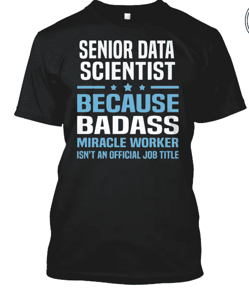

# 谁是“资深”数据科学家？—一些想法

> 原文：<https://towardsdatascience.com/who-is-a-senior-data-scientist-some-thoughts-bba0abc4d842?source=collection_archive---------21----------------------->

source: [https://teespring.com/shop/senior-data-scientist-ba#pid=2&cid=2397&sid=front](https://teespring.com/shop/senior-data-scientist-ba#pid=2&cid=2397&sid=front)

在过去的几周里，以及几个月前，我参与了一个“高级数据科学家”职位的筛选和面试。在这个过程中，我花了相当多的时间思考:

a)是什么让候选人在数据科学方面更资深/更有经验？

b)与我们面试相对初级的数据科学家相比，我们如何调整面试流程来测试这种“资历”？

我必须明确指出，我在这方面没有太多的经验，但是在两个非常不同的组织中作为采访者和被采访者参加过这样的采访之后，我形成了一些观点。这篇文章收集了我对高级数据科学家应该知道的一些个人观点。

请注意:我的经历是在数据科学团队嵌入非专注于人工智能的公司(目标是**用人工智能支持增强**公司的产品)的背景下，而不是在人工智能优先的公司，这些公司有大量的研究人员、开发人员和其他专门致力于构建机器学习系统的团队。

**Q1:是什么让候选人在数据科学方面更资深/更有经验？**

下面是我关注的四件事:对模糊问题描述的反应、建模之外的知识、高效沟通以及指导/领导经验。

a)一个有经验的人不应该对不太具体的问题描述感到不舒服，应该主动提问以理解问题的要求，比如说，面试官用 1-2 句话描述了一个与他们组织相关的问题，并问你将如何处理这个问题？，有了好的候选人，讨论可以进入各个方面，如:如何收集数据，如何建立和选择学习模型，如何决定部署后的关键绩效指标，以及与非技术受众沟通。对于不太有经验的候选人，要么候选人只谈论学习模式，要么不通过问这些问题来继续讨论。

b)有经验的候选人将对部署数据科学系统的不同阶段有所了解——如果不是所有这些阶段的专业知识。也就是说，他们会对一些问题有话要说，比如:一旦模型建立起来，我们该做什么？它如何与将要嵌入的现有产品进行对话？我们可以使用什么工具在其他地方部署这些本地构建的具有 101 个依赖项的模型(比如在云上)？).一个不太缺乏经验的候选人可能不知道除了他们自己在项目中的角色之外的那么多细节。

c)有经验的候选人会是更好的沟通者。通常，高级数据科学家最终会参与项目的各个阶段，从需求收集到向客户展示结果。因此，在我看来，高级数据科学家还应该能够成为相关的技术和非技术团体之间的联络人。一个缺乏经验的候选人可能擅长技术方面，但不需要清楚地表达出来。

d)有经验的候选人可以独立工作，也可以承担起指导年轻数据科学家的责任。如果需要的话，他们还应该愿意承担项目的所有权并领导项目的方向。这一点尤其重要，因为在这种情况下，太多的注意力放在研究新奇的东西上，最终可能不会产生任何有形的产品。经验不足的候选人不太可能有这种经历。

Q2:我们如何调整面试程序来测试这种“资历”？

a)提出更多开放式的问题解决方案——这解决了 Q1 的第一点。一个有经验的数据科学家，即使他们以前从未听说过这个问题，也应该能够通过向面试官问更多的问题，并根据他们迄今为止的经验推断出他们所知道的东西，来对这类问题有所了解。

b)询问他们/他们的团队当前的技术架构、编程实践、他们与工程师的合作有多密切等——具体问题各不相同，但我认为这解决了 Q1 的第二点。一个有经验的候选人应该对一个项目的不同阶段所使用的一些先进的工具有所了解，并且对除了他们已经知道的之外还有什么其他选择有粗略的想法。

c)Q1 的第三点可以在面试过程中通过让候选人更多地谈论阐明他们的想法来测试，例如要求描述一个非常简单和非常复杂的机器学习模型背后的直觉。

d)在 Q1 解决第四点可能很简单——询问候选人关于指导经验、项目管理经验以及围绕这些的行为问题。

需要注意的一点是:这些是我会在常规面试过程中调整的东西，而不是我会寻找的唯一东西。也就是说，如果角色需要，候选人仍然需要技术过硬，擅长动手编程等。