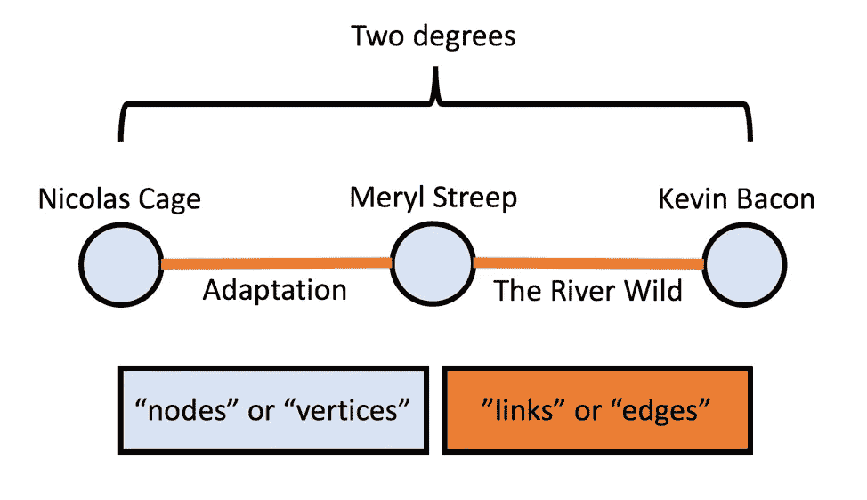
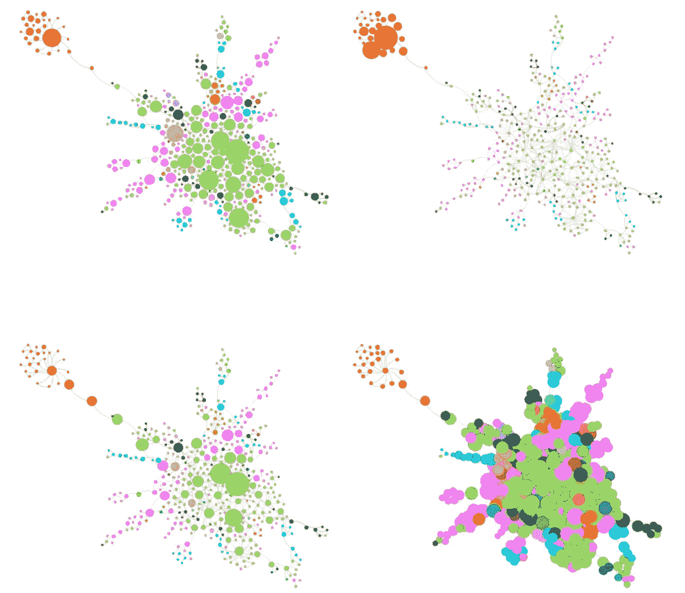

# 电影界最重要的人物是谁？

> 原文：<https://towardsdatascience.com/who-is-the-most-important-person-in-the-film-industry-61d4fd6980be?source=collection_archive---------18----------------------->

William Shakespeare (left), Robert De Niro (middle), and Miles Long (right). Headshots from IMDB.com

## 使用 IMDB 数据的网络分析

凯文·贝肯曾说，他“与好莱坞的每个人或与他们一起工作的人合作过”，这导致了室内游戏“[六度凯文·贝肯](https://en.wikipedia.org/wiki/Six_Degrees_of_Kevin_Bacon)”，以及各种模仿，广告，棋盘游戏，脱口秀表演，甚至慈善机构“【SixDegrees.org】”。该游戏包括通过与其他演员共享电影，尝试将一个演员与凯文·贝肯联系起来，在六个连接内。例如，尼古拉斯·凯奇与梅丽尔·斯特里普一起改编，梅丽尔·斯特里普与凯文·贝肯一起在《荒野之河》中饰演角色(相隔 2 度，意味着尼古拉斯·凯奇的“培根指数”为 2)。网上也有各种资源，像[培根神谕](https://oracleofbacon.org/)，计算一个演员的“培根数”。

*Nicolas Cage is two degrees separated from Kevin Bacon, meaning Nicolas Cage has a “Bacon Number” of 2\. Nodes (or vertices) in blue and links (or edges) in orange — explained in more detail below.*

但是，凯文·贝肯是电影业中“联系最紧密”还是“最重要”的人吗？为了回答这个问题，我下载了整个 IMDB 数据库。这是一个丰富的数据集(就像从 1894 年开始的超过 510 万个标题中的超过 360 万人)，一旦你开始从这些数据中“提取网络”，它就会变得非常庞大。通过“提取网络”数据，我的意思是我们感兴趣的不仅仅是人和电影，还有他们所有的联系。为了让分析更容易，我只使用了 1960 年后制作的电影，这些电影的 IMDB 评分至少为 4，171(平均值)，总体评分高于 1.0。尽管如此，一旦我们提取网络，我们得到超过 12，000 部电影，超过 50，000 人，和 50 万个独特的连接！

网络由节点(或顶点)和链路(或边)组成。在 IMDB 网络的情况下，我们可以在同一个电影中使用节点和协作作为链接来表示人们。在网络分析中，有许多不同的方法来度量网络中节点的“重要性”，称为“中心性”度量。我在这里用引号将单词“重要性”括起来，因为这是一个主观的术语，一个节点对网络的重要性有不同的方式。这就是为什么有不同的中心性测量。

大概最简单的中心性度量是一个节点拥有的连接总数。这被称为**“度中心性”**，因为一个节点拥有的链接数量被称为该节点的“度”。例如，凯文·贝肯在 34 部电影中有 298 个合作者，这意味着他在这个网络中的“度”是 298。一个人拥有的联系越多，中心性程度就越高。具有高度中心性的人是网络中的“中枢”。度中心性是直观的和信息丰富的，但是不考虑次级连接，并且可能错过网络中卫星群的重要性。

**特征向量中心性**是一种度量，其将网络中节点的位置描述为其直接连接的函数，该直接连接又被计算为其直接连接的函数，等等。特征向量中心性不仅识别“枢纽”，还识别与枢纽有联系的人。因此，这种测量考虑到了具有相对较少但重要数量的连接的节点。 [PageRank](https://en.wikipedia.org/wiki/PageRank) (源自拉里·佩奇)，谷歌用于网站排名的算法，是特征向量中心性的一种变体——假设“重要”网站将被其他“重要”网站引用。特征向量中心性不仅考虑了直接连接，还可能遗漏卫星群。

**中间中心性**通过寻找每组两个节点之间的最短路径来计算。对于任意两个节点，它们之间都存在一条最短路径。通过一个节点的最短路径越多，它的介数中心性就越高。在许多节点或节点群之间充当“桥”或“代理”的节点具有较高的“介数中心性”。例如，在电力网络中，节点是变电站，链路是电流，位于许多其他变电站之间最短路径上的变电站将有大量电流流过，因此具有较高的介数中心性。介数中心性可用于评估哪个节点对于从网络中提取信息最重要，并且清楚地突出了充当到其他集群的桥梁的节点，但是在识别密集聚集的中央集群中的重要节点时不太有用。

**紧密中心性**定义为一个节点到所有其他节点的距离之和，可用于评估哪个节点对传播信息最重要。换句话说，具有高接近中心性的节点比其他节点更“嵌入”在网络中。

下图显示了网络中已连接节点的子集。节点的大小对应于它们对于四个不同度量的中心性，颜色对应于它们不同的“社区”(下面将详细解释)。

*Different centrality measures: degree (top left) eigenvector (top right) betweenness (bottom left) and closeness (bottom right)*

如上所述，每种方法都有优点、缺点和用途。度中心性(左上)有利于具有许多连接的节点，因此在主集群以及红色卫星集群中有一些大节点。特征向量中心性(右上)集中在红色卫星星团而不是中央星团。中间中心性(左下角)突出显示了充当集群之间桥梁的节点，请注意连接中央集群和卫星集群的所有节点都相对较大。在紧密度中心图(右下角)中，请注意大多数节点与其他中心性度量相比是如何变大的。这意味着网络本身，或者至少是中央集群，是非常密集的，即所有节点都是“接近的”。

让我们将这些中心性度量应用于 50，000 人的整个网络。具有最高程度中心性的十个人是:

1.  劳勃·狄·尼诺(演员)
2.  尼古拉斯·凯奇(演员)
3.  杰瑞·高德史密斯(作曲家)
4.  塞缪尔·L·杰克逊(演员)
5.  詹姆斯·纽顿·霍华德(作曲家)
6.  斯科特·鲁丁(制片人)
7.  布鲁斯·威利斯(演员)
8.  马克·艾沙姆(作曲家)
9.  克尔·凯恩(演员)
10.  詹姆斯·霍纳(作曲家)

这意味着这些人在职业生涯中与最多的人合作过。虽然他们可能不都是家喻户晓的名字，但这个名单并不令人惊讶。多年来，所有这些人都和许多人一起制作了许多电影。劳勃·狄·尼诺在 82 部电影中担任主角，与 613 位不同的合作者合作。杰瑞·高德史密斯于 2004 年去世，但他也是 82 部电影的主角。多产的尼克·凯奇已经和 602 人合作了 73 部电影，其中五部是去年拍摄的。

但是拍很多电影不一定让你成为最有影响力的人。去年，“电影”领域最多产的人是成人导演兼电影摄影师迈尔斯·朗，他主要参与了 41 部电影，总共有 265 名合作者。劳勃·狄·尼诺只和九个合作者拍了一部电影。我无意冒犯龙永图，但我很难证明他在 2018 年的电影业中比劳勃·狄·尼诺更重要。特征向量中心性不仅仅是将所有的联系相加，而且还说明了这些人之间的联系有多紧密。如果我们将这种中心性度量应用到我们的 IMDB 网络，我们会得到以下重要人员列表:

1.  斯科特·鲁丁(制片人)
2.  劳勃·狄·尼诺(演员)
3.  詹姆斯·纽顿·霍华德(作曲家)
4.  布莱恩·格雷泽(制片人)
5.  塞缪尔·L·杰克逊(演员)
6.  布鲁斯·威利斯(演员)
7.  汉斯·季默(作曲家)
8.  汤姆·汉克斯(演员)
9.  卡特·布尔维尔(作曲家)
10.  杰瑞·高德史密斯(作曲家)

虽然保留了许多名称，但列表中的变化突出了度中心性和特征向量中心性之间的一些重要差异。布莱恩·格雷泽、汉斯·季默、汤姆·汉克斯和卡特·布尔维尔被加入到名单中，而尼古拉斯·凯奇、马克·艾沙姆、克尔·凯恩和詹姆斯·霍纳则落榜了，这意味着新加入的人联系较少，但这些联系的“重要性”高于那些被移除的人。例如，汉斯·季默主要参与了“仅”48 部电影，总共有 360 名合作者，但这些联系比尼克·凯奇的 602 部电影更“有联系”。

度和特征向量中心性可以告诉我们很多关于网络的信息，但它们可能会错过一些重要的见解。如果我们计算网络的介数中心性，我们会得到一个几乎完全不同的前十名列表:

1.  威廉·莎士比亚(作家)
2.  拉赫曼(作曲家)
3.  尼古拉斯·凯奇(演员)
4.  伊尔凡·可汗(演员)
5.  劳勃·狄·尼诺(演员)
6.  格汗·蒂尔亚基(电影摄影师)
7.  埃尼奥·莫里康(作曲家)
8.  杰瑞·高德史密斯(作曲家)
9.  塞缪尔·L·杰克逊(演员)
10.  威利姆·达福(演员)

中间中心性是通过一个节点的“最短路径”数量的函数。通过一个节点的最短路径越多，它的介数中心性就越高。这就是为什么我们可以有一个非常不同的“最重要”的人的列表——这些人在网络中充当从中心集群到卫星集群的桥梁。为了说明这一点，我运行了一个[社区检测算法](https://python-louvain.readthedocs.io/en/latest/api.html)来识别重要的个体集群。网络中的“社区”本质上只是一组节点，它们彼此之间的连接比与网络其余部分的连接更紧密。

下图根据介数显示了一些突出的节点。每个节点的大小对应于它们的介数，颜色对应于它们的社区。在这里我们看到了为什么拉赫曼和伊尔凡·可汗的排名如此之高——他们是从好莱坞到印度电影的桥梁。同样，哥汗·蒂尔亚基是好莱坞通向土耳其电影业的桥梁，成龙是中国电影业的桥梁，佩内洛普·克鲁兹是西班牙电影的桥梁，朱丽叶·比诺什和杰拉尔·德帕迪约将好莱坞与法国电影联系起来。也许最有趣的是，威廉·莎士比亚是中间中心性方面最有影响力的节点。这是因为他的作品贯穿了电影的整个生命周期，也因为世界上几乎所有的电影业都制作过莎士比亚的电影。为了探索这种联系，你可以看看[这个互动网络视频](https://bl.ocks.org/SteveHedden/raw/9a7dde61ad5d5141be122ac221c1ace1/)。

那么，好莱坞“最重要”的人是谁？这取决于你所说的“重要”是什么意思。在六度游戏的背景下，劳勃·狄·尼诺可能是你最好的选择，除非你和一个非常熟悉美国以外电影产业的人一起玩，那么试试威廉·莎士比亚。如果你想知道，凯文·贝肯在度中心性方面排名第 100，在特征向量中心性方面排名第 87，在中间中心性方面排名第 167。

[这里是](https://github.com/SteveHedden/FilmClub/blob/master/IMDBNetworkAnalysis.ipynb)所有这些分析作为一个 Jupyter 笔记本。

感谢杰斯·雷蒂格、戴夫·波尔和伊昂·何的帮助！

[【1】](#_ftnref3)IMDB 的数据只列出了每部电影大概七到十个“主犯”。这通常意味着作家，导演，制片人，作曲家，和一些演员被列出。因此，电影中不在这个名单上的任何人都不在这个分析中。例如，约翰尼·德普不在《巧克力》之列——朱丽叶·比诺什、凯莉·安妮·莫斯、艾尔弗雷德·莫利纳和朱迪·丹奇名列前茅。这也解释了为什么前十名名单中有四位作曲家——作曲家几乎总是被列为主要负责人之一。

[【2】](#_ftnref4)虽然我在 IMDB 的数据中过滤了“成人”类别，但龙的作品被归类为“电影”，因此也包括在内，尽管当我过滤掉评分不超过 4171 分的电影时，它们都被删除了。