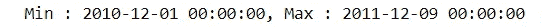

# 谁是你的金鹅？:群组分析

> 原文：<https://towardsdatascience.com/who-is-your-golden-goose-cohort-analysis-50c9de5dbd31?source=collection_archive---------10----------------------->

## Python 中基于 RFM 值和 K 均值聚类的客户细分


客户细分是一种根据购买模式将客户分组的技术，以确定谁是最有利可图的群体。在细分客户时，也可以根据市场使用各种标准，如地理、人口特征或行为基础。这种方法假设具有不同特征的群体需要不同的营销方法，并希望找出最能提高其盈利能力的群体。

今天，我们将讨论如何使用来自 UCI ML repo 的[在线零售数据集](https://www.kaggle.com/jihyeseo/online-retail-data-set-from-uci-ml-repo)进行客户细分分析。这种分析将集中在获得 RFM 值和用 K-means 算法进行聚类这两个步骤上。数据集和完整代码也可以在我的 [Github](https://github.com/jjone36/Cohort/blob/master/Cohort_Anaylsis_Medium.ipynb) 上获得。这篇笔记的原始资料来自课程“Python 中的[客户细分分析](https://www.datacamp.com/courses/customer-segmentation-in-python)”

# 什么是 RFM？

RFM 是近期、频率和货币的缩写。**最近**是关于客户最后一次订购的时间。它表示自客户最后一次购买以来的天数。如果是网站或应用程序的情况，这可能被解释为最后访问日或最后登录时间。

**频率**是关于给定时间段内的购买次数。可能是 3 个月，6 个月或者 1 年。所以我们可以把这个值理解为客户使用公司产品的频率或数量。价值越大，客户参与度越高。我们可以说他们是我们的贵宾吗？没必要。因为我们还必须考虑他们每次购买实际支付了多少钱，这意味着货币价值。

**货币**是客户在给定期间花费的总金额。因此，挥金如土的人将与其他客户区分开来，如 MVP 或 VIP。


Photo from CleverTap

这三个值是队列分析中常用的可量化因素。由于其简单直观的概念，它们在其他客户细分方法中很受欢迎。

# 导入数据

所以我们今天将把 RFM 应用到我们的队列分析中。我们将要使用的数据集是从 2010 年 1 月到 2011 年 9 月的交易历史数据。由于这是队列分析的指导方针，我将只使用原始数据集的随机选择部分。

```
# Import data
online = pd.read_excel('Online Retail.xlsx')# drop the row missing customer ID 
online = online[online.CustomerID.notnull()]
online = online.sample(frac = .3).reset_index(drop = True)online.head()
```


# 计算 RFM 值

我们要计算的第一件事是最近值，即自客户最后一个订单以来的天数。我们可以从哪一列获得该值？ **InvoiceData** 。使用这个列，我们可以得到客户的第一次购买和最后一次购买的时间。我们姑且称第一个为**cohorday**。由于 **InvoiceDate** 还包含额外的时间数据，我们需要提取年、月和日部分。之后，我们将得到**工作日**，它是**工作日**的最小值。

```
# *extract year, month and day*
online['InvoiceDay'] = online.InvoiceDate.apply(**lambda** x: dt.datetime(x.year, x.month, x.day))online.head()
```


由于我们随机选择了数据的子集，我们还需要知道数据的时间段。如下图所示，我们数据集的最后一天是 2011 年 12 月 9 日。因此，将 12 月 10 日设置为我们的 pining 日期，并从每个客户最近一次购买的天数开始倒数。这就是最近值。

```
# print the time period
print('Min : {}, Max : {}'.format(min(online.InvoiceDay), max(online.InvoiceDay)))
```



```
# pin the last date
pin_date = max(online.InvoiceDay) + dt.timedelta(1)
```

在得到最近值之前，让我们先多算一个值，每个顾客花的钱的总数。这是为了计算货币价值。我们怎样才能得到它？轻松点。将每行中的产品价格和订单数量相乘。

```
# Create total spend dataframe
online['TotalSum'] = online.Quantity * online.UnitPrice
online.head()
```


现在我们准备一下子得到三个 RFM 值。我将对每个客户的数据进行分组，并针对每个最近、频率和货币价值进行汇总。

```
# calculate RFM values
rfm = online.groupby('CustomerID').agg({
    'InvoiceDate' : lambda x: (pin_date - x.max()).days,
    'InvoiceNo' : 'count', 
    'TotalSum' : 'sum'})# rename the columns
rfm.rename(columns = {'InvoiceDate' : 'Recency', 
                      'InvoiceNo' : 'Frequency', 
                      'TotalSum' : 'Monetary'}, inplace = True)rfm.head()
```


# RFM 四分位数

现在，我们将根据 RFM 价值观对客户进行分组。因为这些是连续值，我们也可以使用分位数值，并将它们分成 4 组。

```
# create labels and assign them to tree percentile groups 
r_labels = range(4, 0, -1)
r_groups = pd.qcut(rfm.Recency, q = 4, labels = r_labels)f_labels = range(1, 5)
f_groups = pd.qcut(rfm.Frequency, q = 4, labels = f_labels)m_labels = range(1, 5)
m_groups = pd.qcut(rfm.Monetary, q = 4, labels = m_labels)
```

请格外小心`r_labels`。我把标签按降序排列。这是为什么呢？因为最近意味着从客户最后一次订购到现在已经过去了多长时间。因此，价值越小，顾客对该品牌的参与度越高。现在让我们创建一个新的列来表示组标签。

```
# make a new column for group labels
rfm['R'] = r_groups.values
rfm['F'] = f_groups.values
rfm['M'] = m_groups.values# sum up the three columns
rfm['RFM_Segment'] = rfm.apply(lambda x: str(x['R']) + str(x['F']) + str(x['M']), axis = 1)
rfm['RFM_Score'] = rfm[['R', 'F', 'M']].sum(axis = 1)
rfm.head()
```


我在一个单元格中贴上了所有三个标签作为`RFM_Segment`。这样，我们可以很容易地检查一个客户属于哪个级别或细分市场。`RFM_Score`是三个值的总和。不一定是总和，所以平均值也是可能的。此外，我们可以捕捉进一步的模式与平均值或计数值的新近，频率和货币分组的分数如下。

```
# calculate averae values for each RFM
rfm_agg = rfm.groupby('RFM_Score').agg({
    'Recency' : 'mean',
    'Frequency' : 'mean',
    'Monetary' : ['mean', 'count']
})rfm_agg.round(1).head()
```


`RFM_Score`将是客户参与度或忠诚度的总分。将这三个价值加在一起，我们最终可以将客户分为“金牌”、“银牌”、“铜牌”和“绿色”。

```
# assign labels from total score
score_labels = ['Green', 'Bronze', 'Silver', 'Gold']
score_groups = pd.qcut(rfm.RFM_Score, q = 4, labels = score_labels)
rfm['RFM_Level'] = score_groups.valuesrfm.head()
```


太好了！我们完成了一个 RFM 值的队列分析。我们确定了谁是我们的金鹅，以及我们应该额外注意的地方。现在，我们为什么不尝试一种不同的客户细分方法，并比较两种结果呢？

# k 均值聚类

[**K-Means 聚类**](https://en.wikipedia.org/wiki/K-means_clustering) 是一种无监督学习算法，它根据点与点之间的距离进行分组。怎么会？K-Means 聚类中有两个距离概念。**类内平方和** (WSS)和**类间平方和** (BSS)。


WSS 表示每个聚类的点和相应质心之间的距离之和，BSS 表示质心和总样本平均值之间的距离之和乘以每个聚类内的点数。因此，您可以将 WSS 视为紧致性的度量，将 BSS 视为分离性的度量。为了聚类成功，我们需要获得较低的 WSS 和较高的 BSS。

通过迭代和移动聚类质心，K-Means 算法试图得到质心的优化点，使 WSS 值最小，盲源分离值最大。基本概念我就不去更深入了，不过你可以从[视频](https://www.youtube.com/watch?v=_aWzGGNrcic)中找到进一步的解释。


Photo from Wikipedia

因为 K-means 聚类使用距离作为相似性因子，所以我们需要缩放数据。假设我们有两种不同尺度的特征，比如身高和体重。平均身高 150cm 以上，体重 100kg 以下。因此，如果我们绘制这些数据，点与点之间的距离将在很大程度上由高度决定，从而导致有偏差的分析。

因此，当涉及 K-means 聚类时，缩放和归一化数据是预处理的关键步骤。如果我们检查 RFM 值的分布，你会注意到它们是右偏的。不规范使用不是一个好的状态。让我们先将 RFM 值转换成对数标度，然后再进行归一化。

```
# define function for the values below 0
def neg_to_zero(x):
    if x <= 0:
        return 1
    else:
        return x# apply the function to Recency and MonetaryValue column 
rfm['Recency'] = [neg_to_zero(x) for x in rfm.Recency]
rfm['Monetary'] = [neg_to_zero(x) for x in rfm.Monetary]# unskew the data
rfm_log = rfm[['Recency', 'Frequency', 'Monetary']].apply(np.log, axis = 1).round(3)
```

小于或等于零的值在对数标度时变为负无穷大，我创建了一个函数将这些值转换为 1，并将其应用于`Recency`和`Monetary`列，使用如上所述的列表理解。然后，对每个 RFM 值应用对数变换。下一个预处理步骤是缩放，但它比上一步简单。使用 **StandardScaler()** ，我们可以得到如下标准化值。

```
# scale the data
scaler = StandardScaler()
rfm_scaled = scaler.fit_transform(rfm_log)# transform into a dataframe
rfm_scaled = pd.DataFrame(rfm_scaled, index = rfm.index, columns = rfm_log.columns)
```


左边的图是预处理前的 RFM 分布，右边的图是归一化后的 RFM 分布。通过使它们处于某种程度上的正态分布，我们可以向我们的模型提供一些提示，以便轻松而准确地掌握值之间的趋势。现在，我们完成了预处理。

接下来是什么？下一步是选择正确的集群数量。我们必须选择要组成多少个小组。如果有先验知识，我们可以把数字直接给算法。但是在无监督学习的大多数情况下，没有。所以我们需要选择优化的数字，肘法是我们可以得到提示的解决方案之一。

```
# the Elbow method
wcss = {}
for k in range(1, 11):
    kmeans = KMeans(n_clusters= k, init= 'k-means++', max_iter= 300)
    kmeans.fit(rfm_scaled)
    wcss[k] = kmeans.inertia_# plot the WCSS values
sns.pointplot(x = list(wcss.keys()), y = list(wcss.values()))
plt.xlabel('K Numbers')
plt.ylabel('WCSS')
plt.show()
```

使用 for 循环，我为从 1 到 10 的每个集群构建了模型。然后收集每个模型的 WSS 值。看下面的剧情。随着聚类数量的增加，WSS 值降低。这并不奇怪，因为我们做的聚类越多，每个聚类的大小就会减小，所以每个聚类内的距离之和就会减小。那么最佳数字是多少呢？


答案在这条线的“肘”处。在某处，WSS 急剧下降，但 k 值不会太大，我在这里的选择是 3。你说什么？它看起来真的不像线的一个肘吗？

现在，我们选择了集群的数量，我们可以建立一个模型，使实际的集群如下。我们还可以检查每个点和聚类的质心或标签之间的距离。让我们创建一个新列，并将标签分配给每个客户。

```
# clustering
clus = KMeans(n_clusters= 3, init= 'k-means++', max_iter= 300)
clus.fit(rfm_scaled)# Assign the clusters to datamart
rfm['K_Cluster'] = clus.labels_
rfm.head()
```


现在我们做了两种分割，RFM 分位数组和 K-均值组。我们来做个可视化，对比一下两种方法。

# 蛇图和热图

我要做两种图，线图和热图。我们可以很容易地比较这两个图的 RFM 值的差异。首先，我将创建列来分配两个聚类标签。然后通过将 RFM 值融合到一列来重塑数据框。

```
# assign cluster column 
rfm_scaled['K_Cluster'] = clus.labels_
rfm_scaled['RFM_Level'] = rfm.RFM_Level
rfm_scaled.reset_index(inplace = True)# melt the dataframe
rfm_melted = pd.melt(frame= rfm_scaled, id_vars= ['CustomerID', 'RFM_Level', 'K_Cluster'], var_name = 'Metrics', value_name = 'Value')
rfm_melted.head()
```


这将使新近性、频率和货币类别成为观察值，这允许我们在一个图中绘制值。将`Metrics`放在 x 轴上，将`Value`放在 y 轴上，并通过`RFM_Level.`对值进行分组。这次重复通过`K_Cluster`对值进行分组的相同代码。结果如下所示。

```
# a snake plot with RFM
sns.lineplot(x = 'Metrics', y = 'Value', hue = 'RFM_Level', data = rfm_melted)
plt.title('Snake Plot of RFM')
plt.legend(loc = 'upper right')# a snake plot with K-Means
sns.lineplot(x = 'Metrics', y = 'Value', hue = 'K_Cluster', data = rfm_melted)
plt.title('Snake Plot of RFM')
plt.legend(loc = 'upper right')
```


这种情节在市场分析中被称为“蛇情节”。似乎左边图中的**金色**和**绿色**组与右边图中的 **1** 和 **2** 组相似。而**铜牌**和**银牌**组好像合并成了 **0 组**。

让我们用热图再试一次。[热图](https://en.wikipedia.org/wiki/Heat_map)是数据的图形表示，其中较大的值用较暗的刻度表示，较小的值用较亮的刻度表示。我们可以通过颜色非常直观地比较各组之间的差异。

```
# the mean value in total 
total_avg = rfm.iloc[:, 0:3].mean()
total_avg# calculate the proportional gap with total mean
cluster_avg = rfm.groupby('RFM_Level').mean().iloc[:, 0:3]
prop_rfm = cluster_avg/total_avg - 1# heatmap with RFM
sns.heatmap(prop_rfm, cmap= 'Oranges', fmt= '.2f', annot = True)
plt.title('Heatmap of RFM quantile')
plt.plot()
```

然后像之前一样对 K-clusters 重复相同的代码。

```
# calculate the proportional gap with total mean
cluster_avg_K = rfm.groupby('K_Cluster').mean().iloc[:, 0:3]
prop_rfm_K = cluster_avg_K/total_avg - 1# heatmap with K-means
sns.heatmap(prop_rfm_K, cmap= 'Blues', fmt= '.2f', annot = True)
plt.title('Heatmap of K-Means')
plt.plot()
```


这可能是不匹配的，尤其是在地块的顶部。但只是因为顺序不同而已。左边的**绿色**组将对应 **2** 组。如果你看到每个方框内的数值，你会发现**黄金**组和 **1** 组之间的差异变得非常显著。通过颜色的深浅很容易辨认出来。

# 结论

我们讨论了如何从客户购买数据中获取 RFM 值，并用 RFM 分位数和 K-Means 聚类方法进行了两种细分。有了这个结果，我们现在可以知道谁是我们的“黄金”客户，最赚钱的群体。这也告诉我们应该关注哪个客户，向谁提供特别优惠或促销，以培养客户忠诚度。我们可以为每个细分市场选择最佳的沟通渠道，并改进新的营销策略。

# 资源

*   一篇关于 https://clevertap.com/blog/rfm-analysis/的精彩文章

*   另一个对 RFM 分析有用的解释:[https://www.optimove.com/learning-center/rfm-segmentation](https://www.optimove.com/learning-center/rfm-segmentation)
*   对 K-means 聚类的直观解释:[https://www.youtube.com/watch?v=_aWzGGNrcic](https://www.youtube.com/watch?v=_aWzGGNrcic)

感谢您的阅读，希望您对这篇文章感兴趣。如果有需要改正的地方，请分享你的见解！如果您想鼓励一位有抱负的数据科学家，请点击👏 👏 👏！我总是乐于交谈，所以请随时留下评论或在 LinkedIn 上联系我。我会带着另一个令人兴奋的项目回来。在那之前，机器学习快乐！