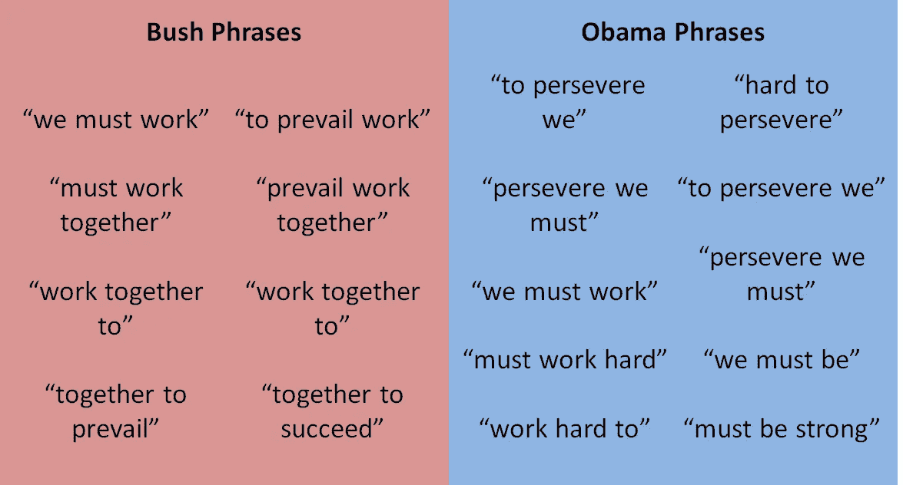
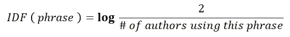
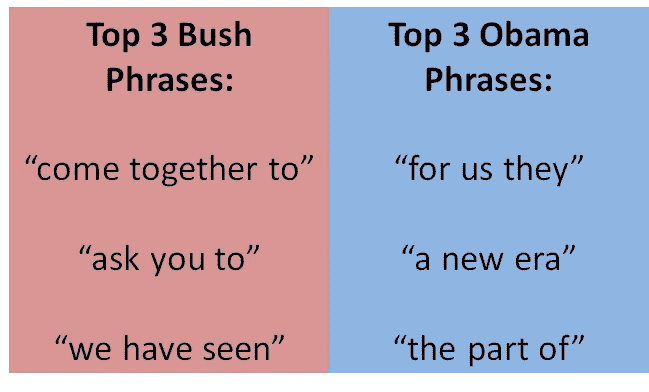

# 谁说的:布什还是奥巴马？

> 原文：<https://towardsdatascience.com/who-said-it-bush-or-obama-9f2e98408b65?source=collection_archive---------20----------------------->

Photo by [Patrick Tomasso](https://unsplash.com/@impatrickt?utm_source=unsplash&utm_medium=referral&utm_content=creditCopyText) on [Unsplash](https://unsplash.com/search/photos/book?utm_source=unsplash&utm_medium=referral&utm_content=creditCopyText)

想象一下，你是一位炙手可热的大学教授，刚刚收集了这学期的期末论文。当你在电脑上浏览全部 300 篇文章时，你意识到**有几个学生忘记在文章上写上他们的名字**。嗯……那不理想。*你有没有试图追踪神秘学生？你会让所有犯了忘记名字这一令人遗憾的错误的学生不及格吗？*

***事实证明，数据科学可以提供帮助！***

## 作者归属

原来，姓名缺失问题只是一个更广泛的领域中的一个例子，这个领域被称为**作者归属，**根据某一特定作品的作者和其他作者过去的例子来预测该作品的作者的过程。

在高层次上，作者归属由以下直观步骤组成:

1.  通读不同作者的作品，识别每个作者使用的 ***【最重要】*** 单词、短语或其他演讲单位
2.  对于一个有神秘作者的给定文档，**比较**最常见的单词、短语等。在具有每个作者的相应列表的文档中
3.  神秘文件列表与任何给定的作者列表越匹配，我们就越有信心**这个作者写了神秘文件**

在这篇文章的剩余部分，我们将讨论**总统演讲**。具体来说，我们将分析乔治·w·布什总统的一篇演讲和巴拉克·奥巴马总统的一篇演讲，找出每位总统最重要的短语。

然后我们会读到一篇神秘的演讲，并试图找出它最有可能属于哪一位总统。

Photo by [History in HD](https://unsplash.com/@historyhd?utm_source=unsplash&utm_medium=referral&utm_content=creditCopyText) on [Unsplash](https://unsplash.com/search/photos/president-obama?utm_source=unsplash&utm_medium=referral&utm_content=creditCopyText)

## 它是如何工作的？

假设我们有布什总统和奥巴马总统的(非常简单的)演讲，看起来像这样:

**布什演讲**:“我们必须共同努力才能胜利，共同努力才能成功。”

**奥巴马演讲**:“要持之以恒，我们必须努力。要持之以恒，就要坚强。”

我们的目标是为每篇演讲找出“*最重要的短语”*。嗯……什么是短语？在演讲的上下文中，一个短语重要是什么意思？嗯，为了简单起见，我们将认为一个**短语**是演讲中任何**连续的 3 个单词**。所以对于上面的小“演讲”，短语应该是(现在忽略大写和标点):

Phrases in each toy speech

这里有几点需要注意。首先，请注意奥巴马说了两次“为了坚持，我们”,而布什从来没有说过。这表明**“为了坚持，我们”**是奥巴马的一个重要识别短语。同样，布什说了**【共同努力】**两次，而奥巴马从来没有说过，这表明了布什的身份。

还要注意，两位总统都说**“我们必须努力”**，这表明*可能不是*一个用于识别目的的有用短语。

所以我们对一个短语的重要性有了一个模糊的概念。它应该满足两个标准:

对一位总统来说很重要但对另一位总统来说不重要的短语需要…

1.  在总统演讲中经常出现
2.  出现 ***的只有*** 那位总统的演讲

这有直观的意义；如果我们知道某个短语只有奥巴马说**而奥巴马经常说**，然后我们在一个神秘的演讲中看到同样的短语，我们可以相当肯定这个演讲是奥巴马说的。****

## ****快速数学解释器(如果你感兴趣的话)****

****我们如何用数学方法量化它？****

****我们将使用名为 **TF-IDF** 的久经考验的方法来确定作者身份。TF-IDF 代表词频——逆文档频率(比听起来可怕多了)。以下是部分内容:****

****给定一个短语和一个作者，这个短语在所有可能的短语中出现的频率是多少？例如，在上面简单的布什演讲中，总共有 **8 个短语**和**其中两个是“共同努力”**，因此“共同努力”短语的 **TF** 是 2/8 = **0.25******

******逆文档频率(IDF):** 给定某个短语， **IDF** 定义如下:****

********

****给定上面玩具演讲中的短语**“我们必须工作”**，我们看到两位总统都使用它，因此 **IDF** 将是 log(2/2) = 0。现在，给定短语**“work together to”**，布什只使用了*，我们看到 IDF 将是 log(2/1) = 0.3(以 10 为基数的对数)。*****

*****要获得特定短语和作者的 TF-IDF，您只需将 TF 和 IDF 值乘上**。*******

*****好吧…但是 ***为什么*** 有用呢？*****

*****假设我们为两位总统的短语**“共同努力”**计算 TF-IDF:*****

*******对于布什:** TF = 0.25 & IDF = 0.3 所以 TF-IDF = 0.25*0.3 = **0.075*******

*******奥巴马:** TF = 0 & IDF = 0.3 所以 TF-IDF = 0*0.3 = **0*******

*****因此，我们得到了布什更高的 TF-IDF，这正是我们想要的，因为这个短语自然是布什更好的标识符。*****

*****作为另一个合理性检查，让我们计算两位总统都使用的短语**“我们必须工作”**的 TF-IDF。*****

*******对于布什:** TF = 0.125，IDF = 0，所以 TF-IDF = **0*******

*******对于奥巴马:** TF = 0.1，IDF = 0，所以 TF-IDF = **0*******

*****正如我们所希望的，这个短语对两位总统都没有真正的识别价值，因为它被两位总统使用。*****

*****从本质上说，这是可行的，因为 TF-IDF **奖励那些只有一位总统经常使用的短语**而**惩罚那些不常使用或两位总统都使用的短语**。*****

## *****代码—识别最重要的短语*****

*****好了，理论谈够了！让我们深入研究代码。*****

*****我们首先读入并清理布什和奥巴马的一篇演讲稿，这两篇演讲稿存储为 txt 文件。*****

*****然后，我们将通读两篇演讲，并得到 TF 值的字典。也就是说，我们将构造字典，其中的关键字是短语，值是该短语在任一语音中的频率。*****

*****现在，我们将获得每个短语的 IDF 值，并为每个总统构建 TF-IDF 字典。*****

*****此时，我们可以根据最高的 TF-IDF 值打印出布什和奥巴马最重要的短语。*****

**********

*****Top 3 Bush and Obama phrases by TF-IDF scores*****

## *****密码——谁写的秘密演讲稿？*****

*****不错！因此，我们为每位总统列出了最重要的短语。让我们读入一份全新的秘密演讲稿，看看我们的系统能否找出是谁写的。剧透警报……*是奥巴马*。*****

*****现在，我们将循环播放秘密演讲中的每个独特短语。对于每个短语，我们将**将其 TF 值(*在秘密演讲中出现的频率*)乘以该短语对于奥巴马的 TF-IDF 值(*该短语对于奥巴马的标识符有多重要*)。我们为 Bush 做了同样的事情，并为每个独特的短语保存了这些产品的运行总数。得分较高的总统将是我们预测的演讲者！*******

*****请击鼓吧！ …。*****

*****将分数换算成百分比后，**老布什**最终得分为 **37%** ，**奥巴马**最终得分为 **63%** ，使得**奥巴马**成为我们预测的演讲者和正确答案！*****

*****只是为了好玩，如果我们使用布什的新秘密演讲，我们会得到布什 62%的分数，T2 38%的分数，所以我们的系统是双向的！*****

*****希望这能帮助你理解一些关于作者归属的问题。这里有几个自然的扩展，例如:*****

*   *****使用多个作者，而不是只有两个*****
*   *****考虑到大写、标点和写作的其他部分*****
*   *****添加更多的自然语言上下文，而不是简单的连续单词集*****

*****我真的很兴奋看到你能想到什么扩展！*****

********祝好运，感谢阅读！~********