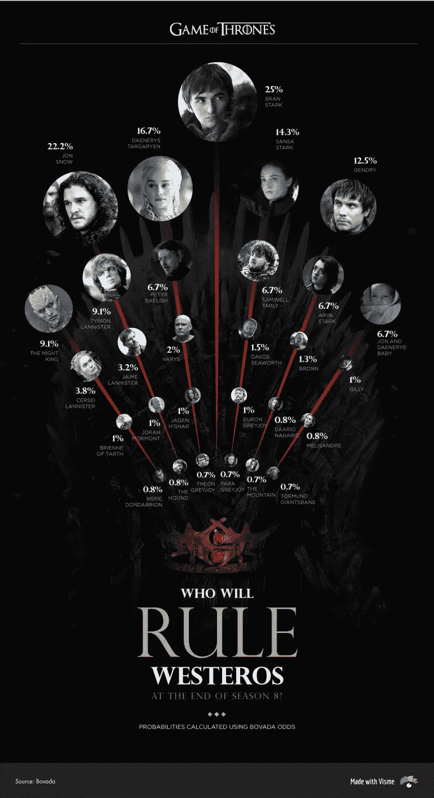
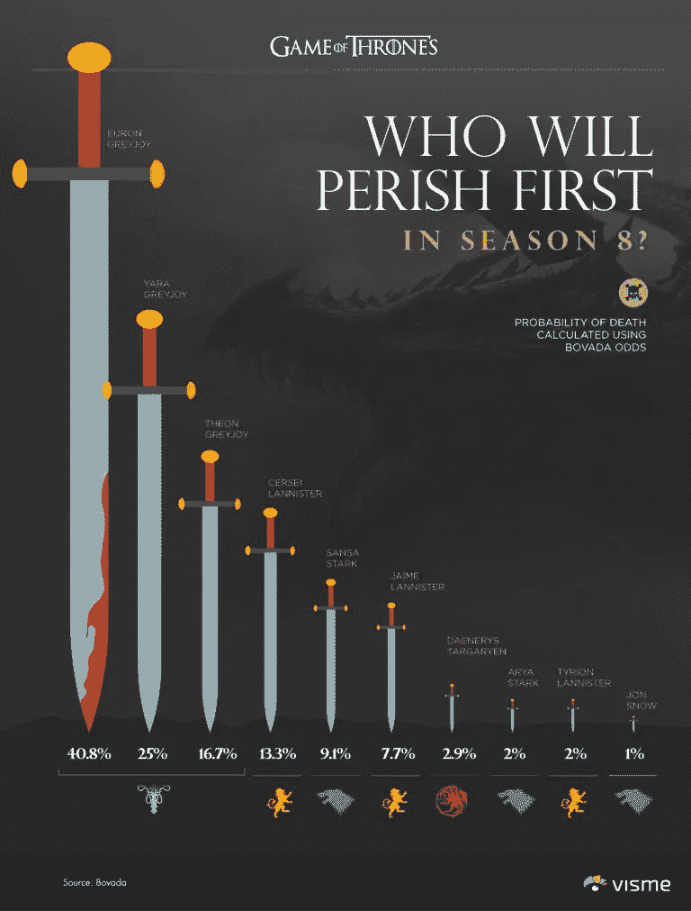
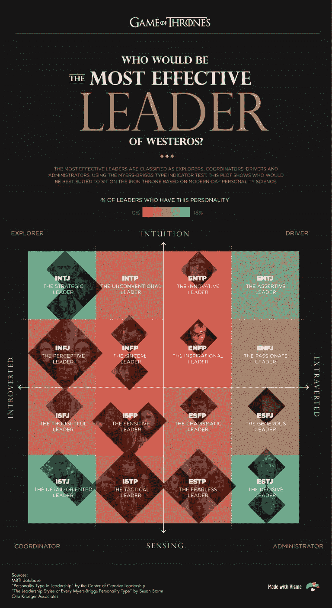

# 谁会赢得权力的游戏？

> 原文：<https://towardsdatascience.com/who-will-win-the-game-of-thrones-fbde8434c94b?source=collection_archive---------22----------------------->

《权力的游戏》的最后一季终于来了，每个人心中的问题是:

***最后谁会坐上铁王座？***

我们在 Visme 的团队，一个数据可视化工具，有一点有趣的是可视化每个主要角色最终出现在铁王座上的概率，使用赌博网站 Bovada 上发布的[最新赔率计算。](https://www.bovada.lv/sports/entertainment/game-of-thrones-specials/who-will-rule-westeros-at-the-end-of-season-8-201904010000)

赔率显示布兰·史塔克最有可能登上王位，紧随其后的是琼恩·雪诺、丹妮莉丝和珊莎。

就连乔恩和丹妮莉丝假想的孩子也出现在了结果中，与艾莉亚·史塔克、山姆威尔·塔利和培提尔的“小指头”贝里席(有人认为他在上一季用一个无面人伪造了自己的死亡)一样，排在第九位。

每个人心中的另一个燃眉之急是:第八季谁会先死？

使用同样的计算将赔率转换成隐含概率，我们发现[博彩公司认为](https://www.bovada.lv/sports/entertainment/game-of-thrones-specials/who-will-perish-first-in-season-8-201904010001)攸伦·葛雷乔伊最有可能首先灭亡，其次是亚拉、席恩·葛雷乔伊和瑟曦·兰尼斯特。

作为书呆子，我们也开始思考:根据现代人格科学，谁最适合领导维斯特洛？

基于广泛使用的 Myers-Briggs 性格类型指标，以及来自 MBTI 数据库的信息，这是一个由用户驱动的社区，拥有数千个真实和虚构人物的性格特征，我们将每个主要人物标在四个象限中的一个上，以可视化他们的领导潜力:

用一个水平标尺来区分内向者和外向者，用一个垂直标尺来区分"[感觉型](https://www.myersbriggs.org/my-mbti-personality-type/mbti-basics/sensing-or-intuition.htm?bhcp=1)和"[直觉型](https://www.myersbriggs.org/my-mbti-personality-type/mbti-basics/sensing-or-intuition.htm?bhcp=1)"类型，我们绘制了 16 种不同的人格类型。

基于[创造性领导中心](https://www.ccl.org/)对 26，477 名领导者进行的研究[结果，我们还可视化了拥有每种性格类型的领导者的百分比。](https://www.researchgate.net/figure/Percentages-of-MBTI-Types-for-CCL-LDP_tbl3_293651155)

通过破译彩色编码矩阵图，你可以清楚地看到，最高百分比的领导人要么是 INTJ，ENTJ，ISTJ 或 ESTJ(图的四个角落)。这意味着，尽管内向型和外向型领导者以及直觉型和感性型领导者的比例相对相等，但大多数被研究的领导者更喜欢将[逻辑而非情感](https://www.myersbriggs.org/my-mbti-personality-type/mbti-basics/thinking-or-feeling.htm)作为决策的方式，以及[有计划的生活方式而非自发的生活方式](https://www.myersbriggs.org/my-mbti-personality-type/mbti-basics/judging-or-perceiving.htm)。

这对维斯特洛的未来意味着什么？显然，最好的领导者并不总是好人。在这种情况下，最有领导潜力的人也是最不被看好登上铁王座的人。

在四个角落，你会发现:夜王，培提尔“小指头”贝里席，山，瑟曦·兰尼斯特，贾昆·哈加尔，塔斯的布蕾妮和亚拉·葛雷乔伊。

# 方法学

对于那些对我们如何创建这些图表感兴趣的人来说，下面是对这个过程的详细解释:

我们使用顶级博彩网站 Bovada 发布的[最新赔率](https://www.bovada.lv/sports/entertainment/game-of-thrones-specials/who-will-rule-westeros-at-the-end-of-season-8-201904010000)，该网站使用美国的赔率陈述方法，并使用赔率转换器将其转换为隐含概率，以评估结果的可能性。

对于第三个图表，我们在这个 [MBTI 数据库](https://www.mbtidatabase.com/)中搜索了《权力的游戏》中每个角色的性格类型，这些性格类型是根据数百名成员的投票决定的。(你可以在下面看到完整的列表。)

接下来，我们将 16 种 Myers-Briggs 人格类型中的每一种绘制在一张 4x4 矩阵图上，并根据[MBTI 认证从业者 Susan Storm 的分类](https://www.psychologyjunkie.com/2017/06/28/leadership-skills-every-myers-briggs-personality-type/)为每一种命名。

最后，我们使用 Visme 通过给一系列颜色分配百分比值，创建了一个颜色编码标度[。这些值对应于每种性格类型的领导者的百分比，由创造性领导中心的研究“领导的性格类型”确定。](https://www.visme.co/map-generator/)

# 每个字符的迈尔斯-布里格斯型指示器

1.  布兰·史塔克——INFP
2.  琼恩·雪诺——INFJ ISFP
3.  丹妮莉丝·坦格利安— INFJ
4.  珊莎·史塔克— ESFJ
5.  詹德利— ISTP
6.  夜王——INTJ
7.  提利昂·兰尼斯特— ENTP
8.  艾莉亚·史塔克— ISTP
9.  培提尔·贝里席— INTJ
10.  山姆威尔·塔利— INFP
11.  瑟曦·兰尼斯特— ESTJ
12.  詹姆·兰尼斯特— ESTP
13.  瓦里斯— INFJ
14.  戴佛斯·席渥斯— ISFP
15.  波隆— ISTP
16.  ISTJ 塔斯的布蕾妮
17.  攸伦·葛雷乔伊— ESTP
18.  吉利 Gilly
19.  贾昆·赫加尔——INTJ
20.  乔拉·莫尔蒙——ISFJ
21.  贝里·唐德利恩— ENFP
22.  达里奥·纳哈里斯— ESTP
23.  梅丽珊卓— INFJ
24.  猎犬——ISTP
25.  这座山——ISTJ
26.  席恩·葛雷乔伊— ESFP
27.  托尔蒙德·巨人银行
28.  亚拉·葛雷乔伊——ESTJ

# 轮到你了

你觉得最后谁会坐上铁王座？你同意我们的评估吗？在下面给我们你最好的有证据支持的预测。

*本帖* [*原版*](https://visme.co/blog/game-of-thrones-characters/) *最早出现在 Visme 的* [*视觉学习中心*](http://blog.visme.co/) *。*