# 今天谁要辞职？

> 原文：<https://towardsdatascience.com/whos-quitting-today-e1b0ca2fa90f?source=collection_archive---------8----------------------->

## 熊猫、海牛和机器学习眼中的飞行风险故事


HR Analytics for Flight Risk — Credits by information-age.com

# 介绍

> “我在寻找更好的机会”
> 
> "我认为我付出的工作和时间还不够多。"
> 
> "这份工作对我来说吸引力不够。"

你以前有没有听同事说过这样的话，甚至自己也想过一个。如果你有，你并不孤单。

根据 Balance Articles 的文章，员工在一生的职业生涯中平均会跳槽 12 次。令人震惊！想象一下，跨国公司为了留住员工或…你而浪费的数十亿美元发生了什么？(这里放一个阴险的声音，杜杜·杜姆)

[](https://www.thebalancecareers.com/how-often-do-people-change-jobs-2060467) [## 人们多久换一次工作？

### 人们不再为一家公司工作一辈子，50 年后退休，拿着养老金和金表…

www.thebalancecareers.com](https://www.thebalancecareers.com/how-often-do-people-change-jobs-2060467) 

因此，有效管理员工流失是非常重要的。新员工将花费大量的时间和金钱来培训和雇佣他们，否则这些时间和金钱将被重新分配到另一项投资中。事实上，这一直是 IBM 人力资源专业人士的一个大问题，IBM 正在向沃森投资数十亿美元，以预测飞行风险和赢得员工流失。这无疑意味着了解员工离职的原因是吸引和留住人才的良好开端。

[](https://www.cnbc.com/2019/04/03/ibm-ai-can-predict-with-95-percent-accuracy-which-employees-will-quit.html) [## IBM 人工智能可以以 95%的准确率预测哪些员工将要辞职

### IBM 人工智能技术能够以 95%的准确率预测员工何时离开他们的…

www.cnbc.com](https://www.cnbc.com/2019/04/03/ibm-ai-can-predict-with-95-percent-accuracy-which-employees-will-quit.html) 

总之，**得出数据驱动的决策**对于了解员工休假以降低离职率、节省雇佣/培训成本和最大化工作效率非常重要。所有这些都转化为未来几年的巨大利润。

通过这篇文章，让我们讨论如何**找出**员工离职的原因，以及如何**预测**谁将离开公司。然后，我们将**建议**公司如何留住他们。

## 但首先，让我们头脑风暴一下员工辞职的原因:

*   工作生活平衡
*   糟糕的经理/同事
*   社会压力(丑闻)
*   另一个更好的提议(薪水，生活条件)
*   家庭(产假/陪产假)
*   还有更多

这种头脑风暴的原因是为了确保当我们的分析陷入死胡同时，我们有更多的话题去发现。

我遇到过一些数据分析师/科学家，他们很难将注意力放回到他们当前工作的不同解决方案上。在心理学中，这被称为认知隧道。

知道如何解决这个问题将会大大节省您进行分析的时间。

 [## 认知隧道:它是什么以及我打算如何防止它

### 你可能从未听说过认知隧道。然而，很有可能，你有时是它的受害者…

www.parhamdoustdar.com](https://www.parhamdoustdar.com/soft-skills/2016/04/24/cognitive-tunneling/) 

为了解决认知隧道问题，一个好的做法是头脑风暴来分散思想。然后在一个好的头脑风暴会议之后，计划你的编码方式。在我看来，一个好的数据科学家或开发人员应该总是参与头脑风暴，以发现问题和头脑中的分析的新观点。因此，暂停你编码和思考的强烈欲望。

好吧，你做到了吗？很好。我们继续吧:)。

# 了解数据集

## 导入 Kaggle 数据集

数据集来自 Kaggle，由一个名为 ludobenistant 的用户提供，该用户因未知原因被关闭。幸运的是，你可以在我下面的 repo 中下载 csv 文件。

[](https://github.com/VincentTatan/PythonAnalytics/blob/master/Youtube/dataset/HR_comma_sep.csv) [## 文森特/PythonAnalytics

### 这是一个存放我的 Kaggle 和 iPython 笔记本- VincentTatan/PythonAnalytics 的仓库

github.com](https://github.com/VincentTatan/PythonAnalytics/blob/master/Youtube/dataset/HR_comma_sep.csv) 

元数据包括以下特征:员工满意度、上次评估、项目数量、平均月小时数、在公司花费的时间、他们是否发生过工伤事故、他们在过去 5 年中是否有过晋升、部门、工资、员工是否已离职。

所有这些都很简单；不需要更多的解释，尤其是如果你已经熟悉了公司生活的黑暗面😈。

不好笑？无论如何，让我们从导入 csv 文件到 Pandas Dataframe 开始我们的旅程。

```
**import** **numpy** **as** **np** *# linear algebra* **import** **pandas** **as** **pd** *# data processing, CSV file I/O (e.g. pd.read_csv)* 
df = pd.read_csv(‘dataset/HR_comma_sep.csv’)
```

## 查看数据

让我们用一个简单的代码来看看下面的数据中的快速和肮脏的健全性测试。

```
*df.tail()*
```

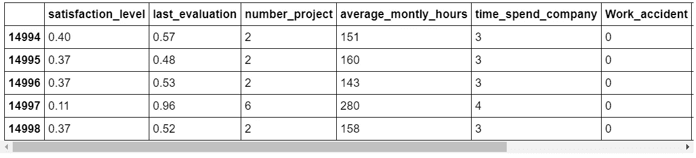

这似乎没问题。数据帧中总共有 14998 条记录。

首先，为了理解数据集的快速外观，让我们描述一下数据集。为了更好地查看，我们将对其进行转置，将特征排列成行。

```
df.describe().T
```


这将描述所有数字特征及其聚合值(计数、平均值等)。从这里我们可以看到一切看起来都很好:完整的计数值，没有空值，以及逻辑分布值。

一个有趣的数值是每月最大平均工作时间:310 小时。哇！这意味着有人每个工作日工作 15 个小时。这个人可能是投资银行家——哦，如果你是投资银行家，无意冒犯。如果你是其中之一，请在下面随意评论😁。

然后，我们可以通过包含参数的数据类型“object”来描述非数值。include=['object']

```
df.describe(include=['object'])
```

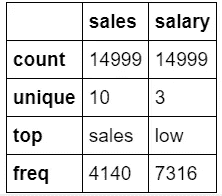

这里的销售是指员工所在的部门，工资标明“顶”、“中”、“低”。

似乎 Kaggle 已经用干净的准备好分析的数据宠坏了我们。然而，在现实中，您应该期望进行全面的数据清理，包括空值、异常值等。

# 数据探索

# 导入 Matplotlib 和 Seaborn 来讲述故事

对于那些不了解 Seaborn 的人来说，我很惭愧没有早点告诉你们。在我看来，这是每个数据分析师和科学家都需要熟悉的最大财富之一！(不开玩笑！).

Seaborn 将允许您在几秒钟内创建令人惊叹的图形和可视化。因此，作为有效的数据科学家/分析师，这是一个非常重要的工具来提高你的故事讲述技巧。

> Seaborn 是一个基于 [matplotlib](https://matplotlib.org/) 的 Python 数据可视化库。它提供了一个高层次的界面来绘制有吸引力的和信息丰富的统计图形。— Seaborn Pydata 组织

[](https://seaborn.pydata.org/examples/index.html) [## 示例库- seaborn 0.9.0 文档

### 编辑描述

seaborn.pydata.org](https://seaborn.pydata.org/examples/index.html) 

```
*# Import seaborn and matplotlib with matplotlib inline*
**import** **seaborn** **as** **sns**
**import** **matplotlib.pyplot** **as** **plt**
%matplotlib inline
```

导入 seaborn 和 matplotlib 后，让我们得到离开或留下的人数。我们将在一个简单的 matplotlib 饼图中将其可视化

```
*# Getting the count of people that leave and not*
leftcounts=df['left'].value_counts()
**print**(leftcounts)

*# Using matplotlib pie chart and label the pie chart*
plt.pie(leftcounts,labels=['not leave','leave']); 
```

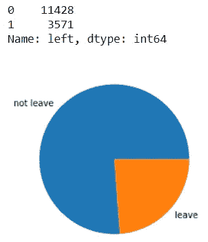

Simple piechart for leave and not leave

这就是 Seaborn 可视化真正发挥作用的地方。让我们为每个离职和留任员工生成多个 Seaborn 分布，然后将其与 Matplotlib 图结合。这段代码会有点长，因为我们要插入 10 个支线剧情(5 行 2 列)。但是可视化对于发现那些离开和留下的人的趋势和差异是非常有价值的。这就是故事的来源！

```
# Create a figure instance, and the two subplots
fig = plt.figure(figsize=(20,17))
ax1 = fig.add_subplot(521)
ax2 = fig.add_subplot(522)
ax3 = fig.add_subplot(523)
ax4 = fig.add_subplot(524)
ax5 = fig.add_subplot(525)
ax6 = fig.add_subplot(526)
ax7 = fig.add_subplot(527)
ax8 = fig.add_subplot(528)
ax9 = fig.add_subplot(529)
ax10 = fig.add_subplot(5,2,10)# Tell pointplot to plot on ax1 with the ax argument (satisfaction level)
sns.distplot(leftdf[‘satisfaction_level’],ax = ax1);
sns.distplot(notleftdf[‘satisfaction_level’],ax = ax2);
sns.distplot(leftdf[‘last_evaluation’], kde=True,ax=ax3);
sns.distplot(notleftdf[‘last_evaluation’], kde=True,ax=ax4);
sns.distplot(leftdf[‘number_project’], kde=True,ax=ax5);
sns.distplot(notleftdf[‘number_project’], kde=True,ax=ax6);
sns.distplot(leftdf[‘average_montly_hours’], kde=True,ax=ax7);
sns.distplot(notleftdf[‘average_montly_hours’], kde=True,ax=ax8);
sns.distplot(leftdf[‘time_spend_company’], kde=True,ax=ax9);
sns.distplot(notleftdf[‘time_spend_company’], kde=True,ax=ax10);
```

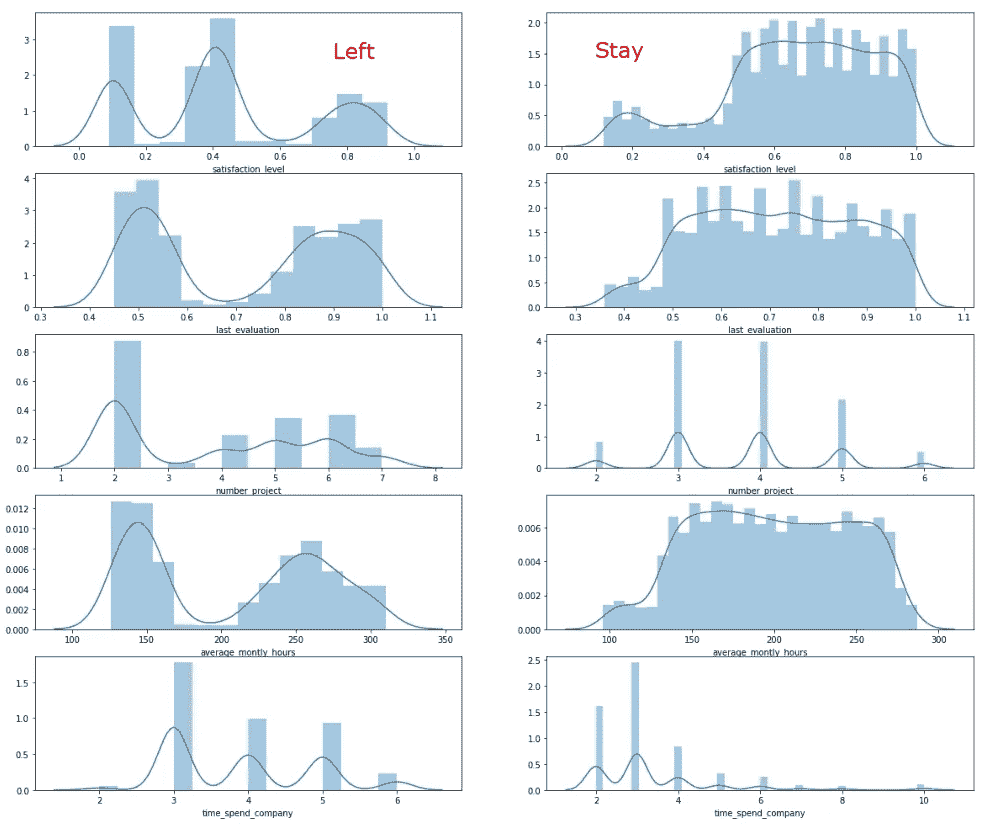

Distributions of those who stayed vs left

整洁！记住这种视觉化，它会让你受益终生:)。现在，我们能从中学到什么？

## 洞察力:离开的人的简介

*   **满意度**:这里没有太多的模式，除了我们可以看到离开的员工不仅仅是那些不满意的人，还有那些对他们的工作非常满意的人。
*   **last_evaluation** :高和低，可能表示超出业绩者和低于业绩者离开公司。如果这是真的，那就意味着员工离职有两个原因:他们觉得自己不能很好地发挥才能或激发积极性，或者他们有动力去申请更好的职业机会。
*   **编号 _ 项目:**最多有 2 个项目。也许与拥有 3-4 个项目的留守员工的分布不同。我们可能希望将此与平均每月小时数进行进一步比较，并观察是否存在辛普森悖论，即当我们考虑其他混杂变量时，洞察力会发生变化。我们还需要进一步比较项目的规模和性质。
*   平均月工作时间:它的平均工作时间要么长，要么短。这是独一无二的，因为也许员工对公司的参与度过高或过低。
*   **time_spend_company:** 他们中的一些人花的时间比留下来的员工少，我们可能会认为他们不太忙于工作。结合平均每月小时数，这是一个可能的假设。

很酷的故事，让我们进一步搞清楚这些变量是如何相互关联的。

# 相关分析

让我们创建相关性分析来找出特性之间的相关性。这可以通过。corr()方法导出左侧 employees 数据框中所有数值的相关性。然后，让我们应用 Seaborn 热图来显示离职员工之间的属性相关性。

```
corr = leftdf.drop(‘left’,axis=1).corr()sns.heatmap(corr)
```

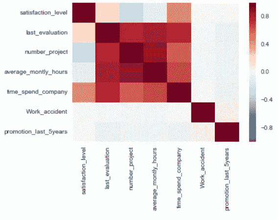

Finding the correlations among attributes

Seaborn 拯救了世界！非常简单的可视化，全部在一行 sns.heatmap()中。

## 洞察力:相关元素

快速浏览一下，我们可以发现一些可能的相关元素，例如:

1.  数字 _ 项目和平均 _ 月 _ 小时:这是有意义的，因为你有越多的项目，你应该花更多的时间在它上面。这可能是不满意的原因。
2.  最后评估和平均每月小时数:这是一个很好的有希望的发现，这表明每月小时数越长，你就越有可能得到一个好的最后评估。在亚洲这样的文化中，这可能是真的，亚洲有时仍然有微观管理。我们需要进一步了解数据的背景信息，以从中提取一些假设。

当我们做预测模型并继续前进时，让我们记住这一点。目前，基于我们对元数据和相关性强度(> 0.7)的理解，似乎还没有相关的特性

# 部门分析

## 哪些部门的员工离职最频繁？

我们将使用 Seaborn Factorplot 根据部门和工资水平可视化左侧数据框。由于图像没有显示足够清晰的文本大小，我已经标记了关键特征来查看。

```
*# For this we assume that high earners are paid highly = 3, the otherwise is paid low to decent* sns.factorplot(x=”sales”,data=leftdf,col=”salary”,kind=’count’,aspect=.8,size=14
```

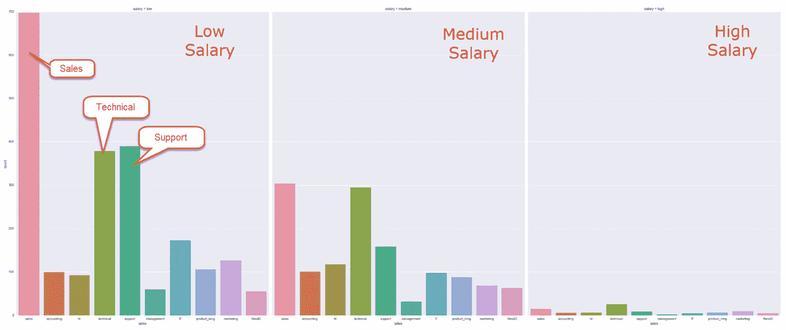

Factorplot among different department and salary levels

## 洞察力

1.  似乎销售人员大部分时间都是以中低收入离开公司的。
2.  同样，其次是对中低工资的技术和支持。

我们现在可以问自己“为什么？”

## **为什么这些部门的员工会离开？**

让我们想象一下箱线图，以得到清楚的答案。使用 Seaborn，我们可以将可视化堆叠在 matplotlib 图形中。这将使我们能够协调我们之前讨论过的四个特性。

为了你的理解，我把视觉化产生的故事编了号。请随意查找下面的故事。如果你发现这太牵强，那就是！这样做的目的是让你的想象力自由流动，自由地提出你的假设。有些甚至可能是真的，你们将成为在废墟中发现宝藏的英雄。

在这些故事中，我借此机会讲述了我自己的一些个人经历或社会群体。如果你能感同身受，请随意鼓掌或评论:)。

```
*# Create a figure instance, and the two subplots*
fig = plt.figure(figsize=(20,10))
ax1 = fig.add_subplot(411)
ax2 = fig.add_subplot(412)
ax3 = fig.add_subplot(413)
ax4 = fig.add_subplot(414)

sns.boxplot(x="sales",y="satisfaction_level",data=leftdf,ax=ax1)
sns.boxplot(x="sales",y="time_spend_company",data=leftdf,ax=ax2)
sns.boxplot(x="sales",y="number_project",data=leftdf,ax=ax3)
sns.boxplot(x="sales",y="average_montly_hours",data=leftdf,ax=ax4)
```

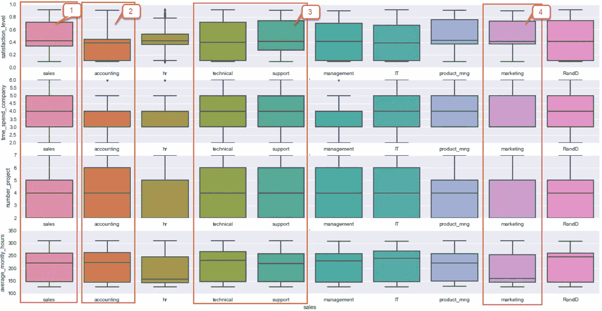

Boxplot for different features and various departments

## **见解:**

1.  与其他离职部门的比较。与其他部门相比，销售部没有留下他们离职的重要原因。事实上，我们在这里可以看到，他们的调查满意度实际上高于会计和其他部门。这意味着销售人员离开的唯一原因可能是因为低工资。另一个原因是他们可能因为害怕被销售经理发现而篡改了调查答案。这可能是一种敲诈材料，以防他们没有达到销售目标。
2.  会计是满意度最低的行业之一，大多数四分位数都低于 0.5。但同时，会计也是离职率较低的部门之一。这可能是由于会计行业工作保障的神话。我的一些朋友坚持从事卑微而艰苦的会计和审计工作，因为他们努力奋斗，以求在公司高层获得更稳定的工作。谁知道呢，不过那是个好玩的故事分享给我的会计朋友们(哈哈！).
3.  另一方面,“技术和支持”给出了所有检查功能的广泛范围。与销售不同，我们仍然可以看到大量员工对他们的工作不够满意。因此，我们需要进一步分离，以了解他们中的一些人离开的原因。很可能，小公司和大公司会区别对待这些员工。还记得英国电信， *IT 人群秀*吗？爱死了！
4.  市场营销和产品管理的满意度很高，尽管低薪辞职率很高。这可能是因为这个行业发展非常快，一些从业者在跨国公司获得了更好的机会。


The British IT Crowd Show which shows Moss and Roy as the Technical and Support Employees, Jen as Entertainment Marketing Manager, and Douglas as the fun CEO — credit to comedy.co.uk

# 模型生成

咻，我们今天学了这么多故事。现在，让我们享受一下生成模型的乐趣。万岁！！

## 创建交叉验证训练测试分解

让我们从创建训练和测试数据集开始。

想法是使用训练数据集来训练模型，并使用测试数据集来测试模型。这是为了避免过度拟合模型以达到高精度但高方差误差。您可以使用的另一个集合是用于调整模型的验证集合。

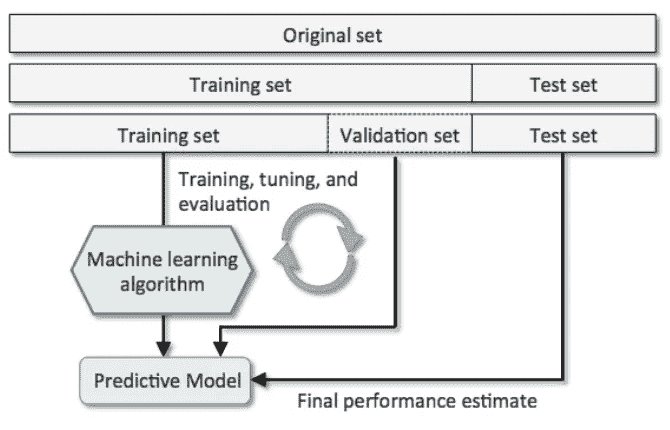

The architecture of train, test, and validation data set

请参考这一惊人的列车测试验证分裂解释媒体。

[](https://medium.com/datadriveninvestor/data-science-essentials-why-train-validation-test-data-b7f7d472dc1f) [## 数据科学精要:为什么要训练-验证-测试数据？

### 想知道为什么我们把数据分成训练-验证-测试吗？

medium.com](https://medium.com/datadriveninvestor/data-science-essentials-why-train-validation-test-data-b7f7d472dc1f) 

```
**import** **numpy** **as** **np**
**from** **sklearn** **import** cross_validation,neighbors,svm*#dropping left and sales X for the df, y for the left*
X = df.drop(['left','sales'],axis=1)
y = df['left']*#splitting the train and test sets*
X_train, X_test, y_train,y_test= cross_validation.train_test_split(X,y,test_size=0.2)
```

完成分割后，我们将继续训练和验证模型。

## 训练支持向量机(SVM)

支持向量机(SVM)是一种用于分类和回归的监督机器学习算法。该模型将处理 n 维空间中的每个数据点，其中 n 表示您拥有的特征数量。每个值都是 n 维平面中特定坐标的值。然后，分类将找到这个最佳超平面，它给出了到训练样本的最大最小距离。它分隔了班级，就像你如何在你的办公桌和你讨厌的同事的办公桌之间放置一个隔板一样。这是我自己的例子，请自行斟酌使用！

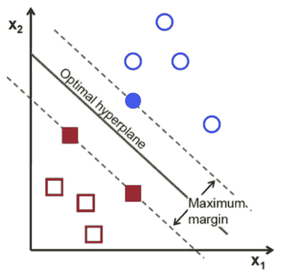

Optimal Hyperplane which allows maximum margins of two classes

这是一个惊人的参考，让你进一步了解 SVM。

[](https://medium.com/coinmonks/support-vector-machines-svm-b2b433419d73) [## 支持向量机(SVM)

### 支持向量机(SVM)是一种有监督的机器学习算法，可用于分类…

medium.com](https://medium.com/coinmonks/support-vector-machines-svm-b2b433419d73) 

现在，让我们用训练数据训练我们的 SVM。一旦我们符合模型，我们可以通过一个简单的评分过程找到准确性。

```
clfsvm = svm.SVC()
clfsvm.fit(X_train,y_trainaccuracy = clfsvm.score(clfsvm.predict(X_test),y_test)
```

这将返回 0.96 的准确度，这在测试数据集上表现得非常好。

## 训练决策树

决策树基本上是一个二叉树流程图，其中每个节点根据一些特征变量分割一组观察值。决策树的目标是将数据分成组，这样一个组中的每个元素都属于同一个类别。这将基于最小均方值，以确保每个组都具有定义的同质性。这样做最大的好处是，它真的很直观，很容易用来得出见解。

请参考以下文章了解更多信息。

[](https://medium.com/@rnbrown/creating-and-visualizing-decision-trees-with-python-f8e8fa394176) [## 用 Python 创建和可视化决策树

### 决策树是当今使用的一些最强大的监督学习方法的构建块。一个…

medium.com](https://medium.com/@rnbrown/creating-and-visualizing-decision-trees-with-python-f8e8fa394176) 

让我们开始训练我们的决策树。

```
**from** **sklearn** **import** tree
clftree = tree.DecisionTreeClassifier(max_depth=3)
clftree.fit(X_train,y_train)
```

拥有决策树的最大好处是可视化它。您可以导入 pydotplus 并运行以下可视化。

```
*# Visualizing the decision tree*
**from** **sklearn** **import** tree
**from** **scipy** **import** misc
**import** **pydotplus**
**import** **graphviz**

**def** show_tree(decisionTree, file_path):
    tree.export_graphviz(decisionTree, out_file='tree.dot',feature_names=X_train.columns)
    graph = pydotplus.graphviz.graph_from_dot_file('tree.dot')
    graph.write_png('tree.png')
    i = misc.imread(file_path)

    fig, ax = plt.subplots(figsize=(18, 10))    
    ax.imshow(i, aspect='auto')

*# To use it*
show_tree(clftree, 'tree.png')
```

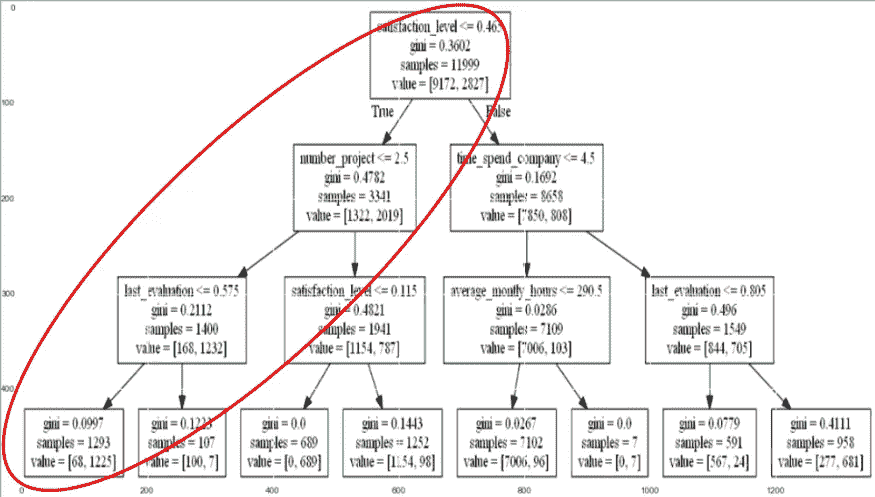

Decision Tree with high intuition, the important characteristics of the left employees are shown in the circle

整洁！你可以想象一个非常直观的决策树。你可以找到红圈来理解这些观点:

## 见解:什么最有可能导致人们离开？

1.  满意度低(<=0.115)
2.  high number of projects (> 2.5)。
3.  低到中的最后评价(≤0.575)
4.  在这个层次上，工资并不是一个重要的预测因素

这是非常明显的，但与我们之前头脑风暴的一些假设一致，例如低满意度和低上次评估。这一发现也可以用一个规则来表示，您可以很容易地用 excel 表进行编码，然后提交给您的管理层进行高度评价(太好了！).

## 决策树解释

一般来说，我们得到*满意度*作为我们的顶级节点。然后分支到第二级节点，具有*数量 _ 项目*和*时间 _ 花费 _ 公司*。技术上节点位置越低，分支节点的 *gini* (分类离散度)越小。这意味着节点越低，分离越均匀。

顶层节点拥有最重要的特征来分隔分类，其次是第二层，依此类推。

# 结论:公司留住员工的 3 条简单建议

1.  在任何给定的时间，将员工的项目数量减少到 1 或 2 个。这比减少他们的工作时间更重要。
2.  除了销售、技术和支持之外，工资不是一个重要的预测因素。谨慎加薪。
3.  增进管理者和员工之间的沟通和信任。很大一部分离职员工在最后一次评估中得分很低。这意味着我们需要在部门/小组之间培养健康的关系。一个具体的解决方案是减少微观管理者和对错误的惩罚。

# 额外收获:训练和测试多个分类模型

这是一个额外的分析，通过训练几个分类模型来提高您的理解。我将在后续出版物的更大主题中讨论每个模型。现在，我们将只探索一段快速代码来涵盖一些模型，如 RandomForest、AdaBoost 等。

```
**from** **sklearn.metrics** **import** accuracy_score, log_loss
**from** **sklearn.neighbors** **import** KNeighborsClassifier
**from** **sklearn.svm** **import** SVC, LinearSVC, NuSVC
**from** **sklearn.tree** **import** DecisionTreeClassifier
**from** **sklearn.ensemble** **import** RandomForestClassifier, AdaBoostClassifier, GradientBoostingClassifier
**from** **sklearn.naive_bayes** **import** GaussianNB
**from** **sklearn.discriminant_analysis** **import** LinearDiscriminantAnalysis
**from** **sklearn.discriminant_analysis** **import** QuadraticDiscriminantAnalysis

classifiers = [
    KNeighborsClassifier(3),
    SVC(kernel="rbf", C=0.025, probability=True),
    DecisionTreeClassifier(),
    RandomForestClassifier(),
    AdaBoostClassifier(),
    GradientBoostingClassifier(),
    GaussianNB(),
    LinearDiscriminantAnalysis(),
    QuadraticDiscriminantAnalysis()]

*# Logging for Visual Comparison*
log_cols=["Classifier", "Accuracy", "Log Loss"]
log = pd.DataFrame(columns=log_cols)

**for** clf **in** classifiers:
    clf.fit(X_train, y_train)
    name = clf.__class__.__name__

    **print**("="*30)
    **print**(name)

    **print**('****Results****')
    train_predictions = clf.predict(X_test)
    acc = accuracy_score(y_test, train_predictions)
    **print**("Accuracy: {:.4%}".format(acc))

    train_predictions = clf.predict_proba(X_test)
    ll = log_loss(y_test, train_predictions)
    **print**("Log Loss: {}".format(ll))

    log_entry = pd.DataFrame([[name, acc*100, ll]], columns=log_cols)
    log = log.append(log_entry)

**print**("="*30)
```

太好了！您将获得如下一些打印结果，完整打印结果请参考 Python 笔记本:

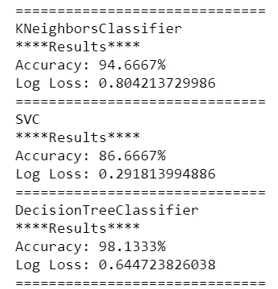

Prints for multiple models

我们将使用精确度和对数损失来评估这些模型。对数损失是由预测要素和实际要素之间的不匹配导致的累积成本。请参考下面的日志丢失定义:

[](https://www.r-bloggers.com/making-sense-of-logarithmic-loss/) [## 理解对数损耗

### 对数损失，或简称为对数损失，是一种分类损失函数，常用作 kaggle…

www.r-bloggers.com](https://www.r-bloggers.com/making-sense-of-logarithmic-loss/) 

使用 Seaborn，让我们基于准确性和日志损失来可视化哪些模型表现最好。

```
sns.set_color_codes("muted")
sns.barplot(x='Accuracy', y='Classifier', data=log, color="b")

plt.xlabel('Accuracy %')
plt.title('Classifier Accuracy')
plt.show()

sns.set_color_codes("muted")
sns.barplot(x='Log Loss', y='Classifier', data=log, color="g")

plt.xlabel('Log Loss')
plt.title('Classifier Log Loss')
plt.show()
```

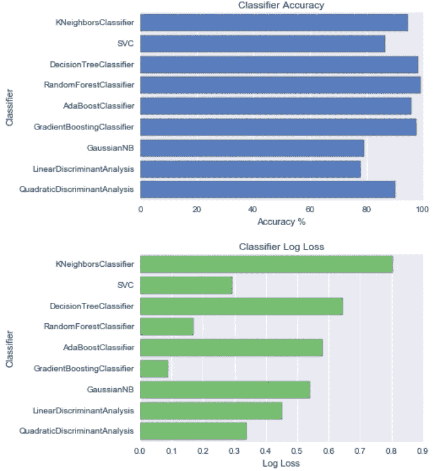

Accuracy and Log Loss Visualization

这是一个很好的可视化工具，展示了我们分类需求中各种模型的性能。

从图中，我们了解到我们应该训练随机森林分类，因为它的低对数损失和高准确性。对于不知道什么是随机森林的人，我将它定义为各种决策树预测的集合。请随意阅读下面的帖子了解更多细节。

[](https://medium.com/@hjhuney/implementing-a-random-forest-classification-model-in-python-583891c99652) [## 用 Python 实现随机森林分类模型

### 随机森林算法用于分类和回归。随机森林是一种集成学习方法…

medium.com](https://medium.com/@hjhuney/implementing-a-random-forest-classification-model-in-python-583891c99652) 

这就是你如何用随机森林分类器进行预测来总结我们的分析。

```
*# Predict Test Set*
favorite_clf = RandomForestClassifier()
favorite_clf.fit(X_train, y_train)
submission = pd.DataFrame(favorite_clf.predict(X_test),index=X_test.index,columns=['Prediction'])
```

这是我走过的路的尽头。希望现在你能更多地了解飞行风险背后的故事，以及如何从数据驱动的见解中保住你的工作:)。

# 目的、Github 代码和您的贡献

本概念证明(POC)的目的是作为辅助项目的一部分，用于学习目的。该应用程序的目标是帮助您快速检索和显示正确的见解，以理解和解决现实生活中的业务问题。

在 POC 中，我使用 Pandas 生成表格格式的数据框架进行分析，使用 Seaborn 可视化重要的分析，最后使用机器学习模型(如 SVM 和决策树)来预测员工的飞行风险。Github Python 笔记本代码位于下面。

[](https://github.com/VincentTatan/PythonAnalytics/blob/master/Youtube/Lesson%204%20Basic%20Python%20for%20Data%20Analytics%20%28HR%20Retention%20Prediction%29%20-%20Practice.ipynb) [## 文森特/PythonAnalytics

### 这是一个存放我的 Kaggle 和 iPython 笔记本- VincentTatan/PythonAnalytics 的仓库

github.com](https://github.com/VincentTatan/PythonAnalytics/blob/master/Youtube/Lesson%204%20Basic%20Python%20for%20Data%20Analytics%20%28HR%20Retention%20Prediction%29%20-%20Practice.ipynb) 

您可以随意克隆这个库，并在有时间的时候贡献自己的一份力量。

# 用 Python 和熊猫分析股票投资

代替今天关于 python 和分析的主题。你也可以看看我为有抱负的投资者出版的另一本书。你应该试着通过这个演示来指导你编写快速的 Python 代码来分析、可视化和预测股票。

[](/in-12-minutes-stocks-analysis-with-pandas-and-scikit-learn-a8d8a7b50ee7) [## 12 分钟:熊猫和 Scikit 的股票分析-学习

### 使用 Python 快速分析、可视化和预测股票价格

towardsdatascience.com](/in-12-minutes-stocks-analysis-with-pandas-and-scikit-learn-a8d8a7b50ee7) 

我的另一个好的出版物是为有抱负的价值投资者准备的价值投资仪表板。

[](/value-investing-dashboard-with-python-beautiful-soup-and-dash-python-43002f6a97ca) [## 价值投资仪表盘，配有 Python Beautiful Soup 和 Dash Python

### 价值投资的 Web 抓取与快速 Dash 可视化概述

towardsdatascience.com](/value-investing-dashboard-with-python-beautiful-soup-and-dash-python-43002f6a97ca) 

希望从这两本出版物中，你可以学到如何通过讲故事来创造个人价值。喜欢的请阅读并给予掌声:)。

## 感谢

我想感谢我的人力资源专业同事和朋友们，他们给了我关于这本书的建设性反馈。我真的很高兴得知你从我的出版物中获得了很多价值。

## 最后…向我伸出手

咻…就是这样，关于我的想法，我把它写成了文字。我真的希望这对你们来说是一个伟大的阅读。因此，我希望我的想法可以成为你发展和创新的灵感来源。

请通过我的 [**LinkedIn**](http://www.linkedin.com/in/vincenttatan/) 联系我，订阅我的 [**Youtube 频道**](https://www.youtube.com/user/vincelance1/videos)

**下面评论**出来建议和反馈。

快乐编码:)

**免责声明:本免责声明告知读者，文中表达的观点、想法和意见仅属于作者，不一定属于作者的雇主、组织、委员会或其他团体或个人**。**参考文献从列表中挑选，与其他作品的任何相似之处纯属巧合**

**本文纯粹是作者的个人项目，绝无任何其他不可告人的目的。**