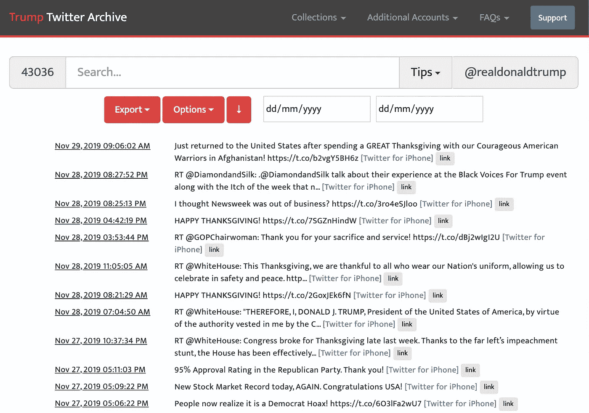
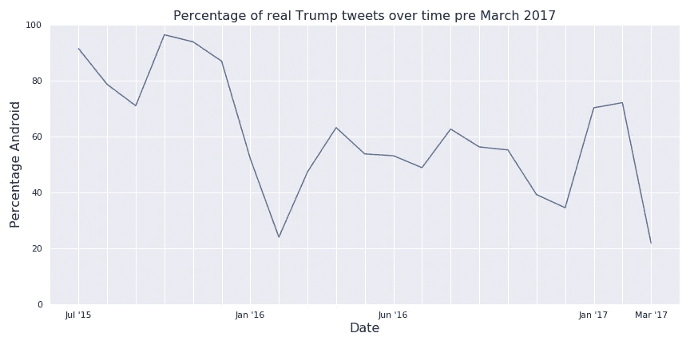
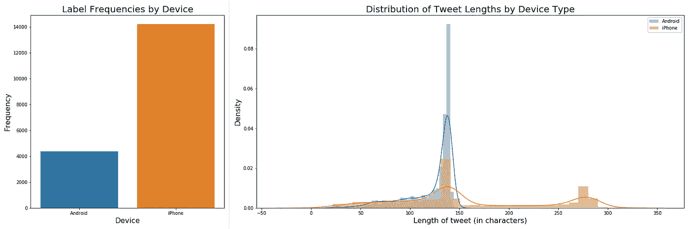
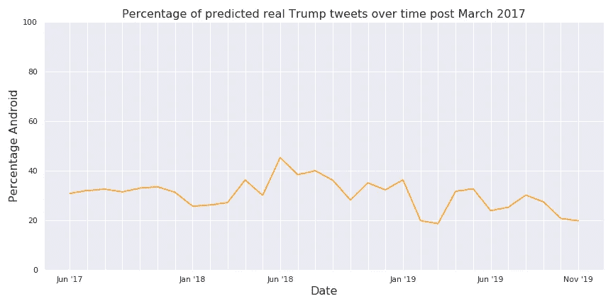

# 手柄后面的脸——使用神经网络区分唐纳德·特朗普的推文习惯

> 原文：<https://towardsdatascience.com/whos-really-behind-trump-s-tweets-a76b20a7e7?source=collection_archive---------38----------------------->


## 几乎每一个不朽的宣言都有它的面孔。在我们这个时代，我们有一个推特账号。

[*【德瑞克】*](https://medium.com/u/f6c36606b9d6?source=post_page-----a76b20a7e7--------------------------------)*[*迦格伦*](https://medium.com/u/a0b64bf968f5?source=post_page-----a76b20a7e7--------------------------------)*[*吴锡荣*](https://medium.com/u/9373c9c25b0f?source=post_page-----a76b20a7e7--------------------------------)*[*纳森萧*](https://medium.com/u/7adf2f371fc5?source=post_page-----a76b20a7e7--------------------------------)***

**纵观历史，总统们都曾为自己搭建平台，宣布重大变革即将到来。富兰克林·罗斯福利用他的私人炉边谈话宣布对日战争和美国加入第二次世界大战；罗纳德·里根通过他在柏林墙的标志性演讲重新统一了德国；约翰·肯尼迪通过电视广播宣布人类登上月球的梦想将成为现实。这些时刻标志着世界历史，表明来自标志性人物的标志性信息永远不会真正消失。**

****

**Three iconic presidential speeches throughout history. Left: FDR fireside chat where he announces war on Japan. Middle: Ronald Reagan’s “Ich Bin Ein Berliner.” Right: JFK giving his moonshot speech. All thumbnails taken from the YouTube videos linked above.**

**然而，时代变了:**

**虽然没错，这是全球关系的一个重大事件，但它也是特朗普总统的个人推特——他与世界沟通的主要手段。**

**从[承认以色列在戈兰高地的主权](https://www.independent.co.uk/news/world/middle-east/golan-heights-trump-tweet-netanyahu-israel-syria-a8835991.html)到[宣布对中国征收 2000 亿美元的新关税](https://www.scmp.com/news/china/diplomacy/article/3009018/it-fake-news-china-censors-trumps-us200-billion-tariff-tweets)，Twitter 上的这些行动一次又一次地证明了它们在世界范围内具有重大影响。[事实上，摩根大通甚至创造了一个“Volfefe”指数](https://www.bloomberg.com/news/articles/2019-09-09/jpmorgan-creates-volfefe-index-to-track-trump-tweet-impact)来跟踪由@realDonaldTrump 的推文引起的美国债券市场的波动。**

**在标志性的电视事件中，比如 JFK 出色地宣布，是的，我们*是* 要去月球，你可以清楚地看到高中 AP Lang 老师的清单:他使用了哪些文学手段？他如何在人群中展示自己？他的*是什么风气？(如果我给了你一个闪回，我道歉)***

**然而，有一个问题几乎从未被提及，但却非常重要:**世卫组织在讲话？****

**仅仅因为它来自@realDonaldTrump 并不意味着它来自(是的，我正在这样做)真正的唐纳德·特朗普。难道你不认为知道谁是世界上最强大的推特账户的幕后操纵者很重要吗？幸运的是，有一个理论。**

**一个流行的(阴谋？)关于唐纳德·特朗普的推文来源的理论是，他更具外交色彩的推文是由工作人员撰写的，而他个人则撰写更具争议性的内容。为了识别真正是谁*写了他的推文，我们基于现有的理论训练了几个神经网络。***

**在 2017 年 3 月 25 日之前， [@realDonaldTrump](https://twitter.com/realDonaldTrump) 的推文在 iPhone 和 Android 设备上发布。一个流行的理论是，特朗普的工作人员用 iPhone 发布推文，而特朗普本人则用他的安卓系统发布推文。虽然特朗普在 2017 年换了一部 iPhone，但我们决定测试一下这个理论，看看我们能否根据文本确定每条推文的来源。**

# **下面是两条不同标签的推文的一个很好的例子:**

**Twitter for Android**

**Twitter for iPhone**

**反差很大，不是吗？**

# **我们做了什么**

****

**Screenshot of the Trump Twitter Archive**

**为了将推文分类为工作人员推文或特朗普推文，我们使用了由[特朗普推特档案馆](http://www.trumptwitterarchive.com/archive)存档的推文目录，并将它们分为两组，即 2017 年 3 月之前和之后。在 2017 年 3 月之前的集合中，我们过滤掉了从 Twitter for Web 等其他来源发布的推文，并使用 Android 和 iPhone 推文来建立我们的地面真相数据集。**

********

**这里我们有一个基于设备类型的推文频率图，我们发现一般来说，来自 Android 设备(特朗普本人)的推文不如来自 iPhone(他的工作人员)的推文频繁。**

**检查分布图，我们注意到两个设备的*大*峰值约为 140 个字符，但来自 Androids 的更多。这可以归因于推特上的[字符限制——自 2007 年推特成立以来，每条推特就保持在 140 个字符，很大程度上受短信 160 个字符限制的影响。然而，自 2017 年底以来，该限制增加了一倍，达到 280 个字符，这一点从分布图中 iPhone 推文的最右边峰值可以看出。这两个图说明了我们的数据集中明显的偏向，严重偏向 iPhones，数据点几乎是 iPhones 的三倍，分布也超过了旧的 140 个字符的限制。](https://www.theverge.com/2017/9/26/16363912/twitter-character-limit-increase-280-test)**

# **准备数据**

**与任何神经网络一样，需要进行一些预处理:**

## **标记化和格式化**

**标记化将每个单词映射到字典中的一个索引。为了准备要传递到神经网络的数据，首先使用 Keras 的`Tokenizer`模块对推文进行标记化。一旦测试和训练集被标记化，我们就必须决定保持输入大小一致的方法。我们认为按长度裁剪推文会导致我们丢失数据，所以我们选择填充推文。我们选择用 65 个单词的长度来填充输入，因为我们发现最长的推文是 50 个单词，我们希望为未来的推文留有足够的余量。**

## **把...嵌入**

**为了构建我们的单词嵌入，我们在 [Kaggle](https://www.kaggle.com/terenceliu4444/glove6b100dtxt) 上找到了预处理的全局向量(手套)单词模型。这种类型的模型映射矩阵中两个单词之间的关系，并根据-1 到 1 的值对该关系进行评分。这是生成单词嵌入层的权重的一种非常常见的方法。首先，我们创建了一个出现在数据集中的单词的字典，然后通过从 GloVe 文本文件中解析这些单词及其嵌入值来创建一个嵌入矩阵。**

## **平衡**

**正如前面的[和](#8997)所看到的，我们的数据严重失真。与机器人相比，iPhones 的推文数量明显更多。在这种倾斜的数据集上进行训练会有一个有偏见的模型的风险，这意味着模型会过度预测 iPhones，而*在大多数时候仍然*是正确的。因此，我们试图通过用平衡批次训练我们的模型来解决这个问题。我们通过使用欠采样技术做到了这一点，该技术从 iPhone 推文中提取较小的样本，这有助于我们的模型做出更可靠的预测，因为它暴露于一组平衡的训练数据。**

## **训练/测试分割**

**在所有数据都被收集到 JSON 文件中之后，每条 tweet 的文本和来源都被传递到 sklearn 的`train_test_split`中，以便生成一个训练和验证集。**

# **建模**

**我们选择了五种不同的架构来训练我们的数据集。我们首先看了一个基本的前馈网络作为基线，然后看了 NLP 中流行的其他四个模型。这样做不是为了微调超参数，而是为了探索各种流行的架构，这些架构后来可以扩展为更精细和精确的模型。**

**每个网络的第一层是嵌入层，具有填充字向量(65)的维度。嵌入层的权重是用我们使用的给定 GloVe 文本文件预先实例化的。通过使用预先制作的单词嵌入文件，这是迁移学习的一个应用。这第一层在每个模型中都是标准的，与后面的层无关。**

**在训练模型时，我们使用 Keras 中内置的`validation_data`参数将测试集设置为验证数据。我们测量每个时期改进的验证准确度，并训练模型，直到验证准确度在 50 个时期内停止改进。**

***如果你想跟随我们，请查看我们的* [*GitHub 页面*](https://github.com/grenkoca/ANNADL_final) *！***

## **正向输送**

**我们想先尝试前馈模型，因为我们想看看与一些更复杂的模型相比，基本模型的表现如何。**

```
**Model: "sequential_1"
_________________________________________________________________
Layer (type)                 Output Shape              Param #   
=================================================================
embedding_1 (Embedding)      (None, 65, 100)           2441300   
_________________________________________________________________
flatten_1 (Flatten)          (None, 6500)              0         
_________________________________________________________________
dense_1 (Dense)              (None, 1)                 6501      
=================================================================
Total params: 2,447,801
Trainable params: 6,501
Non-trainable params: 2,441,300Test Score: 0.4719
Test Accuracy: 0.7909**
```

## **1D 卷积神经网络(CNN)**

**1D CNN 将扫描一系列标记化的单词。滤波器长度决定了在单个卷积中要查看多少单词。**

```
**Model: "sequential_8"
_________________________________________________________________
Layer (type)                 Output Shape              Param #   
=================================================================
embedding_8 (Embedding)      (None, 65, 100)           2441300   
_________________________________________________________________
conv1d_4 (Conv1D)            (None, 61, 128)           64128     
_________________________________________________________________
global_max_pooling1d_4 (Glob (None, 128)               0         
_________________________________________________________________
dense_15 (Dense)             (None, 128)               16512     
_________________________________________________________________
activation_6 (Activation)    (None, 128)               0         
_________________________________________________________________
dense_16 (Dense)             (None, 1)                 129       
=================================================================
Total params: 2,522,069
Trainable params: 80,769
Non-trainable params: 2,441,300
_________________________________________________________________
NoneTest Score: 0.8156
Test Accuracy: 0.7650**
```

## **长短期记忆(LSTM)**

**LSTM 是一个递归神经网络，擅长在较小(短期)和较大(长期)的上下文中查找单词序列的模式。**

```
**Model: "sequential_10"
_________________________________________________________________
Layer (type)                 Output Shape              Param #   
=================================================================
embedding_10 (Embedding)     (None, 65, 100)           2441300   
_________________________________________________________________
lstm_3 (LSTM)                (None, 128)               117248    
_________________________________________________________________
dense_20 (Dense)             (None, 128)               16512     
_________________________________________________________________
activation_8 (Activation)    (None, 128)               0         
_________________________________________________________________
dense_21 (Dense)             (None, 1)                 129       
=================================================================
Total params: 2,575,189
Trainable params: 133,889
Non-trainable params: 2,441,300
_________________________________________________________________
NoneTest Score: 0.5700
Test Accuracy: 0.7748**
```

## **双向 LSTM**

**这个 LSTM 变体既可以向前也可以向后工作，也可以按逆序计算单词序列。**

```
**Model: "sequential_13"
_________________________________________________________________
Layer (type)                 Output Shape              Param #   
=================================================================
embedding_13 (Embedding)     (None, 65, 100)           2441300   
_________________________________________________________________
bidirectional_2 (Bidirection (None, 256)               234496    
_________________________________________________________________
dense_26 (Dense)             (None, 128)               32896     
_________________________________________________________________
activation_11 (Activation)   (None, 128)               0         
_________________________________________________________________
dense_27 (Dense)             (None, 1)                 129       
=================================================================
Total params: 2,708,821
Trainable params: 267,521
Non-trainable params: 2,441,300
_________________________________________________________________
NoneTest Score: 2.1170
Test Accuracy: 0.7552**
```

## **门控循环单元(GRU)**

**GRU 是更新的循环神经结构，类似于 LSTM。**

```
**Model: "sequential_16"
_________________________________________________________________
Layer (type)                 Output Shape              Param #   
=================================================================
embedding_16 (Embedding)     (None, 65, 100)           2441300   
_________________________________________________________________
gru_1 (GRU)                  (None, 128)               87936     
_________________________________________________________________
dense_30 (Dense)             (None, 128)               16512     
_________________________________________________________________
activation_12 (Activation)   (None, 128)               0         
_________________________________________________________________
dense_31 (Dense)             (None, 1)                 129       
=================================================================
Total params: 2,545,877
Trainable params: 104,577
Non-trainable params: 2,441,300
_________________________________________________________________Test Score: 0.6943
Test Accuracy: 0.2448**
```

# **我们发现了什么**

**不同模型之间的验证准确性差异非常小。虽然我们的前馈网络具有最好的验证准确性，但 LSTM 模型的准确性仅低 2%。**

> **LSTM 预测:不是川普**

> **LSTM 预测:不是川普**

> **LSTM 预测:不是川普**

> **LSTM 预测:川普**

**在对一些随机推文进行测试后，我们决定在 2017 年 3 月后的所有推文中尝试我们的 LSTM 模型，以了解特朗普和员工推文的比例是否会随着时间的推移而变化。这是我们的发现:**

****

**为了便于比较，这是 2017 年 3 月之前的图表:**

****

# **总结反思**

**基于我们的结果，我们发现前馈网络表现最好，这可能是由于特朗普推文的简单性质。理想情况下，我们的模型应该考虑大写和标点符号，但是由于嵌入文件的限制，我们不能这样做。如果时间允许，我们可以只在特朗普的推文中训练我们自己的嵌入文件，而不是使用预训练的文件。尽管有这些限制，我们发现我们的结果相当有见地。**

**所以下次你看到这样的推文，**

```
**[[0.1183652 0.8849327]]
# 88.49% Not Trump**
```

**…也许可以半信半疑。也许实际上美国总统并没有就外交政策发表重大声明。**

**对我们的数据好奇？想自己玩玩吗？查看我们的 [GitHub 回购](https://github.com/grenkoca/ANNADL_final)。**

***特别感谢 Ulf Aslak 博士的指导* ❤**

# **参考**

**[](http://www.trumptwitterarchive.com/archive) [## 特朗普推特档案

### 特朗普的所有 30，000 多条推文都可以立即搜索到

www.trumptwitterarchive.com](http://www.trumptwitterarchive.com/archive) [](https://www.kaggle.com/terenceliu4444/glove6b100dtxt) [## 手套. 6B.100d.txt

### 下载数千个项目的开放数据集+在一个平台上共享项目。探索热门话题，如政府…

www.kaggle.com](https://www.kaggle.com/terenceliu4444/glove6b100dtxt) [](https://keras.io/) [## Home - Keras 文档

### Keras 是一个高级神经网络 API，用 Python 编写，能够运行在 TensorFlow、CNTK 或…

keras.io](https://keras.io/) [](https://seaborn.pydata.org/index.html) [## seaborn:统计数据可视化- seaborn 0.9.0 文档

### Seaborn 是一个基于 matplotlib 的 Python 数据可视化库。它为绘图提供了一个高级接口…

seaborn.pydata.org](https://seaborn.pydata.org/index.html)**