# 那个神奇宝贝是谁？

> 原文：<https://towardsdatascience.com/whos-that-pok%C3%A9mon-39d1150aedfe?source=collection_archive---------11----------------------->

## 用 Python 来回答这个古老的问题。

所以我是一个终生的神奇宝贝粉丝，也是一个最近转变的计算机科学书呆子。虽然我的主要兴趣在于数据科学*(为我上一篇关于数据科学伦理的文章***)*，但我发现自己一直在构思随机编码项目，其中大部分从未实现。*

*我和我的朋友 Augustine Chang 正在做一个分类项目，在查看我们数据的散点图时，我们看到了一个熟悉的轮廓。*

*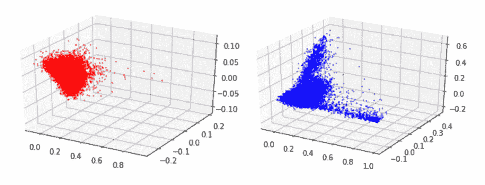*

*作为一个笑话，我们在演示幻灯片的图表上叠加了神奇宝贝的图像，看起来像是一些有趣的 *matplotlib* 函数。这个迷你项目就是这样诞生的。*

*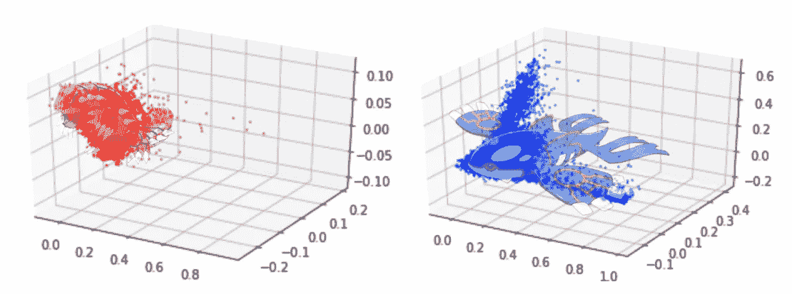*

*Groudon and Kyogre. If only, matplotlib. If only.*

## *步骤 1:解读(神奇宝贝)图像*

*我的最终目标是能够让神奇宝贝适合斑点，我首先需要能够找到一种比较图像的方法。我在 Kaggle 上找到了一个[数据集，其中方便地包含了所有神奇宝贝的 256 x 256 透明 png 图像，这将是我用来比较我的 blobs 的一组图像。在](https://www.kaggle.com/kvpratama/pokemon-images-dataset)[我写的另一篇关于计算摄影的文章](https://medium.com/@yishuen/computational-photography-from-the-amateurs-lens-29c58da8f9c6)中，我发现图像可以被解释为数组中的数组——张量，如果你愿意，每个像素由一个数组表示，这个数组是该像素的 RGB 值。使用`matplotlib.image`中的`imread`方法，我可以很容易地输出给定图像的数组。*

*最重要的是，`matplotlib`能够使用`imshow`将正确维度的数组输出为 2D 图上的图像。*

*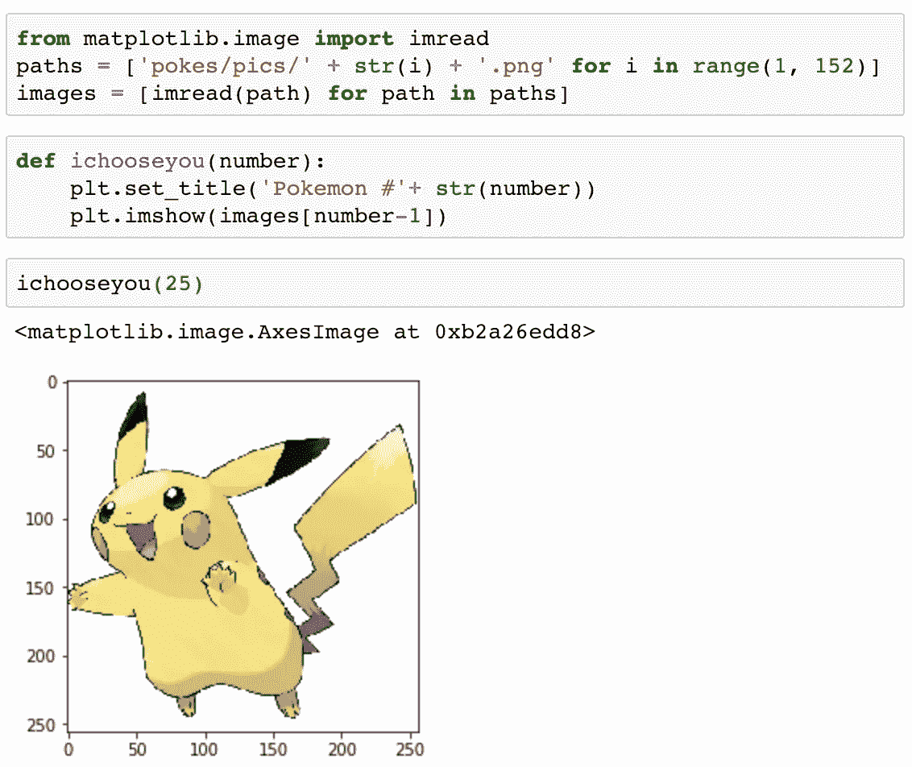*

*‘paths’ is the routes of the images; where the images are saved*

## *步骤 2:比较数据集中的图像*

*为了比较图像，我认为最简单的方法是比较两幅图像中每个对应像素的 RGB 值。更具体地说，我采用了两幅图像中每对匹配像素之间的**欧几里德距离**，并使用它来找到两幅图像中的**平均像素距离**。*

*首先，为了避免处理其他图像，我想看看最相似的神奇宝贝是什么，给定一个神奇宝贝。在我的代码中，我希望能够输入神奇宝贝 ID 号并返回其最佳匹配。所以我设置了它:*

1.  *一个函数，将返回原始的和最匹配的图像，并排。*
2.  *返回两幅图像之间的平均像素距离的函数。*
3.  *该函数将返回输入图像和每个神奇宝贝图像之间的距离列表。*
4.  *嵌套了上述三个函数的函数，将输出预期的结果。*

*以下是目前的一些结果:*

*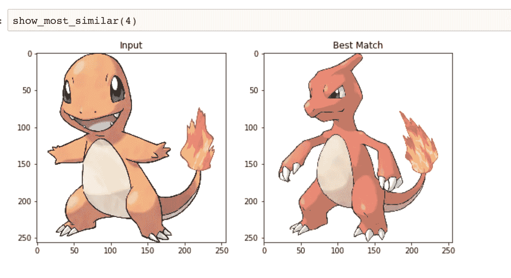*

*Charmander (ID: 4) is most similar to Charmeleon!*

*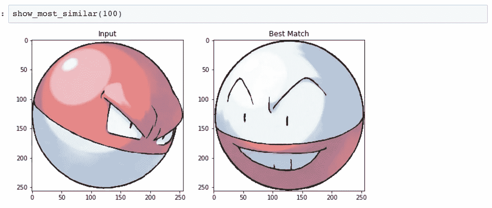*

*Voltorb (ID: 100) is most similar to Electrode!*

*相当不错！因为我使用的度量是平均像素距离，并且因为图像有透明的背景，所以神奇宝贝的颜色和形状都被考虑在内。*

## *步骤 3:使用任何输入图像*

*在这里，我所要做的就是对我现有的函数做一些调整，这样它们就可以接受任何图像。一个限制是，我只能使用与神奇宝贝数据集中的图像具有相同维度的图像。因此，我首先在其他 256 x 256 的图像上测试了我的更新功能。*

*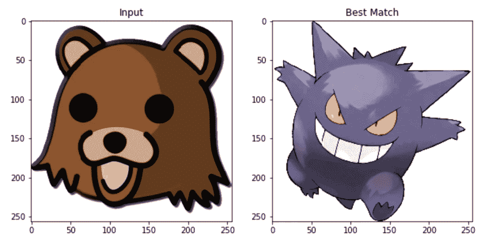**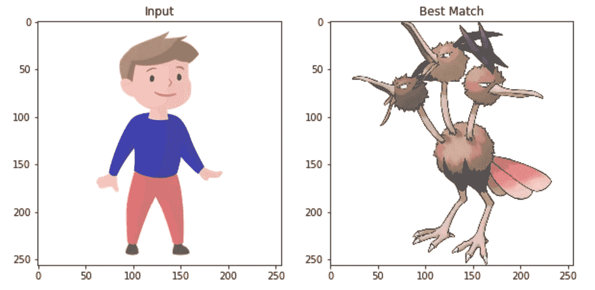*

*酷！但是如果图像不是 256 x 256 呢？Python 的 Pillow 包用名副其实的`resizeimage`函数很容易地为我们做到了这一点，我写了一个函数来接受图像的文件名，并将其调整到我需要的尺寸。*

## *第四步:把所有东西放在一起*

*这里是我的函数使用的所有代码，`bestfitpokemon()`！*

*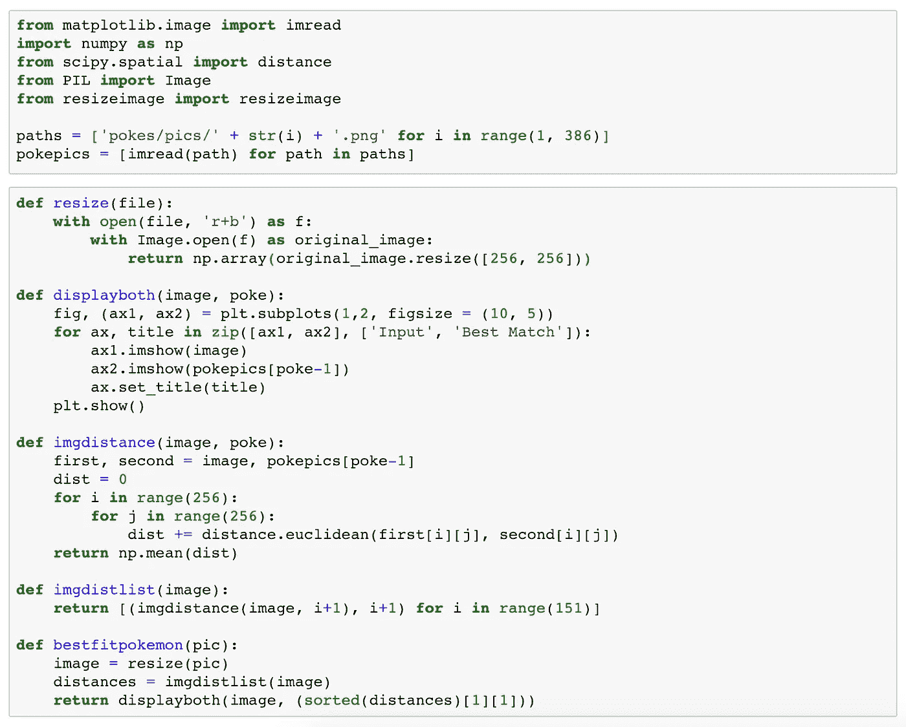*

*The Entire Code!*

**一个警告:我发现 JPEG 文件不起作用，因为神奇宝贝的 PNG 数据集意味着每个像素都有一个额外的“alpha”值，而 JPEG 文件没有。当查找 3D 和 4D 数组之间的欧几里德距离时，该函数会中断。**

*我把我们最初的散点图和一些劣质的 photoshop 作品，只提取红色和蓝色的斑点到透明的 PNG 图像，只是为了看看最适合的神奇宝贝会是什么。*

*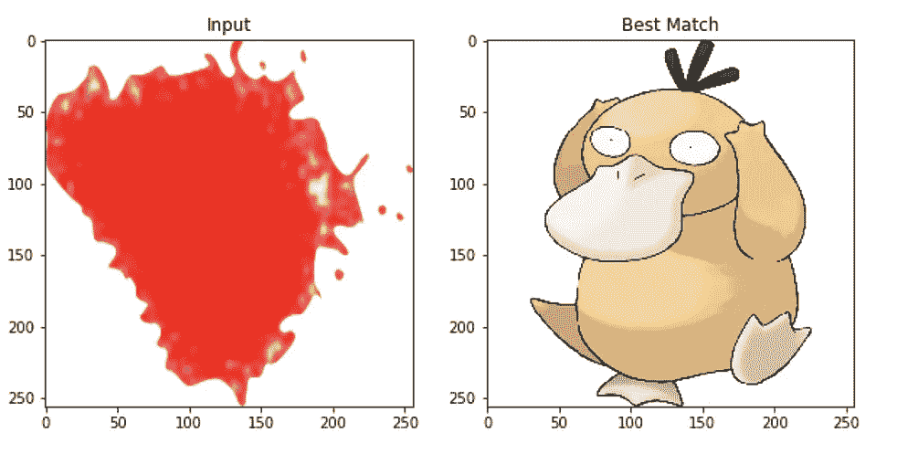**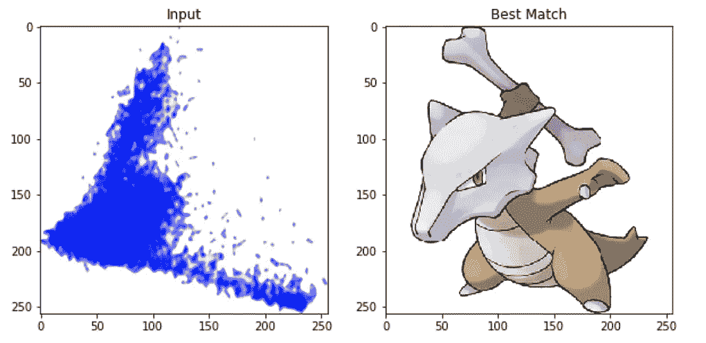*

*Best-Fit Pokémon*

*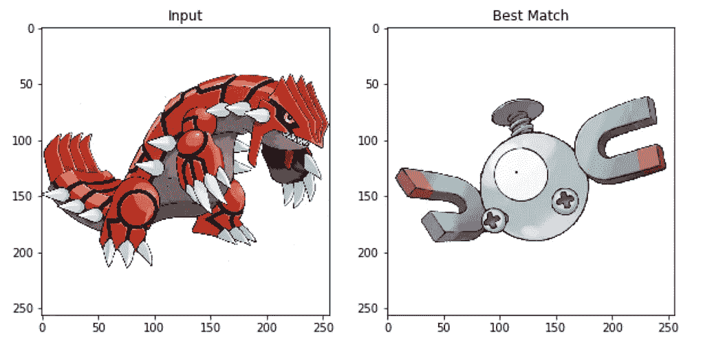**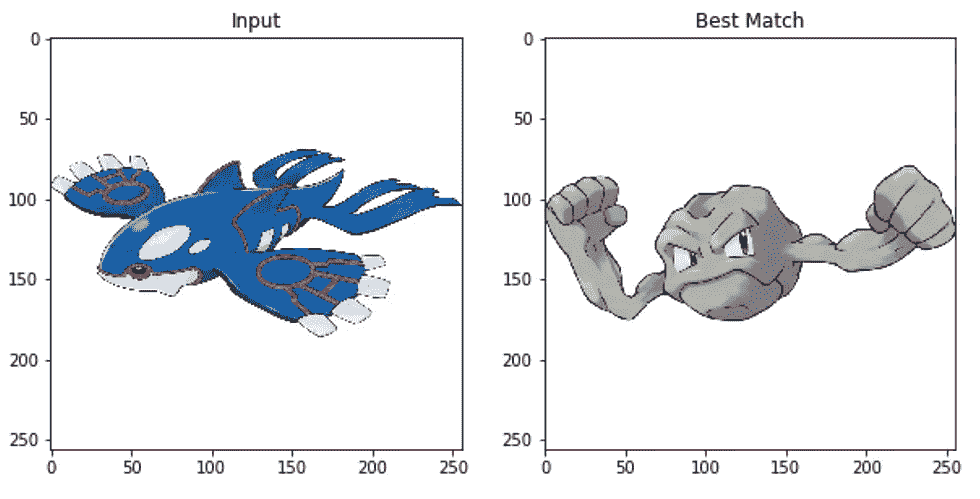*

## *总结一下…*

*对我来说，这里有一些明显的后续步骤。我可以裁剪和重新缩放，或者找到其他方法来处理空白，这样颜色的权重会更高。我还可以通过输入每只神奇宝贝的多张图片，把它变成一个分类模型。*

*所以我的博客没有变成 Groudon 或盖欧卡。检查这些结果，似乎返回的神奇宝贝的形状与斑点形状非常相似！所以根据我的模型，Psyduck 和 Marowak 是最适合我的 blobs 的神奇宝贝。*