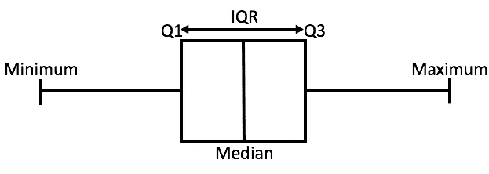
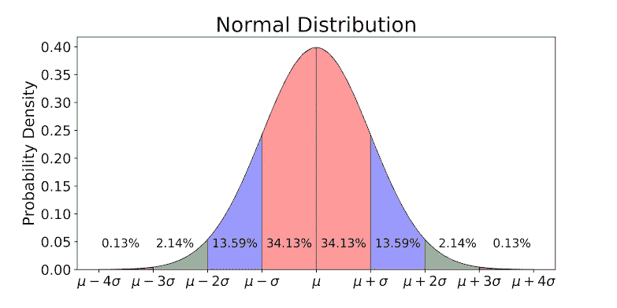

# 为什么 IQR 异常值检测法中的“1.5”？

> 原文：<https://towardsdatascience.com/why-1-5-in-iqr-method-of-outlier-detection-5d07fdc82097?source=collection_archive---------0----------------------->


Photo by [Nick Fewings](https://unsplash.com/@jannerboy62) on [Unsplash](https://unsplash.com/photos/7cLIUI6rVDc)

> 如果你不能向一个六岁的孩子解释，你自己也不会理解。

世界仍在等待下一个爱因斯坦，或者也许再也不会有另一个世纪人物了。但我愿意相信:在宇宙中，在上述引文的变体中…

> 最好的学习方法是教书。

这个帖子的想法来自于我曾经帮助我的一个大三学生完成**异常检测**的任务。这不是一个非常复杂的问题，只是 IQR 方法在数据集上离群点检测的一个应用。当他问我的时候，这个教程发生了令人兴奋的转变:

*“为什么是 IQR 的 1.5 倍？为什么不是 1 或 2 或任何其他数字？”*

现在这个问题对那些不熟悉异常值检测的 IQR 方法(解释如下)的人来说不起任何作用，但对那些知道这个方法有多简单的人来说，我希望上面的问题能让你思考一下。毕竟，好的数据科学家不就是这么做的吗？质疑一切，不要相信任何东西。

从最普遍的意义上来说，异常值是一个与其他观察值明显不同的数据点。现在，它的含义可以根据正在研究的统计模型来解释，但为了简单起见，并且不要偏离这篇文章的主要议程太远，我们将考虑一阶统计量以及非常简单的数据集，不失一般性。

# 异常值检测的 IQR 方法

为了便于解释 IQR 方法，让我们从一个方框图开始。



A box plot from [source](https://panmath7.files.wordpress.com/2017/04/how_to_find_iqr_boxplot_image.jpg)

箱线图或多或少地告诉我们数据的分布情况。它给出了数据实际上分布了多少，它的范围是什么，以及它的偏斜度。您可能已经在图中注意到，箱线图使我们能够从中推断有序数据，也就是说，它告诉我们按升序排列的数据的各种指标。

在上图中，

*   *最小值*是数据集中的最小值，
*   并且*最大值*是数据集中的最大值。

所以两者的区别告诉我们数据集的范围。

*   *中位数*是数据的中位数(或中心点)，也称为第二个四分位数(由数据是有序的这一事实产生)。
*   *Q1* 是数据的第一个四分位数，也就是说有 25%的数据位于*最小值*和 *Q1* 之间。
*   *Q3* 是数据的第三个四分位数，也就是说 75%的数据位于最小值和 *Q3* 之间。

*Q3* 与 *Q1* 之差称为**四分位距**或 **IQR** 。

```
IQR = Q3 - Q1
```

为了使用这种方法检测异常值，我们定义了一个新的范围，让我们称之为决策范围，并且位于该范围之外的任何数据点都被认为是异常值，并且被相应地处理。范围如下所示:

```
Lower Bound: **(Q1 - 1.5 * IQR)**Upper Bound: **(Q3 + 1.5 * IQR)**
```

任何小于*下限或*大于*上限*的数据点都被视为异常值。

但问题是:*为什么只有 IQR 的 1.5 倍？为什么不是其他数字？*

嗯，你可能已经猜到了，数字(这里是 1.5，以下是*标度*)清楚地控制了范围的灵敏度，因此决定了规则。较大的标度会使离群值被认为是数据点，而较小的标度会使一些数据点被认为是离群值。我们很确定，这些情况都不理想。

但这是一种解释原因的抽象方式，它非常有效，但却很幼稚。那么，我们应该把头转向什么呢？

*数学！*当然！(你预见到了，对吗？😐)

从现在开始事情会变得有点“数学化”。但我会尽量减少。

**如果我告诉你这个数字，或者说*标度*，取决于数据遵循的分布，你可能会感到惊讶。**

例如，假设我们的数据遵循我们所钟爱的高斯分布。

# 高斯分布

你们一定都见过高斯分布是什么样子的，对吧？如果没有，在这里(虽然我对你很怀疑👊).



Gaussian Distribution with steps of standard deviation from [source](https://studiousguy.com/wp-content/uploads/2019/04/Normal-Distribution-curve.jpg)

从该图中可以推断出某些观察结果:

*   整个数据的大约 68.26%位于平均值(μ)的一个标准偏差(**<【σ**)内，考虑到两边，图中的粉红色区域。
*   整个数据的大约 95.44%位于平均值(μ)的两个标准偏差( **2σ** )内，考虑到两边，图中的粉红色+蓝色区域。
*   整个数据的大约 99.72%位于均值(μ)的三个标准差( **< 3σ** )内，考虑到两边，图中的粉色+蓝色+绿色区域。
*   整个数据的其余 0.28%位于均值(μ)的三个标准差( **> 3σ** )之外，考虑到两边，图中的小红区域。**而这部分数据被认为是异常值**。
*   第一个四分位数和第三个四分位数 *Q1* 和 *Q3* 分别位于均值的 **-0.675σ** 和 **+0.675σ** 。

我本可以向您展示这些推论背后的计算，但这超出了本文的范围。如果你愿意，你可以在[cs.uni.edu/~campbell/stat/normfact.html](http://www.cs.uni.edu/~campbell/stat/normfact.html)查看这些

# 让我们用σ来计算 IQR 决策范围

## 取*刻度* = 1:

```
**Lower Bound:**= Q1 - 1 * IQR
= Q1 - 1 * (Q3 - Q1)
= -0.675σ - 1 * (0.675 - [-0.675])σ
= -0.675σ - 1 * 1.35σ
= **-2.025σ****Upper Bound:**= Q3 + 1 * IQR
= Q3 + 1 * (Q3 - Q1)
= 0.675σ + 1 * (0.675 - [-0.675])σ
= 0.675σ + 1 * 1.35σ
= **2.025σ**
```

因此，当*标度*被取为 1 时，那么根据 IQR 方法，任何位于平均值(μ)的 **2.025σ** 之外的数据，在任何一侧，都应被认为是异常值。但是我们知道，在μ的两边，数据都是有用的。因此，我们不能采用 *scale = 1* ，因为这使得决策范围过于排他，意味着这会导致过多的异常值。换句话说，决策范围变得如此之小(与 **3σ** 相比)，以至于将一些数据点视为异常值，这是不可取的。

## 取标度= 2:

```
**Lower Bound:**= Q1 - 2 * IQR
= Q1 - 2 * (Q3 - Q1)
= -0.675σ - 2 * (0.675 - [-0.675])σ
= -0.675σ - 2 * 1.35σ
= **-3.375σ****Upper Bound:**= Q3 + 2 * IQR
= Q3 + 2 * (Q3 - Q1)
= 0.675σ + 2 * (0.675 - [-0.675])σ
= 0.675σ + 2 * 1.35σ
= **3.375σ**
```

因此，当*标度*取为 2 时，根据 IQR 方法，任何位于平均值(μ)的 **3.375σ** 之外的数据，在任何一侧都应被视为异常值。但正如我们所知，直到 **3σ** ，在μ的两边，数据都是有用的。因此，我们不能采用 *scale = 2* ，因为这使得决策范围过于宽泛，意味着这导致的异常值太少。换句话说，决策范围变得如此之大(与 **3σ** 相比)，以至于它将一些异常值视为数据点，这也是不可取的。

## 取标度= 1.5:

```
**Lower Bound:**= Q1 - 1.5 * IQR
= Q1 - 1.5 * (Q3 - Q1)
= -0.675σ - 1.5 * (0.675 - [-0.675])σ
= -0.675σ - 1.5 * 1.35σ
= **-2.7σ****Upper Bound:**= Q3 + 1.5 * IQR
= Q3 + 1.5 * (Q3 - Q1)
= 0.675σ + 1.5 * (0.675 - [-0.675])σ
= 0.675σ + 1.5 * 1.35σ
= **2.7σ**
```

当*标度*取 1.5 时，根据 IQR 方法，任何位于平均值(μ)的 **2.7σ** 之外的数据，在任何一侧都应被视为异常值。而这个决策范围是最接近高斯分布告诉我们的，即 **3σ** 。换句话说，这使得决策规则最接近高斯分布对于异常值检测的考虑，这正是我们想要的。

***旁注***

为了精确地得到 **3σ** ，我们需要取*标度=* 1.7，但是 1.5 比 1.7 更“对称”，我们总是更倾向于对称，不是吗！？

此外，异常值检测的 IQR 方法不是唯一的，也绝对不是最佳的异常值检测方法，因此，一点权衡是清晰可辨的，也是可以接受的。

看，这一切用数学展现得多么美丽而优雅。我只是喜欢事物是如何变得清晰，并在通过数学感知时明显成形的。这也是为什么数学是我们这个世界的语言的众多原因之一(尽管对宇宙不太确定😐).

所以，我希望，现在你们知道为什么我们把它定为 1.5，IQR。但是这个*标度*取决于数据遵循的分布。假设我的数据似乎遵循指数分布，那么这个*标度*就会改变。

但是，每一个因数学而产生的复杂问题都被数学本身解决了。

听说过中心极限定理吗？没错。同一个定理为什么给了我们假设服从高斯分布的自由。但我想我还是改天再说吧。在那之前，保持好奇！

希望这篇文章对你有用。谢谢！

一路平安！