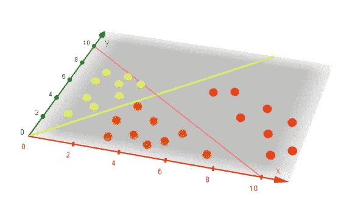
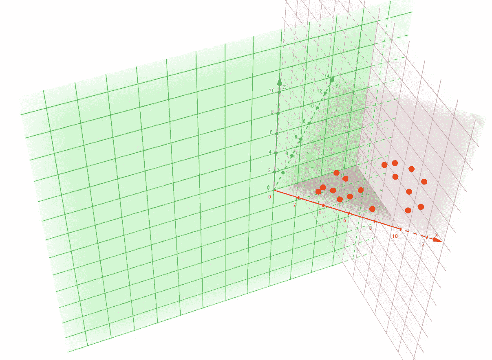
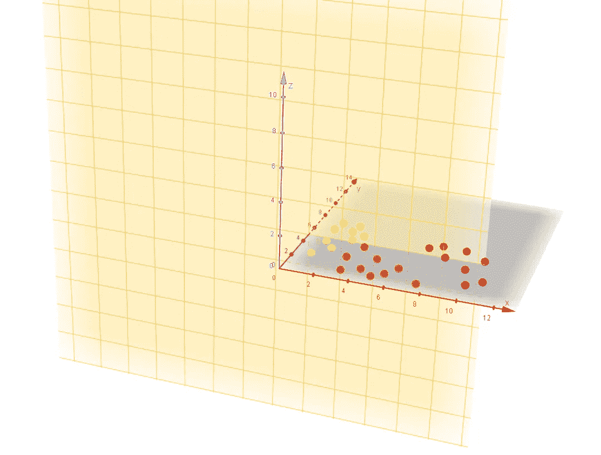
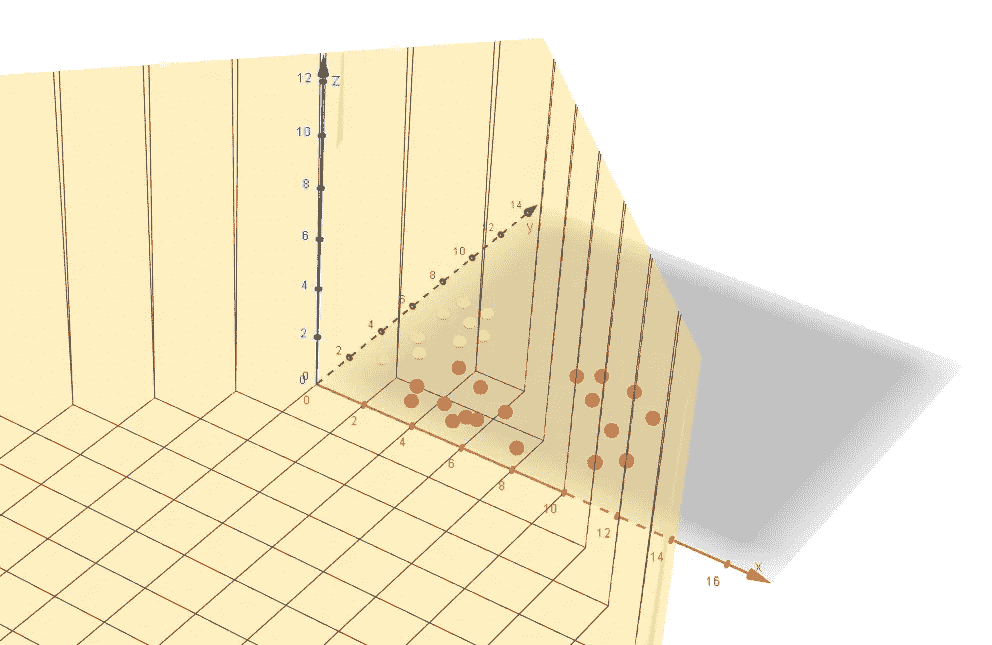
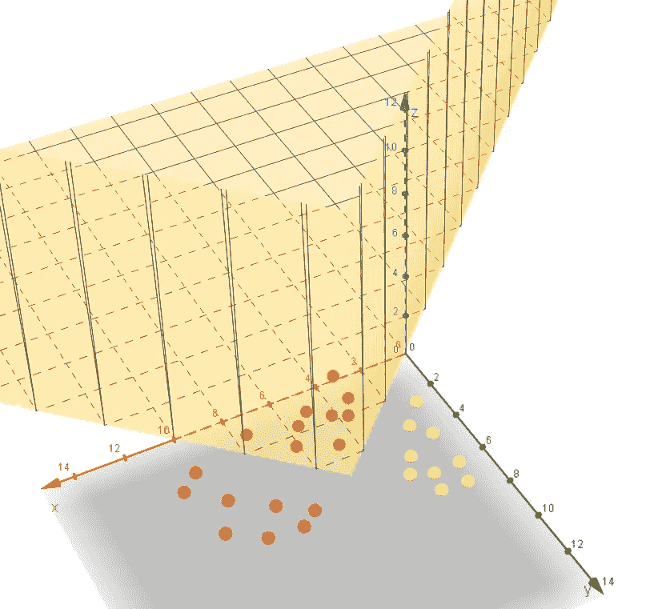

# 为什么没有非线性的神经网络只是一条美化了的线——3D 可视化

> 原文：<https://towardsdatascience.com/why-a-neural-network-without-non-linearity-is-just-a-glorified-line-3d-visualization-aff85da10b6a?source=collection_archive---------27----------------------->

在本系列的第一部分中，我们创建了一个简单的单神经元神经网络来区分苹果和橙子。如果你是直接到达这里的，你可能想先检查一下(下面的链接)。如果你已经可以用 ReLU 很好地在 3D 中可视化神经元的输出，请继续。

 [## 2D 人工神经网络中的神经元如何在三维可视化中弯曲空间

### 这是为那些想直观了解人工神经网络中神经元内部工作的人准备的。你只需要一个…

medium.com](https://medium.com/@avinash_dubey/how-a-neuron-in-a-2d-artificial-neural-network-bends-space-in-3d-visualization-d234e8a8374e) 

为了继续我们的旅程，我们将为分类问题添加另一种水果—香蕉。我认为可以很有把握地说，香蕉离红色还很远，但会很甜(至少在成熟时)。

2D graph for fruits on a plane (x-axis: redness, y-axis: sweetness)

因此，如果我们取几个香蕉样本(熟的和生的都用黄色的球表示)并把它们放在 X-Y 轴水果盘上，我们会得到一个看起来像左边的图。

此外，你们中的大多数人会敏锐地观察到一条新的绿线的存在，这条绿线将香蕉与橙子区分开来。

# 从线条到神经元

从上一篇文章中，我们已经知道了一条线的神经元等效方程。

粉线: ***w1 * x + w2 * y + b1 = 0***

绿线:**w3 * x+w4 * y+B2 = 0**

Two 2D neurons each with two inputs and one output

通过在这些方程周围画一些圈和箭头，我们得到了两个 2D 神经元。粉红色和绿色的都接收 2 个输入并产生一个输出。

# 但是你喜欢 3D…

…我也是

因此，正如我们在之前的帖子中所做的那样，我将使用 3D 神经网络的实际输出来替换这些线条。没有任何激活的 3D 神经元的输出只是一个平面，因为我们有 2 个神经元，所以我们有 2 个平面。

# 将飞机的输出放在一起

现在，你可能会想(就像我当年那样)，把两个神经元的输出放在一起应该能让我们很好地分离我们的 X-Y 水果拼盘。但是，细节决定成败。

***新输出 z =粉色平面+绿色平面***

***或 z = w1 * x+w2 * y+B1+w3 * x+w4 * y+B2***

***或 z =(w1+w3)* x+(w2+w4)* y+B1+B2***

***或 z = w5 * x + w6 * y + b3***

Adding multiple planes together just results in a new one

这是另一个“橙色”平面的方程式。它甚至没有按照我们预期的方式对水果进行分类(正如你在左边看到的)。

事实上，无数隐藏层中的大量神经元加在一起，只能给我们一个 2D 平面。这同样适用于 n 个输入，也就是说，你将有第二个超平面。

# 添加非线性的神奇公式

现在，让我们加入非线性的神奇公式，重新激活神经元的输出。对于门外汉来说，它只是用零代替了所有的负值。所以，g(z) = max{0，z}

Non-linear planes added together are excellent classifiers

现在，神经网络的行为完全符合我们的预期——非常聪明。这个程序能够区分橙子、苹果和香蕉，但是我们可以很容易地创建一个程序来挑选任何其他水果，或者更好的是，分别挑选所有水果。

如果你仍然不相信，下面是不同角度的相同观点。

Non-linear planes added together are excellent classifiers — different perspective

如果您希望进一步研究图表，请随时访问我的 geogebra 应用程序，网址为[https://www.geogebra.org/3d/ege3egjh](https://www.geogebra.org/3d/ege3egjh)

大多数对象应该非常简单，但是应用程序不支持某些激活功能，比如 relu。所以，我不得不采用一些简单的变通方法。

供思考，g(z) = max{0，z}与(z+ abs(z)) / 2 相同

# 其他激活的非线性

我确信，你们中的一些人会是一些其他激活的泄漏、双极或软版本的粉丝。它们都产生不同种类的输出，各有利弊，但都是非线性的。可以说，非线性是任何神经网络的生命线，没有它，它只是一条美化了的线。