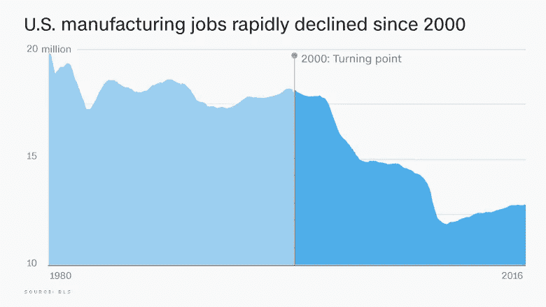
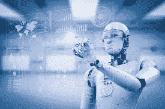

# 为什么人工智能是不平衡的工业全球格局中的全球均衡器

> 原文：<https://towardsdatascience.com/why-ai-is-a-global-equalizer-in-the-unbalanced-industrial-global-landscape-a8ff8f46a05e?source=collection_archive---------31----------------------->

如果你相信机器人和人工智能是人类所有邪恶的原因，因为你在电影中见过它(并且你相信好莱坞=现实)，这篇文章不适合你。

如果你是一个理性的人，那么继续阅读。

2000 年代，数千万美国人和欧洲人失去了制造业工作。我出生并成长在这样一个以制造业为主的城市，意大利蒙法尔科内，这座位于地中海最北端的城市以其造船厂而闻名，建造了一些世界上最大最豪华的游轮。

有思想的人类，比如我认识的那些正在造船的人，很久以来就知道机器人和人工智能不是失业的罪魁祸首——人工智能甚至没有达到重要的质量和规模。

亚洲和南美的低工资国家应该受到谴责，而不是人工智能，也不是机器人。

> 2015 年蒙法尔科内，取代 45 岁的保罗·萨托里工作的不是机器人。是另一个国家的《闪电侠与白骨》里的某个人。

甚至一些学者(再说一次，我也是，艾教授……)终于醒悟过来，得出了其他人类的相同结论。

多年来，自动化的作用越来越大，这被认为是制造业就业岗位流失的罪魁祸首，但在过去几年里，一个更理性、显然更符合逻辑的观点出现了。

例如，[大卫·奥特](https://www.marketwatch.com/story/how-chinese-imports-may-have-curbed-american-ingenuity-2017-03-22)(麻省理工学院)有一个非常不同的观点:在美国，我们大大高估了制造业生产率的增长。这意味着自动化并没有真正发挥主要作用，如果它是失业的罪魁祸首，它应该发挥主要作用，将生产率提高到最终解雇工人的水平。

> *事情不是这样的。那是什么原因呢？*

嗯，奥托尔声称，更简单，更符合逻辑的是，将中国引入全球贸易体系是失业的根本原因。我们还可以加上其他效仿的国家，但 Autor 基本上证实了工人们一直以来都知道的事情:他们的工作被亚洲和拉丁美洲的表亲抢走了，而不是被人工智能机器人抢走了。

# 从这里去哪里？AI 作为均衡器。

既然我们知道了显而易见的事情，那么我们对于自动化、人工智能和机器人技术的立场应该是什么呢？

我的主张很简单，我希望人们会发现它和上面的论点一样合乎逻辑。

> 人工智能将为美国和欧盟境况不佳的制造业和工业部门注入所需的“肾上腺素”。

美国和欧盟的制造业面临竞争，并输给了低劳动力成本的国家。人工智能和相关技术，如机器人技术，以及它们的结合，是全球均衡器。

我这么说是什么意思？虽然劳动力成本差异很大，但软件成本——如人工智能——是一样的。

通过优化单个人类工人的工作，美国/欧盟与世界其他地区之间的生产成本差异将缩小，因为人工智能软件将提高工人的生产率，无论他们在哪里。

此外，如果趋势继续，疯子不掌权(你永远不知道)，美国和欧盟的推动和当前在人工智能方面的领导地位可能会使这些地区首先受益于人工智能引入带来的生产力提高，重新平衡不平衡的全球情景。

如果从表面上看，以及理解人工智能不会取代人类，而是增强并让美国制造商重新参与竞争，上述推理应该被任何人接受，无论是民主党人还是共和党人，无论是美国人还是欧洲人。

好莱坞，想拍一部关于那个的电影，还是太真实了？