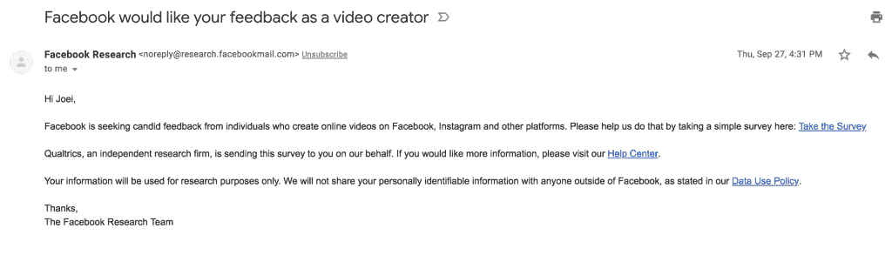
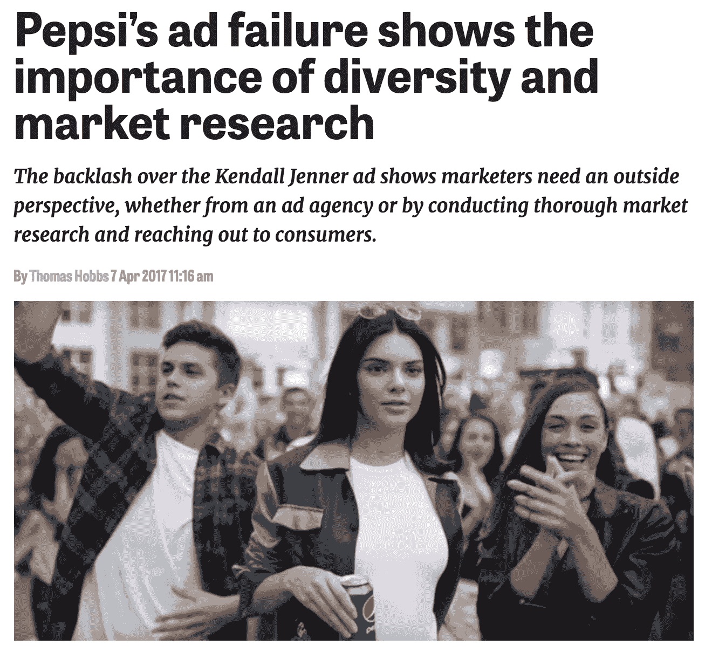
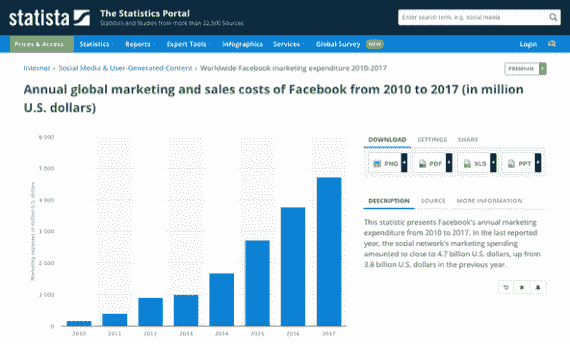
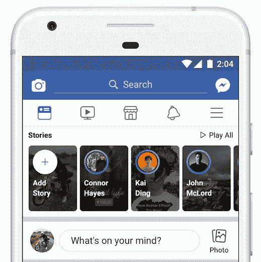
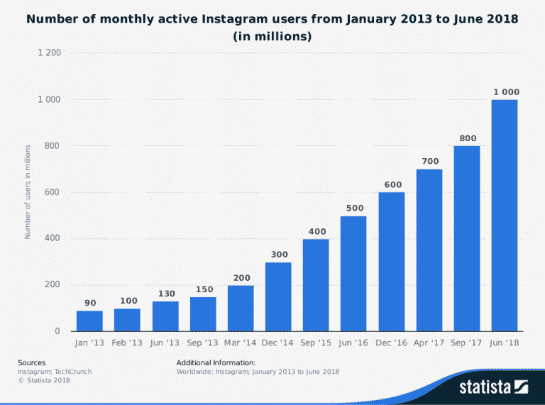
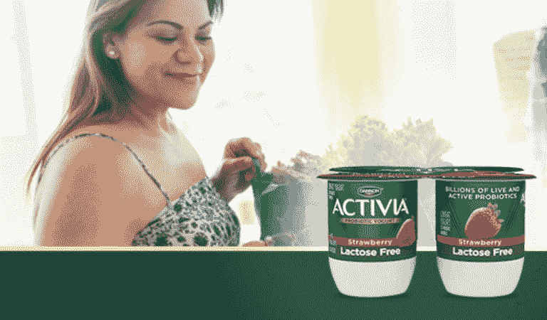

# 像脸书和达能这样的全球品牌为什么以及如何投资市场研究

> 原文：<https://towardsdatascience.com/why-and-how-global-brands-like-facebook-and-danone-invest-in-market-research-d856559902af?source=collection_archive---------26----------------------->

上周，我收到了以下来自脸书的电子邮件:

*“你好，乔伊，*

*脸书正在向在脸书、Instagram 和其他平台上制作在线视频的人寻求坦诚的反馈。请在这里做一个简单的调查来帮助我们…………*

*谢谢，*

*脸书研究小组"*

这让我想到:如果世界上发展最快的科技巨头之一脸书有一个专门的研究团队，这一定意味着积极的市场研究在全球商业中有真正的一席之地？

但是为什么呢？他们不是已经收集了大量的数据吗(多到让他们陷入麻烦)？还有，难道没有比电子邮件更好的方法来收集数据吗？

但是脸书并不是唯一的例子。[谷歌在研究上投入巨资](https://www.thinkwithgoogle.com/intl/en-gb/consumer-insights/)，Hubspot 也是如此。像[乐高](https://www.mackenziecorp.com/research-realism-lego/)和[麦当劳](https://www.forbes.com/sites/robertpassikoff/2014/10/14/mcdonalds-hopes-new-social-media-qa-will-modify-food-image/#11368c8d2e5e)这样的消费巨头严重依赖市场调查来改进他们的产品和营销策略。

在本帖中，我们将探讨全球公司为什么以及如何继续投资于市场研究，他们采取的不同方法，以及每种方法的利弊。

# 为什么企业投资市场研究？

对市场的深刻理解现在比以往任何时候都更加重要，原因有二:

1.  **竞争激烈。你的竞争对手通常只需点击一下鼠标。如果客户对你的产品不满意，他们会毫不犹豫地转向其他产品。站在市场的顶端意味着了解客户的想法。**
2.  顾客有很高的期望。因为有如此多的选择，客户期望高质量的服务和产品。品牌需要通过更好地了解顾客想要什么来跟上这些期望。

具体来说，传统的市场研究允许企业跟踪:

*   随着时间的推移对其品牌的认知。
*   影响他们产品的趋势和细分市场。
*   他们的广告活动和社交媒体营销的影响。
*   他们客户群体的偏好。
*   与他们每个品牌相关的独特价值。

基本上，品牌可以利用市场研究来指导他们的营销和产品策略——获得新客户，同时[与现有客户建立更好的关系](https://blog.marketresearch.com/how-to-use-market-research-to-improve-customer-relations)。

正如留住客户与获得新客户一样重要，企业需要跟上不断变化的客户期望和购买行为，以保持领先地位。

或者，简单地说[避免像百事可乐](https://www.marketingweek.com/2017/04/07/pepsi-scandal-prove-lack-diversity-house-work-flawed/)那样的公关失误:

这有助于解释为什么像脸书这样的公司近年来稳步增加营销支出。

看一看这些数字:

*Source:* [*Statista*](https://www.statista.com/statistics/506867/facebook-marketing-spending/)

这笔支出包括对经典市场研究方法的持续投入。

但是当我们使用这个术语时，我们指的是什么呢？

# 市场研究中的常用方法

当我们谈论[传统市场调查方法](http://researchaccess.com/2015/05/traditional-research-technique/)时，我们谈论的是:

*   焦点小组:聚集在一起讨论现有产品或为新产品的开发或推出提供反馈的人群。
*   调查:向预先确定的一组人提供问题和提示，以获得关于产品和服务的信息和见解。
*   问卷:一系列问题，旨在获取在线或面对面的客户反馈。

我们可以在脸书的用户体验研究方法中看到这些技术在起作用。在脸书，“用户体验研究经理”专注于以下五种类型的研究，以将产品从早期的想法变为准备推出的东西:

*   了解用户和客户需求的基础研究。
*   情境调查关注用户如何参与技术，包括花更多时间与真实用户在一起。
*   描述性研究允许脸书获得反馈，了解用户到底想要一个新功能做什么。
*   参与式设计，给予用户不同的设计元素，并询问用户与产品的理想交互是什么样的。
*   产品研究，脸书观察人们与特定产品的互动，以便在产品发布前做最后的调整。

*Source:* [*Techcrunch*](https://techcrunch.com/2018/09/26/facebook-stories-300-million-users/)

现在我们已经讨论了基础知识，让我们来看看阻碍传统市场研究的一些因素。

# 经典市场研究方法的局限性

公司长期依赖传统研究来帮助识别市场机会，并确定他们的产品如何被看待。

这些可靠的方法有其优势，但也有主要的局限性:

*   **顾客需要参与。**如今，每个人的时间都很紧张，填写一份调查或问卷并不是最重要的事情。(例如，我没有回复脸书的电子邮件来参与他们的研究。)
*   **调查和问卷侧重于过去的经验。**只要产品有更新或变更，数据就会过时。
*   **观察者的偏见**会导致研究人员改变结果以反映[先入为主的信念](https://greenbookblog.org/2015/12/01/why-surveys-cannot-be-trusted/)。
*   市场调查可能很耗时，尤其是在分析大量数据的时候。这可能会大幅推高研究的价格。不仅如此，过多的调查会让顾客望而却步。
*   **真正的*代表性*可能很难达到**。获得足够大的样本量是一个真正的挑战，因为愿意完成问卷或调查的客户可能有太多的时间。
*   最后，这些**传统方法没有提供足够的灵活性**——通过关注预先确定的问题，这些方法只和提出的问题一样好。

那么，品牌有什么选择来解决这些限制呢？

# 经典市场研究方法的替代方法

历史上，像可口可乐和百事可乐这样的消费巨头仅仅依靠传统的市场研究，像迪奥和欧莱雅这样的奢侈品牌也是如此。

焦点小组和调查仍然是相关和有用的。然而，品牌正在看到这些方法的局限性。

大多数品牌现在通过采取不同的市场研究方法来解决这些限制；将传统方法与人工智能和其他数据源(如社交媒体)结合起来。

例如，人工智能[让问卷根据用户之前回答的内容制定“智能”问题](https://knect365.com/insights/article/49d59f88-3255-4938-b9b7-2332169d828b/how-artificial-intelligence-will-affect-market-research-in-2018)。这避开了所提问题的静态性质，有助于品牌更深入地获取客户反馈。

# 社会数据研究:一种新的选择

特别是，品牌正在转向社交媒体作为数据来源。

全球有[22 亿活跃的脸书用户](https://www.statista.com/statistics/264810/number-of-monthly-active-facebook-users-worldwide/)，[每天有 5 亿条推文](https://blog.hootsuite.com/twitter-statistics/)，[每天有 9500 万条 instagram 帖子](https://www.wordstream.com/blog/ws/2017/04/20/instagram-statistics)，社交媒体为品牌提供了可以想象的最大的焦点群体。

这个数字只会越来越大:

*Source:* [*Statista*](https://www.statista.com/statistics/253577/number-of-monthly-active-instagram-users/)

有了[社交数据研究](https://linkfluence.com/products-and-services/)，品牌可以利用这一庞大的意见网络，并将其用于营销和产品开发。

## 达能如何使用社交数据

Linkfluence 的长期客户达能利用社交倾听来推动他们的产品和营销战略。一个很好的例子是他们利用社交倾听来发现西班牙市场的缺口。意识到对无乳糖产品的需求，达能开发并推广了 [Activia 无乳糖酸奶](https://www.activia.us.com/probiotic-yogurt/lactose-free)。

但是达能不只是利用社交倾听来发现他们的客户想要什么产品；他们还利用数据为产品包装提供灵感。

例如，作为对社交媒体评论的回应，达能为其 *A tu gusto* 酸奶系列开发了除单杯服务之外的四包选项。

“社交媒体上的反馈有助于我们了解人们在说什么、感觉什么以及对我们的要求，”达能营销 CRM 和数字经理 Isabel María Gonzalez 说。“它赋予我们反应的能力。”

达能利用推特、快照、Insta-stories 和其他在线数据获得即时反馈，而不是等待数月才能从传统研究方法中获得消费者洞察。

# 社会数据研究如何填补传统市场研究的空白

社交数据研究有几种方法来解决传统市场研究的局限性:

## 实时洞察

社交倾听工具以避免偏见的方式实时收集品牌信息。通过实时市场研究，品牌可以分析数以千计的产品参考，同时仍能捕捉到个人对话和意想不到的观点。

## 大规模、高质量的研究

随着数十亿社交媒体用户每天在推特上发布他们的想法和感受，品牌可以大规模地获取客户见解，同时仍然可以提出严格定义的问题。

## 捕捉更广泛的背景

社会数据研究让你分析大量的在线讨论。但是你也可以将这种分析与对现实世界事件的理解联系起来。

例如，某个品牌可能会在某个事件之后的对话中出现峰值，或者某个名人或公众人物的提及。

正如麦肯锡在 2014 年指出的那样，社交倾听让公司和品牌能够识别社交媒体数据中的有价值的信号:“随着信息在数字经济中轰鸣，很容易错过往往隐藏在噪音中的有价值的‘微弱信号’。这些信号可以帮助公司了解客户的需求，并在竞争对手之前发现即将到来的行业和市场混乱。”

对于寻求对其在线感知进行深入细致评估的品牌和企业而言，社交倾听至关重要。当与更传统的市场研究方法相结合时，社会数据研究为品牌提供了消费者所想和期望的 360 度视角。

# 考虑多样化的市场研究方法

正如我们所见，市场研究给品牌带来了难以置信的洞察力。从产品到营销策略，品牌需要研究来更好地了解和服务他们的客户。

好消息是，品牌进行市场调查的选择越来越多。

当然，[传统的研究方法](https://www.quirks.com/articles/even-big-data-giants-rely-on-traditional-marketing-research)仍然有一席之地，比如焦点小组、调查和问卷。

但随着社交媒体和人工智能技术的兴起，品牌现在可以实时收集和获取更大规模的消费者洞察。

*本文原载于* [*Linkfluence 博客*](https://linkfluence.com/why-and-how-global-brands-invest-in-market-research/) *。*

# 关于作者

Joei Chan 是全球领先的全球品牌社交媒体情报公司 Linkfluence 的全球内容主管。

在 [Twitter](http://twitter.com/joeei) 或 [LinkedIn](https://www.linkedin.com/in/joeichan/) 上与她联系。