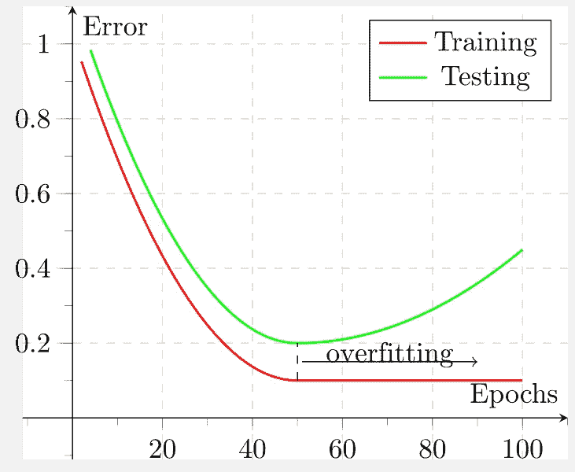
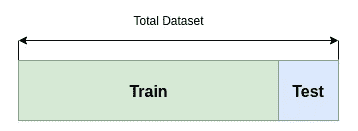
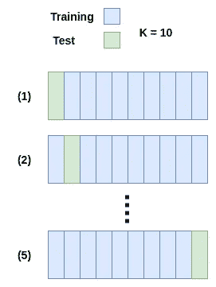

# 为什么以及如何对机器学习进行交叉验证

> 原文：<https://towardsdatascience.com/why-and-how-to-do-cross-validation-for-machine-learning-d5bd7e60c189?source=collection_archive---------13----------------------->

> 想获得灵感？快来加入我的 [**超级行情快讯**](https://www.superquotes.co/?utm_source=mediumtech&utm_medium=web&utm_campaign=sharing) 。😎

交叉验证是一种测试机器学习模型性能的统计技术。特别是，一个好的交叉验证方法给了我们一个模型在整个*数据集中的性能的综合度量。*

所有交叉验证方法都遵循相同的基本程序:

(1)将数据集分成两部分:训练和测试

(2)在训练集上训练模型

(3)在测试集上评估模型

(4)可选地，对一组不同的数据点重复步骤 1 至 3

包括步骤 4 的更彻底的交叉验证方法，因为这样的测量对于选择特定分割可能带来的偏差更稳健。选择数据的特定部分产生的偏差称为 [*选择偏差*](https://en.wikipedia.org/wiki/Selection_bias) 。

这种方法将花费更多的时间，因为模型将被多次训练和验证。但它确实提供了更彻底的显著优势，以及有机会潜在地找到挤出最后一点准确性的分裂。

除了选择偏差，交叉验证也有助于我们避免过度拟合。通过将数据集划分为训练集和验证集，我们可以具体地检查我们的模型在训练期间看到的数据上是否表现良好。如果没有交叉验证，我们永远不会知道我们的模型是在全球范围内令人惊叹，还是仅仅在我们的保护性训练中令人惊叹！

说了这么多理论之后，让我们来看看 3 种常见的交叉验证技术。

An illustration of how overfitting works

# 坚持

维持交叉验证是最简单也是最常见的。我们简单地将数据分成两组:训练和测试。训练和测试数据不能有任何相同的数据点。通常，这种分割将接近 85%的数据用于训练，15%的数据用于测试。下图说明了维持交叉验证的工作方式。

使用非常简单的维持交叉验证的优点是我们只需要训练一个模型。如果它表现得足够好，我们可以继续在任何我们想要的应用程序中使用它。只要您的数据集在分布和“难度”方面相对一致，这就非常合适

当数据集不完全均匀时，会出现维持交叉验证的危险和缺点。在分割我们的数据集时，我们可能会以这样一种方式结束分割，即我们的训练集与测试集非常不同，或更容易，或更难。

因此，我们对维持执行的单一测试不够全面，不足以正确评估我们的模型。我们最终会遇到一些不好的事情，比如过度拟合或者不准确地测量我们的模型预测的真实世界的性能。

如何在 Scikit-Learn 中实现维持交叉验证:`sklearn.model_selection.train_test_split`

# k 倍交叉验证

使用 K-Fold 交叉验证将帮助您克服使用 Holdout 带来的许多缺点。

使用 K-Fold，我们将把我们的数据集随机分成 *K* 个大小相等的部分。然后我们将训练我们的模型 *K* 次。对于每次训练运行，我们从我们的 *K* 部分中选择一个分区作为测试集，并使用其余的进行训练。

例如，如果我们在下面的示例中设置 K = 10，那么我们将训练 10 个模型。每个模型都将在一个独特的训练集上接受训练——蓝色显示的部分。每个模型也将在一个独特的测试装置上进行测试——绿色部分。

为了获得最终的准确性度量，我们对每个模型在各自的测试集上评估的结果进行平均。

K-Fold 交叉验证带来的最大优势是它不容易产生选择偏差，因为训练和测试是在几个不同的部分上进行的。特别是，如果我们增加 K 的值，我们甚至可以更加确定我们模型的稳健性，因为我们已经在如此多的不同子数据集上进行了训练和测试。

这种方法唯一可能的缺点是，当我们通过增加 K 来获得鲁棒性时，我们还必须训练更多的模型——这是一个潜在的冗长且昂贵的过程。

如何在 Scikit-Learn 中实现 K-Fold 交叉验证:`sklearn.model_selection.KFold`

# 重复随机子采样

重复随机子抽样也许是交叉验证方法中最稳健的。

类似于 K-Fold，我们为 K 设置一个值，它表示我们将训练我们的模型的次数。然而，在这种情况下，K 将**而不是**表示大小相等的分区的数量。

相反，在每次训练迭代中，我们随机选择点作为测试集。我们选择的点数将是我们为测试集设置的某个百分比。例如，如果我们选择 15%，那么在每次训练迭代中，我们将在数据集中随机选择 15%的点来进行训练。

其余的程序以与 K-Fold 相同的方式继续。在训练集上进行训练，在其独特的测试集上测试每个模型，最后平均结果以获得最终精度。

这种方法相对于 K-Fold 的明显优势是训练-测试分割的比例不依赖于迭代的次数。如果我们愿意，我们甚至可以在每次迭代中为测试集设置不同的百分比。随机化也可能对选择偏差更具鲁棒性。

这种方法的缺点是，有些点可能永远不会被选入测试子集中，同时，有些点可能会被选择多次。这是随机化的直接结果。然而，使用 K-Fold 可以保证所有点在某个时候都将被测试。

# 喜欢学习？

在 twitter 上关注我，我会在这里发布所有最新最棒的人工智能、技术和科学！也在 [LinkedIn](https://www.linkedin.com/in/georgeseif/) 上和我联系吧！