# 为什么以及如何在 Python 中使用与熊猫合并

> 原文：<https://towardsdatascience.com/why-and-how-to-use-merge-with-pandas-in-python-548600f7e738?source=collection_archive---------1----------------------->

无论您是数据科学家、数据分析师、业务分析师还是数据工程师，都没有关系。

如果你一直在工作中使用 Python—[特别是数据预处理/清理](/the-simple-yet-practical-data-cleaning-codes-ad27c4ce0a38)——你可能在某些方面使用了 Pandas。

# 为什么要“合并”？

您可能遇到过多个数据表，这些数据表包含您希望在一个地方看到的各种信息，在本例中是一个数据帧。

这就是 **merge** 的威力所在，它以一种良好有序的方式高效地将多个数据表组合成一个数据帧，以供进一步分析。

> *“合并”两个数据集是将两个数据集合并成一个数据集，并根据公共属性或列对齐每个数据集的行的过程。*

“合并”和“加入”这两个词在熊猫和其他语言中可以相对互换使用。尽管熊猫有“合并”和“加入”的功能，但本质上它们做的是相似的事情。

也就是说，在本文中，我们将只关注 Pandas 中使用的“合并”功能。

# “合并”到底是什么？

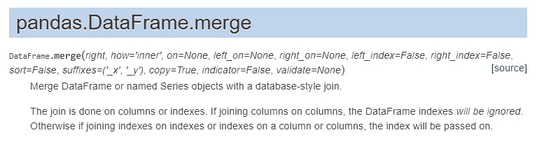

[(Source)](https://pandas.pydata.org/pandas-docs/stable/reference/api/pandas.DataFrame.merge.html)

看了一下[合并函数](https://pandas.pydata.org/pandas-docs/stable/reference/api/pandas.DataFrame.merge.html)(熊猫版= 0.24.1)的文档，乍一看好像是外国的，不太容易被读者(至少对我来说)理解。

在从我的一些朋友和网上资源中寻求更多的信息和解释后，我开始理解这个概念——合并实际上可以用一种更简单的方式来解释，并开始欣赏熊猫合并功能的美丽。

为了理解`pd.merge`，让我们从下面一行简单的代码开始。这行代码的作用是根据两个数据帧的值将两个数据帧——`left_df`和`right_df`——合并成一个，两个数据帧中都有相同的`column_name`。使用`how='inner'`，它将执行内部合并，只合并`column_name`中匹配的值。

`pd.merge(left_df, right_df, on='column_name', how='inner'`

由于方法`how`有不同的参数(默认情况下 Pandas 使用`inner`，我们将研究不同的参数( **left，right，inner，outer** )及其用例。

之后，我们将解释方法`on`，并进一步阐述如果两个数据帧有不同的列名，如何合并它们(提示:将不使用方法`on`)。

下面的解释主要来自 Shane Lynn 的[优秀教程](https://www.shanelynn.ie/merge-join-dataframes-python-pandas-index-1/)，使用的数据(3 个 CSV 文件)来自 [KillBiller 应用程序](http://www.killbiller.com/)。

你可以在这里得到数据[。](https://github.com/shanealynn/Pandas-Merge-Tutorial)

我们开始吧！

# 快速浏览数据

让我们首先了解一下每个数据帧上的以下解释所使用的数据集。

*   **用户使用** —包含用户每月移动使用统计的第一个数据集
*   **用户设备** —第二个数据集，包含个人“使用”系统的详细信息，以及日期和设备信息
*   **android_device** —第三个数据集，包含设备和制造商数据，列出了所有 android 设备及其型号代码

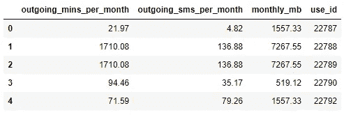

user_usage

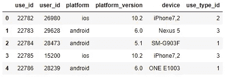

user_device

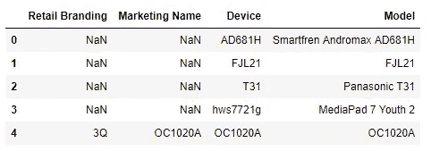

android_device

这里需要注意的是:

1.  列名`use_id`由**用户使用**和**用户设备**共享
2.  **用户设备**的`device`列和**安卓设备**数据帧的`Model`列包含通用代码

# 1.左侧合并

保留左侧数据框中的每一行。如果右侧数据框中缺少“on”变量的值，则在结果中添加空值/ NaN 值。

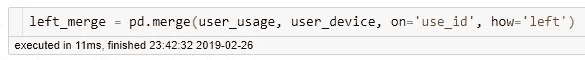

LEFT Merge

通过上面的操作， **left_merge** 与 **user_usage** 具有相同的大小，因为我们使用方法`how`的`left`参数来保留左侧数据帧中的所有行。

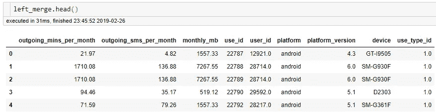

LEFT Merge (Top 5 rows)

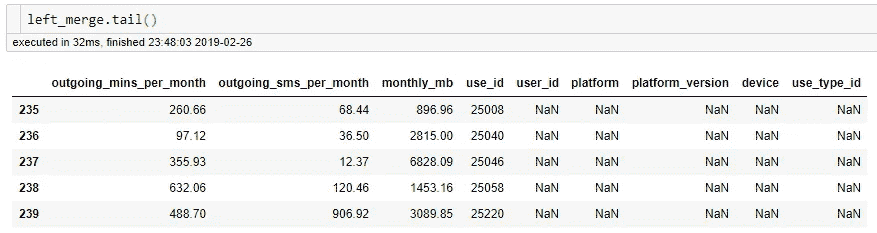

LEFT Merge (Last 5 rows)

正如所料，列`use_id`已经被合并在一起。我们还看到，右侧数据帧中的空值被 NaN 替代— **用户设备**。

# 2.右合并

要执行正确的合并，我们只需简单地将`how`的参数从`left`更改为`right`即可重复上面的代码。

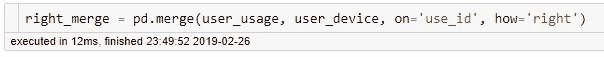

RIGHT Merge

通过上面的操作， **right_merge** 与 **user_device** 具有相同的大小，因为我们使用方法`how`的`right`参数保留了右数据帧中的所有行。

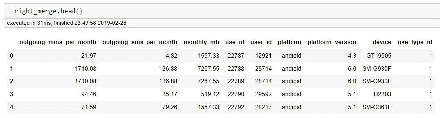

RIGHT Merge (Top 5 rows)

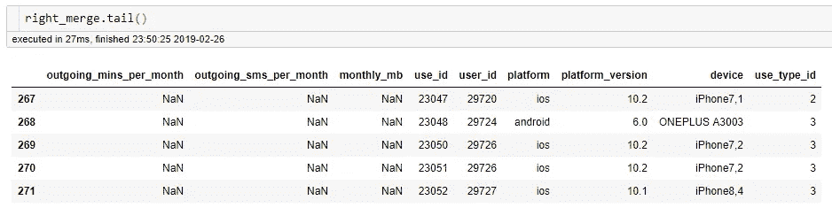

RIGHT Merge (Last 5 rows)

这一次，我们看到左侧数据帧中的空值被 NaN 替代— **user_usage** 。

# 3.内部合并

Pandas 默认使用“内部”合并。这仅保留合并数据的左右数据帧中的公共值。

在我们的例子中，只有包含在 **user_usage** 和 **user_device** 之间共有的`use_id`值的行保留在合并数据 **inner_merge** 中。

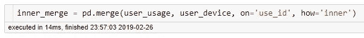

INNER Merge

虽然 Pandas 默认使用“内部”合并，但是上面指定的参数`inner`是显式的。

通过以上操作，合并的数据— **inner_merge** 与原始的左右数据帧(**user _ usage**&**user _ device**)相比具有不同的大小，因为只有公共值被合并。

# 4.外部合并

最后，我们有“外部”合并。

当行中没有匹配的值时,“外部”合并用 NaN 组合左右数据帧的所有行。

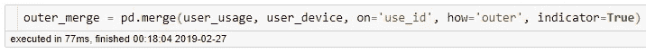

OUTER Merge

注意，方法`indicator`被设置为`True`，以指示每一行在合并数据 **outer_merge** 中的来源。

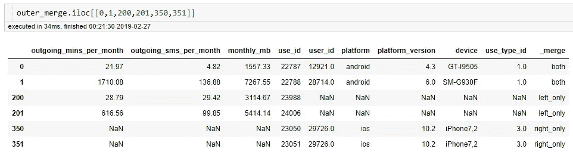

Specified rows in outer_merge

为了进一步说明“外部”合并是如何工作的，我们特意指定了 **outer_merge** 的某些行，以了解这些行来自哪里。

对于第**行和第 2 行**，这些行来自两个数据帧，因为它们具有相同的要合并的`use_id`值。

对于**第 3 行和第 4 行**，这些行来自左侧数据帧，因为右侧数据帧没有`use_id`的公共值。

对于**第 5 和第 6 行**，这些行来自右侧数据帧，因为左侧数据帧没有`use_id`的公共值。

# 💡合并具有不同列名的数据帧

我们已经讨论了如何使用不同的方式合并数据——左合并、右合并、内合并和外合并。

但是方法`on`只适用于左边和右边数据帧中相同的列名。

因此，我们用`left_on`和`right_on`来代替方法`on`，如下图所示。

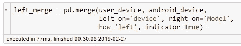

LEFT Merge for dataframes with different columns names

在这里，我们将**用户设备**与**安卓设备**合并，因为它们分别在列`device`和`Model`中包含相同的代码。

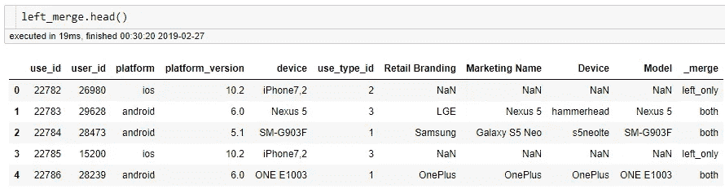

LEFT Merge for dataframes with different column names

# 最后的想法

[(Source)](https://unsplash.com/photos/UFCVxUC-PqM)

感谢您的阅读。

合并不同数据表中的数据是我们作为数据专业人员必须完成的最常见的任务之一。

希望这篇分享在某些方面对你有益。

一如既往，如果您有任何问题或意见，请随时在下面留下您的反馈，或者您可以随时通过 [LinkedIn](https://www.linkedin.com/in/admond1994/) 联系我。在那之前，下一篇文章再见！😄

## 关于作者

[**阿德蒙德·李**](https://www.linkedin.com/in/admond1994/) 目前是东南亚排名第一的商业银行 API 平台 [**Staq**](https://www.trystaq.com) **—** 的联合创始人/首席技术官。

想要获得免费的每周数据科学和创业见解吗？

你可以在 [LinkedIn](https://www.linkedin.com/in/admond1994/) 、 [Medium](https://medium.com/@admond1994) 、 [Twitter](https://twitter.com/admond1994) 、[脸书](https://www.facebook.com/admond1994)上和他联系。

 [## 阿德蒙德·李

### 让每个人都能接触到数据科学。Admond 正在通过先进的社交分析和机器学习，利用可操作的见解帮助公司和数字营销机构实现营销投资回报。

www.admondlee.com](https://www.admondlee.com/)