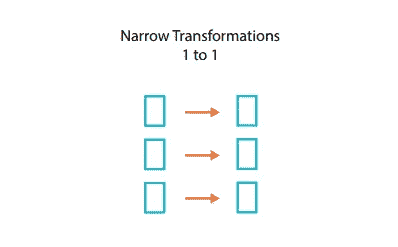
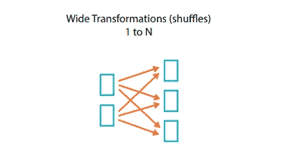

# Apache Spark 为什么快，如何让它跑得更快

> 原文：<https://towardsdatascience.com/why-apache-spark-is-fast-and-how-to-make-it-run-faster-9d31bf3eae04?source=collection_archive---------3----------------------->

Apache Spark logo

Spark 做事很快。自 2010 年首次推出以来，这一直是该框架的主要卖点。

为 Map-Reduce 提供基于内存的替代方案极大地推动了大数据生态系统的发展，在过去几年中，这是公司采用大数据系统的主要原因之一。

凭借其广泛的用例、易用性和创纪录的能力，Spark 迅速成为每个人在大数据架构中处理数据的首选框架。

# 第一部分:火花 ABC

Spark 的关键组件之一是其 SparkSQL 模块，该模块提供了将批量 Spark 作业编写为类似 SQL 的查询的可能性。为此，Spark 在幕后依靠一种复杂的机制来通过执行引擎运行这些查询。这种机制的核心是 Catalyst: Spark 的查询优化器，它通过生成作业的物理执行计划来完成大量繁重的工作。

尽管这一过程的每一步都经过了细致的改进，以优化工作的各个方面。为了让你的 Spark 工作运行得更快，你仍然有很多事情可以做。但是在深入讨论之前，让我们更深入地了解一下 Catalyst 是如何工作的。

## 首先，让我们从基础开始

Spark 提供了多种方式与其 SparkSQL 接口进行交互，主要的 API 是 DataSet 和 DataFrame。这些高级 API 建立在面向对象的 RDD API 之上。他们保留了它的主要特征，同时增加了一些关键特性，比如模式的使用。(详细对比请参考[在 Databricks 博客](https://databricks.com/blog/2016/07/14/a-tale-of-three-apache-spark-apis-rdds-dataframes-and-datasets.html)上的这篇文章)。

要使用的 API 的选择主要取决于您正在使用的语言。DataSet 仅在 Scala / Java 中可用，并且自 Spark 2.0 发布以来取代了这些语言的 DataFrame。每一个都提供一定的额外津贴和优势。好消息是，Spark 使用相同的执行引擎来运行您的计算，因此您可以轻松地从一个 API 切换到另一个 API，而不用担心执行级会发生什么。

这意味着，无论您使用哪种 API，当您提交作业时，它都会经过一个统一的优化过程。

## 火花如何看待世界

您可以在 Spark 应用程序中执行的操作分为两种类型:

*   **转换**:当应用于 RDD 时，这些操作返回对通过转换创建的新 RDD 的引用。一些最常用的转换是`filter`和`map`。([这里是可用转换的完整列表](https://data-flair.training/blogs/spark-rdd-operations-transformations-actions/))
*   **动作**:当应用于 RDD 时，这些操作返回一个非 RDD 值。一个很好的例子是`count`动作，它将一个 RDD 中的元素数返回给 Spark 驱动程序，或者是`collect`，它将一个 RDD 的内容发送给驱动程序。(请参考[此链接](https://jaceklaskowski.gitbooks.io/mastering-apache-spark/spark-rdd-actions.html)了解可应用于 rdd 的完整操作列表)。

数据帧和数据集操作被分为相同的类别，因为这些 API 是基于 RDD 机制构建的。

下一个要区分的是以下两种类型的转换:

*   **窄转换**:当这些转换应用于 RDD 时，分区之间没有数据移动。该变换应用于 RDD 的每个分区的数据，并生成具有相同分区数量的新 RDD，如下图所示。例如，`filter`是一个狭义的转换，因为过滤器被应用于每个分区的数据，并且结果数据代表新创建的 RDD 中的一个分区。

A narrow transformation (Source: Databricks)

*   **大范围转换**:这些转换需要在分区之间移动数据，也就是所谓的**洗牌**。数据在网络间移动，新创建的 RDD 的分区基于多个输入分区的数据，如下所示。一个很好的例子就是`sortBy`操作，在这个操作中，来自所有输入分区的数据都是基于某个列进行排序的，这个列是一个生成新分区的 RDD 的过程。

A wide transformation (Source: Databricks)

因此，当您向 Spark 提交作业时，您提交的基本上是一组动作和转换，Catalyst 会在生成理想的物理计划之前将它们转化为作业的逻辑计划。

# 第二部分:火花魔法

现在我们已经知道了 Spark 如何看待我们提交给它的作业，让我们来看看将动作和转换列表转化为作业的物理执行计划的机制。

## 火花是一个懒惰的魔术师

首先，使用 Spark 时需要记住的一个重要概念是，它依赖于懒惰评估。这意味着当你提交一个作业时，Spark 只会在必要的时候施展魔法——也就是说，当它收到一个动作时(比如当司机要求一些数据或者当它需要将数据存储到 HDFS 中时)。

Spark 不是一收到转换就一个接一个地运行它们，而是将这些转换存储在 DAG(有向无环图)中，并且一收到动作，它就运行整个 DAG 并交付所请求的输出。这使它能够根据作业的 DAG 优化其执行计划，而不是按顺序运行转换。

## 这一切是如何发生的

Spark 依靠 Catalyst(它的优化器)来执行必要的优化，以生成最有效的执行计划。Catalyst 的核心包括一个通用库，专门用于表示树并应用规则来操作它们。它利用了 Scala 中的函数式编程结构，并提供了特定于关系查询处理的库。

Catalyst 的主要数据类型是由节点对象组成的树，它应用一组规则来优化它。这些优化通过四个不同的阶段来执行，如下图所示:

Catalyst’s optimization phases (source: Databricks)

## 逻辑/物理计划

一开始可能不太清楚的一个区别是术语“逻辑规划”和“物理规划”的用法。简而言之，逻辑计划由描述需要做什么的树组成，没有暗示如何做，而物理计划准确地描述了树中的每个节点将做什么。

例如，一个逻辑计划简单地表明有一个连接操作需要完成，而物理计划为这个特定的操作确定连接类型(例如 ShuffleHashJoin)。

现在让我们通过这四个步骤，更深入地研究 Catalyst 的逻辑。

## 第一步:分析

Catalyst 优化管道的起点是一组未解析的属性引用或关系。无论您使用的是 SQL 还是 data frame/Dataset API，SparkSQL 一开始都不知道您的数据类型，甚至不知道您所引用的列是否存在(这就是我们所说的未解析)。如果您提交一个`select` 查询，SparkSQL 将首先使用 Catalyst 来确定您传递的每个列的类型，以及您使用的列是否实际存在。为此，它主要依靠 Catalyst 的树和规则机制。

它首先为未解决的逻辑计划创建一个树，然后开始对它应用规则，直到它解决了所有的属性引用和关系。在整个过程中，Catalyst 依赖于一个 Catalog 对象来跟踪所有数据源中的表。

## 第二步:逻辑优化

在这个阶段，Catalyst 得到了一些帮助。随着 2017 年 Spark 2.2 的发布，引入了基于成本的优化器框架。与基于规则的优化相反，基于成本的优化器使用统计数据和基数来寻找最有效的执行计划，而不是简单地应用一组规则。

分析步骤的输出是一个逻辑计划，然后在第二步中经过一系列基于规则和基于成本的优化。Catalyst 将所有优化规则应用于逻辑计划，并与基于成本的优化器合作，将优化的逻辑计划交付给下一步。

## 第三步:物理规划

就像上一步一样，SparkSQL 使用 Catalyst 和基于成本的优化器进行物理规划。它基于优化的逻辑计划生成多个物理计划，然后利用一组物理规则和统计数据来提供最有效的物理计划。

## 步骤 4:代码生成

最后，Catalyst 使用 quasi quotes(Scala 提供的一个特殊特性)来生成 Java 字节码，以便在每台机器上运行。Catalyst 通过将作业树转换为抽象语法树(AST)来使用这一特性，然后 Scala 对抽象语法树进行评估，然后编译并运行生成的代码。

## 综上

Spark SQL 依靠一个复杂的管道来优化它需要执行的作业，它在这个过程的所有步骤中都使用 Catalyst，它的优化器。这种优化机制是 Spark 的天文性能和有效性的主要原因之一。

# 第三部分:让 Spark 更上一层楼

现在我们已经检查了 Spark 复杂的优化过程，我们很清楚 Spark 依靠精心制作的机制来实现其令人难以置信的速度。但是认为不管你怎么做，火花都会给你带来最佳结果是错误的。

这种假设很容易做出，尤其是在从另一种数据处理工具迁移时。与您一直使用的工具相比，处理时间缩短了 50%,这可能会让您认为 Spark 正在全速运行，并且您无法进一步减少执行时间。问题是，你可以。

Spark SQL 和它的优化器 Catalyst，通过我们上面讨论的过程，可以自己创造奇迹，但是通过一些扭曲和技术，您可以将 Spark 带到下一个级别。因此，让我们来讨论如何从您的角度优化 Spark 作业

## 总是看一下引擎盖下面

使用 Spark 时要记住的第一件事是，执行时间本身并没有太大的意义。要评估作业的性能，了解它运行时发生了什么很重要。在开发和测试阶段，您需要经常使用`explain`函数来查看您希望分析的语句生成的物理计划，为了进行深入分析，您可以添加`extended`标志来查看 Spark SQL 选择的不同计划(从解析的逻辑计划到物理计划)。这是检测潜在问题和不必要阶段的好方法，甚至不需要实际执行作业。

## 知道何时使用缓存

在处理大型数据集和复杂作业时，缓存非常重要。它允许您保存您计划在后续阶段使用的数据集，以便 Spark 不会从头开始再次创建它们。这种优势有时会将开发人员推向“过度缓存”,使缓存的数据集成为一种负担，降低了您的工作速度，而不是优化它。要决定您需要缓存哪些数据集，您必须准备好整个作业，然后通过测试尝试找出哪些数据集实际上值得缓存，以及在什么情况下您可以取消它们的持久化，以释放缓存时它们在内存中占用的空间。高效地使用缓存可以让 Spark 以 10 倍的速度运行某些计算，这可以显著减少作业的总执行时间。

## 了解您的集群和数据

充分利用 Spark 的一个关键要素是根据集群对其配置进行微调。在某些情况下，依赖默认配置可能是可行的，但通常情况下，您离获得更令人印象深刻的结果还差一个参数。选择适当的执行器数量、每个执行器的内核数量以及每个执行器的内存大小都是可能极大地影响您的作业性能的因素，因此请不要犹豫执行基准测试，看看某些参数是否可以优化。

最后，要记住的一个重要因素是，您需要知道您正在处理的数据以及从每个操作中可以得到什么。当一个阶段花费的时间太长，即使它处理的数据比其他阶段少，那么您应该检查另一个阶段发生了什么。Spark 在处理繁重的工作和运行代码方面非常出色，但是只有您能够发现与业务相关的问题，这些问题可能与您定义工作的方式有关。

如果您在开发和实现 Spark 作业时应用了所有这些规则，那么您可以期待破纪录的处理工具会给您带来令人瞠目结舌的结果。

这些建议仅仅是掌握 Apache Spark 的第一步。在接下来的文章中，我们将详细讨论它的不同模块，以便更好地理解 Spark 的工作原理。

> 这篇文章最初发表在 INVIVOO 的科技博客上。

*要了解更多数据工程内容，您可以订阅我的双周刊时事通讯 Data Espresso，我将在其中讨论与数据工程和技术相关的各种主题:*

 [## 数据浓缩咖啡

### 数据工程更新和评论伴随您的午后咖啡。点击阅读数据咖啡，由马赫迪…

dataespresso.substack.com](https://dataespresso.substack.com/)