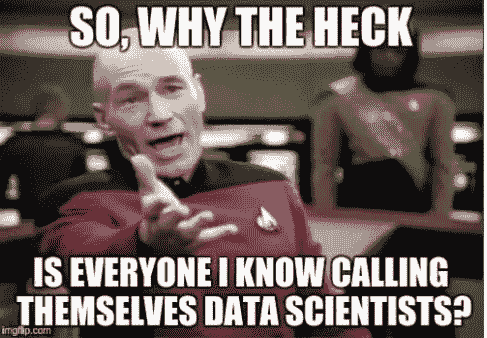
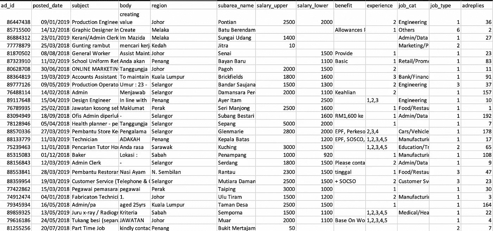
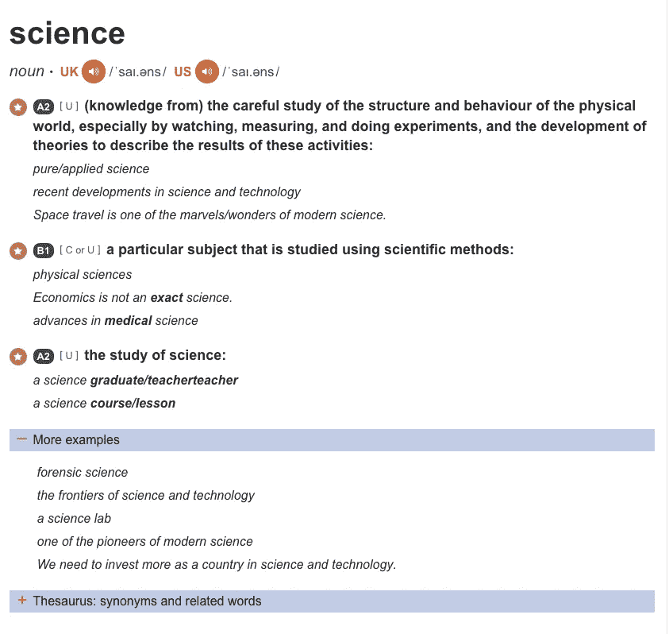
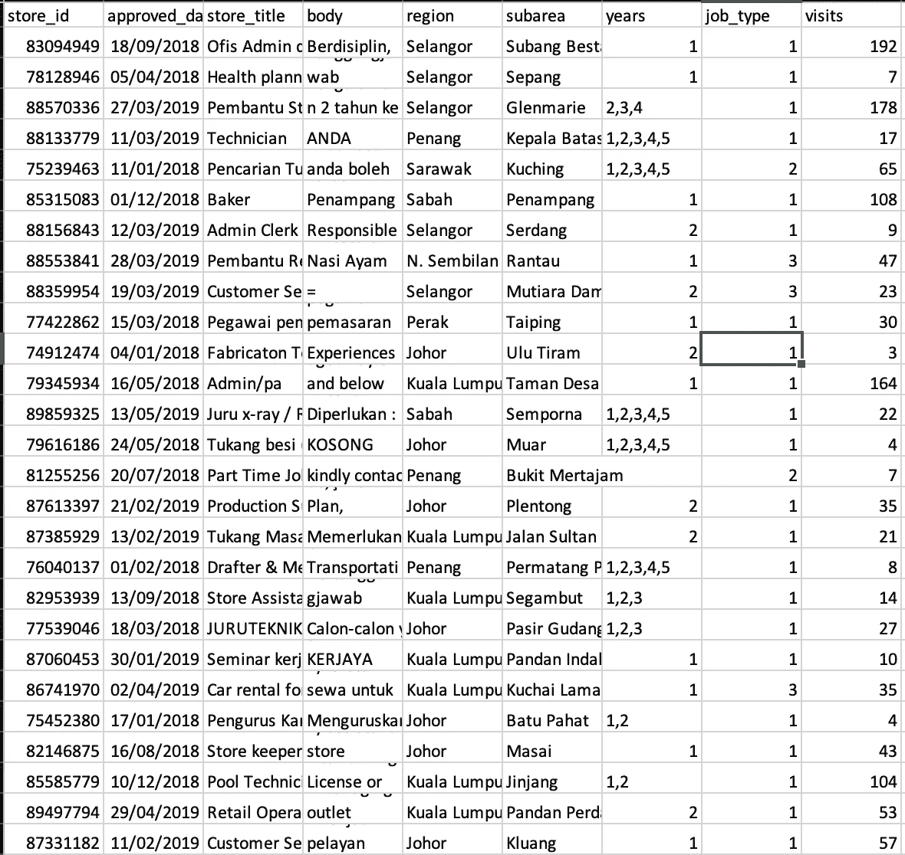
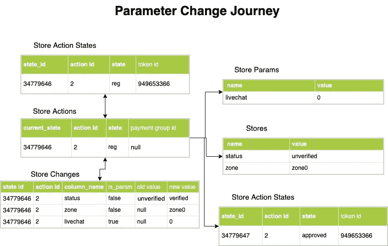

# 为什么数据工程师与数据科学家同等重要

> 原文：<https://towardsdatascience.com/why-are-data-engineers-equally-as-important-as-data-scientists-545898929444?source=collection_archive---------17----------------------->

## 数据工程师重要吗？

Photo by [Proxyclick Visitor Management System](https://unsplash.com/@proxyclick?utm_source=medium&utm_medium=referral) on [Unsplash](https://unsplash.com?utm_source=medium&utm_medium=referral)

我的读者朋友们，你们好。我希望这篇文章能让你心情愉快，因为我可能会惹恼一些人。在过去的几周里，我写了很多基于教程/指南的文章。我想稍微改变一下。本周我们不会接触任何代码。相反，我们将讨论为什么我们应该对所有的数据工程师表现出一些爱心。

Photo by [Krista Mangulsone](https://unsplash.com/@krista?utm_source=medium&utm_medium=referral) on [Unsplash](https://unsplash.com?utm_source=medium&utm_medium=referral)

我一再提到它。**数据**是 20 世纪公司的新燃料。如果你不根据现有数据采取行动，你就错过了。数据从业者利用数据解决业务问题，引入新技术，创新新产品。

你认为 Google Home 是如何诞生的？**数据**

你觉得 Youtube 是怎么知道给你推荐什么视频的？**数据**

**数据，数据，数据。**

公司能够通过查看你的网络浏览模式来预测你的年龄、性别、收入范围和许多其他属性，并据此向你推荐产品，而你甚至不会注意到这一点！数据科学家正在相互竞争，看谁的模型更好，能让他们致富。
正如数据科学家喜欢说的:

> 给我你所有的数据，我会让你变得富有——每一个数据科学家

然而，在所有的幕后，在所有华而不实的模特背后，隐藏着一个真正的英雄。它是一个沉默的守护者，守护着我们部署的模型、自动化系统、数据架构。提供真实燃料进行加工的人。一个完全了解数据的人。确切知道获取什么数据、在哪里、何时、如何以及为什么获取数据的人。我们称他/她为**数据工程师**。

个人认为**数据工程师**没有得到足够的认可。如今，一切都与**数据科学家有关。**

每个公司都需要一个。每个人都想成为其中一员。每个人都是一体的。

为什么我没看到有人吹嘘自己是数据工程师？我的工程师同事在哪里？
好吧，我在这里解释一下为什么数据工程师如此重要。我在这里解释为什么数据工程师应该昂首挺胸。没有他们，甚至没有数据来建模。为了做到这一点，让我们深入了解一下这些职业都做些什么。

# 数据科学家

欢迎来到 2019 年，
“数据科学家”一词被如此盲目地抛来抛去，以至于没有人真正知道数据科学家具体负责什么任务。根据我的经验，这很大程度上取决于公司的性质。

有些 DS 更面向**分析**。
DS 被期望在他们工作的行业中拥有某种**领域/商业知识**。除了提出正确的问题，他们还通过解释他们从分析中发现的可能会或可能不会为该公司带来更高(在此插入指标)的结果，为该公司提供业务解决方案、见解和应采取的步骤。他们做出惊人的**可视化**来帮助他们向利益相关者解释他们的发现，希望说服他们在业务中采取正确的方向。有一个巨大的分析分支要做，客户，流失率，收入，细分，分配和许多更多的，我不打算进入细节。

一些 DS **为公司建造模型**。
越走越深。一些 DS 为某些类型的数据集建立**机器学习模型**，这些数据集很难进行分析。这些模型需要一定程度的数学和编程。举下面这个例子。

这是一个关于网站上职位发布的数据集。根据给出的数据，网站的利益相关者想知道什么样的招聘广告得到最多的广告回复。
也许是主题更长的广告？更高的薪水？
好福利？
某些工作类别？
DS 能够运行**机器学习模型**来回答这样的问题。这可以为管理层带来**最佳决策**，以增加他们优先考虑的任何指标。DS 也能够预测一个新广告的
广告回复。

一些 DS 更加面向技术。
以 Spotify 为例，你注意到他们能够**向你推荐**歌曲(你甚至没有意识到你喜欢这些歌曲)。另一个例子是 Google Home，它实现了一个语音识别机器人，可以回答你几乎所有的问题。像这样的技术是由机器使用**人工神经网络**创造的。DS 用大量数据训练这些机器，让它学会做一些事情作为回报。这个过程并不像你想的那么简单。人们需要知道如何根据某种适当的模型训练机器，优化模型，并在应用程序/网站/产品或任何你命名的东西上部署模型。

问题是，DS 并不局限于一种特定的类型。你可以是一个面向技术的 DS，但仍然为公司做分析。同样，这很大程度上取决于公司对你的要求。
对于数据科学家的官方定义，我们必须回到“科学”的定义。这是剑桥的定义:

source: Cambridge

简而言之，基本上，科学意味着关于事物如何运作的知识。
将“数据”加入其中，你将获得关于数据如何工作的**知识**。
在我看来，数据科学家应该了解数据的本质，它是如何工作的，以及你如何使用它来给出你需要的具体结果。数据科学家将确切地知道在给定需求的情况下对数据集执行哪种方法。数据科学家知道如何将数据处理成所需的任何形状或形式，以便可以对该形状或形式的数据进行某些处理。数据科学家应该了解数据的一切。

但是在科学领域，有像物理、生物和化学这样的专业。因此我们得到:
数据科学—工程学
数据科学—分析学
数据科学—机器学习
这样的例子不胜枚举。

然而，现在有些人自称是数据科学家，他们只懂一点 excel 知识，一些简单的 SQL 和一些可视化技能。我不会说他们这样做是错误的，但我要知道，这个术语被如此明目张胆地到处乱用，以至于如今很难找到一位真正的数据科学家。每个人对 DS 的定义都不一样，所以当你打算称自己为 DS 时，请准备好解释原因。

# 数据工程师

Photo by [Danial RiCaRoS](https://unsplash.com/@ricaros?utm_source=medium&utm_medium=referral) on [Unsplash](https://unsplash.com?utm_source=medium&utm_medium=referral)

数据工程师在科技公司尤其重要。不管你处理的是哪种媒介，数据团队通常不会干预**主数据库**中的数据。这是因为它对数据库来说很重，可能会导致崩溃、介质本身的延迟等问题。还有几个数据库可以存放数据。例如，如果你同时有一个网站和一个应用程序，你的数据可能不会驻留在一个地方。

当 DS 在展示他们的模型时，数据工程师正试图找出他们的数据在数据仓库中如何组织和结构化的核心**基础**,数据分析师/科学家从数据仓库中获得数据。数据工程师创建可扩展的高性能**基础设施**来满足公司的所有数据需求，无论需求来自数据科学家同事还是财务同事。他们通过编写 **ETL** ，或者在我的情况下，编写 **ELT** **管道**来将来自多个来源的原始数据提取到一个数据仓库中，这样团队就可以对它们执行奇特的操作，如**机器学习**、**可视化**等。由于他们是数据仓库基础设施的所有者，数据工程师也在数据仓库本身上构建自动化、功能、实时分析解决方案。函数的一个例子是类似于 [Gmail 数据管道](/data-engineering-how-to-build-a-gmail-data-pipeline-on-apache-airflow-ce2cfd1f9282)——一个直接从你的 Gmail 收件箱中提取数据的数据管道。

数据工程师通过使用不同的技术如 **GCP** 和 **AWS** 来完成上述所有任务，表明他们在这些领域的知识。他们在研究哪种技术能为他们试图实现的目标提供最佳解决方案方面发挥着重要作用。就我而言，我对使用
**Apache Airflow** 很有经验，因为它是我在公司提取数据的主要 **ELT** 工具。我还接触了谷歌云功能、谷歌应用脚本、谷歌 BQ、AWS 和其他一些技术。我也写过一篇如何从零开始操作阿帕奇气流的文章，你可以在这里阅读[。](/data-engineering-basics-of-apache-airflow-build-your-first-pipeline-eefecb7f1bb9)

在我看来，数据的工程方面是 it 科学的一部分。就像积木一样，工程师是将碎片组装在一起的人。他们就像数据管道工，从零开始了解数据。他们能够回答以下问题:

*   当站点上发生事件时，主数据库中会发生什么？
*   为什么数据仓库中的表是这样构造的？
*   为什么我们使用 GCP 而不是 AWS？
*   为什么上报的数据总是不准确？
*   为什么我们每天提取数据，而不是每小时？
*   表格中的这一栏是什么意思？

也就是说，公司的利益相关者只关心我们是否能以他们的方式回答他们的**业务问题**。因此，使用数据仓库中的数据来做他/她想做的任何事情，以实现这一目标，这取决于数据科学家。许多人没有意识到，数据科学家通常会获得已经由数据工程师在内部转换的数据，这些数据可以轻松阅读、理解并输入复杂的机器学习模型，以便产生他们的研究结果。不从他们那里拿走荣誉，数据科学家必须对业务进行实验、试运行和深入研究，以知道如何处理数据。然而，工程师们已经部分完成了大量的数据工作。这里有一个例子:

这是一个关于**商店导向网站中**商店**的数据集。**
假设我们可以从数据仓库中的 **Stores** 表中获得这个数据集。它非常简单易懂。
商店、商店的参数以及访问量指标。
然而，数据并未记录在**主数据库**中。相反，在母版中记录数据的规则和方法通常对用户不友好。为了更好地解释它，我做了一个流程图:

Note: Not all columns are included

下面是在**主机**中发生的事情。
一旦存储注册，存储动作状态表中就会出现一行，指示新存储的注册以及该存储附带的所有参数。然而，该商店的用户可以在任何给定时间改变商店参数。例如，如果商店类别是珠宝，店主可能在一段时间后想卖其他东西，他/她于是将商店类别改为电子产品。这也被记录在商店动作状态表中，作为具有新的**状态 ID** 的新行。与此同时，商店活动表记录了一个新行，说明商店的活动，即“参数更改”活动。然后，存储更改表记录多行，指示被更改的列的更改。系统批准更改后，更改的新值将在存储和存储参数表中更新。然后，存储动作状态表记录一个具有新的**状态 ID** 的新行，表明它已经被批准。

如果我在这里失去了你，那就是重点！

这种形式的数据对于正常人来说既不可读也不容易理解。每个数据库记录数据的方式不同，这只是众多例子中的一个。如果你要回答这样的问题:

*   如果商店类别现在是“X ”,那么一天前也是“X”吗？
*   商店什么时候改变了它的商店名称？
*   五月份“柔佛”地区有多少家商店？

这种表格形式不能直接翻译。因此，数据工程师制作**转换后的**表格，这样每个人都可以很容易地阅读这些信息，这也是数据科学家通常得到的。他们的主要关注点之一是设计数据仓库中这些表的**架构**，以便所有信息都可以通过简单的 **SQL** 连接轻松访问。所以，请我的数据从业者同事们，明天请你们的数据工程师喝杯咖啡吧。

Photo by [Tyler Nix](https://unsplash.com/@jtylernix?utm_source=medium&utm_medium=referral) on [Unsplash](https://unsplash.com?utm_source=medium&utm_medium=referral)

# 判决

你难道不喜欢一点戏剧的味道吗？你认为谁更相关？

> 科学家可以发现一颗新星，但他不能制造一颗。他将不得不请一位工程师为他做这件事。戈登·林赛·格莱格

让我们把事实摆出来。没有数据工程师，科学家们甚至不会有任何数据。如果没有他们，当科学家们问:“这个专栏是什么意思？”这个问题比你想象的更常被问到。你可能会反驳，到时候他们会问开发商！在这种情况下，开发人员就是数据工程师。简单地说，数据科学家是数据工程师的内部客户，他们依靠数据工程师获得可靠、有用和“好”的数据，这让他们的生活轻松 10 倍。

然而，工程师无法回答商业问题，因为他们在那个领域没有经验。数据科学家通常拥有他们所在领域的业务知识，能够提出正确的问题，建议正确的解决方案，并为特定需求找到正确的指标。他们就像首席执行官的大脑，以便他做出正确的决定。

因此，我认为角色**与**相辅相成。两者缺一不可。你不会希望在没有建立适当的数据管道的公司雇用一名数据科学家，希望他/她会钻研所需的核心数据工程。这完全是浪费你公司的资源、这个人的时间、能力和技能。数据工程师和科学家的技能组合对于确定组织中数据的价值至关重要。两者协调工作，互相沟通也很重要。

现在有许多种数据团队正在形成，其中一些由数据工程师和科学家组成，而另一些则纯粹由科学家组成。就我而言，我大量参与工程任务，同时也为公司进行分析。如果你不喜欢其中的一个，我建议在进入之前先问清楚你申请的职位的性质。

然而，当谈到部署**机器学习模型**时，我不会把所有鸡蛋都放在数据科学家的篮子里。如果你已经读到这里，你会明白工程师们完全理解**所有**他们可用的(和不可用的)数据。因此，我认为他们是为你的媒体实现机器学习模型的最佳候选人之一。如果你不理解你的数据，你将如何决定在你的模型中包含什么和排除什么来优化它？

> 你应该对什么是什么有个大概的了解。

此外，数据工程师更擅长各种各样的**技术**。他们习惯于在网站和应用程序上部署模型，他们理解容器的工作方式，他们理解 API 的工作方式，以及许多其他科学家没有经验的解决方案。他们在编写**干净的**代码、诊断和调试方面更有经验。他们可以很好地处理缺失数据、不一致的数据类型和格式、时区、模型的可伸缩性和持久性，因为他们习惯于转换和清理数据。他们有很酷的 GitHub 推/拉方法。更好的是，如果他们意识到数据集中缺少了什么，他们可以立即得到它，即使它不在数据仓库中。因此，你会看到如今数据工程师越来越多，称自己为
**机器学习工程师。**这些人完成了以上所有工作，还有一些。

希望看完我的文章，你更了解数据工程师。你意识到他们是让世界运转的人。所以请给他们一些爱。不要歧视，继续学习。
毕竟数据从不睡觉。

## 订阅我的时事通讯，保持联系。

***感谢*** *的阅读！如果你想与我取得联系，请随时在 nickmydata@gmail.com 上联系我或我的* [*linkedIn 个人资料*](https://www.linkedin.com/in/nickefy/?source=post_page---------------------------) *。也可以在我的*[*Github*](https://github.com/nickefy?source=post_page---------------------------)*中查看代码。*