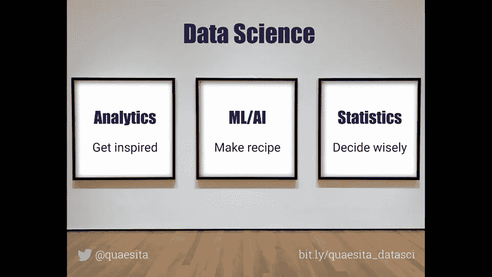
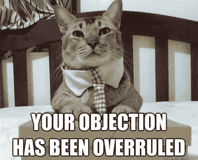

# 为什么 p 值像针一样？分享它们很危险！

> 原文：<https://towardsdatascience.com/why-are-p-values-like-needles-its-dangerous-to-share-them-b94c11be537?source=collection_archive---------8----------------------->

## 这是一场关于 p 值的战争…双方都是错的

Image source: istock.com/brianajackson

对于一个几乎在每个 STAT101 课堂上教授的概念，围绕 p 值的争论数量是惊人的(T2)。作为一名统计学家，我既支持 T4 的观点，也支持贝叶斯的观点，让我试着帮你避开这些噪音。我将愉快地对双方都不敬。

如果你是 p 值的新手，花点时间看看我用小狗做的[简单解释或者上面的视频，让你熟悉一下。简而言之，p 值是一种决策工具，它告诉你是否应该](http://bit.ly/quaesita_puppies)[对你的](http://bit.ly/quaesita_fisher)[无效假设](http://bit.ly/quaesita_damnedlies)感到可笑。

# 反对 p 值的理由

当人们(通常是贝叶斯人)批评 p 值时，通常可以归结为两个论点之一:

1.  涉及定义或公式的东西。通常包括*“后验概率更好”*在某处。
2.  涉及对潜在滥用的焦虑。

请允许我把这些翻译成我听起来的样子:

1.  我不喜欢你制定统计决策的方式。
2.  懒人就是懒。

## 论据 1(反对)

如果你一直在做第一个论证…好吧，这会让你看起来很糟糕。那就是你忘记了统计学是改变你想法的科学，你可以根据自己的想法来制定决策，然后选择合适的工具。(此外，如果你更擅长数学而不是做决定，那就退出吧！)

> 选择正确的方法取决于决策者希望如何做出决定。

如果你想要一种合理的选择行动的方式，并且你在考虑如何最小化选择错误行动的风险，那么频繁主义者的方法并不是那么邪恶。如果你更喜欢考虑用数据来发展你的个人观点，那么贝叶斯方法更有意义。

选择正确的方法取决于决策者希望如何做出决策，因此这里没有放之四海而皆准的方法。这种东西有许多正确的答案……偏好和哲学立场与它息息相关。为什么有些人对把事情做好如此趾高气扬，而那些事情本来就是主观的，没有正确的答案？这让我困惑。

## 论据 2(反对)

论点 2(滥用的可能性)是合理的，但这不是 T2 p 值 T3 的错。事实证明，使用[统计数据](http://bit.ly/quaesita_statistics)仔细做决定需要努力，但人们一直在寻找神奇的不费力气的魔法，这能给他们带来一个水晶球。神秘的 [p 值](http://bit.ly/quaesita_puppies)很诱人——它的大多数用户不知道如何使用它，由此导致的电话故障已经达到了可笑的程度。我支持你。

这就是为什么我大力提倡放松。换句话说，我喜欢做出[基于数据的决策](http://bit.ly/quaesita_inspired)，如果你不愿意付出努力，就不要把自己当回事。对那些感觉懒惰的人来说，最好的解决办法是:做描述性分析，保持谦逊。

> 如果你不愿意付出努力，选择[描述性分析](http://bit.ly/quaesita_datasci)并保持谦逊。

只有当你以一种完全尊重你建立决策框架和假设的有意方式的方式严谨地进行时，统计推断才有意义。这不是一个 [p 值](http://bit.ly/quaesita_puppies)的问题。这是一个蛇油问题:[统计数据](http://bit.ly/quaesita_statistics)经常被当作神奇的万灵药出售，声称提供的保证如果你停下来想一想就会觉得很疯狂。没有魔法能把不确定性变成确定性……但不知何故，有许多骗子却在暗示相反的事情。

# p 值的情况

你也应该怀疑任何宣称狂热热爱 p 值的人。它们只在非常特殊的情况下有用。但是当 p 值有用时，它们非常有用。

> 它们是以特定方式做出决策的有用工具。

很难挑战这一点。对于希望在不确定的世界中尽最大努力并以特定方式做出决策的决策者来说，p 值是完美的。不要因为你喜欢用不同的方式做决定而扫他们的兴——当轮到你做决策者时，你可以随心所欲地做。

# p 值的另一种情况

如果你对[分析](http://bit.ly/quaesita_hero)(而不是[统计](http://bit.ly/quaesita_statistics))感兴趣， [p 值](http://bit.ly/quaesita_puppies)可能是总结数据和迭代搜索的有用方法。请不要像统计学家那样解读它们。除了在这些*数据中有一个模式之外，它们没有任何意义。[统计学家和分析师](http://bit.ly/quaesita_battle)可能会大打出手，如果他们没有意识到[分析](http://bit.ly/quaesita_versus)是关于数据中的内容(仅限！)而[统计](http://bit.ly/quaesita_statistics)是关于数据之外的东西。*

> 当你在做[分析](http://bit.ly/quaesita_datasci)的时候，不要使用[假设 T21*这个词，否则你会听起来像个白痴。*](http://bit.ly/quaesita_damnedlies)

对于一个[分析师](http://bit.ly/quaesita_hero)，一个 [p 值](http://bit.ly/quaesita_puppies)仅仅是另一个[统计量](http://bit.ly/quaesita_vocab)，除了*之外没有任何解释“这是我以一种特定方式摇动数据集时得到的数字，当它很小时，这意味着我的数据集具有某种模式”*——把它想象成一种有效可视化复杂和大型数据集的方式。当你用 analytics*探索数据时，不要使用 [*假设*](http://bit.ly/quaesita_damnedlies) 这个词，否则你会听起来像个白痴。你用事实工作:*这些*数据有*这个*模式。句号。

To learn more about the difference between the subfields of data science, see bit.ly/quaesita_datasci.

受够了[分析](http://bit.ly/quaesita_analysts)——没有战斗(就像没有超越*的规则一样，“不要做出超越数据的结论！”*)。回到[的统计数据](http://bit.ly/quaesita_statistics)，这里的争论很激烈！

# 置信区间代替 p 值的情况

你走错房间了，伙计。回到[分析](http://bit.ly/quaesita_analysts)，置信区间*是*一种更有效的可视化和汇总数据的方式。在统计决策中，没人在乎。为什么？使用置信区间和 p 值得到的决策*是相同的*。如果你在做真正的统计推断，你应该对任何非美学的理由漠不关心。

(的确，这对未来的数据探索者——分析师——是一种恩惠，如果你用置信区间报告你的结果，但这与你决策的质量无关。)

# 回归基础

让我们回顾一下 [p 值](http://bit.ly/quaesita_puppies)具有统计学意义的情况。首先，你围绕[默认行为](http://bit.ly/quaesita_damnedlies)的概念建立你的决策，你给[数据](http://bit.ly/quaesita_hist)一个说服你放弃它的机会。你没有试图形成数学上可描述的观点(用贝叶斯理论)。你愿意按照这篇博文中的逻辑做出决定。如果不是，p 值不适合你。没什么好争的。对于某些工作来说，它们是很好的工具，但是如果那不是你需要做的工作，那就去找一个更好的工具。从什么时候开始，我们希望一种工具适合所有工作？！

既然你已经决定用经典方法测试假设，让我们看看你如何计算 p 值。

# 创造零世界

一旦你正式陈述了你的零假设(在你完成了[这个](http://bit.ly/quaesita_damnedlies)之后)，大部分工作将是可视化零假设世界，并弄清楚那里的事情是如何运作的，这样我们就可以制作一个玩具模型。

这就是你可能还记得的统计课上那些晦涩难懂的涂鸦的要点——它们归结为建立一个宇宙的数学模型，其规则由[零假设](http://bit.ly/quaesita_damnedlies)支配。你用方程式(或通过模拟)来构建宇宙！)这样下一步就可以考察了。

> 数学就是建立一个零假设宇宙的玩具模型。这就是获得 p 值的方法。

The math is all about making and examining toy universes (how cool is that, fellow megalomaniacs!? So cool!) to see how likely they are to spawn datasets like yours. If your toy model of the null hypothesis universe is unlikely to give you data like the data you got from the real world, your p-value will be low and you’ll end up rejecting the null hypothesis… change your mind!

# 假设，假设，假设

自然，你必须做出一些简化的[假设](http://bit.ly/quaesita_saddest)，否则你会很快不知所措。没有人有时间去创造一个像我们实际生活的宇宙那样丰富和复杂的世界，这就是为什么[统计](http://bit.ly/quaesita_statistics)不会给你一个大写的真相，而是一个在不确定性下做出[合理决定的方法……受制于你愿意走的一些捷径。(这也是为什么](http://bit.ly/quaesita_pointofstats)[统计学究看起来那么傻](http://bit.ly/quaesita_saddest)。)

在 STAT101 中，那些假设往往会被[灌输给你](http://bit.ly/quaesita_damnedlies)因为“*数据是正态分布的……等等等等。*“在现实生活中，你必须自己提出假设，这可能会让人感到害怕，因为突然间没有正确的答案了。

> 在现实生活中，没有正确的答案。我们能做的最好的事情就是以一种感觉合理的方式做决定。

如果 p 值是为别人计算的，对你可能没用。它应该只在选择做出相同的简化假设并以相同的方式制定决策的人之间分享。

> 使用别人的 p 值是很危险的…它们就像针一样:如果你要使用它们，就去用你自己的！

统计决策总是主观的，无论是贝叶斯还是频率主义，因为你总是要做出简化的假设。这些结论只有在你接受这些假设的情况下才有效，这就是为什么如果有人没有看到你的笑点所基于的假设，就期望他们同意你的笑点是很奇怪的。我们为什么要这么做？不知道。我不知道。如果我不愿意考虑我想如何做决定，以及陈述的假设是否适合我(在我看到数据或 p 值之前)，那么我在 p 值中看到的就是一个[分析师](http://bit.ly/quaesita_analysts)看到的:在一些设置被扭曲后，你看到了一个模式。真可爱。当我看云的时候，有时我[也会看到动物](http://bit.ly/quaesita_inkblot)。如果我想认真对待它，我会在[其他数据](http://bit.ly/quaesita_history)中跟进这个“洞见”。否则，我会把它当作模糊的灵感…在这种质量下，谁会在乎它有多好呢？

# 这个证据让你吃惊吗？

既然你已经想象了描述你的零假设的世界，你将会问你得到的证据——你的[数据](http://bit.ly/quaesita_hist)——在那个世界里是否令人惊讶。p 值就是你的零世界吐出的数据至少和你的一样糟糕的概率。当它很低时，这意味着你的数据在这样的世界里看起来很怪异，这让你觉得自己好像生活在那个世界里很可笑。当它对你的口味来说足够低时——低于你选择的一个称为[显著性水平](http://bit.ly/quaesita_p3)的阈值——这意味着你足够惊讶地改变你的想法，改变你的行动，远离你的[默认](http://bit.ly/quaesita_damnedlies)。否则，你继续做你本来要做的事。

> 将低 p 值解释为:*“某人对某事感到惊讶。”*

谁来定义“荒谬”的含义？决策者(选择假设和显著性水平的人)。如果你没有设置分析，那么对低 p 值的唯一有效解释是:*“有人被某事惊到了。”让我们一起思考一下，如果你不太了解正在讨论的某人或某事，这能告诉你多少。*

这就是为什么 p 值有点像医用针头:它们是供个人使用的，分享它们是危险的。

# 感谢阅读！喜欢作者？

如果你渴望阅读更多我的作品，这篇文章中的大部分链接会带你去我的其他思考。喜欢我的最佳列表吗？试试这个:

 [## 最佳数据科学概述

### 关于数据科学的十篇人人友好的文章

medium.com](https://medium.com/hackernoon/best-of-data-science-overviews-1e73b9c7682) 

# 附录:技术异议

***技术异议你的技术异议(用行话，不好意思):**

*   对于那些将要抗议*的人来说，“这个假设被用于置信区间的计算，这就是为什么我们会使用这个词，而且凯西称每个人(每个人！)傻逼？!"*…虽然计算确实使用了假设，但让我提醒你，分析中的游戏是[速度](http://bit.ly/quaesita_speed)。为什么要滚动自己的测试反演进行探索？有很多包裹准备好了。
*   对于那些将要抗议*“如果我们有所有的数据来* [*确定地测试一个假设*](http://bit.ly/quaesita_hypexample) *的人，那么我们会在我们的真理的光辉中焚化它之前说出‘假设’……*伙计们，这的另一个名字是“查找答案”，是的，你可以使用分析进行基于事实的决策，但是严肃地说:为什么我们在这种情况下谈论 p 值(0)或置信区间，置信点？你已经有了事实，所以不需要统计数据。当你掌握了所有的事实后，可以随意忽略带有标签 *#statistics* 的文章中的任何[该死的谎言](http://bit.ly/liesdamnedlies)，包括这篇文章。

# 感谢阅读！人工智能课程怎么样？

如果你在这里玩得开心，并且你正在寻找一个为初学者和专家设计的有趣的应用人工智能课程，这里有一个我为你制作的娱乐课程:

Enjoy the entire course playlist here: [bit.ly/machinefriend](http://bit.ly/machinefriend)

# 喜欢作者？与凯西·科兹尔科夫联系

让我们做朋友吧！你可以在 [Twitter](https://twitter.com/quaesita) 、 [YouTube](https://www.youtube.com/channel/UCbOX--VOebPe-MMRkatFRxw) 、 [Substack](http://decision.substack.com) 和 [LinkedIn](https://www.linkedin.com/in/kozyrkov/) 上找到我。有兴趣让我在你的活动上发言吗？用[这个表格](http://bit.ly/makecassietalk)联系。