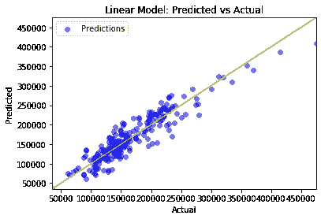
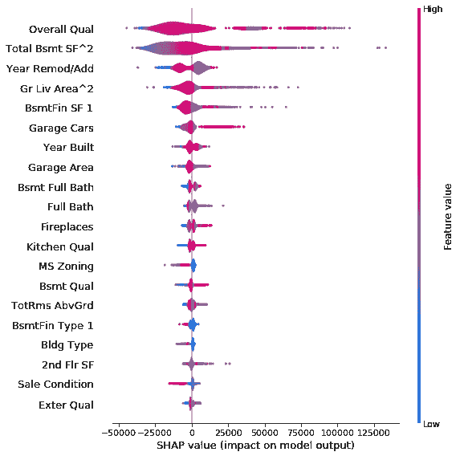
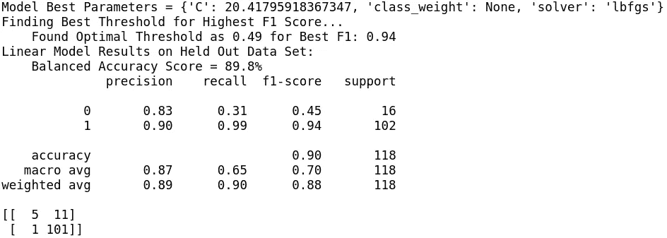
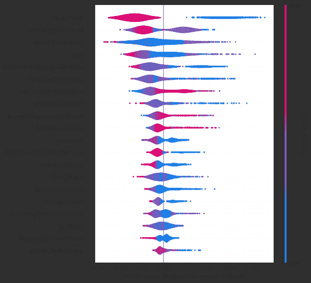
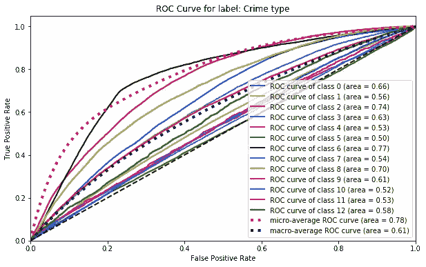
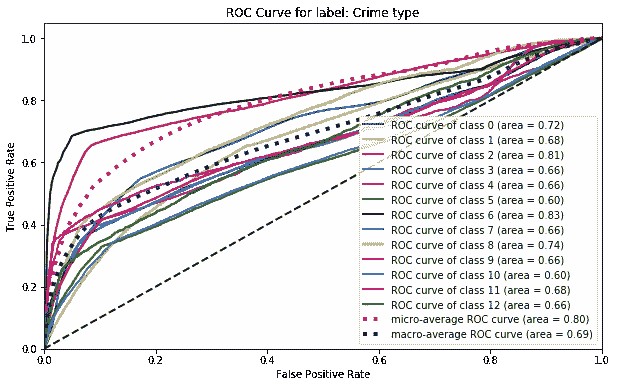
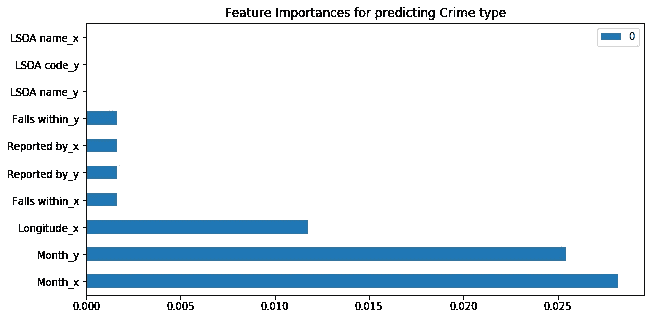

# 为什么 AutoML 是数据科学家必不可少的新工具

> 原文：<https://towardsdatascience.com/why-automl-is-an-essential-new-tool-for-data-scientists-2d9ab4e25e46?source=collection_archive---------18----------------------->

机器学习(ML)是当前通过利用利用计算机智能的算法来建模统计现象的范例。常见的地方是建立预测房价的 ML 模型，根据用户的潜在营销兴趣聚集用户，并使用图像识别技术来识别脑瘤。然而，到目前为止，这些模型都需要小心翼翼地反复试验，以便在看不见的数据上优化模型性能。

自动机器学习(AutoML)的出现旨在通过提供设计良好的管道来处理数据预处理、特征选择以及模型创建和评估，从而抑制所需的资源(时间和专业知识)。虽然 AutoML 最初可能只吸引那些希望利用 ML 的力量而不消耗宝贵的预算和雇用熟练的数据从业者的企业，但它也包含了成为有经验的数据科学家的无价工具的非常强的承诺。

由于当前机器学习工具的谬误，数据科学家经常难以在拥挤的时间线内产生有效的模型。他们与不灵活的框架、缺乏跨平台的可复制性、协作障碍以及尚未完全开发的软件工具作斗争。目前市面上有许多不同的 AutoML 工具，但它们都有各自的缺点。通常，它们将用户限制在一个严格的工作流程中，并且可以充当黑盒；他们产生了令人印象深刻的结果，但几乎没有可解释性和再现性。对于自动建模软件实际上是如何得到最佳模型的，或者为什么它选择保留某些特征而不保留其他特征，几乎没有给出解释。一些数据科学家也觉得避免使用这些工具是一种骄傲。毕竟，如果数据科学家的整个工作流程可以被自动化工具取代，那么他们存在的理由是什么？

AutoML 领域非常拥挤，有许多 AutoML 选择，从免费的开源工具如 WEKA 或 Auto-Sklearn 到最昂贵的平台如 Data Robot、H2O 无人驾驶 AI 和 Dataiku。虽然网上有很多关于这些工具的文章，但我想我会根据我最近参加的一个由设计者和作者参加的演示来尝试一下这个领域的一个新成员。

# 输入 Auto_ViML

该工具被称为“Auto_ViML”或“自动变体可解释机器学习”(发音为“Auto_Vimal”)，这是一个开发的库，作为一个功能齐全但免费的 AutoML 管道如何有效地促进当代数据工作流的主要示例。

AutoViML 是输入不可知的，这使它能够接受任何熊猫数据帧形式的数据集。它执行类别特征转换和简单的数据清理步骤，例如将缺失值标识为“缺失”,以便让模型决定如何使用它们。

该库的独特优势之一是它自动执行特征缩减(或特征选择),以产生最简单的模型，在这种情况下，该模型具有产生合理的高性能所需的最少数量的特征。我发现 AutoML 生成的模型自动减少了所选特征集中的多重共线性，并通过迭代一系列超过 15 个不同的 ML 选项生成了一个性能良好的模型(详见下文)。最重要的是，它不仅产生了性能最好的模型(基于您的评分标准)，而且还提供了详细而冗长的输出，允许大量的理解和模型可解释性(因此 Auto_ViML 名称中有术语“可解释性”)。

我决定用几个著名的数据集来测试 Auto_ViML。开始使用 Auto_ViML 就像 1–2–3 一样简单:

*   通过“pip install”安装 Auto_ViML
*   将数据集加载到数据帧中，并将其分为训练和测试
*   用一行函数调用 Auto_ViML

我已经把我实验用的 Jupyter 笔记本附在这里了。

# 埃姆斯住宅数据集的线性回归

通过使用 Auto_ViML 测试各种不同的数据集，Auto_ViML 工作流的优势得到了有效的展示。automodeller 首先创建了一个非常有效的线性回归模型，用于使用 Ames Housing 数据集预测房屋的销售价格。数据被分成训练集和测试集，并提供一个目标变量作为 Auto_ViML 的参数。所有这些都可以在一行中完成:

回归分析为处理住房数据的最有效方法提供了强有力的见解。通过让 Auto_ViML 创建多项式项(包括交互)来创建最佳拟合线。这种内置的功能工程将 RMSE 从 25640.78 美元降低到 23255.65 美元，在预测房价方面有了明显的改善。根据外部评估，最终模型的 R2 为 0 . 91。

该库还生成了一个要素重要度图，该图表明新添加的地下室总平方英尺和地面居住面积平方英尺多项式变换与目标变量具有很强的指数关系。最终的模型采用了套索正则化和 79 的 alpha。能够让 Auto_ViML 过程理解哪些特征转换最相关，哪些特征在对目标变量建模时最没用，以及最适合这个问题的模型正则化的类型和强度，这是很有见地的。

*当 verbose = 2 和 Boosting_Flag = True 时，Auto_ViML 智能地合并了 SHAP 特性重要性图，以便采用 XGBoost 模型。*

# 员工流失分类

Auto_ViML 以类似的洞察力处理了一个二进制分类问题。它发现，当使用 IBM Watson HR 数据集时，高度正则化的逻辑回归模型(C = 20)能够最好地预测员工的流失概率。自动建模器直观地知道优先召回积极类(一个选择离开公司的雇员)，这是一个适合这个特殊问题的优化。Auto_ViML 计算出 F1 分数为 0.94 的最佳阈值为 0.49，得出的结论是单个模型在这项任务中表现非常好。

员工流失问题不仅需要强大的预测准确性，还需要了解员工流失的潜在动态。AutoViML 的特性重要性图表准确地指出了识别员工流失的一些更具预测性的因素，如员工的工作投入程度以及他们是否必须加班或拥有股票期权。在一个有如此多内置特性的数据集中，这个 Auto_ViML 管道还指出了那些与其他特性高度相关从而冗余的特性。Auto_ViML 发现，员工的总工作年限、在当前职位上的工作年限、在现任经理手下的工作年限以及年薪并不是特别有用的特征。其中一些观察结果令人惊讶，因为数据科学家可能会认为他们应该在对员工流失建模时突出这些特征属性。来自 AutoML 的见解有助于指导数据科学工作流，成功地引导建模管道清除可能在功能工程流程中转移注意力的不必要功能。

# 使用 Auto_ViML 进行犯罪预测

包含数百万条观测数据的大型数据集通常会给数据科学家带来巨大挑战。这些数据存储迫使数据从业者处理争论和清理数据，同时还试图揭示隐藏在数据中的潜在趋势和预测因素。为了观察 Auto_ViML 处理大型数据集的能力，我选择了来自 Kaggle 的具有 1m+行和 7 个特征的伦敦犯罪记录数据集进行下一次测试。

为了预测伦敦警察记录数据集中出现的各种犯罪，能够使用 Auto_ViML 的不平衡标志来完成这项任务是很有用的。大量的数据观察也有助于试验 Auto_ViML 的模型堆叠功能，如下所示:

运行有和没有叠加的两个测试表明，模型叠加提供了更强的宏观平均 F1 分数(从 0.06 提高到 0.31)以及更强的 ROC-AUC 分数，这意味着模型置信度已经提高。

ROC 曲线的比较证实了这种改善。

*ROC 曲线表明，与单一模型输出(顶部)相比，采用模型堆叠(底部)后，模型具有更大的置信度。*

可悲的是，模型堆叠导致了可解释性的丧失；最初的单一模型实验解释说，犯罪的月份和地点是预测犯罪类型的两个最重要的特征，但堆叠输出只是将决策树输出作为最重要的特征。这表明，就性能而言，模型堆叠是解决这个问题的合适方案，但是通过改变 Auto_ViML 测试的属性来获得多个视角仍然是有用的。

*Auto_ViML 的默认特性重要性图表，没有 SHAP。*

# 结束语

AutoML 不仅能够快速创建准确的模型，而且如果一个库提供了适当的详细输出，那么就可以收集很好的见解，从而加快理解问题的过程。Auto_ViML 的可解释性是它的主要优势之一；这与当前使用深度神经网络的趋势形成鲜明对比。Cynthia Rudin (2019)感叹道:“准确性和可解释性之间总是存在权衡的信念导致许多研究人员放弃了建立可解释模型的尝试。这个问题因研究人员现在接受深度学习培训，而不是可解释的机器学习培训而变得更加复杂。更糟糕的是，机器学习算法的工具包几乎没有为可解释的机器学习方法提供有用的接口。”像 Auto_ViML 这样的库可以抵制黑盒自动化工具的趋势，并为透明的自动建模提供有力的支持。

AutoML 可以为数据科学家指出特定数据管道的正确模型和正则化工具。自动化过程能够过滤掉可能误导模型的要素，并动态确定多项式要素变换的有效性。数据科学家的偏见常常会扭曲建模过程的结果，并可能将数据从业者引入死胡同。因此，为了获得对问题的完全无偏见的见解，能够将数据集放入 AutoML 管道是非常宝贵的。

虽然数据科学家最终可能仍然会寻求手动调整和评估他们自己的模型，但 AutoML 仍然是收集对问题的初步见解并获得对特征和目标变量关系的客观观点的不可或缺的工具。许多数据科学家现在对使用 AutoML 工具犹豫不决，但在可预见的未来，看到这些资产被纳入探索性数据分析或初始模型实验也就不足为奇了。最好是认可 AutoML 过程，这些过程重新引入了可解读的机器学习模型的范式，而不是快速的黑盒解决方案。然后，这些 AutoML 工具可以有效地成为团队中另一个数据科学家的等价物:一个已经对手头的问题有强大见解和独特解决方案的人。

你可以在这里访问 Auto_ViML [的 github 库。](https://github.com/AutoViML/Auto_ViML)

特别感谢 Ram Seshadri 对 Auto_ViML 数据实验的支持和指导。

***书目***

*C. Rudin，“停止解释高风险决策的黑盒机器学习模型，改用可解释的模型，”arXiv:1811.10154 [cs，stat]，2019 年 9 月。*

*原载于 2019 年 11 月 10 日*[*https://danrothdatascience . github . io*](https://danrothdatascience.github.io/datascience/autoviml.html)*。*