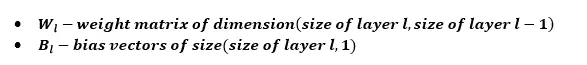
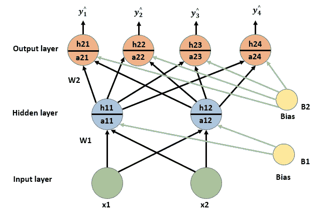
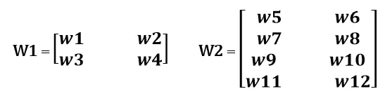
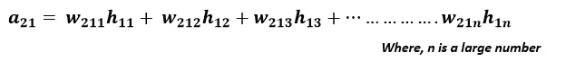
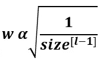
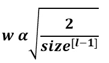

# 为什么更好的权重初始化在神经网络中很重要？

> 原文：<https://towardsdatascience.com/why-better-weight-initialization-is-important-in-neural-networks-ff9acf01026d?source=collection_archive---------19----------------------->

在我深度学习之旅的开始，我总是低估权重初始化。我认为权重应该初始化为随机值，而不知道为什么要随机初始化？为什么没有其他方法呢？权重初始化应该有多大的威力或意义？等等。

这一系列的问题激发了我写博客的灵感，我将在博客中讨论不同的权重初始化技术，每种技术的优缺点，对个别技术的需求等。用更简单的方式。

> **补充说明**
> 
> 本文假设读者对神经网络的概念、前向和后向传播、激活函数、优化算法等有基本的了解。如果你不熟悉，那么我会推荐你关注**我的其他** **关于这些话题的文章**。
> 
> [神经网络中的前向传播——简化的数学和代码版本](/forward-propagation-in-neural-networks-simplified-math-and-code-version-bbcfef6f9250)
> 
> [分析神经网络中不同类型的激活函数——选择哪一种？](/analyzing-different-types-of-activation-functions-in-neural-networks-which-one-to-prefer-e11649256209)
> 
> [为什么梯度下降还不够:神经网络优化算法综合介绍](/why-gradient-descent-isnt-enough-a-comprehensive-introduction-to-optimization-algorithms-in-59670fd5c096)

在继续之前，首先让我们看看整篇文章中使用的参数符号。

## **使用的术语**

考虑一个 *L* *层*网络，具有 *L-2* (不包括输入输出层)*隐藏层*。任意层 *l* 的*参数*表示为

为了得到具有更好和最优结果的神经网络，权重初始化是首先要考虑的步骤。权重初始化不当的网络会使整个学习过程变得繁琐而耗时。因此，要实现更好的优化、更快的收敛，可行的学习过程权重初始化是非常关键的。现在让我们从一些重量初始化问题开始。

# 为什么不简单地将所有权重初始化为零？

考虑一个场景，其中所有的*权重*被初始化为 **0** 。参考下面为*多类分类*问题设计的网络。使用来自`sklearn.datasets`的`make_blobs()`函数生成数据集。数据集有四个不同的类，包含两种不同的要素。网络有一个具有两个神经元的*隐藏*和*输入*层，一个具有四个神经元的*输出*层。

其中 W1 是 2×2 矩阵，W2 是 4×2 矩阵。B1 和 B2 分别是大小为 2 和 4 的列向量。

在隐藏层*预激活*期间

a11 = w1x1 + w2x2 + b1

a12 = w3x1 + w4x2 + b2

a11 = a12(假设 b1 = b2)那么 h11 = h12

类似地，a21 = a22 = a23 =a24，那么 h21 = h22 = h23 =h24

在 w1 和 w3 的*反向传播*期间

注- *此处所示 w1 和 w3 的梯度仅通过单路径计算，事实上，这些梯度是通过考虑多条可能路径上的所有导数计算的。*

如果梯度相等，那么权重将被更新相同的量。连接到同一神经元的权重在整个训练期间继续保持不变。它使隐藏的单元对称，这个问题被称为 ***对称问题*** 。

因此，为了打破这种**对称性**，连接到同一神经元的权重不应被初始化为相同的值。

**要点**

*   切勿将所有重量初始化为零。
*   切勿将所有重量初始化为**相同的**值。

# 我们可以将权重初始化为大值吗？

如果权重被初始化为大值，并且如果使用了 sigmoid 激活函数(logistic，tanh ),则*饱和问题*可能发生，这导致*消失梯度问题。*因此，梯度变化缓慢，学习变得乏味。类似地*爆炸梯度问题*也可能发生。

**要点**

*   切勿将权重初始化为 ***大的*** 值。
*   最好将 ***标准化*** */* ***标准化*** 输入，使它们位于一个小的公共范围内。

# 什么在实践中有效？

知道了零初始化和高值初始化的问题后，还有什么可行的初始化方法呢？

嗯，我们可以按照特定的分布(均匀分布、正态分布、截尾正态分布等)随机初始化权重。

例如，我可以在 Python 中使用`np.random.randn(size_l, size_l-1)`来随机初始化权重，遵循均值为 0、标准差为 1 的标准正态分布。

**但是对于更深更广的网络，隐含层神经元数量多，隐含层数量大，随机初始化可能会产生问题。**

例如，如果在一个隐藏层中有 ***n*** 个神经元，并且如果 ***n*** 是一个非常大的数字，那么在预激活期间

在 a21 中，由于大量的神经元，所有这些加权和都会爆炸。因为 a21 值很高，所以会再次出现饱和问题，这导致梯度消失问题。类似地*爆炸梯度问题*也可能发生。

**如何克服这一点？**

为了处理这些*梯度*问题，我们可以以合适的分布方式初始化随机权重。不使用标准的正态分布，而是使用具有 k/n 方差的正态分布，其中 k 是基于激活函数选择的。

*Xavier Glorot* 和 *He 等人*是更好的随机权重初始化这一概念的第一贡献者。

# tanh 和逻辑激活函数的 Xavier 初始化

*Xavier* 提出了一种更好的随机权重初始化方法，该方法在初始化权重时还包括网络的大小(输入和输出神经元的数量)。

根据这种方法，权重应该与前一层中神经元数量的平方根成反比。

其中权重可以在 Python 中初始化为`np.random.randn(sizes[i-1],sizes[i])*np.sqrt(1/sizes[i-1])`

按照这种方法，隐藏层输入的加权和将不会取很大的值，并且减少了*消失* / *爆发梯度问题的机会。*

# ReLu 和泄漏 ReLu 激活功能的初始化

***He*** 初始化类似于 ***Xavier*** 初始化，其中前一层中神经元的数量被赋予重要性。但是因子是乘以两个而不是一个**和*。***

其中权重可以在 Python 中初始化为`np.random.randn(sizes[i-1],sizes[i])*np.sqrt(2/sizes[i-1])`

***濒死神经元*** 是 *ReLu 激活*功能的常见问题。使用 ReLu 激活功能， ***多达 50%*** 的神经元可能在训练过程中*死亡。为了处理这种情况，在初始化中，该因子乘以**两个**。*

## *结束注释*

*在这个旅程中，到目前为止，我们已经讨论了各种 ***权重初始化*** 方法以及与每种方法相关的问题。建议使用 ***Xavier 初始化**用于***sigmoid 基础*激活函数 ***He 初始化*** 用于 ***ReLu 和 Leaky ReLu*** *激活函数*。******