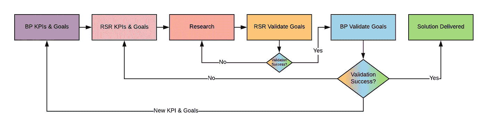
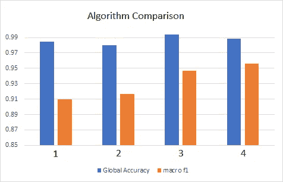

# 为什么业务和产品应该始终定义数据科学的 KPI 和目标

> 原文：<https://towardsdatascience.com/why-business-product-should-always-define-kpis-goals-for-data-science-450404392990?source=collection_archive---------10----------------------->

## 为什么企业或产品应该选择适合他们的 KPI，为什么研究人员应该选择满足企业或产品需求的数学 KPI。

关键绩效指标(KPI)是一种绩效衡量指标，用于评估所参与的组织、项目或产品的绩效。我们需要 KPIs & Goals，以便有一组所有相关利益相关者都同意的期望，这允许我们测量业务影响，并朝着单个结果进行优化。

在业务或产品(BP)团队已经建立的公司中，与数据科学(DS)的良好沟通是必不可少的。DS 团队需要两种类型的 KPI，一种来自 BP 方面，另一种由 DS 团队创建，以满足 BP KPIs &目标。在大多数情况下，DS KPIs 将不同于 BP KPIs。这反过来允许我们定义与之一致的 KPI。很多情况下，这些 KPI 不需要相同！

想象一下，你需要启动一个新项目或修复一个旧模型，但没有 BP KPI。你被告知尽你所能，反复迭代，直到找到一个合适的解决方案。然后你认为你已经弄清楚了 BP 的需求是什么，并为它制定了一个数学 KPI。

这就是为什么我不建议使用迭代过程来拟合 DS KPI 和不是来自 BP 的 BP KPI:

1.  研究过程需要时间。
2.  为了实现某个目标，研究人员可能会检查许多可能的解决方案。
3.  实际上，这可能需要几周时间！

拥有 BP KPI 首先允许利益相关者达成一致，允许我们(DS)专注于满足业务需求的解决方案，最后它更加敏捷，因为它防止了没有明确定义的目标的不必要的长时间迭代。

> "为了达到某个目标，研究人员可能会检查许多可能的解决方案."例如，假设你的利益相关者对分类器有意见，他们抱怨分类器更喜欢对某些类进行分类。有许多可能的解决方案，有些在时间或金钱方面很昂贵，例如注释更多的样本。其他的可以便宜一点；诸如过采样或欠采样、合成采样、影响类别权重或样本权重、推拉精度和召回等解决方案..

## 以下是描述某项任务、BP KPI 或目标以及如何将其转化为 DS KPI 的四个示例，请注意，这些数字是为了解释总体思路而编造的:

任务 1 :创建模型，预测房子是否有空调、t 型洗衣干衣机或热水锅炉等。

注:电力公司有每家每户电器的统计。

*   **产品 KPI** :匹配电子公司统计报表。**目标**:贴近电力公司的期望。
*   **DS KPI** :精度，**目标** : 81%。
*   **DS KPI** :目标分布。**目标**:与电力公司报告相同。即，已知 40%的房屋具有烘干机。因此，我们在分类器上设置了一个阈值，这样 40%的房子都会有烘干机。

**任务二**:改善和优化公司各种场景下的管理费用支出

*   **业务 KPI** :华润。**目标**:减少 10%。
*   **DS KPI** :标注能力。**目标**:使用相同的资源支持多两倍的客户端。
*   **DS KPI** :批注速度。**目标**:提供一个能够将样品注释速度提高 3 倍的解决方案。即，更多的注释允许支持更多的客户端并获得更多的数据。
*   **DS KPI** :关注最相关的标注样本。**目标**:减少 75%的不相关标注。

任务 3:帮助其中一个团队提高工作效率

*   **业务 KPI** :投产时间。**目标**:减少一半。
*   **DS KPI** :精度、召回、任务完成时间。**目标**:创建一个解决任务的自动化流程，准确率 80%，召回率 90%，完成时间不超过 5 分钟。

**任务 4** :基于异常检测创建信号警报

*   **业务 KPI** :客户投诉垃圾邮件提醒的次数。**目标**:减少 50%。
*   **DS KPI** :误报。**目标**:只允许 1%的误报。

## 右度量的虚幻性

在某些场合，你会发现自己处于这样一种情况:产品、业务甚至销售向客户承诺某个产品的某个精确度。我知道有时这是不可避免的，但是，这里有一些关于为什么准确性不总是要考虑的适当 KPI 的争论。

不同的度量组合可以达到相同的精度。某个准确率高的模型，可以有高准确率，低召回率。另一个具有较低精确度的模型可以具有相似的精确度和较高的召回率。我假设大多数客户会选择第一个模型，因为它具有更好的准确性，然而，BP 的需求可能会满足于第二个模型，因为我们希望捕捉更多更精确的样本。

高精度并不能保证好的结果。例如，在图 1 中，我们看到了 4 个多类算法的比较，特别显示了准确性和 F1。如果我们只考虑准确性，算法 3 似乎是最佳候选，但是，由于相似的准确性和最重要的低召回水平，算法 1、2 和 3 不应被考虑，因为算法 4 捕获更多的样本。

Figure1: a comparison of accuracy vs F1 for 4 multi-class algorithms,

底线是准确性并不总是与我们的期望或 BP 的需求相关，选择正确的数学指标应该留给您的研究人员，即 BP 应该选择适合他们的 KPI，ds 应该将其转化为满足 BP KPI 的数学。

## 我提议的流程

下面的流程(图 2。)试图弥合 BP 和 DS 在工作关系、设定 KPI、验证 KPI 并最终交付一个大家都满意的解决方案方面的差距

Figure 2: a proposed flow for when working side by side with business and product

我们从紫色方框开始，BP 有一个新项目，他们定义了 KPI 和目标。DS 团队接受它们(粉色)并开始制定数学 KPIs &目标来满足 BP 的需求。一旦公式化，DS 应该与 BP 进行数学交流，以查看是否有比对。准备就绪后，DS 团队开始研究(橙色)，对 KPI 和目标进行内部验证(黄色)。比如试图达到某个精度点。当 DS-验证步骤完成时，可交付物被传递给 BP 进行验证。BP 通过他们自己的验证阶段(青色)，如果不成功，他们将它交还给 DS 团队进行另一次迭代，如果成功，则交付一个解决方案，每个人都满意(绿色)。在决定需要一个新的 KPI 或一个新的目标的情况下，这个过程从紫色的盒子开始，也就是说，这就像说“我们正在开始一个新的项目”。

我完全承认，一些利益相关方不会完全配合这一想法，可以相当肯定地认为，您将会听到以下评论:

1.  定性的反馈就足够了，因此，我们不需要 KPI 和目标。
2.  某个团队不擅长定义 KPI 和目标。这是产品的工作，以帮助这一点。

定性反馈可能不会很好地转化为满足原始需求的解决方案，此外，如果没有 KPI，当有多个利益相关者和无限数量的可能解决方案时，可能不可能有“完成的定义”。因此，建议联系产品团队，与他们合作定义这些指标。

我希望这些想法能给开始一个新项目或给你的产品添加新功能时出现的混乱带来一些秩序，为你节省一些时间，并希望有助于业务经理、产品经理、数据科学家和研究人员之间的复杂关系。

我要感谢我的同事 Sefi Keller、Samuel Jefroykin、Yoav Talmi 和 Ido Ivry 提供的宝贵意见。

Ori Cohen 博士拥有计算机科学博士学位，专注于机器学习。他领导着 Zencity.io 的研究团队，试图积极影响市民的生活。