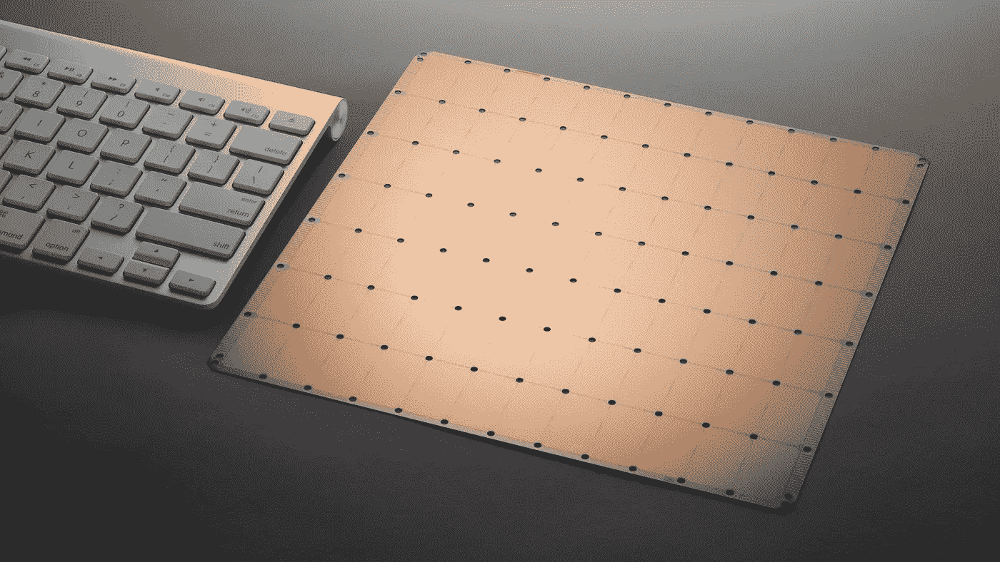
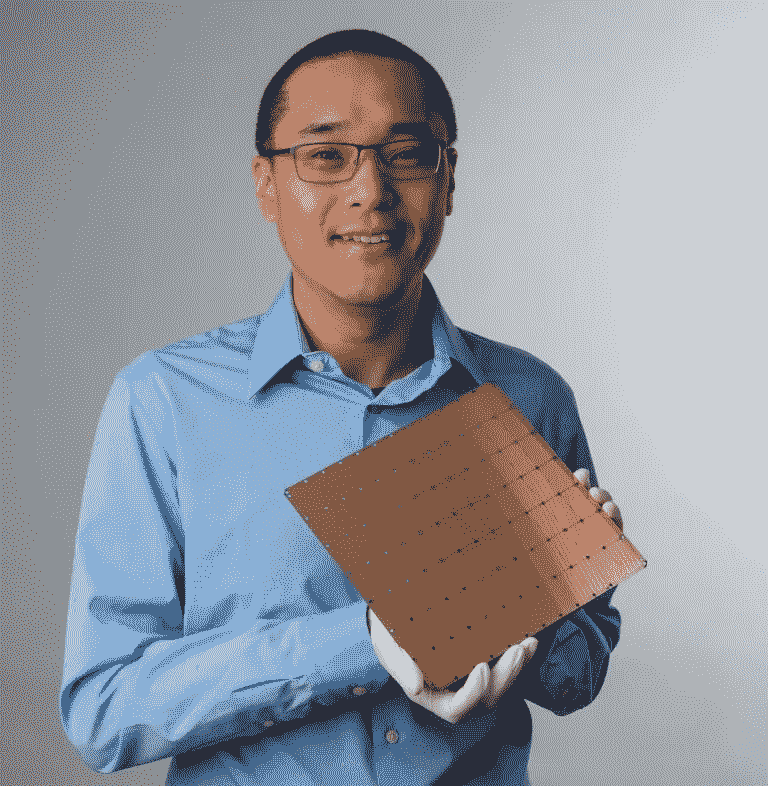

# 为什么脑波强化器的发布是一件大事

> 原文：<https://towardsdatascience.com/why-cerebras-announcement-is-a-big-deal-6c8633ffc49c?source=collection_archive---------28----------------------->

## 大脑的芯片可以成为深度学习的事实上的芯片

深度学习模型的最大问题之一是，它们变得太大，无法在单个 GPU 中训练。如果在单个 GPU 中训练当前的模型，它们将花费太长时间。为了及时地训练模型，有必要用多个 GPU 来训练它们。

我们[需要](https://medium.com/south-park-commons/scaling-transformer-xl-to-128-gpus-85849508ec35)将训练方法规模化到使用 100 个甚至 1000 个 GPU。例如，[的一位著名研究员](https://medium.com/south-park-commons/scaling-transformer-xl-to-128-gpus-85849508ec35)能够将 ImageNet 的训练时间从 2 周减少到 18 分钟，或者在 2 周内而不是 4 年内训练出最大和最先进的 Transformer-XL。他使用了 100 个 GPU 来完成这个任务。

随着型号越来越大，需要的处理器也越来越多。每当将这些模型的训练扩展到几个 GPU 时，都会有一些瓶颈会显著增加训练它们的时间。但有两个主要瓶颈阻碍了这一领域的发展:处理器之间的网络速度和每个 GPU 可以存储多少内存。让我们覆盖它们:

## 网络速度

网络的速度成为一个瓶颈，因为为了训练这些神经网络，你需要传递每个节点的梯度，以便算法可以找出如何更新其权重。像 [Ring AllReduce](https://preferredresearch.jp/2018/07/10/technologies-behind-distributed-deep-learning-allreduce/) 这样的算法通常用于同步不同节点之间的工作。芯片之间的通信速度如此重要，以至于 Nvidia 花了 68 亿美元收购了一家名为 Mellanox 的公司，以改善其 GPU 之间的通信。

## GPU 内存

将模型扩展到多个 GPU 的挑战的第二部分是每个 GPU 拥有的内存量。神经网络可以消耗 GB 的内存，GPU 只有 MB 的片上内存。目前，为了解决这个问题，GPU 将神经网络存储在焊接在它旁边的外部存储器上。问题是外部存储器比片内存储器慢 10 到 100 倍&更耗电。

像谷歌的神经机器翻译这样的大型模型甚至不适合放在一个 GPU 外部存储器中。通常，它们必须被分散到数十个 GPU 上。这又增加了 10 到 100 倍的延迟。

因此，在每个 GPU 上存储权重和用于训练的数据集对于快速训练模型非常重要。它的内存越大，训练模型的速度就越快，消耗的能量也就越少。理想情况下，整个模型可以放在一个芯片上。

# 大脑综合方法

今天最快的人工智能芯片也是最大的，这不是巧合。面积越大，内核和内存就越多。问题是，今天制造芯片的工艺使用 ASML 制造的标准光刻机，其刻线尺寸约为 858 纳米，几乎与英伟达 V100 的尺寸相同。已经到极限了。

ASML machinery to produce chips of size of around 858nm²

脑波强化器用新方法整合了制造芯片的旧流程。脑波强化器所做的是将单个晶片构建成一个“巨型芯片”。它的新“芯片”包含总共 1.2 万亿个晶体管。这比 Nvidia 生产的最先进的 GPU 芯片高出 50 倍。更重要的是，随着所有这些芯片合并成一个大芯片，脑波强化器的芯片实现了它们之间更高的通信速度。它也有更多的内存！据报道，它拥有 Nvidia 旗舰 GPU 的 3000 倍内存芯片和 10000 倍 GPU 之前可以实现的带宽。

*Cerebras’ co-founder Sean Lie and the* Cerebras’ Wafer Scale Engine (WSE). It holds 400,000 cores and 18GB of memory

在 80 年代，有公司试图建造一个大的集成芯片，就像脑波强化器那样，但是他们失败了。这些公司由于缺乏资金而失败了。他们没有能够克服很多工程问题来做到这一点。脑波强化器做到了。

脑波强化器制造了有史以来最大的芯片，一个有整个晶片大小的芯片。Cerebras 的芯片(大晶片)仍然使用与旧芯片相同的方法来构建每个“单独的芯片”，但晶片是按部分“蚀刻”的。脑波强化器与 TSMC(制造商)合作添加额外的电线，所以所有的芯片一起工作，作为一个整体而不是单独的。为了制造晶片大小的芯片，脑波强化器克服了 5 大挑战:

# 挑战

## 1.划线之间的通信

首先，为了实现这一点，脑波强化器团队必须处理跨越“划线”的通信。通过与 TSMC 合作，他们不仅发明了新的通信渠道，还必须编写新的软件来处理超过万亿晶体管的芯片。

## 2.芯片产量

第二个挑战是产量。当芯片覆盖整个硅晶片时，该晶片蚀刻中的一个缺陷就可能使整个芯片失效。Cerebras 通过在整个芯片中添加额外的核心来解决这个问题，这些核心在晶片上的核心附近出现错误时用作备份

## 3.热膨胀

他们处理的第三个问题是热变化。芯片在工作时会变得非常热，但是不同的材料会以不同的速度膨胀。这意味着将芯片固定在主板上的连接器也需要以同样的速度热膨胀。他们发明了一种可以吸收部分温差的材料。

## 4.包装和制造流程

他们的第四个挑战是基本上与现有的服务器基础架构集成。没有人有工具来处理这么大的芯片。所以他们不得不为它建造包装，并创造一个新的生产流程。不仅如此，他们还开发了软件来测试这一切。

## 5.冷却

最后，一个芯片中的所有处理能力需要巨大的电力和冷却。比“更小”的芯片多得多。他们基本上是通过翻转芯片来解决问题的。冷却在芯片上的所有点垂直传递，而不仅仅是水平传递。

# 前方道路

在克服了所有这些挑战之后，脑波强化系统还有很长的路要走，这并不容易。在成为主流之前，他们仍然需要证明自己。他们开始向少数客户发布原型，客户需要一段时间才能在生产中使用它的芯片。

不仅如此，Nvidia 还为开发人员建立了许多工具，以便在多个 GPU 中创建和部署他们的模型。开发人员还需要时间来获得与脑波强化器的芯片相匹配的类似工具。但这种芯片将代表着向更大更好的神经网络迈出的一大步，也将是向建设 AGI 迈出的一大步。