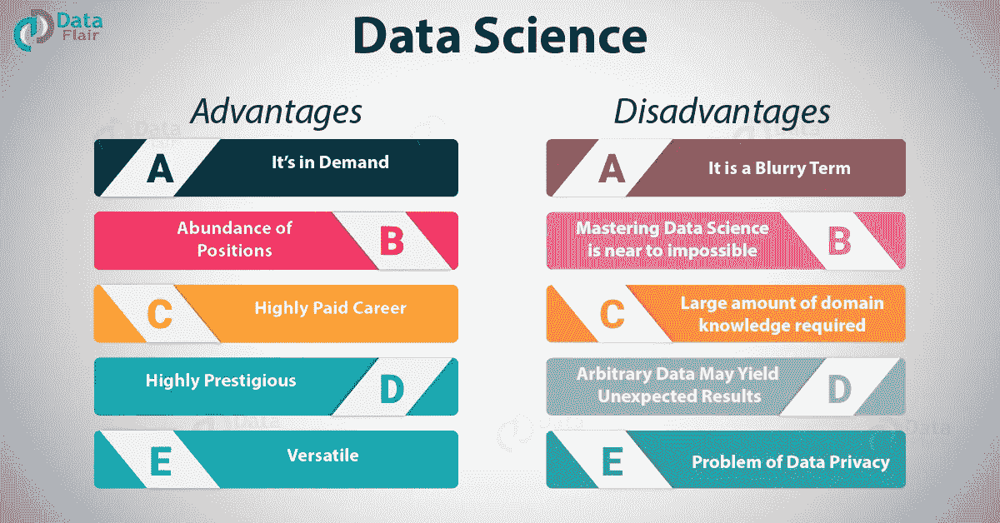

# 为什么选择数据科学作为你的职业

> 原文：<https://towardsdatascience.com/why-choose-data-science-for-your-career-ca38db0c28d4?source=collection_archive---------1----------------------->

数据科学已经成为一项革命性的技术，似乎每个人都在谈论它。被誉为“21 世纪最性感的工作”的数据科学是一个时髦词，很少有人真正了解这项技术。虽然许多人希望成为数据科学家，但权衡数据科学的利弊并给出真实的图景是至关重要的。在本文中，我们将详细讨论这些要点，并为您提供关于数据科学的必要见解。

*Pros and Cons of Data Science*

# 数据科学导论

数据科学是对数据的研究。它是关于提取、分析、可视化、管理和存储数据以创造洞察力。这些见解有助于公司做出强大的数据驱动型决策。数据科学需要使用非结构化数据和结构化数据。这是一个多学科领域，其根源在于统计学、数学和计算机科学。由于大量的数据科学职位和丰厚的薪水，这是最受欢迎的工作之一。这是对数据科学的简要介绍，现在我们来探讨一下数据科学的利弊。

# 数据科学的利与弊

数据科学领域规模庞大，有其自身的优势和局限性。因此，在这里我们将衡量数据科学的利弊。本文将帮助您评估自己，并在数据科学领域采取正确的措施。

# a.数据科学的优势

数据科学的各种好处如下:

## 1.它很受欢迎

数据科学非常受欢迎。未来的求职者有很多机会。这是 Linkedin 上增长最快的工作，预计到 2026 年将创造 1150 万个工作岗位。这使得数据科学成为一个高度可雇佣的工作领域。

## 2.丰富的职位

很少有人具备成为一名完整的数据科学家所需的技能。与其他 IT 部门相比，这使得数据科学不那么饱和。因此，数据科学是一个非常丰富的领域，有很多机会。数据科学领域对数据科学家的需求很大，但供应不足。

## 3.高薪职业

数据科学是收入最高的工作之一。根据 Glassdoor 的数据，数据科学家的平均年薪为 116，100 美元。这使得数据科学成为一个非常有利可图的职业选择。

## 4.数据科学是多功能的

数据科学有许多应用。它广泛应用于医疗保健、银行、咨询服务和电子商务行业。数据科学是一个非常通用的领域。因此，你将有机会在各个领域工作。

## 5.数据科学让数据变得更好

公司需要熟练的数据科学家来处理和分析他们的数据。他们不仅分析数据，还提高数据质量。因此，数据科学处理丰富的数据，并使其更好地为他们的公司服务。

## 6.数据科学家声望很高

数据科学家让公司做出更明智的商业决策。公司依赖数据科学家，并利用他们的专业知识为客户提供更好的结果。这使得数据科学家在公司中占据重要位置。

## 7.不再有无聊的任务

数据科学已经帮助各行各业将冗余任务自动化。公司正在使用历史数据来训练机器，以便执行重复的任务。这简化了以前人类承担的艰巨工作。

## 8.数据科学让产品更智能

数据科学涉及机器学习的[用途](https://data-flair.training/blogs/machine-learning-applications/),这使得各行各业能够创造出更好的专门为客户体验定制的产品。例如，电子商务网站使用的推荐系统根据用户的历史购买记录向用户提供个性化的见解。这使得计算机能够理解人类行为并做出数据驱动的决策。

## 9.数据科学可以拯救生命

由于数据科学，医疗保健行业得到了极大的改善。随着机器学习的出现，检测早期肿瘤变得更加容易。此外，许多其他医疗保健行业正在使用数据科学来帮助他们的客户。

## 10.数据科学可以让你成为更好的人

数据科学不仅会给你一个伟大的职业生涯，还会帮助你的个人成长。你将能够拥有解决问题的态度。由于许多数据科学角色在 IT 和管理之间架起了桥梁，您将能够享受两个世界的优势。

# b.数据科学的缺点

虽然数据科学是一个非常有利可图的职业选择，但这个领域也有各种各样的缺点。为了了解数据科学的全貌，我们还必须知道数据科学的局限性。其中一些如下:

## 1.数据科学是一个模糊术语

数据科学是一个非常笼统的术语，没有明确的定义。虽然它已经成为一个流行词，但是很难写下数据科学家的[的确切含义。一个数据科学家的具体角色取决于公司所专攻的领域。虽然有些人将*数据科学描述为科学的第四范式*，但很少有批评者称之为*仅仅是统计学的更名*。](https://data-flair.training/blogs/what-is-data-science/)

## 2.掌握数据科学几乎是不可能的

作为许多领域的混合体，数据科学源于统计学、计算机科学和数学。要精通每一个领域并在所有领域都成为专家是不可能的。虽然许多在线课程一直试图填补数据科学行业面临的技能缺口，但考虑到该领域的广阔性，要精通它仍然是不可能的。一个有统计学背景的人可能无法在短时间内掌握计算机科学，以便[成为一名精通数据的科学家](https://data-flair.training/blogs/how-to-become-data-scientist-infographic/)。因此，这是一个不断变化的动态领域，需要人们不断学习数据科学的各种途径。

## 3.需要大量的领域知识

数据科学的另一个缺点是它依赖于领域知识。一个在统计学和计算机科学方面有相当背景的人，如果没有其背景知识，会发现很难解决[数据科学](https://en.wikipedia.org/wiki/Data_science)问题。反之亦然。例如，从事基因组序列分析的医疗保健行业需要一名具备遗传学和分子生物学知识的合适员工。这使得数据科学家能够做出经过计算的决策，以帮助公司。然而，来自不同背景的数据科学家很难获得特定领域的知识。这也使得从一个行业迁移到另一个行业变得困难。

## 4.任意数据可能会产生意想不到的结果

数据科学家分析数据并做出谨慎的预测，以促进决策过程。很多时候，所提供的数据是任意的，不会产生预期的结果。这也可能由于管理薄弱和资源利用率低而失败。

## 5.数据隐私问题

对于许多行业来说，数据是他们的燃料。数据科学家帮助公司做出数据驱动的决策。但是，流程中使用的数据可能会侵犯客户的隐私。客户的个人数据对母公司来说是可见的，有时可能会由于安全漏洞而导致数据泄露。关于保护数据隐私及其使用的伦理问题一直是许多行业关注的问题。

# 摘要

在权衡了数据科学的利弊之后，我们能够展望这个领域的全貌。虽然数据科学是一个有许多有利可图的优势的领域，但它也有自己的缺点。作为一个不太饱和的高薪领域，它已经彻底改变了几个行业，当考虑到这个领域的广阔性和跨学科性质时，它也有自己的背景。数据科学是一个不断发展的领域，需要数年才能精通。最后，由你来决定是数据科学的优点激励你把它作为你未来的职业，还是缺点帮助你做出谨慎的决定！

希望您喜欢我们关于数据科学利弊的文章。通过评论分享您的反馈。

必读-

许多其他大公司像脸书、亚马逊、优步都在使用它。看看— [数据科学使用案例](https://data-flair.training/blogs/data-science-use-cases/)

[数据科学在教育中的重要性](https://data-flair.training/blogs/data-science-in-education/)