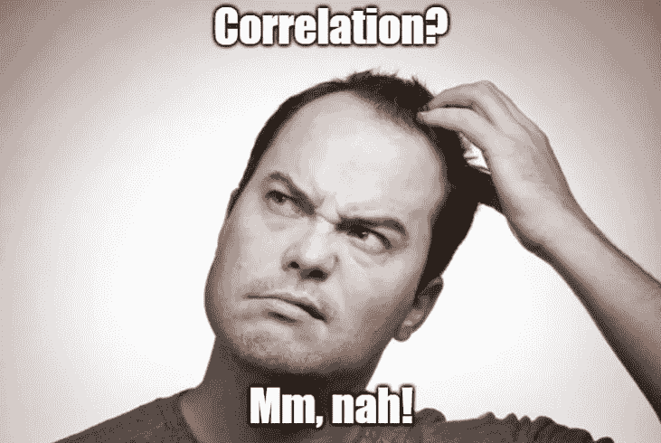
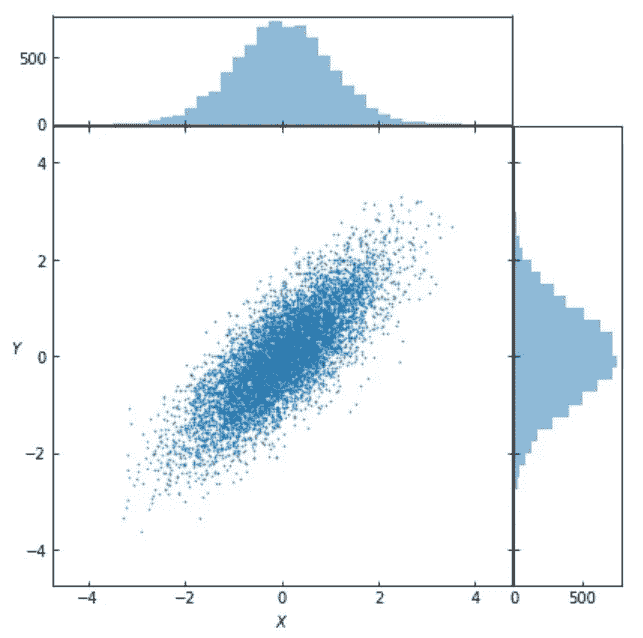
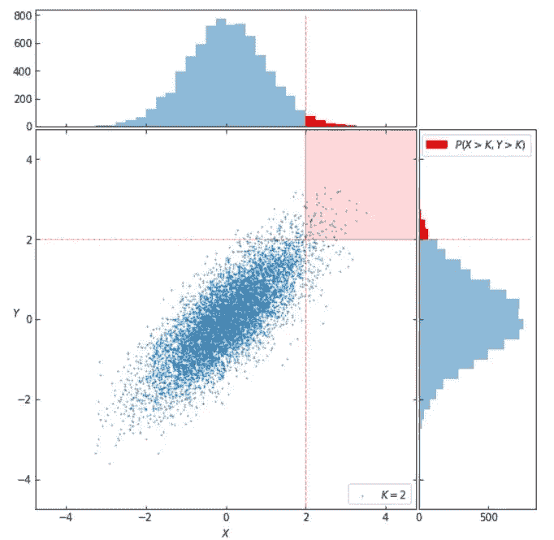

# 为什么相关性可能对异常值一无所知

> 原文：<https://towardsdatascience.com/why-correlation-might-tell-us-nothing-about-outliers-9409f324cb88?source=collection_archive---------10----------------------->

# 介绍

我们经常听到这样的说法:*àla**x 和 y 之间有很高的相关性。*这对于心理学、社会科学或经济学中关于人类或社会行为的所谓发现来说尤其如此。一个报道的 0.8 的[皮尔逊相关系数](https://en.wikipedia.org/wiki/Pearson_correlation_coefficient)在很多情况下确实看起来*高*，并且逃脱了我们对其真实意义的批判性评估。

因此，让我们看看相关性**实际上**意味着什么，以及它是否真的传达了我们通常认为它传达的信息。

受有趣的[虚假相关性](https://www.tylervigen.com/spurious-correlations)项目以及 Nassim Taleb 的 [medium post](https://medium.com/incerto/iq-is-largely-a-pseudoscientific-swindle-f131c101ba39) 和 [Twitter 咆哮](https://twitter.com/nntaleb)的启发，他在其中哀叹心理学家(不仅仅是)*对概率和统计的完全无知*和*误用*，我决定复制他的[笔记](https://twitter.com/nntaleb/status/1135116646442590208)关于相关系数在高斯分布下传达了多少信息。

# 二元正态分布

假设我们有两个具有协方差结构的标准正态分布变量 ***X*** 和 ***Y***

由于变量是标准正态的，相关性是𝜌=0.8.的如果我们听到有人报告说，*智商*和“*成功*”(不管它意味着什么)之间的这种相关性，这可能对我们大多数人来说听起来很有说服力。换句话说，给定 0.8 的令人信服的相关性，我们会倾向于相信“*高*”*智商*分数在大多数情况下会预测“*高成功*”。

这就是我们错的地方。让我们来可视化一下 ***X*** 和 ***Y*** 的二元分布:

Standardized Bivariate Normal Distribution with ρ=0.8

# 不确定性比例

为了理解相关性在数据分布域的不同区间告诉我们什么，让我们考虑在相关性结构𝜌下， ***X*** *和* ***Y*** 超过某个阈值 ***K*** 的概率与 ***X*** *和* ***Y*** 的概率之比塔勒布称这个比率为“**不确定性比例**”:

在继续评价𝜙(𝜌、 **𝐾** 之前，我们先来看看门槛 ***K*** 代表了什么:

Standardized Bivariate Normal Distribution with ρ=0.8 and probability threshold **K**=2

在上图中， ***K*** =2，阴影区域代表样本空间的子集，其中既有***X***>***K****和****Y***>***K***。

为了评价𝜙(𝜌， ***K*** ，我们注意到联合概率

解析积分是不可能的，所以我们不得不求助于数值计算。让我们看看我们如何能做它。

有了𝜙(𝜌， **𝐾** ，我们就密谋对付𝜌，并获得:

Information conveyed by correlation under the Gaussian distribution

# 结论

从剧情中我们可以看到的是， ***X*** 和 ***Y*** 的相关性所传达的信息表现的不成比例。从实践的角度来看，这意味着，例如，0.5 的相关性携带非常少的普通值信息(𝜙介于 0.1 和 0.3 之间)(最多两个标准差之外)，并且携带基本上**没有**关于尾部的信息(即异常值或优于表现者)。换句话说，观察到一个相当于*高的*值为 ***X*** (例如 4–5σ)，我们**就不能**宣称它预测一个*高的* ***Y*** 。

回到塔勒布对心理测试有效性的攻击，上面得到的结果意味着，引用塔勒布的话来说，你需要一些东西来“解释”天才。

附:包含这篇文章所有代码的完整 Jupyter 笔记本可以在[这里](https://github.com/Gev7191/Sketches-in-Probability-and-Statistics/blob/master/Why%20correlation%20might%20tell%20us%20nothing%20about%20outliers.ipynb)找到。