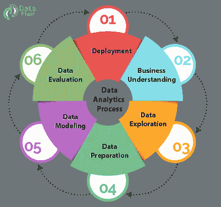
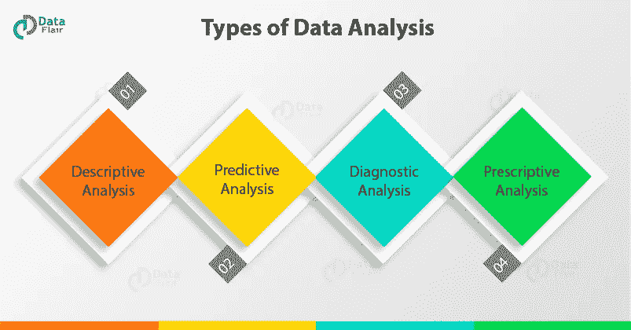
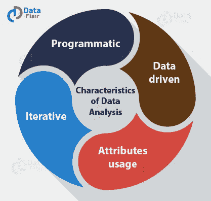

# 为什么数据分析在 21 世纪越来越流行

> 原文：<https://towardsdatascience.com/why-data-analytics-is-gaining-hype-in-the-21st-century-b7b1ca289f09?source=collection_archive---------5----------------------->

数据科学和数据分析是今年的两个热门词汇。如今，数据对行业来说不仅仅是石油。数据以原始形式收集，并根据公司的要求进行处理，然后将这些数据用于决策目的。所有这些过程，都有助于企业在市场中成长。但是，谁来做这项工作呢？谁来处理这些数据？等等。一切都是由数据分析师和数据科学家完成的。

# 什么是数据分析？

数据或信息是原始格式。随着数据量的增加，为了找到有用的信息、做出结论和支持决策，对数据进行检查、清理、转换和建模已经成为一种需要。这个过程被称为数据分析。

数据挖掘是一种特殊的数据分析技术，它侧重于为预测而不是纯粹的描述目的进行建模和知识发现。商业智能涵盖了非常依赖聚合的数据分析，侧重于商业信息。在统计应用中，一些人将业务分析分为描述性统计、探索性数据分析(EDA)和验证性数据分析(CDA)。

EDA 侧重于发现数据中的新特征，而 CDA 侧重于证实或证伪现有假设。预测分析通过关注统计或结构模型来进行预测或分类，而在文本分析中，应用统计、语言和结构技术来从文本源(一种非结构化数据)中提取信息并进行分类。所有这些都是各种各样的数据分析。

因此，数据浪潮已经改变了行业运作的方式。随着大数据的出现，出现了对 it 实施高级分析的需求。现在，专家可以做出更准确、更有利可图的决策。

看起来混淆了[数据科学和数据分析](https://data-flair.training/blogs/data-science-vs-data-analytics-infographic/)？

# 数据分析与报告

*分析是一个人处理问题、寻找得到答案所需的数据、分析数据、解释结果以提供行动建议的互动过程。*

报告环境或商业智能(BI)环境涉及报告的调用和执行。因此，输出会以期望的形式打印出来。*报告是指以易于阅读的格式组织和总结数据以传达重要信息的过程。报告有助于组织监控不同领域的绩效并提高客户满意度*。换句话说，您可以将报告视为将原始数据转换为有用信息的过程，而分析则将信息转换为见解。

## 1.商业理解

第一步包括业务理解。每当任何需求出现时，我们首先需要确定业务目标，评估情况，确定数据挖掘目标，然后根据需求制定项目计划。在这个阶段定义业务目标。

## 2.数据探索

第二步包括数据理解。对于进一步的过程，我们需要收集初始数据，描述和探索数据，并验证数据质量，以确保它包含我们需要的数据。从各种来源收集的数据根据其应用和本阶段项目的需要进行描述。这也称为数据探索。这对于验证所收集数据的质量是必要的。

## 3.数据准备

接下来是数据准备。从上一步收集的数据中，我们需要根据需要选择数据，清理数据，构建数据以获得有用的信息，然后集成所有数据。最后，我们需要格式化数据以获得适当的数据。在此阶段，数据被选择、清理并整合到最终确定的格式中进行分析。

## 4.数据建模

一旦收集了数据，我们就需要进行数据建模。为此，我们需要选择建模技术，生成测试设计，构建模型，并评估所构建的模型。构建数据模型以分析数据中各种选定对象之间的关系，构建测试用例以评估模型，并在此阶段对数据测试和实现模型。

## 5.数据估计

接下来是数据评估，我们评估上一步的结果，检查误差范围，并确定要执行的下一步。我们评估测试用例的结果，并在这个阶段检查错误的范围。

## 6.部署

分析过程的最后一步是部署。在这里，我们需要计划部署、监控和维护，我们需要生成最终报告并审查项目。在这个阶段，我们部署分析的结果。这也被称为项目评审。

我们称上述过程为商业分析过程。

# 数据分析的类型

有 4 种用于数据分析的技术

## 1.描述性分析

借助于描述性分析，我们分析和描述一个数据的特征。描述性分析处理信息的总结。描述性分析，当与视觉分析相结合时，为我们提供了一个全面的数据结构。

在描述性分析中，我们处理过去的数据以得出结论，并以仪表板的形式呈现我们的数据。在企业中，描述性分析用于确定关键绩效指标或 KPI，以评估企业的绩效。

## 2.预测分析

在预测分析的帮助下，我们决定未来的结果。基于对历史数据的分析，我们能够预测未来。它利用描述性分析来预测未来。在技术进步和机器学习的帮助下，我们能够获得对未来的预测性见解。

预测分析是一个复杂的领域，需要大量的数据、预测模型的熟练实施及其调整，以获得准确的预测。这需要精通机器学习的熟练劳动力来开发有效的模型。

## 3.诊断分析

有时，企业需要批判性地思考数据的本质，并深入理解描述性分析。为了发现数据中的问题，我们需要找到可能导致模型性能不佳的异常模式。

通过诊断分析，您可以诊断通过数据显示的各种问题。企业使用这种技术来减少损失，优化业绩。企业使用诊断分析的一些例子是

*   企业实施诊断分析以减少物流延迟并优化生产流程。
*   在销售中使用诊断分析来更新营销策略，否则会导致收入下降。

## 4.规定性分析

规定性分析结合了上述所有分析技术的洞察力。它被称为数据分析的最终前沿。通过[描述性和预测性分析](https://data-flair.training/blogs/r-predictive-and-descriptive-analytics/)提供的细节，规定性分析允许公司基于这些细节做出决策。它大量使用人工智能来帮助公司做出谨慎的商业决策。

像脸书、网飞、亚马逊和谷歌这样的主要行业参与者正在使用规范分析来做出关键的商业决策。此外，金融机构正在逐渐利用这种技术的力量来增加收入。

# 数据分析的特点

我们已经看到了[大数据](https://data-flair.training/blogs/what-is-big-data/)的特征，如数量、速度和多样性。现在让我们看看数据分析的特征，这些特征使它不同于传统类型的分析。

数据分析有以下特点:

## 节目的

由于数据的规模，可能需要编写一个数据分析程序，通过使用代码来操作它或进行任何类型的探索。

## 数据驱动

它意味着由数据和程序语句驱动的活动的进展，描述匹配的数据和处理要求，而不是采取定义序列的步骤。许多分析师使用假设驱动的方法进行数据分析，数据可以使用海量数据来驱动分析。

## 属性用法

为了正确和准确地分析数据，它可以使用许多属性。过去，分析师处理数据源的数百个属性或特征，而现在大数据有数千个属性和数百万个观察值。

## 重复的

由于整个数据被分成样本，然后对样本进行分析，因此数据分析本质上可以是迭代的。更强的计算能力支持模型的迭代，直到数据分析师满意为止。这导致了为满足分析要求和时间框架而设计的新应用程序的开发。

# 数据分析的应用

以下是一些最受欢迎的数据分析应用——

## 欺诈检测和风险分析

在银行业，数据分析大量用于分析异常交易和客户详细信息。银行还使用数据分析来分析其客户的贷款违约者和信用评分，以最大限度地减少损失和防止欺诈。

## 优化运输路线

像优步和 Ola 这样的公司非常依赖数据分析来为他们的客户优化路线和票价。他们使用一个分析平台来分析最佳路线，并根据几个参数计算出租车费用的上涨和下跌百分比。

## 提供更好的医疗保健

在数据分析的帮助下，医院和医疗保健中心能够预测慢性病的早期发作。他们能够预测未来可能发生的疾病，并帮助病人采取早期行动，这将有助于他们减少医疗费用。

## 管理能源支出

公共部门能源公司正在使用数据分析来监控家庭和行业的能源使用情况。根据使用模式，他们正在优化能源供应，以降低成本和减少能源消耗。

## 改善搜索结果

谷歌等公司正在使用数据分析，根据用户的偏好和搜索历史向他们提供搜索结果。此外，像 Airbnb 这样的公司使用搜索分析为其客户提供最佳住宿。亚马逊还利用搜索分析向客户提供推荐。

## 物流优化

各种公司都在依靠大数据分析来分析供应链并减少物流延迟。像亚马逊这样的公司正在使用消费者分析来分析他们的需求，并毫无延迟地向他们发送产品。

# 如何得到更好的分析？

为了进行出色的分析，有必要提出正确的问题，收集正确的数据来解决问题，并设计正确的分析来回答问题。那么只有分析我们才能称之为正确的和成功的。所以，我们来详细讨论一下这个。

问题的框架意味着确保必须提出重要的问题和布局关键的假设。例如，新计划的目标是增加收入还是增加利润？这个选择导致了接下来的分析和行动的巨大差异。是否所有需要的数据都可用，或者是否有必要收集更多的数据？不把问题框住，剩下的工作就没用了。

对于一个伟大的分析，我们正确地构建问题。因此，这包括正确评估数据，制定可靠的分析计划，并考虑各种技术和实际考虑因素。

我们可以针对两个问题分析任何业务问题:

## 统计显著性

这个问题在统计学上对决策的重要性。统计显著性检验采用一些假设，并确定假设正确时结果发生的概率。

## 商业重要性

它意味着问题如何与业务及其重要性相关联。始终将结果放在业务环境中，作为最终验证过程的一部分。

# 成为数据分析师所需的技能

如果不讨论这些技巧，数据分析教程是不完整的。当今世界，对专业分析人员的需求越来越大。学术项目需要时间来适应和扩大规模，以培养更多人才。

如果组织缺乏熟练的数据分析师，所有收集的数据和创建的模型都没有用。数据分析师需要技能和知识来获得好的数据分析工作。

必须阅读[数据科学家 vs 数据分析师](https://data-flair.training/blogs/data-scientist-vs-data-analyst/)——一个有前途的职业的热门辩论

要成为一名成功的分析师，专业人士需要精通各种数据分析工具，如 R & [SAS](https://data-flair.training/blogs/sas-tutorial/) 。他应该能够正确使用这些商业分析工具，并收集所需的细节。他还应该能够做出具有统计意义且对业务非常重要的决策。

即使你知道如何使用任何类型的数据分析工具，你也需要有正确的技能、经验和视角来使用它。分析工具可以为用户节省一些编程，但是他或她仍然需要理解所发生的分析。那么只有我们才能称一个人为成功的数据分析师。

没有分析专业知识的业务人员可能希望利用分析，但他们不需要做实际的繁重工作。分析团队的工作是让业务人员能够推动整个组织的分析。让业务人员花时间向上游销售分析能力，并改变他们管理的业务流程以利用分析。如果分析团队做他们最擅长的，业务团队做他们最擅长的，这将是一个双赢的组合。

# 数据分析的技术和业务技能

现在让我们讨论所需的技术和业务技能。

**数据分析的技术技能—**

1.  包装和统计方法
2.  商务智能平台和数据仓库
3.  数据库设计
4.  数据可视化和管理
5.  报告方法
6.  了解 [Hadoop](https://data-flair.training/blogs/hadoop-tutorial/) 和 MapReduce
7.  数据挖掘

**商业技能数据分析—**

1.  有效的沟通技巧
2.  创造性思维
3.  行业知识
4.  分析问题解决

数据分析将在市场上获得新的推动。根据研究，到 2023 年，全球预测分析市场预计将增长 149.5 亿美元。那么，你还在等什么？现在，是时候利用大数据分析提升您的职业生涯了。现在，是时候用大数据分析来[促进你的职业生涯了。](https://data-flair.training/big-data-hadoop/)

# 别忘了把你的给我们👏！