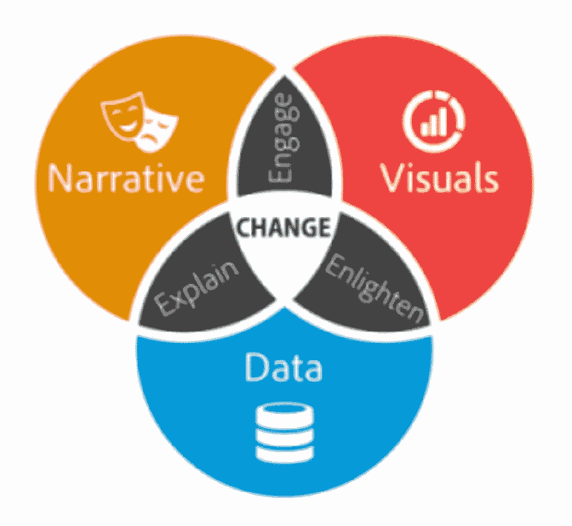

# 我为什么选择数据科学

> 原文：<https://towardsdatascience.com/why-data-science-31508b87997?source=collection_archive---------25----------------------->

## 一个人从教学到数据的旅程

Attribution: Brent Dykes CC BY-SA 2.5

2018 年，我在旧金山湾区教高中物理。作为学校领导团队的一员，我们对当前迟到政策的有效性有一些疑问和担忧。我和一位同事朋友自愿收集一些数据来帮助推动调查和对话。我们对这个项目充满好奇和兴奋，希望增加轶事故事线和团队学生、员工、教师、家长和管理人员的直观理解。

当我们试图从我们神秘的学习管理系统中获取数据时，我们有一百万个问题:

> 这个变量到底是什么意思？我们对这些数据的假设是什么？这是怎么收集的？我们能相信这些数据吗？迟到被严重低估了吗？迟到次数最多的班级实际上是学生迟到率最高的班级，还是老师最致力于记录的班级？这是一种有效且合理的数据汇总方式吗？我们如何找出哪些是最重要的因素？

最终，我的同事朋友说:“如果我们在工业界工作，就会有人来帮助我们！”我们无法独自解决这些问题，利用这些数据集尽可能好地了解延迟的状态，并决定如何获取数据，以提高我们理解和跟踪模式以及评估计划的能力。

随着我花越来越多的时间在这些类型的项目上，我意识到我想成为那个人。这个人帮助人们回答问题，弄清他们正在努力解决的问题，帮助人们理解这个世界，并做出决策。我开始意识到，我越来越兴奋地在每个工作日来工作，参与这些项目。我加快了周末远足的速度，这样我就可以更快地回到家里研究数据。

在更深的层面上，我相信人类是天生好奇的生物。我最初的一些记忆包括我问我的父母一些很大的为什么和如何的问题，然后他们做出了很棒的教学动作:“这是一个很好的问题！我真的不确定…你认为我们如何才能找到更多信息？”我一定是一个疲惫不堪的孩子，不停地问问题。我一点也不知道，通过参与和支持提问，他们让我走上了调查生活的轨道，一种以数据为导向的生活。

作为一名数据科学家，我很高兴能够通过发现数据中的模式并以某种方式交流它们来帮助人们和组织自信地前进，而不仅仅是凭直觉，从而让世界变得更美好。我想帮助这个世界做出更好的决定。

最重要的是，我喜欢数据科学的跨学科性质。它利用了如此多的学术领域——信息系统和科学、统计和数学、计算机科学、通信和商业。它适用于从个人使用到政府、财富 500 强和全球组织等各种规模的行业。

尽管我喜欢帮助年轻人学会在数据中寻找模式，并就他们的信心和结论的有效性提出关键问题，但我想自己做这些创造性的分析任务。我喜欢设计越来越接近实现团队教育目标的学习体验，但我渴望更好、更可靠、更容易分析的数据，以及分析这些数据的时间和技能，以便随着时间的推移跟踪改进和评估课程。感觉上，容易分析的学生学习数据(阅读:多项选择评估)并没有很好地显示学生学习和技能的范围，特别是对于那些最近开始将英语添加到他们的语言技能中或历史上在学校学习困难的学生，但书面和非标准的评估使其难以提取模式。我想要一种方法，在时间有限的工作环境中，准确评估每个学生知道什么和能做什么，获得关于课程和教学的反馈，并为学生的成长提供有用的反馈。对我和我的教学团队来说，这是一个持续的斗争和平衡。我喜欢深入现实生活中杂乱无章的数据，也很高兴了解更多关于如何处理复杂的非结构化数据的知识，这样我就可以帮助人们和组织根据所有可用数据做出最佳决策。

就数据科学家的生活和职业而言，我认为有四个主要优势:

1.  作为一名数据科学家，我将分析思维、好奇心、创造力以及沟通、同情和理解的人际技能结合在一起。
2.  我进入了一个充满活力的领域，在那里总会有继续学习和成长的方法。
3.  蓬勃发展和充满活力的在线和个人数据科学社区不断激励着我。
4.  我通过帮助组织了解他们的挑战并做出有意义的改变来产生影响。

这似乎很好地利用了我的时间，也符合我的兴趣和价值观。