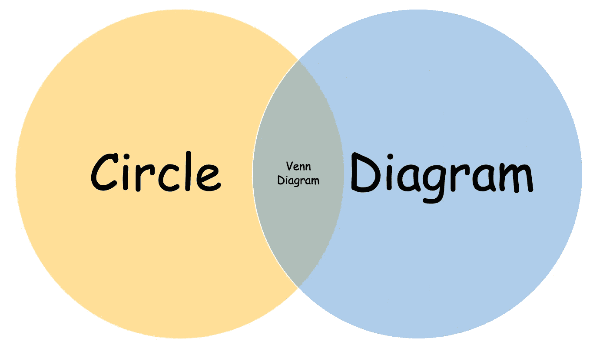
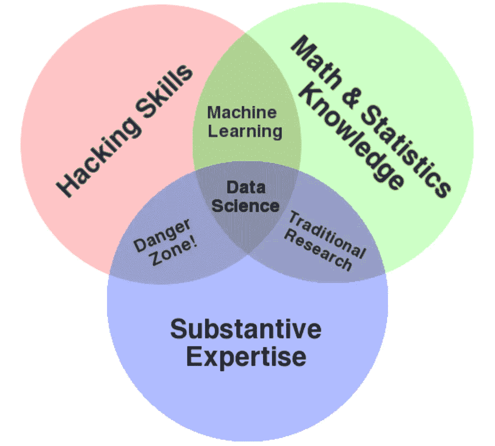
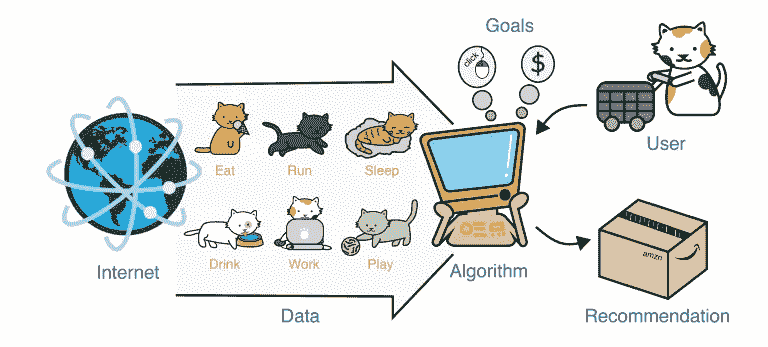
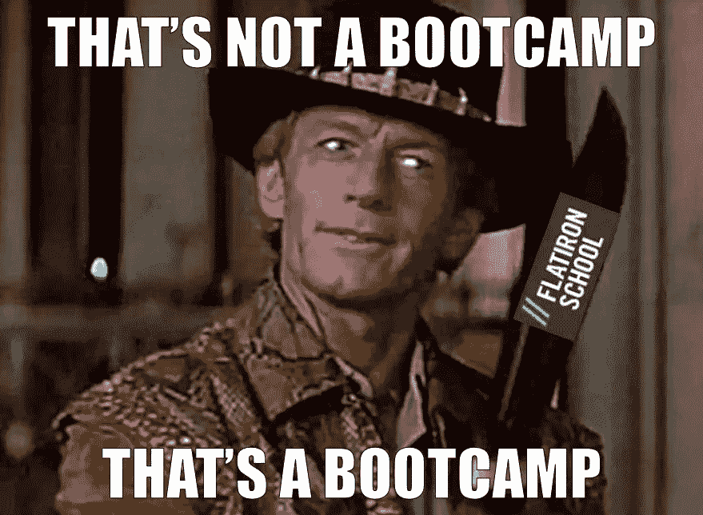

# 为什么是数据科学。

> 原文：<https://towardsdatascience.com/why-data-science-326fe9031d89?source=collection_archive---------15----------------------->

## 或者，为什么我决定参加熨斗学校的数据科学沉浸式训练营。

每个人都喜欢维恩图，包括我自己。如果你不知道它们是什么，那么:

Source: me.

在我的记忆中有一个特别特别的例子。几年前，我看到(如果不是这个确切的，那么是它的某个版本)下面描述“数据科学”的文氏图:

[http://drewconway.com/zia/2013/3/26/the-data-science-venn-diagram](http://drewconway.com/zia/2013/3/26/the-data-science-venn-diagram)

…自从原版在网上流传开来后，还有其他人把自己的想法放到了上面。无论如何，读完之后，我回想起当时的想法，“这种*式的*描述了我的技能组合！”

让我们打开那种*。*

*在大学里，我获得了统计学(学士)、经济学(学士)和商学(学士)的本科学位。显然，我真的很喜欢上学。我最终选择了三个专业，因为我即将获得经济学学位，那年春天，我在职业周的一个小组讨论会上了解了精算专业。我被描述的东西所吸引:[有形的成就](https://www.soa.org/education/exam-req/default)通常转化为职业发展，以及典型的[甚至工作与生活的平衡](https://beanactuary.org/why/?fa=balance-of-work-life)。因此，我的总体规划转变为接受统计学和商业教育。*

*数学统计知识？检查。*

*大学毕业后，我去了一家当地的健康保险公司工作，担任初级精算分析师。然后，我逐渐获得了这个职业的最高头衔，被称为[研究员](https://www.soa.org/future-actuaries/earning-credentials/) (FSA)。这需要[考试](https://pathways.soa.org/asa)考试[更多的考试](https://pathways.soa.org/fsa)。通过所有这些考试通常需要六到十年的时间；花了我八个(我有没有提到我觉得我喜欢上学？).总的来说，我已经在这个组织工作了十多年。你在某个地方工作足够长的时间，你会情不自禁地掌握一些领域知识。*

*实质性专业知识？检查。*

*除了我的统计学和经济学学位，我还主修商业，专注于信息系统。这让我接触到了商业世界的技术工具，这真的引起了我的共鸣。数据库、Visual Basic 和 HTML 编程之类的课程，挠到了我工科预科(当时我以为自己想当工程师)入门编程课程开始的一个痒处。*

*我会在一份兼职工作中进一步利用这些工具，那份兼职工作是一项研究的数据录入员。我不断地修补和自动化 Access 数据库的一些部分，这些部分作为研究的数据收集应用程序。这反过来又导致了为同事的朋友构建自定义 Access 数据库应用程序的推荐。在随后的几年中，这已经发展到做一些事情，例如将 Tableau 前端与 Teradata 后端相结合，并将它们与同事开发的 Python 算法捆绑在一起，以创建动态应用程序。*

*黑客技能？检查。*

*因此，虽然我觉得我的技能触及了这三个不同的方面，但有一个方面我几年来一直感到欠缺(这就是我所说的*的意思)!*):*

**

*Source: [http://sitn.hms.harvard.edu/flash/2017/recommended-machine-learning-helps-choose-consume-next/](http://sitn.hms.harvard.edu/flash/2017/recommended-machine-learning-helps-choose-consume-next/) | figure by *Jeep Veerasak Srisuknimit**

*机器学习。*

*作为一名精算师，我认为我们的工作和技能与我所理解的“数据科学家”有很多重叠。我们通常使用(非常)大的数据集来构建分析和模型，以“预测”将要发生的事情。例如，健康保险精算学中的一个传统角色是预测一段时间内的最终索赔金额，甚至在我们看到来自医疗保健提供者的实际索赔文档之前。*

*在过去的几年里，我们目睹了“数据科学”作为一个实践领域的爆炸式增长，我觉得在我的职业发展中缺少的(这在数据科学家中非常重要)是现代机器学习中的深度和实践知识。*

*我的意思是，我已经*完成了*机器学习。如果你使用过 Excel 中的[斜率](https://support.office.com/en-us/article/slope-function-11fb8f97-3117-4813-98aa-61d7e01276b9)函数:恭喜你，你已经运行了一次线性回归！但是在一个每周都有新算法问世的空间里，我感觉自己越来越落后了。*

*我更新工具箱的第一次尝试是参加由精算师协会提供的为期三天的预测建模训练营。虽然训练营提供了带回来工作的例子和灵感，但它并不能代替实际做有意义的工作(T2，T3)。当其他类似的训练营和研讨会出现时，我会去参加，并带着类似的结果离开。很多灵感，一些知识，但不是肌肉记忆或信心。*

*为了寻找继续填补这一空白的方法，我寻求了其他学习机会，比如 Coursera 和 DataCamp 课程。去年，精算师协会认识到需要更新其成员面对数据科学的技能(*仅代表作者观点！*)开始提供[预测分析证书课程](https://www.soa.org/programs/predictive-analytics-certificate/)，我抓住了这个机会。我从 2018 年 4 月到 2018 年 9 月参加了该计划，并正式获得了证书。我学到了很多东西，我感谢它给了我知识的巨大基础。虽然我在将我学到的一些东西应用到项目中取得了成功(难道[随机森林](https://en.wikipedia.org/wiki/Random_forest)不是一个很棒的名字吗？)，我还是患上了[冒名顶替综合征](https://en.wikipedia.org/wiki/Impostor_syndrome)。我是一个名字后面有字母和证书的人，但我仍然觉得不符合标准。*

*我觉得我还有很多要补上。Python 已经成为事实上的机器学习语言的选择。)，而我刚刚完成的证书程序用的是 R(其实我很喜欢！).我曾经尝试过在项目中使用 Python，但从未以广泛或有意义的方式，主要限于小任务。因此，当我看到 2019 年 2 月底在丹佛举办的“Python 精算师训练营”时，我再次欣然接受。*

*在那次旅行前的几周，我在网上偶然发现了熨斗学校。老实说，我不记得我是如何到达那里的，但是，很明显，我留下来看看他们提供了什么，并对进行数据科学训练营的想法产生了兴趣。前一年，在与我们数据科学软件的培训师谈论他的背景时，他提到他毕业于纽约的一个数据科学沉浸式训练营。虽然我对这个想法很感兴趣，但我立刻认为这是不可能的。我什么时候去？*我该去哪里？我全职工作！我有家庭！**

*但是这一次有些不同。我已经完成了证书课程，但仍然觉得少了点什么。我意识到这是我不再冒充的最后机会。因此，我向 Flatiron 提交了一份申请，并开始了免费的训练营前期工作。*

*我去了 Python 训练营，并在抵达的当天通过 Zoom 进行了面试。参加 Python 训练营实际上帮助增强了我申请 Flatiron 的良好氛围。虽然训练营表面上是关于 Python 的，并且有很多很棒的内容，但也有很多关于精算师与数据科学发展这一主题的思想领导。我离开丹佛时，对有机会继续深入学习和实践 Python 并进一步发展我的机器学习能力感到兴奋。熨斗将是我追求这个目标的方式。*

*这就把我们带到了现在。我是熨斗数据科学沉浸式训练营的学生。这是我从未经历过的。恕我直言，我的其他训练营经历:*

**

*感谢阅读。*请随意联系！|*[LinkedIn](https://www.linkedin.com/in/werlindo/)|[GitHub](https://github.com/MangrobanGit)*