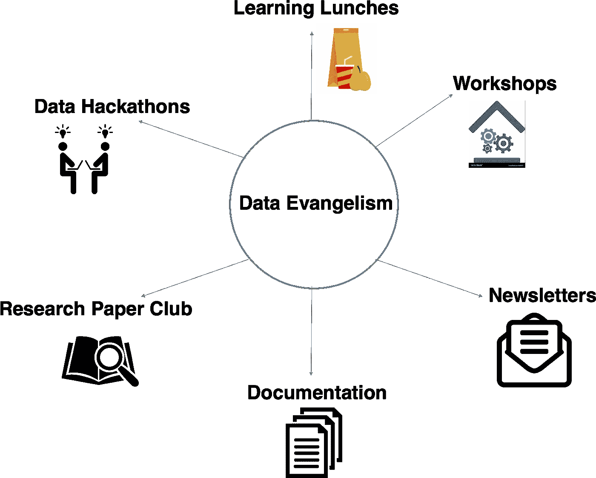

# 为什么数据科学家需要领导数据传播工作

> 原文：<https://towardsdatascience.com/why-data-scientists-need-to-lead-data-evangelism-efforts-f433f7fac936?source=collection_archive---------24----------------------->

## *通过这六项计划启动数据传播*

你上一次帮助别人完成他们自己可以轻松完成的请求是什么时候？如果您像大多数数据科学家一样，您可能必须相当频繁地处理临时请求。

最大限度减少此类请求的最简单方法是通过数据传播工作来教育和授权您的同事。每个组织都是不同的，取决于您的公司处于[数据成熟度模型](https://www.cio.com/article/3077871/the-four-stages-of-the-data-maturity-model.html)的哪个阶段，一个数据传播计划可能比其他计划有更高的投资回报。例如，如果您收到一个简单 SQL 请求的变体(例如，最近 x 地区的销售额是多少？)，那么创建一个 SQL workshop 可能会证明是对您时间的极大利用。

除了让你的同事自给自足，数据福音也可以加强你的技术团队，促进你的工作意识。邀请人们在学习午餐或时事通讯的背景下分享他们的工作，是提高认识的好方法，并允许人们展示他们的知识。外部利益相关者也可以受益于对数据科学团队具体做什么以及如何帮助他们实现业务目标的更深入的了解。

作为一名数据科学家，您应该在传播您的数据和鼓励数据驱动的决策方面起带头作用。考虑到数据传播的重要性，以下是你可以在你的公司开始实施的六个计划。

## **1。研讨会**

如果你发现自己经常处理一些简单的要求，这些要求可以通过一些基本的培训来完成，那么是时候考虑举办一个研讨会了。对业务线利益相关者进行 SQL 基础知识以及数据收集和存储机制的培训可能会为您节省大量时间。其他主题可能包括基本商业智能工具的概述，如[潜望镜](https://www.periscopedata.com/)和 [Tableau](https://www.tableau.com/) ，甚至是描述预测模型如何做出决策的基本知识的研讨会。这里的关键是让你的同事参与进来，教育和激励他们自己继续学习。在一周的特定时间安排办公时间可能是保持高参与度和创造时间回答问题的另一种有用方式。这样你也可以批量提问，避免在一周内转换上下文。

## 2.**简讯**

有了时事通讯，你可以关注内部话题(突出项目和内部团队更新)，外部话题(行业趋势)，或者两者兼而有之。有一种方式来交流你的团队正在做什么是提高意识和与公司其他人协调行动的好方法。同样，突出你所在领域的发展可能会让你直属团队之外的人提出一个值得探索的新颖想法。

## **3。研究论文俱乐部**

当你开始工作时，很难继续学习并跟上最新的发展。这样，研究论文俱乐部可以作为一个有用的问责工具。它还可能会产生一些影响您的技术路线图的有趣想法。

## **4。** **学习午餐**

邀请内部或外部的演讲者是获得新观点的好方法，并为其他人提供一个平台来分享他们正在做的事情。目标可以是任何东西，从突出团队以外的人的独特见解，到引发有趣的讨论。

## **5。数据黑客马拉松**

如果您想集体讨论可视化数据的新方法或构建预测模型的不同方法，向公司中的其他人公开您的数据可能会很有用。有时候需要一个不每天看同样数据的人来提出一个新颖的见解。

## **6。文档**

教育同事的一个重要步骤是就经常出现的主题创建文档。当新队友加入时，这也将是一个无价的工具。

一种通过数据传播工作来教育和赋权员工的文化，将在未来许多年里获得显性和隐性的好处。有时候，简单的方法就是向业务利益相关者介绍生产中的模型机制，让他们了解它是如何发生的，而不是让他们认为这是黑盒魔术。随着透明度的增加，业务涉众可能会更愿意合作，甚至可能会提出一些您以前没有想到的新应用程序。以上列举的这些类型的努力将最终提高可信度和信任度。没有这两样东西，无论你的技术能力有多强，你影响公司的能力都会受到阻碍。

如果你对数据传播有其他想法，请在下面的评论中分享！