# 为什么在训练神经网络之前应该对数据进行规范化

> 原文：<https://towardsdatascience.com/why-data-should-be-normalized-before-training-a-neural-network-c626b7f66c7d?source=collection_archive---------2----------------------->

## **为什么 Tanh 通常比 Sigmoid 表现更好**

Photo by [Clint Adair](https://unsplash.com/@clintadair?utm_source=medium&utm_medium=referral) on [Unsplash](https://unsplash.com?utm_source=medium&utm_medium=referral)

训练神经网络的最佳做法之一是将数据标准化，以获得接近 0 的平均值。标准化数据通常会加快学习速度，并导致更快的收敛。此外，在神经网络的隐藏层中,(逻辑)sigmoid 函数几乎不再用作激活函数，因为 tanh 函数(以及其他函数)似乎更优越。

虽然这可能不会立即显现出来，但有非常相似的原因来解释为什么会出现这种情况。双曲正切函数非常类似于逻辑 s 形函数。但是，主要区别在于，双曲正切函数输出介于-1 和 1 之间的结果，而 sigmoid 函数输出介于 0 和 1 之间的值，因此它们总是正的。

我几乎找不到任何文章解释为什么这能加速训练。我能找到的解释要么太肤浅，没有更多的上下文很难理解，要么就是错误的。所以我决定深入挖掘，根据我的发现写这篇文章。

我们将首先看看 sigmoid 和 tanh，然后我们将根据我们的发现讨论归一化。

# 场景设置:Tanh 和逻辑 s 形

显然，在神经网络中使用的激活函数比 tanh 和 sigmoid 多得多，但现在我们只看一下两者之间的区别。(注意，严格地说，双曲正切函数也是 sigmoid 函数，但是在神经网络的上下文中,“sigmoid”函数通常指逻辑 sigmoid。所以我在这里遵循惯例。)

让我们快速地看一下这两个激活函数和它们的导数，以便搞清楚基本情况。

双曲正切函数及其导数如下所示:

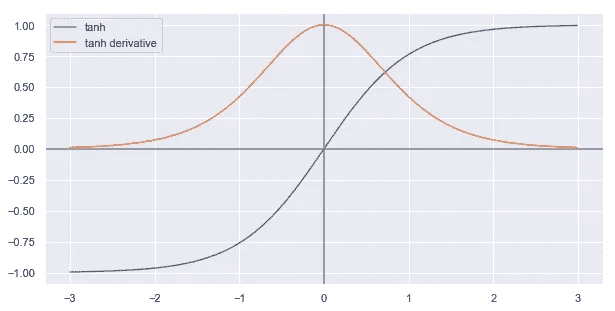

tanh function and its derivative

如你所见，tanh 函数以 0 为中心。它的值范围从-1 到 1。它可以表示为

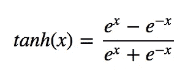

另一方面，sigmoid 函数及其导数如下所示:

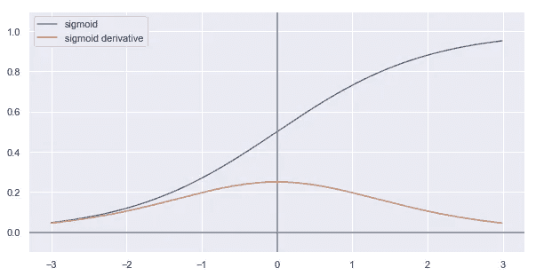

logistic sigmoid and its derivative

逻辑 sigmoid 的值范围是从 0 到 1，因此总是正的。它可以写成:

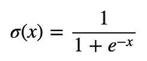

如果比较两者的导数，可以发现双曲正切函数的导数往往比 sigmoid 的导数大得多:

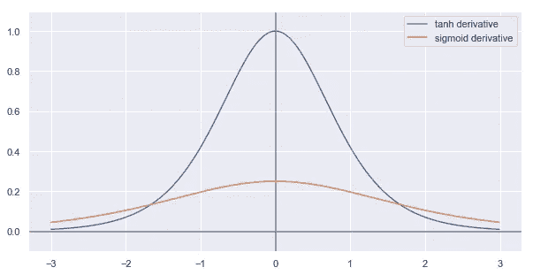

Comparison of sigmoid and tanh derivatives

当我们看一下在梯度下降过程中发生了什么时，这将变得相关。

# Tanh 和 Sigmoid 作为激活函数

在神经网络中，一层中节点的输出用作下一层中节点的输入。因此，激活函数决定了下一层中节点的输入范围。如果使用 sigmoid 作为激活函数，则下一层中节点的输入范围将全部在 0 和 1 之间。如果您使用 tanh 作为激活函数，它们的范围将在-1 和 1 之间。

现在，让我们考虑一个用于二元分类的神经网络。它有一堆隐藏层，输出层中的一个节点具有 sigmoid 激活函数。对于我们的讨论，我们现在对所有这些隐藏层中发生的事情不感兴趣，我们只对输出层中发生的事情感兴趣。所以让我们把其他所有东西都当作一个黑盒:

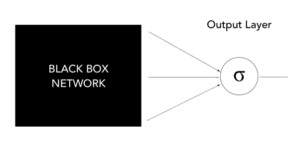

Neural Network with one output node — rest of network is treated as black box

根据我们在最后一个隐藏层中使用的激活函数，输出层中节点的输入会有所不同。

由于我们在输出层使用 sigmoid 函数，网络的最后一部分基本上是一个逻辑回归。该节点接收来自前一层的一些输入，将它们乘以一些权重，并将逻辑 sigmoid 应用于该结果。

为了理解为什么 tanh 比 sigmoid 更好，我们需要看看在梯度下降过程中发生了什么。因为我们的输出节点主要执行逻辑回归，所以我们可以通过查看逻辑回归的梯度下降来简化事情。

# 梯度下降过程中会发生什么

对于二元分类，我们通常使用二元交叉熵作为损失函数:

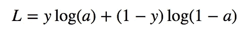

其中，𝑎是我们的模型对于特定训练实例的预测输出，而 *y* 是真实的类标签。

对于逻辑回归(因此对于上面例子中的输出层也是如此)，损失函数 *L* 相对于权重 *wᵢ* 的导数等于

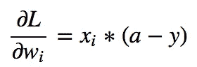

其中 *y* 是真实类别标签 *xᵢ* 是对应于权重 *wᵢ* 的输入特征。

对于每个权重 *wᵢ* ，偏导数的第二项，(*a*-*y*)将是相同的。不同权重的梯度之间的差异仅取决于输入 *xᵢ* 。如果输入都是相同的符号，梯度也将是相同的符号。

因此，当使用 sigmoid 作为前一层节点的激活函数时，节点的权重可以在梯度下降的单个步骤中同时增加或减少。节点的一些权重增加而另一些权重减少是不可能的。

如果权重向量需要改变方向，它只能通过“之字形”来实现:向权重添加和移除不同的量，直到完成方向的改变。这是非常低效的。(我们将在后面看一个说明这一点的图。)

另一方面，对于 tanh 来说，我们输入的符号 *xᵢ* 可以变化——有些会小于零，有些会大于 0。因此，更新的方向相互独立。这使得权重向量更容易改变方向。

如果这些仍然很抽象，让我们来看一个具体的例子和一些正在发生的可视化。与本文相关的完整代码可以在 [GitHub](https://github.com/timo-stoettner/nn-normalization/blob/master/Tanh%20vs%20Sigmoid%20-%20Notebook.ipynb) 上找到。

# 看一些数据:Tanh 真的更好吗？

我们将构建两个完全相同的小网络，唯一的区别是一个将使用 tanh 作为隐藏层中的激活函数，另一个将使用 sigmoid 激活。然后，我们比较结果，并详细查看输出层中的权重发生了什么变化。

我们将根据一些随机生成的虚拟数据来训练网络:

x 包含-0.5 到+0.5 之间的随机值。其行构成训练示例，列构成特征值。y 包含类别标签，如果记录的平均值大于 0，则为 1，否则为 1。

首先，让我们看看 tanh 是否真的比 sigmoid 表现得更好。也许 tanh 的所有优势只是一个既定的谣言。我们将定义两个简单的模型，一个隐藏层由 4 个节点组成，一个输出层由 1 个节点组成。它们唯一的区别是隐藏层中使用的激活函数。

让我们用生成的数据训练他们几个时期，看看他们的表现如何:

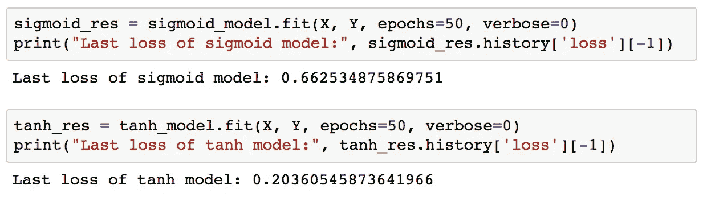

tanh 模型学得更快。经过 50 个时期后，双曲正切网络的损耗不到 sigmoid 模型损耗的三分之一。

然而，由于 sigmoid 和 tanh 函数的导数在它们的范围上有很大的不同，这是一个有点不公平的比较。我们在两种情况下使用了相同的学习率。在梯度下降的每一步中，每个权重根据下式更新

其中𝜶是学习率。如果梯度越大，更新也将越大，并且网络将学习得更快——只要更新不会变得太大。因此，我们可能希望通过为 sigmoid 网络选择更大的学习速率来解决这个问题。

为了理解学习率的影响，让我们用不同的学习率训练两个网络几次，并比较结果。当对不同学习速率的 10 个时期的训练后的损失作图时，我们得到如下结果:

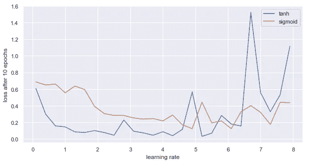

Loss after 10 epochs of training for different learning rates

结果不再那么明朗了，但是 tanh 总体上还是表现得更好。当达到大于 6 的学习率时，tanh 网络中的更新明显变得太大，因此它们超过了最小值。考虑到双曲正切的梯度往往比 sigmoid 的梯度大得多，当双曲正切网络的更新变得太大时，sigmoid 网络仍然表现良好是很有意义的。

然而，如图所示，使用双曲正切网络 10 个周期后获得的最佳损耗明显小于使用 sigmoid 网络获得的最佳损耗。此外，对于高于 5 的较高学习速率，sigmoid 模型的结果也开始波动，这表明学习速率对于 sigmoid 网络来说也变得太大了。

在确定 tanh 确实看起来更好之后，让我们仔细看看为什么会这样。

# 绘制输出图层的权重

对于为什么 tanh 比 sigmoid 性能更好的一些说明，让我们看一下输出层的各个权重。记住，如果我们在隐藏层中使用 sigmoid 激活函数，输出层只检索 0 和 1 之间的值。具体来说，我们感兴趣的是梯度下降的每个单独更新如何影响输出图层的权重。

当在梯度下降的每个单独步骤后绘制权重时，结果将如下所示:

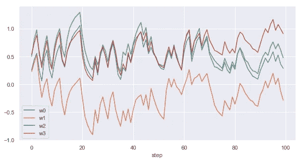

Weights of output layer after each step of gradient descent with **sigmoid activations** in hidden layer

正如你所看到的，重量总是朝同一个方向变化。在梯度下降的一个步骤中，它们或者全部减少或者全部增加，导致“之字形”运动。变化的幅度不同，但变化的符号是相同的。如果权重向量需要改变其方向，例如最低的权重需要变成最高的权重，它只能通过上下曲折相当长的时间来实现。

如果您为我们的 tanh 网络绘制相同的权重，结果将如下所示:

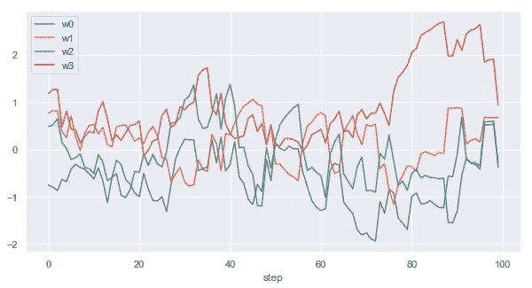

Weights of output layer after each step of gradient descent with **tanh activations** in hidden layer

这里，权重更新看起来彼此完全独立。这使得学习更加灵活。如果权重向量的方向需要改变，梯度下降不需要像 sigmoid 激活函数那样上下曲折，它只需更新单个权重，直到获得所需的方向。

# 这和正常化有什么关系？

根据上面的讨论，规范化有所帮助的一个原因应该是非常清楚的:如果您有一个全是正的或全是负的特征，这将使下一层中的节点更难学习。它们将不得不像遵循 sigmoid 激活函数的那些一样呈之字形。如果你转换你的数据，使其平均值接近于零，你将因此确保有正值和负值。

标准化有帮助的第二个原因与输入的**比例有关。标准化可确保要素假设的值的大小大致相同。**

回想一下，我们在梯度下降过程中的步骤，以及在具有逻辑激活函数的节点中的学习速度，取决于

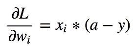

其中 *x* ᵢ是节点的第*和第*个输入。ᵢ越大，更新就越大，反之亦然。学习的速度与输入的大小成正比。(对于双曲正切激活函数，梯度会略有不同，但仍以类似的方式取决于输入。)

如果输入具有不同的标度，则连接到某些输入的权重将比其他输入更新得更快。这通常会损害学习过程——除非我们事先知道哪些特征比其他特征更重要，在这种情况下，我们可以调整尺度，让我们的神经网络将学习集中在更重要的特征上。但是在实践中，我们不太可能预先预测这对学习有什么好处。

总之，归一化很有帮助，因为它确保了(a)有正值和负值用作下一层的输入，这使得学习更加灵活;( b)网络的学习在相似的程度上考虑所有输入要素。此外，由于 sigmoid 激活只输出正值，这抑制了学习，所以您通常应该更喜欢隐藏层中的其他激活函数。(当然，在输出层使用 sigmoid 激活完全没问题。)

我希望这能让你更好地理解为什么应该对神经网络的数据进行归一化，以及为什么 tanh 作为激活函数通常比 sigmoid 更好。

如果您有任何反馈或问题，请在下面的评论中告诉我！