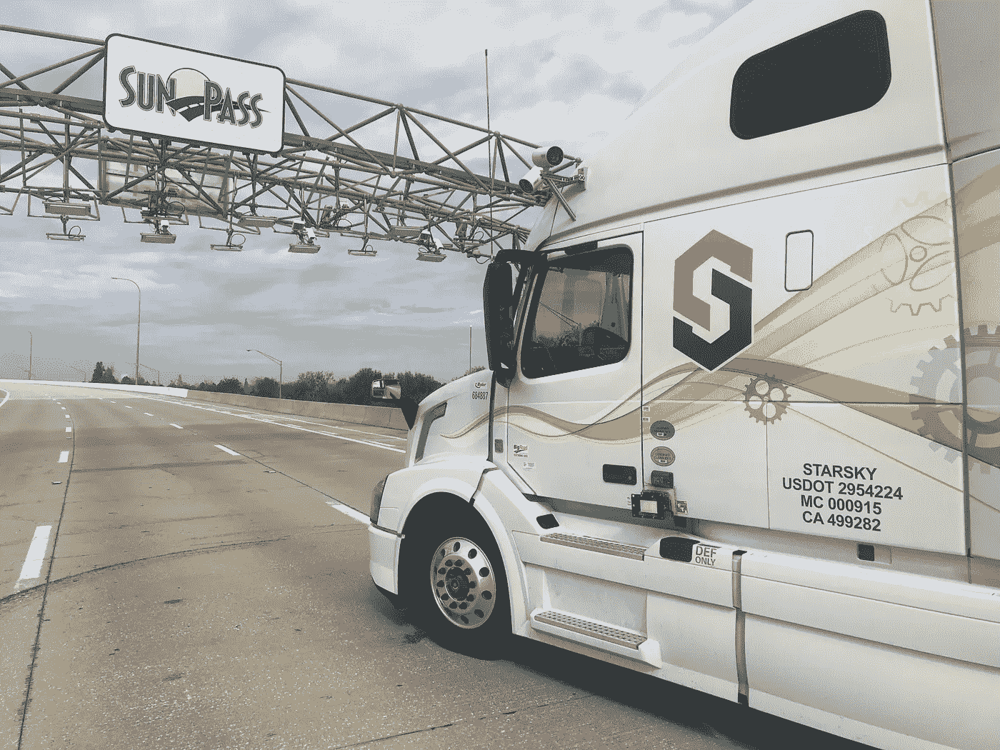
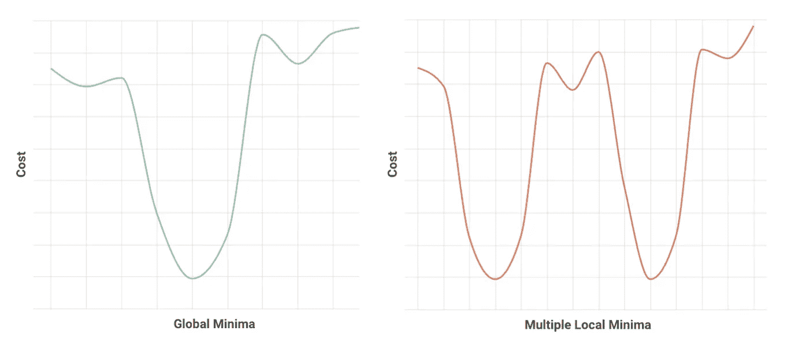

# 为什么深度学习不是自动驾驶汽车的银弹

> 原文：<https://towardsdatascience.com/why-deep-learning-is-not-a-silver-bullet-for-autonomous-vehicles-371c74c1a02b?source=collection_archive---------11----------------------->

如果你是自驾领域的工程师，你会经常被问到同一个问题的不同版本。“为什么要这么久？”有人可能会说。“我现在不是应该可以坐机器人出租车了吗？

我明白了。去年，Waymo 的车辆达到了 1000 万英里的自动驾驶里程。特斯拉的自动驾驶仪通过了一次 [*十亿*英里](https://www.bloomberg.com/news/articles/2018-11-28/tesla-customers-rack-up-1-billion-miles-driven-on-autopilot)的激活行驶。那么，在全国各个城市向公众推出机器人出租车会有什么延迟呢？

我马上会谈到我认为正在发生的事情。但首先我应该澄清一些事情。大牌的自动驾驶公司都在追求高水平的自动驾驶。他们的目标是创造出能在人类能到达的任何地方自动驾驶的车辆。

在 Starsky，我们有不同的方法。

**Starsky Robotics Driverless Truck**

我们正在解决一些更简单的事情:我们正在建立一个只能在某些预先选择的高速公路上行驶的系统。我们依靠人类遥控操作者在他们行程的第一英里和最后一英里驾驶卡车。当过程中发生复杂的事情时，他们也会做出关键的决定。因为我们的用例要简单得多，所以我们能够相对快速地将我们的技术推向市场。

在这篇文章中，我想解释为什么你还没有乘坐机器人出租车。然后我会进一步谈论 Starsky 的方法，并解释关键的区别。

**业内每个人都在使用的一个伟大工具是深度学习**，自从巴斯蒂安·特龙和他的斯坦福团队在 2005 年使用人工智能成为第一个赢得 DARPA 大挑战的人以来，深度学习一直被认为是解决[第五级自治](http://www.thedrive.com/sheetmetal/15724/what-are-these-levels-of-autonomy-anyway)不可或缺的。深度学习是人工智能的一种形式，旨在像人脑一样工作。

工程师教授它的方式和人类学习的方式非常相似。作为一个例子，想象你正在试图创建一个深度学习算法，可以在图像中检测一只猫。算法试图回答的问题有一个客观正确的答案。图片里要么有一只猫，要么没有。用数学术语来说，问题空间有一个明确的全局极小值。因为请求的输出很简单，所以我们很好地理解了如何对这个 cat 检测算法进行编程。首先，你用数据“训练”算法——数万张猫的照片，以及非猫的照片，比如狗、人和熊。很快，该算法可以查看新的、从未见过的照片，并以很高的确定率确定这组像素是否以猫为特征。

大多数行业都在尝试做一些比教计算机识别猫更困难的事情:他们试图使用深度学习来做出适当的驾驶决策。这就复杂多了。这个的问题空间真的很大。这使得对训练数据量的需求也呈指数级增长。作为一个复杂的因素，不同的人在相似的情况下倾向于做不同的事情。这意味着没有客观正确的答案。有些驾驶决策客观上是不好的。但是大多数在路上的场景有许多不同的可能的解决方案，许多人会同意是好的。

从数学上来说，工程师通过训练深度学习算法来设计深度学习算法，以最小化一个成本函数。当问题空间有一个明确的全局最小值时，算法很容易训练，也就是说，单个选项的成本比任何其他选项都低，例如图像中有猫，或者车道线的位置。当存在多个局部最小值时，即存在大量可能的“正确”解决方案时，该算法的训练变得更加棘手，就像车辆在交通堵塞期间决定如何并入一条车道时的情况一样。(引入更多变量或增加问题空间的维度在这里也不是正确的答案。)

**让这项任务变得更加艰难的是:**深度学习算法相当于黑盒。他们的内部工作本质上是随机的，几乎不可能确定他们为什么做出这样的决定。你知道输入算法的数据，你知道它吐出的决定，但你不知道*为什么*它吐出它做了什么。

例如，业内人士在为无保护的左转等复杂场景设计决策算法时，每天都会遇到这种情况。自动驾驶汽车应该减速，还是加速转向左侧车道？

不管采取了什么行动，都很难说出*为什么*算法会做出这样的决定。工程学中有一个概念:回溯。如果你在一个可回溯的系统中遇到了问题，你可以回去，重新回顾发生的每一个步骤，并找出哪里出了问题。

深度学习算法不是可回溯的系统。测试可以揭示车辆在单一的精确测试情况下会做什么。但这并不一定会告诉你在稍微不同的*情况下车辆会做什么。以我们上面的例子为例，如果左边的车开得稍微快一点，或者在稍微不同的位置起步，自动驾驶汽车可能会执行完全不同的动作。*

*所有这些都让测试*变得异常复杂。很难将这种复杂的深度学习融入到最终成为消费品的东西中。因为消费者想要可重复的、可靠的、值得信赖的结果。他们希望无人驾驶汽车在繁忙的街道上左转时，每次面对这种情况时都能做出大致相同的反应。但是深度学习算法偶尔会给你一个曲线球。当这种情况发生时，你必须出去收集更多的数据——数量惊人的数据。为了有任何统计意义，我们谈论的是数十亿英里。根据兰德公司的一项研究，一个由 100 辆自动驾驶汽车组成的车队以 25 英里/小时的平均速度一年 365 天每天 24 小时运行，大约需要 400 年才能达到这些数字。**

*所以才花了这么长时间。*

***我并没有轻视深度学习的意思。在 Starsky，我们将它用于许多不同的目的。也就是说，我们对它的使用是非常有限的。我们将深度学习用于具有客观正确答案的小范围问题。Starsky Robotics 永远不会采用深度学习算法的当前状态来做出驾驶决策。***

*相反，我们用两种方法之一来解决卡车面临的驾驶困境。管理我们卡车在公路上决策的软件依赖于一个确定性模型。我的意思是，它是按常规编程的。我们使用工程师已经使用了几十年的相同的基本框架来编写我们的软件。同样，我们使用经过验证的质量保证程序来生产可靠的软件模块。*

*这种方法是可行的，因为它让我们知道我们的系统如何运作的每个方面。每当我们遇到问题，我们就把事情分解成组成部分。这使我们能够通过遍历软件决策过程的每个方面来测试事情——因为，与使用深度学习算法不同，决策过程的每个方面都是可知的。*

*比方说，我们想了解一辆 Starsky 卡车在另一辆车切入其车道后的行为。汽车行驶得比卡车快得多，但卡车还是刹车了。那个动作感觉怪怪的。人类司机不会这么做。幸运的是，我们的确定性软件允许我们仔细检查卡车做出的每一个决定。我们可以深入研究代码，检查算法做出刹车决定的推理——并按照我们的意愿纠正事情。*

*我在这里简化了一些事情，但是重点是，当你使用一个确定性的模型时，这些组件中的大部分都是非常简单的。通过将流程简化为组件，系统变得更加容易验证、可靠，并最终变得安全。*

*Starsky Robotics 在自动驾驶领域与众不同的地方还有一个。大多数其他公司都在试图发明能够在复杂的城市环境中工作的自动驾驶汽车。Starsky 正在制造自动驾驶卡车，在高速公路上自动驾驶，并将第一英里和最后一英里的控制权交给人类遥控操作者。即使当我们的卡车在高速公路上时，我们的软件也会让人类参与某些决策，例如当卡车的自动软件遇到有问题的“边缘情况”时。本质上，我们使用人类来解决他们擅长解决的问题(复杂和非结构化的驾驶环境)，并将我们对深度学习的使用保留在它工作良好的地方。*

*是的，随着行业完善深度学习在自动驾驶汽车上的应用，推广机器人出租车需要很长时间。与此同时，我们可以制造出一种有用而安全的产品，它可以在今年使用，而不是在下一个十年的某个时候。*

*因为我们正在解决的问题非常不同。我们并不是要解决整个自动驾驶的问题。相反，我们正在创造一种解决方案，以提高生产率和安全性，在全国范围内运输货物。我们不需要深度学习来解决这个问题。*