# 深度学习为什么有效——循序渐进教程

> 原文：<https://towardsdatascience.com/why-deep-learning-works-289f17cab01a?source=collection_archive---------7----------------------->

## 一开始是神经元:理解梯度下降、反向传播、线性回归、逻辑回归、自动编码器、卷积神经网络和 VGG16。借助 Python & Keras 中的可视化辅助工具和实际动手编码。

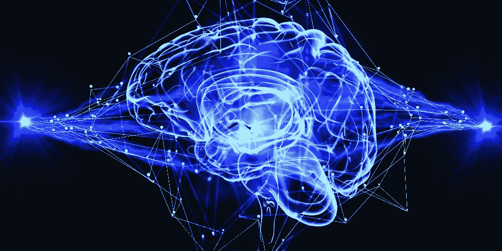

这篇文章是为那些错过了通过深度学习黑盒的无痛之旅的人写的。我们用一个关于一个过于关心未来的农民的故事来激励和吸引读者。我们通过使用人工神经网络解决简单的线性和逻辑回归来开始研究他的问题。我们通过观察梯度下降、链式法则和反向传播来逐步建立我们的理解。稍后，我们通过构建一个自动编码器并添加卷积层来消除 MNIST 手写数字的噪声，进行了更深入的研究。在解释了为什么这样的网络在计算机视觉中如此成功之后，我们进一步从预训练的 VGG16 网络中提取特征。

> 通过阅读这篇文章，你将最终破解深度学习的奥秘。
> 
> 你也会有一些有意义的开放式问题。这就是(深度)学习的全部意义，对吗？

先说一个故事。

# 生活在未来的人

这是一个想知道自己未来的老人的故事。他是个农民。他很幸运，他的田地每年都能产出越来越多的庄稼。他的粮仓里有太多的粮食，不得不把多余的粮食分给朋友和邻居。尽管如此，他还是担心未来。他不知道给慈善机构捐多少，自己留多少。实际上，这取决于他下一年的收成。他需要对未来几年的产量有一个准确的预测。

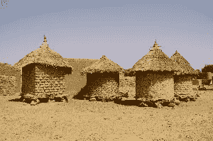

那么，和深度学习有什么联系呢？请继续读下去，你会很高兴的。农夫的大儿子想出了下面这个实验。他取了一些谷物样本，并把大约相当于前一年每年收获量的数量放在一个袋子里。按照时间升序排列，每个袋子代表一年。然后，他让他最小的兄弟姐妹把一根棍子放在袋子的顶部，这样棍子就不会掉下来，并且保持平衡，正如这篇文章中的图片所示。

这一景象让老人对未来几年的收成有了一个概念，假设趋势保持不变。他的儿子刚刚发明了线性回归，比弗朗西斯·高尔顿早了几百年吗(对不起，先生)？

> 如果我们可以做线性回归，为什么我们需要人工神经网络？

继续阅读，我们将很快解决深度学习问题。人们对未来很着迷。我们想知道明天是否会下雨，我们明年是否会结婚，我们是否以及何时会最终变得富有。过去，这些是甲骨文(而非软件公司甲骨文)最喜欢问的问题。据推测，神谕是具有特殊技能的人，他们会根据现实世界的数据来预测未来，比如手上的线条、星座或血液的味道。

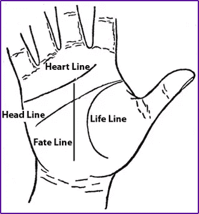

能够预测未来并不总是一件好事。特洛伊的卡珊德拉有预见的天赋。对她自己不利的是，她被阿波罗诅咒没有人会相信她的预言。因此，她关于特洛伊毁灭的警告被忽视了，事情对她来说并不顺利。如今，企业、组织和政府都在通过雇佣数据科学家——现代的先知——来寻找自己的卡珊德拉。因为一些数据科学家和机器学习者希望尽可能地模糊，以便获得更多的重要性，就像过去的神谕一样，他们选择使用所谓的**深度学习**技术，一直如此。也是因为管用。不仅仅是为了预测未来，也是为了理解现在，进行推理和分类。你可以看看[这篇文章](https://blog.statsbot.co/deep-learning-achievements-4c563e034257)自己看看，我们可以用深度学习做些什么惊人的事情。

深度学习为什么有效？为什么我们农民的儿子需要深度学习，尽管他已经发明了线性回归？这些是我们将在接下来的章节中尝试解决的问题。

# **用神经元进行线性回归**

我们先来看看农夫儿子的线性模型。他用年份来预测收成的数量(数量)。通过画出一条最佳匹配线，这条线跟随多年来的数量趋势，他能够预测接下来几年的收获量。在数学上，他找到了一条多年来的直线*ŷ*x，截距为 *β0* ，斜率为 *β1* 。

## 线性回归的解析解

给定 *Y* 的真实世界测量值和相应的预测值 *X* ，我们能够计算斜率和截距，如下所示。

一张图片胜过千言万语，Python 代码也是如此。为了做出漂亮的剧情，探索模式，我们将重现农夫之子使用的数据。让我们沿着线性方程所表示的平面中的直线创建 100 组人工随机测量值。我们将这些点沿直线均匀分布在-2 和 3 之间的区间内。然后，我们向每个 Y 值添加一个标准偏差为 1 且平均值为 0 的随机正态分布值。我们最后使用上面的公式来计算截距和斜率。

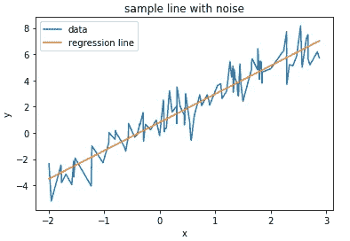

正如我们在上面的图像中看到的，农民的儿子的想法是一个赢家。我们可以预测 *X* 的任意值的 *Y* ，因为我们知道支配 *Y* 行为的回归线。那么，我们能用人工神经网络做同样的事情吗？首先，我们需要定义什么是真正的人工神经网络。

## 生物神经元

什么先出现的？神经科学还是人工神经网络？不管怎样，人工神经元的想法似乎来自我们大脑中的神经元。我们的大脑由 1000 亿个神经元组成。当电信号通过树突流入神经元的细胞核时，电荷就积累起来了。当细胞达到一定的电荷水平，即阈值时，它就会激活，通过轴突发出电信号。神经元在决定何时触发时，对不同的输入信号有不同的权重。一些人认为，人工神经网络模拟了为不同的树突(输入)分配不同权重的过程。

## 人工神经元

单个人工神经元接受输入 *X* ，使用**权重**W*应用(线性)**仿射变换**以产生临时值 *h* 。然后，它将该值通过**激活功能**来产生输出。在我们的线性回归例子中， *X* 可以是一个数，比如说 2。仿射变换会使用向量 *W* 中存储的截距和斜率对输入进行变换，为了返回，姑且说 *h* =5。后一个值将经过激活，在我们的例子中是线性函数，输出，比如说 *Y* = *h* =5。*

## 人工神经元和梯度下降

我们之前看到，回归线的截距和斜率可以使用解析公式直接计算。像我们刚刚描述的那样，一个人工神经元可以不使用任何公式找到那些值吗？我们可以使用以下策略:我们可以选择截距和斜率的随机值，假设 *W* =(-1，3)，然后，神经元可以计算相应的回归线，并将其与真实的 *Y* 值进行比较。然后，我们将能够计算出神经元的输出与真实的 *Y* 之间的差异，即损耗。在我们的例子中，均方误差是一个好的损失函数，我们称之为 L。我们将重复选择随机值的过程，直到损失足够小，或者直到我们厌倦尝试。这种策略可能对一个神经元有效。然而，如果我们有两个或几千个神经元，我们可以花一生的时间来寻找。这就是为什么这个策略听起来如此疯狂，以至于人们想出了一个更好主意，叫做梯度下降。这就像在自由式滑雪中从山顶通过最短的路径下降到山谷。不会被杀。

梯度下降是一种工具，通过查看损失函数 *L* 相对于 *W* 的导数，找到使损失函数*L*最小的 *W* 的值。假设我们已经选择了 *W* =(-1，3)，并且我们已经计算了这些值的损失，现在我们必须决定尝试 *W* 的哪个下一个值，以便具有减少的损失。我们的想法是计算损失的导数，比如说截距，并检查其符号。如果导数为正，说明损失在增加，需要尝试更小的截距。如果导数是负的，损失在减少，所以我们可以继续尝试更大的斜率值。如果导数为零，我们就达到了损失的极小值，希望是全局的。我们可以停下来考虑一下 *W* 是使损失最小的最佳重量。梯度下降需要计算导数，如果我们没有像 Matlab 这样的好工具，这可能会成为一个噩梦。感谢**反向传播**，我们甚至不需要这样的工具，我们将在后面看到。

## 带 Keras 的线性回归

让我们实际看看我们的神经元将如何执行线性回归任务。我们使用 [Keras](https://keras.io/) ，这是一个 Python 库，也是深度学习实验的好伙伴。我们创建一个具有单个神经元、标量输入、标量输出、具有权重和偏差的仿射变换以及线性输出的模型。接下来，我们使用随机梯度下降优化器在数据点上训练我们的神经元。损失函数是均方误差。优化器将执行 5 次迭代(历元)。为了简单起见，我们不对数据进行缩放。

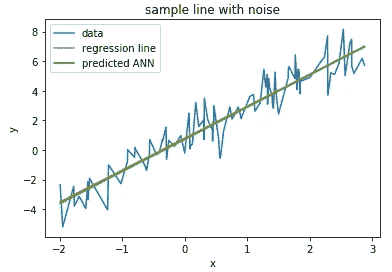

瞧啊。单个神经元能够预测几乎相同的回归线(绿色)，这是我们之前分析计算的(橙色)。如上图所示，斜率和截距的预测值非常接近。在这两种情况下，衡量健康的 R2 分数看起来也很相似。看来人工神经网络真的管用！如果我们让它变得更难呢？

# 神经元非线性回归

我们的农民很快意识到生活中只有少数事情是线性的。收成趋势可能会达到一个稳定水平，然后开始下降。下面，我们设想一个新的数据集，它呈现出所谓的“单峰”趋势。

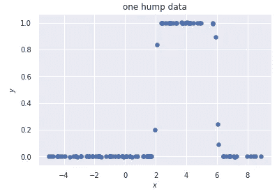

## 三神经元模型

显然，线性激活的单个神经元将无法捕捉到这一新数据中的行为。第一个想法是改变线性激活函数，并使用类似于 *S* 的形状函数。sigmoid 函数是深度学习中非常常用的一个很好的候选函数。一个 sigmoid 将完美地捕捉到我们的数据中观察到的增长趋势。镜像的 s 形曲线也可以捕捉到下降趋势。因此，我们需要两个 sigmoid，因此需要两个神经元，以及将两个 sigmoid 相加的第三个神经元。相应的架构如下图所示。

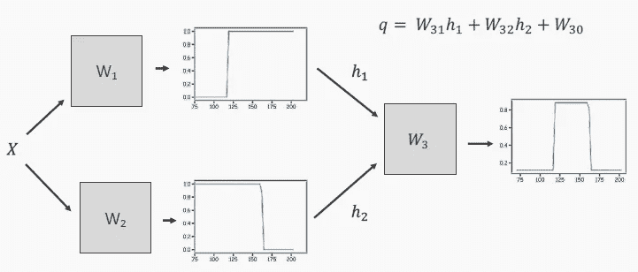

source: P. Protopapas, Harvard

第一个神经元将采用标量 *X* 作为输入，然后使用权重 *W1* 和偏差应用仿射变换。结果将通过一个 sigmoid 激活产生 *h1* 。第二个神经元也会发生类似的事情，产生 *h2* 。现在，数字 *h1* 和 *h2* 都将被馈入第三个神经元，该神经元将通过应用权重 *W31* 到 *h1* 和 *W32* 到 *h2* 来执行仿射变换，最后添加一个偏置*。*产生的 *q* 将通过线性激活产生单峰形状。

## 人工神经网络前向传递

让我们用 Python 从头开始构建这个网络，没有 Keras。正如我们在上一节中看到的，网络总共有 7 个权重(和偏差)。我们手动给 7 个权重赋值，使用驼峰函数的数据执行正向传递，并绘制网络的输出，与真实的 *Y* 值绘制在相同的图中。我们手动调整权重，直到图尽可能匹配。通过这样做，我们模拟了所谓的前向传递，这是由 Keras 在训练网络时执行的。

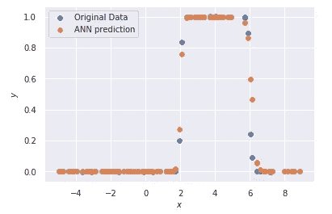

## 带 Keras 的非线性回归

像特洛伊的卡珊德拉一样，我们能够猜测出 *W* 的完美值，因此网络**的输出完美地超过了**的数据。虽然大多数数据科学家都能做到这样的神奇，但并不是所有人都有这种天赋。幸运的是，对于普通人来说，有另一种方法可以做到这一点。这是使用一个库，如 Keras 来运行一个梯度下降优化器，尽最大努力为我们找到这 7 个权重。这就是我们在下面的代码中演示的内容。

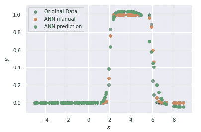

经过 50000 次的训练，网络达到了 96.69%的 R2 评分。上面的图显示了它的预测，与我们之前通过手动权重调整获得的预测进行了比较。看起来很神奇，不是吗？给定 3 个神经元， *X* 和 *Y* 数据点，网络能够微调自己以适应数据。它已经学习了数据的形状，而没有任何进一步的洞察力。下面，我们可以直观地看到对最佳 *W* 的搜索如何收敛到最低损失。如果我们让优化器运行额外的时期，我们最终会达到 100%适合。这篇文章的一些读者已经在咬牙切齿地考虑过度拟合和缩放。好吧，让我们先高兴一下，过一会儿再回到这个热门话题。

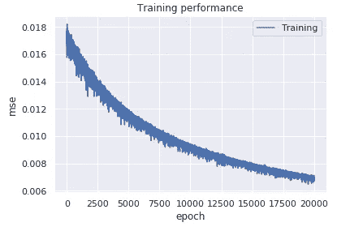

这一结果进一步证明了人工神经网络具有捕捉数据中非线性相关性的能力。这就是深度学习奏效的原因吗？好吧，我们在这里作弊了一点。我们基于我们对数据的双 s 形形状的先验知识来设计网络，因此，通过选择 s 形作为激活函数。来自真实场景的数据并不总是具有如此清晰的形状，我们最终将四处寻找合适的网络架构。迟早，我们会把我们对世界的看法引入网络架构，把它变成一个有偏见的模型。你可以看看我另一篇关于[负责任的数据科学](/wild-wide-ai-responsible-data-science-16b860e1efe9)的文章。现在，让我们暂时假设我们都是好人。然而，深度学习为什么有效的问题仍然没有答案。

## 使用 Keras 的逻辑回归

我们的农民对驼峰模型不太满意，尤其是它的第二部分，告诉他预计收成会下降。他更想知道哪一年有好收成。下面我们创建一个反映这种情况的数据集。低于 0 的年份被归类为歉收年份，而 0 之后的年份则是丰收年份。

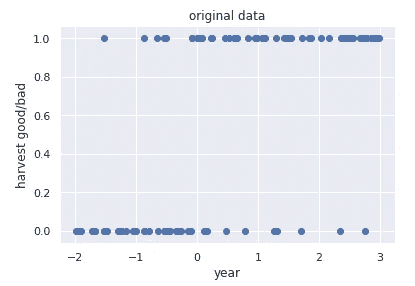

现在让我们看看一个简单的神经元是否能够将一个给定的年份归类为收获的好年份。这是一个逻辑回归问题。下面我们将数据输入 Keras 模型，使用随机梯度下降作为二进制交叉熵损失的优化器(太多的关键字让你吃惊)。我们实现了 81%的分类准确率，正如你在下图中看到的，sigmoid 激活函数做得很好。

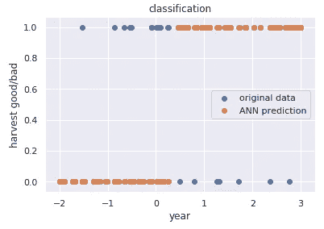

## 逻辑回归中的梯度下降

我们刚刚解决的分类问题是进入梯度下降和反向传播的黑暗世界的一个很好的例子。我们记得，在我们上面的神经元中，输入经过仿射变换，结果被输入到 sigmoid 激活中。因此，输出是 0 或 1 之间的值，这是丰收的可能性。下面我们看到这个输出的表达式 *P(Y=1)* 。注意， *X* 上的仿射变换取决于两个参数 *β0* 和 *β1* 。

source: P. Protopapas, Harvard

在训练期间，对于任何输入 *Xi* ，神经元能够计算似然 *Pi* 并将其与真实值 *Yi* 进行比较。通常使用**二进制交叉熵**计算误差。它的作用与我们之前介绍的均方误差相同。二进制交叉熵测量预测值 *Pi* 与真实值 *Yi* (为 0 或 1)的距离。下面给出用于计算二元交叉熵的公式。

source: P. Protopapas, Harvard

如你所见，损失取决于权重 *β0* 和 *β1。*在梯度下降优化器选择了随机权重后，它挑选一个随机的 *Xi* ，然后向前传递以计算损失。如果我们使用的是基本梯度下降，优化器会对所有输入数据点重复这种计算，如果我们使用的是随机版本，优化器只会对少量数据重复这种计算。总损失是将所有单项损失相加得出的。在优化器计算了损失之后，它将计算它相对于权重的导数。基于导数的符号，它将正向或负向更新权重。

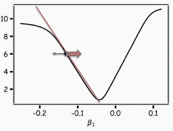

source: P. Protopapas, Harvard

我们知道，我们想要向导数的相反方向前进，我们知道，我们想要向导数成比例地前进一步。**学习率** λ是控制每个权重 *W* ( *β0* 或β1 )的比例。

source: P. Protopapas, Harvard

## 逻辑回归中的反向传播

如上图所示，更新权重需要计算损失相对于每个权重的偏导数。我们如何做到这一点？嗯，我们可以用高中数学来做这个。在下图中，我们试图计算相对于 *β0* 和 *β1* 的交叉熵损失函数的导数。

source: P. Protopapas, Harvard

对于只有一个神经元的网络来说，这是一个很好的解决方案。但是想象一下，一个我们通常在深度学习中遇到的有数百个神经元的网络。我敢打赌，你不想计算结果的导数。即使你成功地做到了这一点，你也必须在每次网络结构改变时更新你的公式，哪怕只是一点点。这就是**反向传播**发挥作用的地方。反向传播算法最初是在 20 世纪 70 年代提出的，但直到 1986 年 Geoffrey Hinton 的一篇论文才充分认识到它的重要性。

反向传播使用**链规则**，这是编写嵌套函数的导数的方便的助记符。例如，如果我们有一个网络，其中一个神经元馈入第二个神经元，最后馈入第三个神经元，以获得输出。总损失函数 *f* 是前两个神经元的损失函数 *g* 的函数，类似地 *g* 是第一个神经元的损失函数 *h* 的函数。

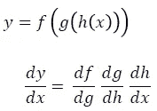

基本上，当我们从输入开始计算每个神经元的输出，直到最后一个神经元，我们也已经计算了导数的微小分量。在上面的例子中，当向前通过第一个神经元时，我们已经能够计算出 *dh/dx* 。接下来，当向前通过第二个神经元时，我们能够计算 *dg/dh* 。最后，我们开始计算 *df/dg* ,通过神经元回溯并重用所有已经计算过的元素。这就是反向传播这个名字的由来。这种技术有几种实现和风格。为了简单起见，我们在这里保持简单。

为了说明链式法则和反向传播是如何工作的，让我们回到具有 sigmoid 激活的 1-神经元网络的损失函数。损失函数被定义为二进制交叉熵，它可以被分成两部分 A 和 B，如下所示。

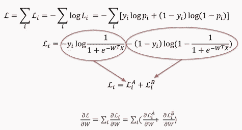

source: P. Protopapas, Harvard

让我们仔细看看损失函数的 A 部分。它可以分成几个块，在下图中用红框突出显示。

source: P. Protopapas, Harvard

反向传播需要计算该函数在任何给定数据点 *X* 处对于任何给定权重 *W* 的导数。这是通过计算每个块的导数，并使用链式法则将所有块放在一起完成的。下面我们来看看这对于 *X=3* 和 *W=3* 是如何工作的。

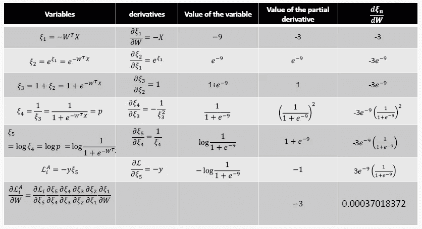

source: P. Protopapas, Harvard

我们所需要的是能够计算小块(上面称为变量)的导数。这种块是已知的，因为激活函数通常是已知的。它们可以是 s 形的、线形的、ReLu 形的等等。这些是导数已知的可微函数。您可以在此找到最新激活功能的完整列表[。因此，上述计算可以在运行时使用计算图来构建。Keras 能够查看您的网络架构和每个神经元使用的激活函数，以便在模型编译期间构建计算图。该图在训练期间用于执行正向传递和反向传播。交叉熵损失函数的计算图的例子如下所示。](/activation-functions-neural-networks-1cbd9f8d91d6)

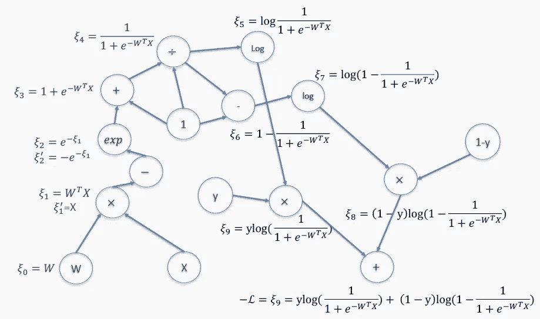

source: P. Protopapas, Harvard

# 神经元聚类

理解梯度下降和反向传播是如何工作的，是理解深度学习为什么实际工作的重要一步。嗯，我们还没到那种程度。到目前为止，我们只用了 3 个神经元。我们的农民可以争辩说，年份和收获量之间的关系太复杂了，不能只用两类来表示:好或坏。在这一节中，我们将探讨人工神经网络的聚类问题。让我们模拟一些分布在三组代表收割质量的数据。我们考虑坐标为(-2，0)，(0，1.7)和(2.1，0)的(x，y)平面中的三个点。在这三个中心的周围，我们创建了一个由 100 个随机生成的点组成的云。对于这些点中的任何一个到其中心的径向距离，我们使用随机正态分布。对于任何一个“云”点的角坐标，我们使用均匀分布。

我们现在将创建一个两层人工神经网络，它可以预测平面中随机生成的点是属于云 0、1 还是 2。输入层有 50 个神经元(我们越来越深入)！它接收两个值( *x，y* )。ReLU 激活函数被应用于输入的仿射变换。结果被输入到具有 3 个神经元的输出层，该层使用 **softmax** 激活函数来预测三类云之一。随机梯度优化器用于通过最小化用作损失函数的**分类交叉熵**来解决估计 303 权重和偏差的分类问题。我们将数据分成 50 个数据点用于训练分类器，50 个数据点用于验证。我们在 20 个时期内分批训练 5 个点。训练之后，我们还对测试集进行预测。在显示之前，我们使用 argmax 将预测的分类向量转换为原始标签。

如上所示，神经网络在分离测试集中的类方面做得很好(右图)。在原始数据(左)中发现的一些异常值被网络(右)分配了不同的标签，以产生清晰的边界。我们在测试数据上取得了 95.33%的分类准确率。

下面我们在平面上随机生成全新的看不见的坐标。然后我们用训练好的网络来预测类(云)。正如我们在图中看到的，网络清楚地将所有三个云分开，尽管有几个点非常接近边界，这是假阳性/阴性的良好候选。总的来说，似乎我们开始做深度学习了。

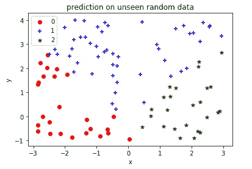

现在，我们让我们农民的孙子的孙子的孙子对深度学习感到兴奋！直奔[http://playground.tensorflow.org](http://playground.tensorflow.org)通过在你的浏览器中可视化地修补层、神经元、激活功能、训练和测试来构建你自己的人工神经网络。当你完成后，回到这里，更多令人兴奋的东西来了。

# 用于图像去噪的自动编码器

没有被现在打动的读者，已经知道深度学习为什么有效了。对于我们其余的人，我们现在来看一个网络架构的例子，这个例子有点深奥。自动编码器由一对两个相连的网络组成:编码器模型和解码器模型。自动编码器的目标是找到一种将输入编码成压缩形式(潜在空间)的方法，使得解码版本尽可能接近输入。**编码器模型**将输入转换成小而密集的表示。**解码器模型**可以被视为能够生成特定特征的生成模型。编码器和解码器通常作为一个整体来训练。损失函数惩罚网络产生不同于输入的输出。因此，编码器学会在有限的潜在空间中保存尽可能多的相关信息，并巧妙地丢弃不相关的部分，例如噪声。解码器学习获取压缩的潜在信息，并将其重构为完全无错误的输入。自动编码器可以用于图像的降维和去噪，但也可以在无监督的机器翻译中获得成功(哇！).

下面我们定义一个自动编码器的最简单的架构，它处理有噪声的手写数字的图像。我们向网络提供原始图像 *x* ，以及它们的嘈杂版本 *x~* 。网络试图重建其输出*x’*以尽可能接近原始图像。通过这样做，它学会了如何去噪任何手写数字。

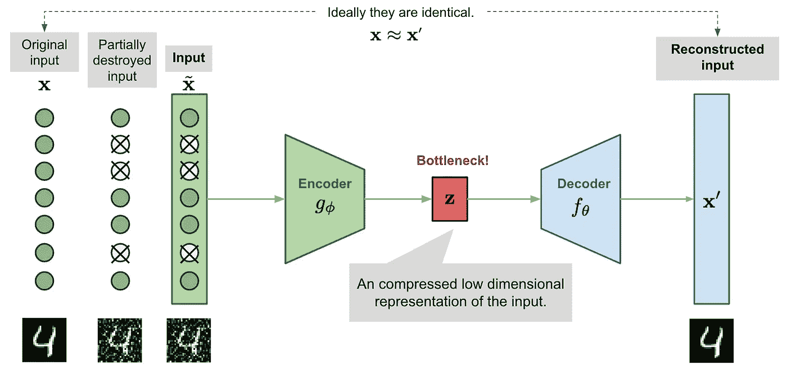

[source](https://lilianweng.github.io/lil-log/2018/08/12/from-autoencoder-to-beta-vae.html)

在接下来的几段中，我们将通过使用 Keras 实现这样一个网络的一个小版本来了解它是如何工作的。

**输入**:28x 28 灰度图像。因此，输入是一个 784 元素的向量。

**编码器**:64 个神经元的单一致密层。因此，潜在空间将具有尺寸 64。所用的激活函数是整流单元(ReLu)，选自最佳实践。激活函数被附加到层中的每个神经元，并基于每个神经元的输入是否与自动编码器的预测相关来确定它是否应该被激活(“激发”)。激活函数还有助于将每个神经元的输出标准化到 1 到 0 之间的范围。

**解码器**:具有 784 个神经元的单一致密层，对应于 28x28 灰度图像。使用 sigmoid 激活函数作为分类任务的最佳实践(编码器的输入与解码器的输出)。

**优化器:**我们使用二进制交叉熵作为损失函数，使用 Adadelta 作为优化器来最小化损失函数。

**数据:**我们使用 [MNIST 数字](http://yann.lecun.com/exdb/mnist/)通过应用高斯噪声矩阵生成合成噪声数字，并在 0 和 1 之间裁剪图像。下面我们展示一些有噪声的数字。

我们仍然可以识别数字，但很难。因此，我们想使用我们的自动编码器来学习恢复原始数字。我们通过在 100 个时期内拟合自动编码器来实现这一点，同时使用噪声数字作为输入，原始去噪数字作为目标。因此，自动编码器将最小化噪声图像和干净图像之间的差异。通过这样做，它将学习如何从任何看不见的手写数字中去除噪声，这些数字是由类似的噪声产生的。

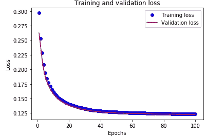

下面，我们将有噪声的输入图像与干净的输入图像进行对比。

*   整体噪声消除得非常好。在输入图像上人为引入的白点已经从清洗后的图像中消失。数字可以被视觉识别。例如，有噪声的数字“4”根本不可读，现在，我们可以读取它的干净版本。
*   去噪对信息质量有负面影响。重建的数字有些模糊。解码器添加了一些原始图像中不存在的特征，例如，下面的第 8 位和第 9 位数字几乎无法识别。

希望这个去噪的例子已经说明了深度学习的机会。我们通过添加层得到的越深，模型变得越复杂，它能实现的魔力就越大。然而，复杂性是以过度适应训练数据和泛化能力下降为代价的。这就是正规化和其他技巧发挥作用的地方。在下一节中，我们将通过添加卷积层来升级我们的自动编码器。

# 卷积神经网络

前面几节温和地介绍了用神经元来近似线性和非线性现象的思想。我们还演示了两层神经元如何足以学习手写数字中的正确特征，并消除有噪声的特征。在这一部分中，我们将探讨如何将具有数百个神经元的几个层堆叠起来，这些神经元在噪声图像中学习低级特征，以减少潜在空间中的信息损失，并提高生成数字的质量。

现在，让我们建立一个深度网络。我们从第一个卷积层 Conv2D 开始，它有 16 个滤波器，每个滤波器的尺寸为 3×3。填充相同，步幅为 1，因此输出要素地图的形状为 28x28x16。我们对这个输出应用一个 ReLu 激活函数，在它上面加上一个偏置。卷积导致来自图像相邻区域的信息重复，导致高维数。 **Pooling** 取卷积层输出的一个区域，并返回一个聚合值:通常是 max，但可以使用 average、min 或任何函数。

我们添加一个 MaxPooling2D 层，大小为 2x2，步幅为 1，填充相同。这意味着我们将取 2x2 块的最大值，并移动 1 步到下一个块。池化的输出将用零填充，以具有与输入相同的维度。将激活函数应用于卷积后，总会进行池化。

当考虑多个尺度时，CNN 工作得最好。因此，我们再次复制卷积和最大池层。得到的编码器以 7x7x32 的形状输出图像的表示。这是因为输入图像 28x28x1 由第一 Conv2D 层中的 32 个 3x3 滤波器中的每一个进行卷积，返回维数为 28x28x32 的特征空间。MaxPooling 将这种表示减少到 14x14x32 的一半。第二个 Conv2D 层使用一组 32 个 3x3 滤波器对每个 14x14x32 表示进行卷积。这导致 14×14×32 维的特征空间。最后一个 MaxPooling 图层将制图表达缩小了一半，从而得到形状 7x7x32。

解码器与编码器具有相同的架构，但各层以相反的顺序排列。我们使用上采样层来恢复由编码器中的 MaxPooling 执行的维度减少。最后，我们添加一个卷积层，将上次表示中的通道数恢复为 1。Sigmoid 激活函数用于解决分类问题，其中二进制结果反映了解码图像与输入图像的相似程度。我们可以观察自动编码器的解码部分如何恢复原始图像形状(28x28x1)。

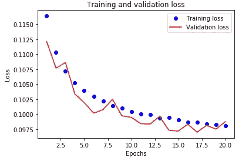

整个网络有 28，353 个权重和偏差要训练。我们使用二进制交叉熵作为损失函数，使用 Adadelta 作为优化器来最小化损失函数。在 20 个时期之后，CNN 自动编码器具有大约 0.098 的训练/测试损失值，相比之下，密集自动编码器具有更高的损失 0.1235。我们的 CNN 自动编码器在看不见的图像上表现很好。与上一节中带有 1 个密集隐藏层的简单自动编码器相比，去噪后的图像看起来要好得多。

# 越来越深

将卷积层堆叠在一起的方法与其说是科学，不如说是艺术。不要害怕看下面的 VGG 网络，它是在 2014 年提出的，用于以 92.7%的测试准确度将 1400 万张图像分类到 1000 个类别。它接受了 2 周的训练，以估计其 14，714，688 的体重。恐怖！还有更多这样的超大质量网络:GoogLeNet、ResNet、DenseNet、MobileNet、Xception、ResNeXt，仅举几例。

深度学习的一个推荐且高效的方法是利用那些预先训练好的网络之一。预先训练的网络只是先前在大型数据集上训练的保存的网络，并且可以有效地充当真实世界的通用模型。特征提取是使用由预训练网络学习的表示的一种方式，它采用预训练网络的卷积基，通过它运行新数据，并使用新的小数据集在输出之上训练新的简单分类器，如下所示。另一种技术包括冻结预训练网络的基础，附加一个简单的分类器并训练整体。另一种替代方案，称为微调，包括在训练前解冻基地中的特定层。

# 结论

在本文中，我们假设了一种深度学习的神经网络架构方法。我们没有直接解释为什么深度学习算法会在复杂输入通过每个神经网络层时逐步学习复杂输入的表示，而是从单个神经元开始。通过动手的例子和 Python 代码，我们用人工神经网络解决了基本的回归任务，并逐步建立了一个具有卷积层的自动编码器。我们通过梯度下降和反向传播展示了学习过程。我们很快介绍了使用预先训练的超大质量人工神经网络(如 VGG16)的迁移学习。

我们没有触及像风格转换这样的主题，对于物体识别来说，纹理，而不是物体形状，似乎是物体最重要的方面。我们解释的概念，对于递归神经网络、序列对序列网络、长短期记忆网络和许多其他奇特的深度学习外星发明，将略有不同。

在一篇文章中涵盖深度学习是一个笑话，我们并没有试图这样做。经典书籍****伊恩·古德菲勒**的《深度学习》**和**的《用 Python 进行深度学习》**的**弗朗索瓦·乔莱**都是很好的起点。

深度学习为什么有效？这是一个开放式的问题。谢天谢地。

感谢您的阅读。看看我下面这篇关于机器学习中贝叶斯方法的文章。

 [## 贝叶斯噩梦。解决了！

### 通过 Python PyMC3 中的示例和 cod 温和地介绍贝叶斯数据分析。

towardsdatascience.com](/bayesian-nightmare-how-to-start-loving-bayes-1622741fa960)